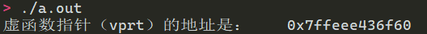
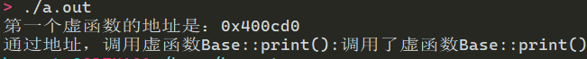

# 1 虚函数表

## 1.1 多态与虚表
C++中虚函数的作用主要是为了实现多态机制。多态，简单来说，是指在继承层次中，父类的指针可以具有多种形态——当它指向某个子类对象时，通过它能够调用到子类的函数，而非父类的函数。
```cpp
class Base {     virtual void print(void);    }
class Drive1 :public Base{    virtual void print(void);    }
class Drive2 :public Base{    virtual void print(void);    }

Base * ptr1 = new Base(); 
Base * ptr2 = new Drive1();  
Base * ptr3 = new Drive2();
ptr1->print(); //调用Base::print()
prt2->print();//调用Drive1::print()
prt3->print();//调用Drive2::print()
```


## 1.2 使用指针访问虚表
如果我们丰富我们的Base类,使其拥有多个virtual函数：
```cpp
class Base
{
public:
    Base(int i) :baseI(i){};
    virtual void print(void){ cout << "调用了虚函数Base::print()"; }
    virtual void setI(){cout<<"调用了虚函数Base::setI()";}
    virtual ~Base(){}
 
private:
    int baseI;
};
```

```cpp
Base b(1000);
int * vptrAdree = (int *)(&b);  
cout << "虚函数指针（vprt）的地址是：\t"<<vptrAdree << endl;
```
我们运行代码出结果：
虚函数指针指向虚函数表，**虚函数表中存储的是一系列虚函数的地址，虚函数地址出现的顺序与类中虚函数声明的顺序一致**。通过虚函数指针地址值，可以得到虚函数表的地址，也即是虚函数表第一个虚函数的地址:

```cpp
Base b(1000);
typedef void(*Fun)(void); //对应Base类的print函数

Fun vfunc = (Fun)*((int*)*(int*)(&b));
cout << "第一个虚函数的地址是：" << (int *)*(int*)(&b) << endl;
cout << "通过地址，调用虚函数Base::print()：";
vfunc();
```

- 我们把虚表指针的值取出来：`＊(int＊)(&b)`，它是一个地址，虚函数表的地址
- 把虚函数表的地址强制转换成 int* : `( int ＊) ＊( int＊ )( &b )`
- 再把它转化成我们Fun指针类型 ： `(Fun )＊(int ＊)＊(int＊)(&b)`，这样，我们就取得了类中的第一个虚函数，我们可以通过函数指针访问它。


运行结果：
```cpp
(int * )(*(int*)(&b)+1)
```


# 2 三种基本的对象模型
在C++中，有两种数据成员：static 和nonstatic，以及三种类成员函数：static、nonstatic和virtual:
```cpp
class Base
{
public:
    Base(int i) :baseI(i){};
    int getI(){ return baseI; } //非静态函数
    static void countI(){}; //静态函数
    virtual ~Base(){} //虚函数
    virtual void print(void){ cout << "Base::print()"; } //虚函数
 
private:
    int baseI;//非静态成员
    static int baseS;//静态成员
};
```
那么，这个类在内存中将被如何表示？如何布局才能支持C++多态？ C++标准与编译器将如何塑造出各种数据成员与成员函数呢？先介绍三种基本的对象模型

## 2.1 简单对象模型
> **在下面出现的图中，用蓝色边框的内容在内存上是连续的。**

这个模型非常地简单粗暴。在该模型下，对象由一系列的指针组成，**每一个指针都指向一个数据成员或成员函数**，也即是说，每个数据成员和成员函数在类中所占的大小是相同的，都为一个指针的大小。这样有个好处：很容易算出对象的大小，不过缺点是空间和执行期效率。所以这种对象模型并没有被用于实际产品上。想象一下，如果很大的类是这种模型，将会比C语言的struct多了许多空间来存放指向函数的指针，而且每次读取类的数据成员，都需要通过再一次寻址：又是时间上的消耗。

## 2.2 表格驱动模型
这个模型在简单对象模型的基础上又添加一个间接层，它把类中的数据分成了两个部分：**数据部分与函数部分**，并使用两张表格，**一张存放数据本身，一张存放函数的地址**（也即函数比成员多一次寻址），而类对象仅仅含有两个指针，分别指向上面这两个表。这样看来，对象的大小是固定为两个指针大小。这个模型也没有用于实际应用于真正的C++编译器上。

## 2.3 无继承的C++对象模型
在此模型下：

- **所有的非静态数据成员的值（注意是值）直接存在对象中，非静态的所有每个实例之间不共用**
- **静态数据成员、非静态/静态成员函数放在对象外****。**这几个都是同一个class中不同实例共用的，且不会在运行时改变（指向这些的指针不变）
   - 对于静态数据成员，实际上是存放在全局区的（未初始化前在全局区临近区域）
- **虚函数使用虚函数表vtbl和虚指针vpt**


虚函数实现具体如下：

- 每个类生成一个表格，称为虚表（virtual table，简称vtbl）。虚表中存放着一堆指针，这些指针指向该类每一个虚函数。虚表中的函数地址将按声明时的顺序排列，不过当子类有多个重载函数时例外，后面会讨论。
- 每个类对象都拥有一个虚表指针(vptr)，由编译器为其生成。虚表指针的设定与重置皆由类的构造控制（也即是构造函数、析构函数、拷贝构造和赋值操作符）来完成。
- 另外，虚函数表的前面设置了一个指向type_info的指针，用以支持RTTI（Run Time Type Identification，运行时类型识别）。RTTI是为多态而生成的信息，包括对象继承关系，对象本身的描述等，只有具有虚函数的对象在会生成。

在此模型下，Base的对象模型如图：
```
Base b(1000);
```

```cpp
void testBase( Base&p)
{
    cout << "对象的内存起始地址：" << &p << endl;
    cout << "type_info信息:" << endl;
    RTTICompleteObjectLocator str = *((RTTICompleteObjectLocator*)*((int*)*(int*)(&p) - 1));
 
    string classname(str.pTypeDescriptor->name);
    classname = classname.substr(4, classname.find("@@") - 4);
    cout <<  "根据type_info信息输出类名:"<< classname << endl;
 
    cout << "虚函数表地址:" << (int *)(&p) << endl;
 
    //验证虚表
    cout << "虚函数表第一个函数的地址：" << (int *)*((int*)(&p)) << endl;
    cout << "析构函数的地址:" << (int* )*(int *)*((int*)(&p)) << endl;
    cout << "虚函数表中，第二个虚函数即print（）的地址：" << ((int*)*(int*)(&p) + 1) << endl;
 
    //通过地址调用虚函数print（）
    typedef void(*Fun)(void);
    Fun IsPrint=(Fun)* ((int*)*(int*)(&p) + 1);
    cout << endl;
    cout<<"调用了虚函数"；
    IsPrint(); //若地址正确，则调用了Base类的虚函数print（）
    cout << endl;
 
    //输入static函数的地址
    p.countI();//先调用函数以产生一个实例
    cout << "static函数countI()的地址：" << p.countI << endl;
 
    //验证nonstatic数据成员
    cout << "推测nonstatic数据成员baseI的地址：" << (int *)(&p) + 1 << endl;
    cout << "根据推测出的地址，输出该地址的值：" << *((int *)(&p) + 1) << endl;
    cout << "Base::getI():" << p.getI() << endl;
}
```


- 通过 (int *)(&p)取得虚函数表的地址
- type_info信息的确存在于虚表的前一个位置。通过((int_)_(int*)(&p) - 1))取得type_infn信息，并成功获得类的名称的Base
- 虚函数表的第一个函数是析构函数。
- 虚函数表的第二个函数是虚函数print()，取得地址后通过地址调用它（而非通过对象），验证正确
- 虚表指针的下一个位置为nonstatic数据成员baseI。
- 可以看到，static成员函数的地址段位与虚表指针、baseI的地址段位不同。

# 3 工作中的一个真实例子
在工作中遇到一个奇怪的现象，类B的成员函数中会用到类A的指针（访问其内部静态变量），而类A的指针是空指针并没有赋值，程序正常运行没有出现重启问题。我很是奇怪，看之前的旧代码，每个类似功能的类都进行了类A指针的初始化操作，而新加入的类B没有此操作竟然也能正常工作。我仿照公司代码的结构，编写了如下示例简单的描述调用过程：
```cpp
#include <iostream>
using namespace std;

class A
{
public:
    friend class B; //友元类
    int getPrivateNum()
    {
        return a; //返回静态变量
    }

private:
    static int a; //内部静态变量
};

class B
{
public:
    void printNum()
    {
        cout << ptr_a->getPrivateNum() << endl;
        cout << ptr_a->a << endl;
    }

private:
    static A *ptr_a; //静态类A指针
};

int A::a = 1;
A *B::ptr_a = nullptr;

int main()
{
    //A对象即使是空指针，也可以访问内部函数和静态变量
    //因为这里的内部函数访问的是静态变量，保存在全局数据区，所以不会导致内存错误
    A *a = nullptr;
    cout << a->getPrivateNum() << endl;
    //B是A的友元类，可以访问A内部变量，所以这里即使B内部的A指针是空指针，也可以获得静态变量的值
    B *b = nullptr;
    b->printNum();
}
```
该示例能正常打印出结果，没有任何错误和重启问题。结合上面关于C++对象模型的笔记，我能够得出程序正常的原因：

- 首先，B是A的友元类，所以可以访问类A的私有成员
- 类A和类B的成员a，prt_a都是**静态变量，保存在对象之外**，所以即使指针没有初始化（初始化意味着有类的对象存在），也可以正常获取到静态变量的值
- 类的指针为空指针，并不妨碍类成员函数被调用，因为**静态函数和非静态函数都是在对象之外**，空指针也可以访问成员函数。只要当成员函数中使用活访问非静态变量时才会出问题，因为类的对象没有创建，非静态变量在内存中时没有地址的。
