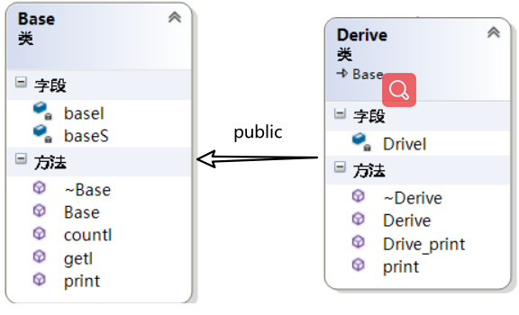

# 1 单继承
如果我们定义了派生类
```cpp
class Derive : public Base
{
public:
    Derive(int d) :Base(1000), DeriveI(d){};
    //overwrite父类虚函数
    virtual void print(void){ cout << "Drive::Drive_print()" ; }
    // Derive声明的新的虚函数
    virtual void Drive_print(){ cout << "Drive::Drive_print()" ; }
    virtual ~Derive(){}

private:
    int DeriveI;
};
```
继承类图为：

- 若子类重写（overwrite）了父类的虚函数，则子类虚函数将覆盖虚表中对应的父类虚函数(**注意子类与父类拥有各自的一个虚函数表**)
- 若子类并无overwrite父类虚函数，而是声明了自己新的虚函数，则该虚函数地址将扩充到虚函数表最后（在vs中无法通过监视看到扩充的结果，不过我们通过取地址的方法可以做到，子类新的虚函数确实在父类虚函数表末端）。


```cpp
typedef void(*Fun)(void);
 
int main()
{
    Derive d(2000);
    //[0]
    cout << "[0]Base::vptr";
    cout << "\t地址：" << (int *)(&d) << endl;
        //vprt[0]
        cout << "  [0]";
        Fun fun1 = (Fun)*((int *)*((int *)(&d)));
        fun1();
        cout << "\t地址:\t" << *((int *)*((int *)(&d))) << endl;
 
        //vprt[1]析构函数无法通过地址调用，故手动输出
        cout << "  [1]" << "Derive::~Derive" << endl;
 
        //vprt[2]
        cout << "  [2]";
        Fun fun2 = (Fun)*((int *)*((int *)(&d)) + 2);
        fun2();
        cout << "\t地址:\t" << *((int *)*((int *)(&d)) + 2) << endl;
    //[1]
    cout << "[2]Base::baseI=" << *(int*)((int *)(&d) + 1);
    cout << "\t地址：" << (int *)(&d) + 1;
    cout << endl;
    //[2]
    cout << "[2]Derive::DeriveI=" << *(int*)((int *)(&d) + 2);
    cout << "\t地址：" << (int *)(&d) + 2;
    cout << endl;
    getchar();
}
```
运行结果：

# 2 多继承

## 一般的多重继承
单继承中（一般继承），子类会扩展父类的虚函数表。在多继承中，子类含有多个父类的子对象，该往哪个父类的虚函数表扩展呢？当子类overwrite了父类的函数，需要覆盖多个父类的虚函数表吗？

- **子类的虚函数被放在声明的第一个基类的虚函数表中**
- overwrite时，所有基类的print()函数都被子类的print()函数覆盖。保证了父类指针指向子类对象时，总是能够调用到真正的函数
- 内存布局中，父类按照其声明顺序排列
```cpp
class Base
{
public:
 
    Base(int i) :baseI(i){};
    virtual ~Base(){}
 
    int getI(){ return baseI; }
 
    static void countI(){};
 
    virtual void print(void){ cout << "Base::print()"; }
 
private:
 
    int baseI;
 
    static int baseS;
};
class Base_2
{
public:
    Base_2(int i) :base2I(i){};
    virtual ~Base_2(){}
    int getI(){ return base2I; }
    static void countI(){};
    virtual void print(void){ cout << "Base_2::print()"; }
 
private:
 
    int base2I;
 
    static int base2S;
};
 
class Drive_multyBase :public Base, public Base_2
{
public:
    Drive_multyBase(int d) :Base(1000), Base_2(2000) ,Drive_multyBaseI(d){};
 
    virtual void print(void){ cout << "Drive_multyBase::print" ; }
 
    virtual void Drive_print(){ cout << "Drive_multyBase::Drive_print" ; }
 
private:
    int Drive_multyBaseI;
};
```
继承类图为：
```cpp
typedef void(*Fun)(void);
 
int main()
{
    Drive_multyBase d(3000);
    //[0]
    cout << "[0]Base::vptr";
    cout << "\t地址：" << (int *)(&d) << endl;
 
        //vprt[0]析构函数无法通过地址调用，故手动输出
        cout << "  [0]" << "Derive::~Derive" << endl;
 
        //vprt[1]
        cout << "  [1]";
        Fun fun1 = (Fun)*((int *)*((int *)(&d))+1);
        fun1();
        cout << "\t地址:\t" << *((int *)*((int *)(&d))+1) << endl;
 
 
        //vprt[2]
        cout << "  [2]";
        Fun fun2 = (Fun)*((int *)*((int *)(&d)) + 2);
        fun2();
        cout << "\t地址:\t" << *((int *)*((int *)(&d)) + 2) << endl;
 
 
    //[1]
    cout << "[1]Base::baseI=" << *(int*)((int *)(&d) + 1);
    cout << "\t地址：" << (int *)(&d) + 1;
    cout << endl;
 
 
    //[2]
    cout << "[2]Base_::vptr";
    cout << "\t地址：" << (int *)(&d)+2 << endl;
 
        //vprt[0]析构函数无法通过地址调用，故手动输出
        cout << "  [0]" << "Drive_multyBase::~Derive" << endl;
 
        //vprt[1]
        cout << "  [1]";
        Fun fun4 = (Fun)*((int *)*((int *)(&d))+1);
        fun4();
        cout << "\t地址:\t" << *((int *)*((int *)(&d))+1) << endl;
 
    //[3]
    cout << "[3]Base_2::base2I=" << *(int*)((int *)(&d) + 3);
    cout << "\t地址：" << (int *)(&d) + 3;
    cout << endl;
 
    //[4]
    cout << "[4]Drive_multyBase::Drive_multyBaseI=" << *(int*)((int *)(&d) + 4);
    cout << "\t地址：" << (int *)(&d) + 4;
    cout << endl;
 
    getchar();
}
```
运行结果：

## 菱形继承
菱形继承也称为钻石型继承或重复继承，它指的是**基类被某个派生类简单重复继承了多次**。这样，派生类对象中拥有多份基类实例（这会带来一些问题）。为了方便叙述，我们不使用上面的代码了，而重新写一个重复继承的继承层次：
```cpp
class B
{
public:
    int ib;
 
public:
    B(int i=1) :ib(i){}
    virtual void f() { cout << "B::f()" << endl; }
    virtual void Bf() { cout << "B::Bf()" << endl; }
};
 
class B1 : public B
{
public:
    int ib1;
 
public:
    B1(int i = 100 ) :ib1(i) {}
    virtual void f() { cout << "B1::f()" << endl; }
    virtual void f1() { cout << "B1::f1()" << endl; }
    virtual void Bf1() { cout << "B1::Bf1()" << endl; }
};
 
class B2 : public B
{
public:
    int ib2;
 
public:
    B2(int i = 1000) :ib2(i) {}
    virtual void f() { cout << "B2::f()" << endl; }
    virtual void f2() { cout << "B2::f2()" << endl; }
    virtual void Bf2() { cout << "B2::Bf2()" << endl; }
};
 
class D : public B1, public B2
{
public:
    int id;

public: 
    D(int i= 10000) :id(i){}
    virtual void f() { cout << "D::f()" << endl; }
    virtual void f1() { cout << "D::f1()" << endl; }
    virtual void f2() { cout << "D::f2()" << endl; }
    virtual void Df() { cout << "D::Df()" << endl; }
};
```
这时，根据单继承，我们可以分析出B1，B2类继承于B类时的内存布局。又根据一般多继承，我们可以分析出D类的内存布局。我们可以得出D类子对象的内存布局如下图：
```cpp
D d;
 
d.ib =1 ;               //二义性错误,调用的是B1的ib还是B2的ib？
 
d.B1::ib = 1;           //正确
 
d.B2::ib = 1;           //正确
```
尽管我们可以通过明确指明调用路径以消除二义性，但二义性的潜在性还没有消除，我们可以通过虚继承来使D类只拥有一个ib实体。
