# STL使用的技术
- 运算符重载
- 模版编程（泛化，全特化，偏特化）

## 全特化
基于泛化的模版编程，然后对于某些特殊的类型，进程不同于泛化的其他处理。例如：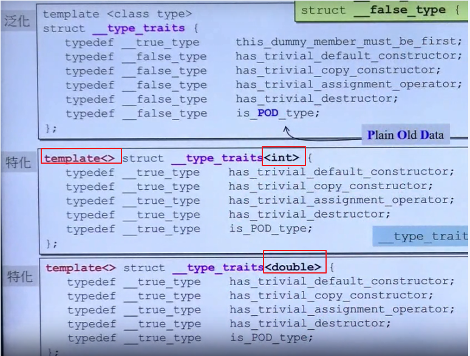


## 偏特化

- **个数偏特化**：对于拥有多个模板参数的类或者函数，指定某个为特定类型，其他参数依然是模版，用于特化某一小部分的操作。例如：

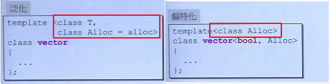

- **范围偏特化**：类似全特化，不同的是，template<>中仍然可以指定类型。例如：

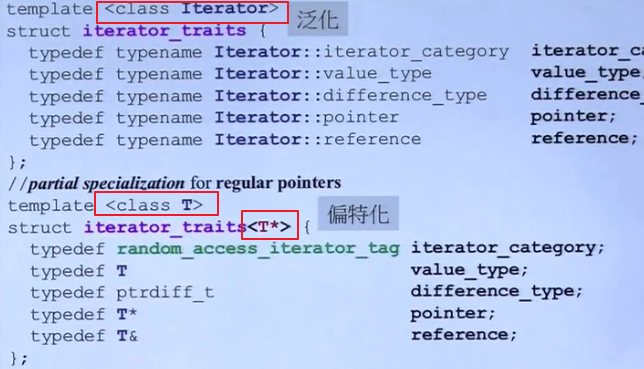


# STL六大部件

- 容器 containers
- 分配器 allocators
- 算法 algorithms
- 迭代器 iterators
- 适配器 adapters
- 仿函数 functors

组件间关系如下：

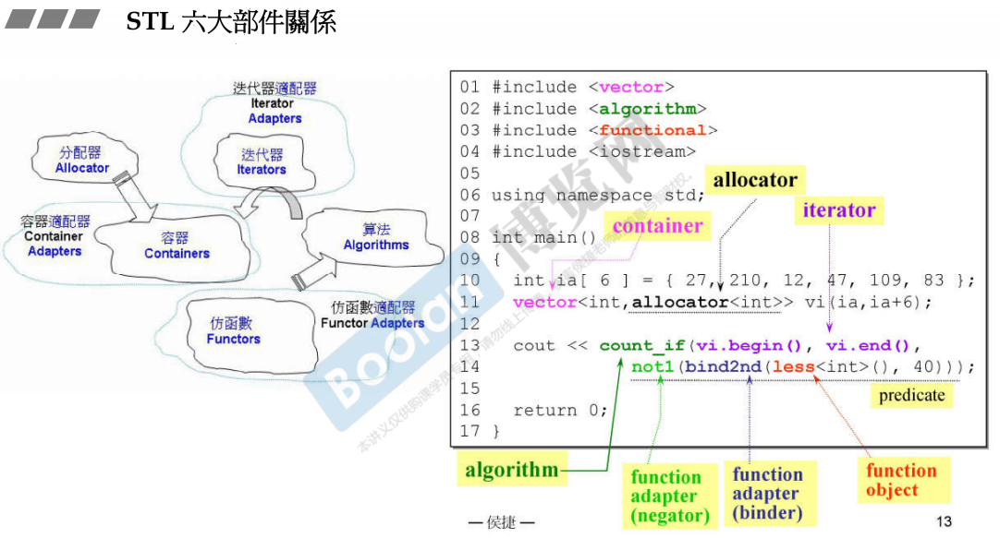

>   容器需要分配器来帮忙分配内存,通过算法来操作容器,迭代器是算法与容器之间的桥梁

简单例子演示六大部件如何组合使用：

```cpp
#include <vector>  //容器
#include <algorithm> //算法
#include <functional> //仿函数
#include <iostream>

using namespace std;

int main()
{
    int a[6] = {27, 210, 12, 47, 109, 83};
    //容器vector同时指定保存的类型和分配器，一次将数据导入
    vector<int, allocator<int>> vec(a, a+6);
    
    /* begin(),end()是迭代器
    * count_if是某个算法，计算符合条件的个数
    * not1是否定的函数适配器，取否
    * bind2nd是绑定第二个参数的函数适配器，即第二个参数绑定是40
    * less是比大小的仿函数，小于
    * 综合一下即：计算vec中大于等于40的数的个数*/
    cout<<count_if(vec.begin(), vec.end(), not1(bind2nd(less<int>(), 40))); 
    
    return 0;
}
```


## 容器 containers

容器的结构示意图

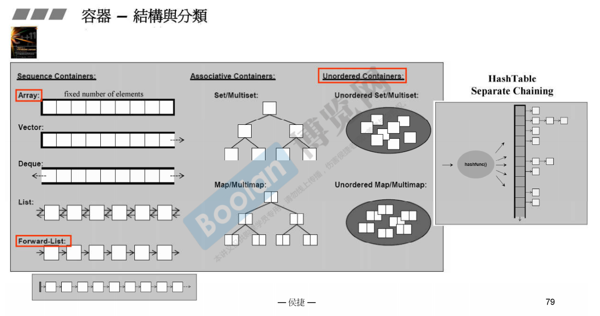

各容器之间的实现关系：

缩进的容器是底层结构的衍生，并非继承，而是复合

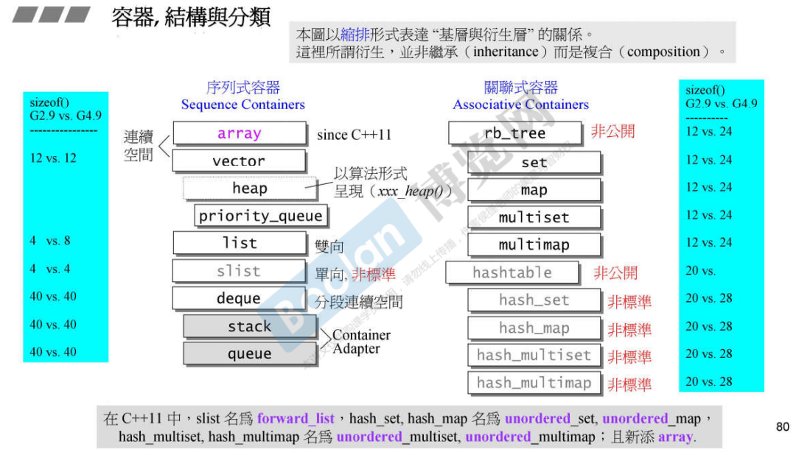


## 分配器 allocators

### VC++ allocator
以::operator new 和::operator delete完成allocate()和deallocate()，没有其他特殊设计。

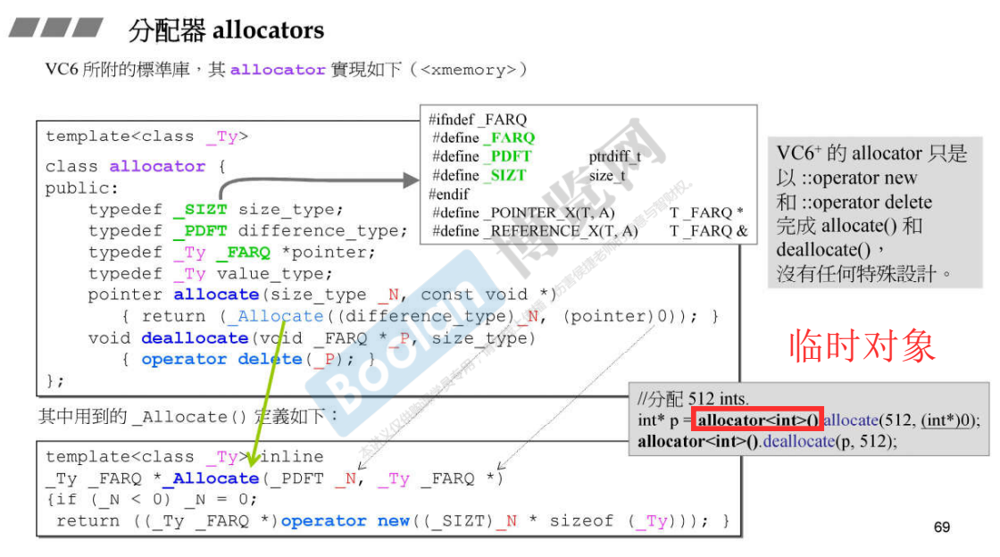

### Gcc allocator
GCC也有一套和VC++一样实现的allocator，在STL库中使用（GCC4.9之后）。另外还有另一套实现(`__gun_cxx::__pool_alloc`)，即内存池的实现方式，原理如下：

- 16个链表，每个链表负责某一种特定大小的区块（回忆一下SIP Mmemory pool）
- 如果当前链表没有内存，就会用malloc去系统申请一块很大的内存块，然后切割成该链表负责的大小，这样每一小块不带无用的内存cache（例如头尾的cookie，下图所示红色部分），节省内存
    - 如果有100万个元素，每个元素1字节，那么将会省800万字节空间（确定为800万字节？只是抽象的举例而已）

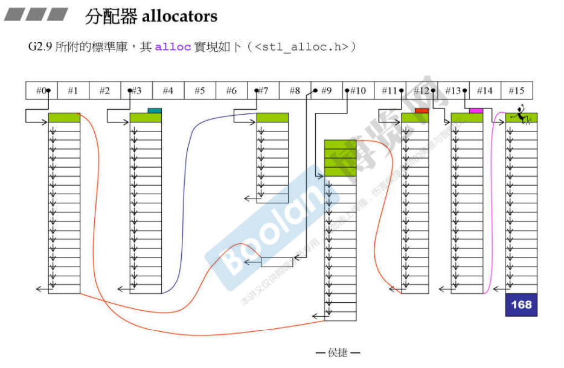

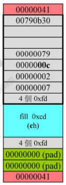

### Note

-   分配器的效率会影响容器的效率


## 迭代器 iterators
迭代器用法类似指针，但是在容器的类中并不是指针那么简单（指针没法进行++，--等操作），==因为*, ->，++，-- 等操作需要根据容器类型不同进行重载==。iterator是一个单独的struct，需要遵守以下准则：

- 保存容器的第一个节点，用于找到整个容器内容（节点可以在调用iterator时赋值，从容器类中读取）
- 重载运算符，使其可以作为智能指针使用

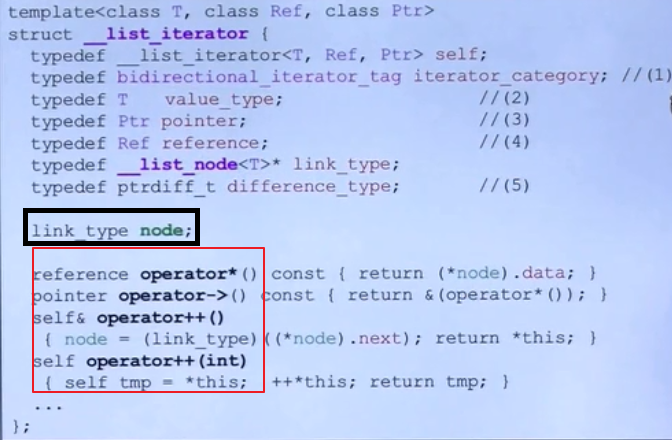

- iterator必须提供5种associated types供算法使用
    - 分类、值类型、距离、指针、引用

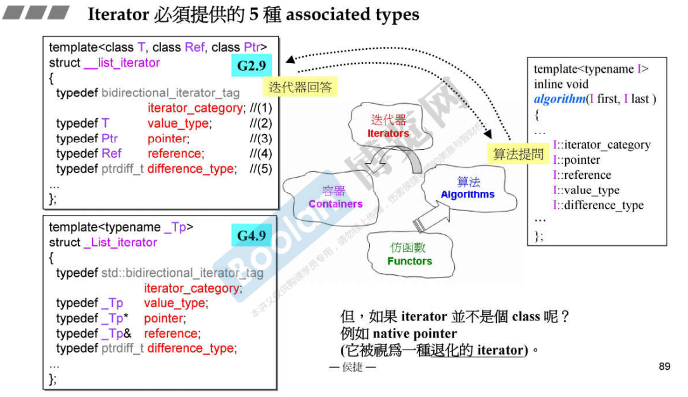

-   通过 萃取 判断 iterator 是普通的指针还是一个 class

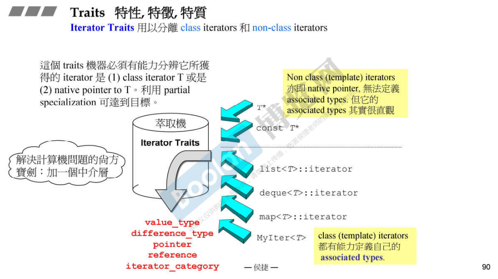

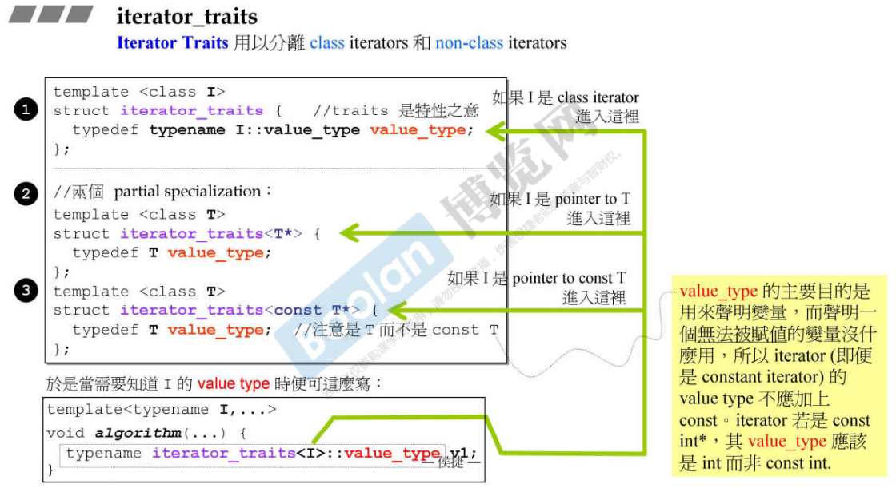

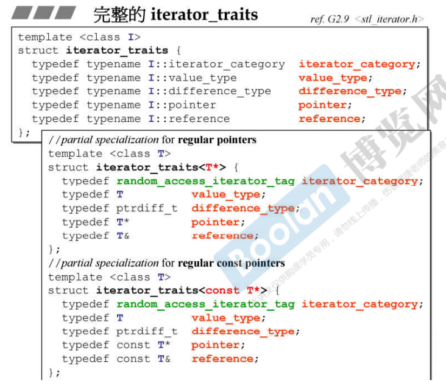

==Note==

前面一个 class 是泛化的，后面两个 class 是偏特化的

## 仿函数 functors
仿函数为算法服务，是一个类，但是提供类似函数调用的功能。一般定义为一个类或struct，并重载()运算符。仿函数有三类：  **算术类，逻辑运算类，相对关系类**：


### 如何使用仿函数
下图拿sort()算法为例，第三个参数指定如何进行大小比较，可以指定函数指针，或者使用仿函数：

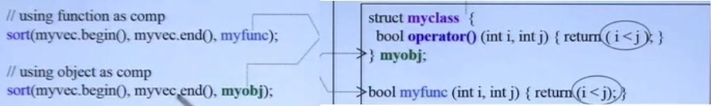


### 仿函数可适配的条件：继承
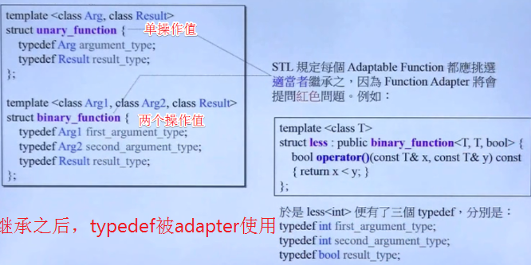

## 适配器 Adapter
适配器分类：

- **容器适配器**： 创建新类，包含某个容器，对容器的操作进行重新定义。例如stack内含一个deque，重新定义了部分函数。
- **函数适配器**： 内含原来的函数对象，对函数操作进程重定义，需要函数提供三个type的定义(这也是为什么仿函数需要继承的原因)。如下图例子，op是一个函数，本来需要两个参数，适配器固定了其中一个参数(即重定义了)

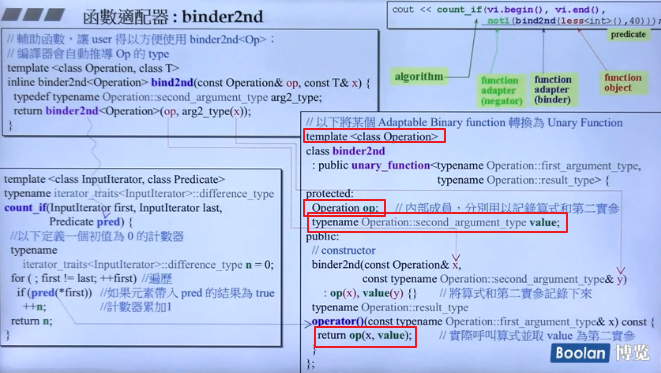

- **新型适配器bind**:使用如下

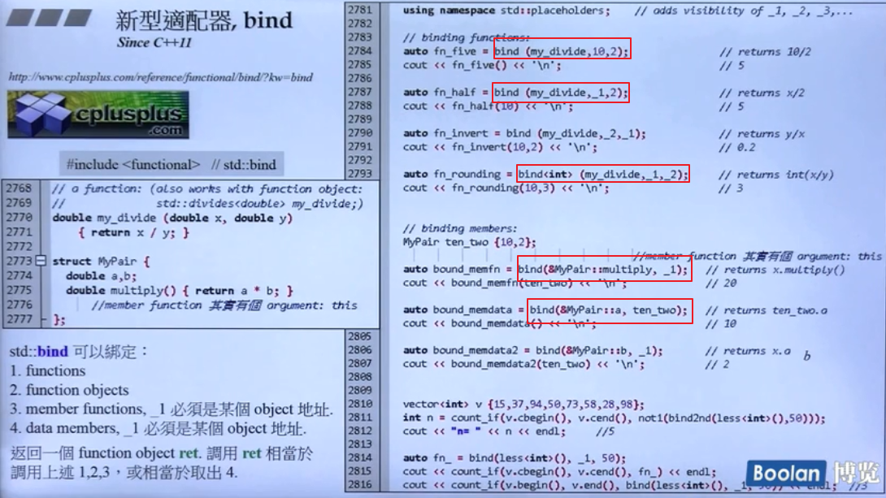

- **迭代器适配器**： l类似容器适配器，包含一个迭代器，重定义迭代器的所有操作。下例为逆向迭代器的实现：

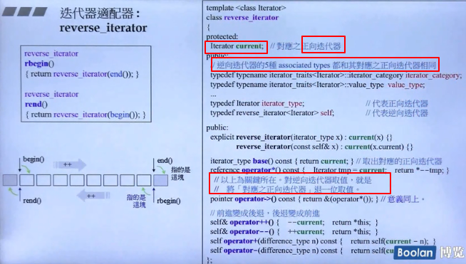
