# STL使用的技术
- 运算符重载
- 模版编程（泛化，全特化，偏特化）

## 全特化
基于泛化的模版编程，然后对于某些特殊的类型，进程不同于泛化的其他处理。例如：


## 偏特化

- **个数偏特化**：对于拥有多个模板参数的类或者函数，指定某个为特定类型，其他参数依然是模版，用于特化某一小部分的操作。例如：


- **范围偏特化**：类似全特化，不同的是，template<>中仍然可以指定类型。例如：


# STL六大部件

- 容器 containers
- 分配器 allocators
- 算法 algorithms
- 迭代器 iterators
- 适配器 adapters
- 仿函数 functors

组件间关系如下：

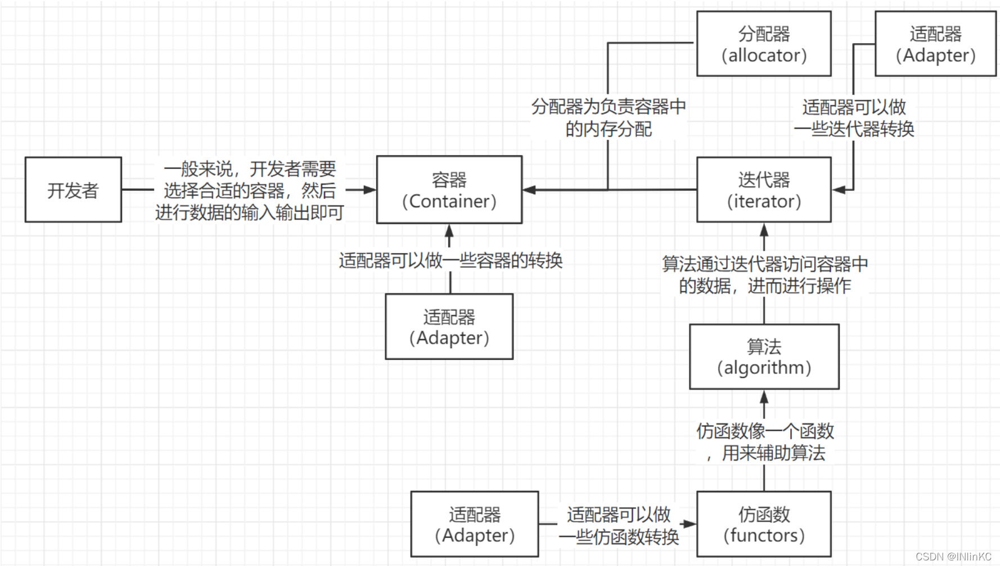


>   容器需要分配器来帮忙分配内存,通过算法来操作容器,迭代器是算法与容器之间的桥梁

简单例子演示六大部件如何组合使用：

```cpp
#include <vector>  //容器
#include <algorithm> //算法
#include <functional> //仿函数
#include <iostream>

using namespace std;

int main()
{
    int a[6] = {27, 210, 12, 47, 109, 83};
    //容器vector同时指定保存的类型和分配器，一次将数据导入
    vector<int, allocator<int>> vec(a, a+6);
    
    /* begin(),end()是迭代器
    * count_if是某个算法，计算符合条件的个数
    * not1是否定的函数适配器，取否
    * bind2nd是绑定第二个参数的函数适配器，即第二个参数绑定是40
    * less是比大小的仿函数，小于
    * 综合一下即：计算vec中大于等于40的数的个数*/
    cout<<count_if(vec.begin(), vec.end(), not1(bind2nd(less<int>(), 40))); 
    
    return 0;
}
```


## 容器 containers

容器的结构示意图


各容器之间的实现关系：

缩进的容器是底层结构的衍生，并非继承，而是复合


## 分配器 allocators

### VC++ allocator
以::operator new 和::operator delete完成allocate()和deallocate()，没有其他特殊设计。


### Gcc allocator
GCC也有一套和VC++一样实现的allocator，在STL库中使用（GCC4.9之后）。另外还有另一套实现(`__gun_cxx::__pool_alloc`)，即内存池的实现方式，原理如下：

- 16个链表，每个链表负责某一种特定大小的区块（回忆一下SIP Mmemory pool）
- 如果当前链表没有内存，就会用malloc去系统申请一块很大的内存块，然后切割成该链表负责的大小，这样每一小块不带无用的内存cache（例如头尾的cookie，下图所示红色部分），节省内存
    - 如果有100万个元素，每个元素1字节，那么将会省800万字节空间（确定为800万字节？只是抽象的举例而已）


==Note==

-   分配器的效率会影响容器的效率


## 迭代器 iterators
迭代器用法类似指针，但是在容器的类中并不是指针那么简单（指针没法进行++，--等操作），==因为*, ->，++，-- 等操作需要根据容器类型不同进行重载==。iterator是一个单独的struct，需要遵守以下准则：

- 保存容器的第一个节点，用于找到整个容器内容（节点可以在调用iterator时赋值，从容器类中读取）
- 重载运算符，使其可以作为智能指针使用


- iterator必须提供5种associated types供算法使用
    - 分类、值类型、距离、指针、引用


-   通过 萃取 判断 iterator 是普通的指针还是一个 class


==Note==

前面一个 class 是泛化的，后面两个 class 是偏特化的

## 仿函数 functors
### 仿函数简介

仿函数为算法服务，是一个类，但是提供类似函数调用的功能。一般定义为一个类或struct，并重载 `()` 运算符。仿函数有三类：  **算术类，逻辑运算类，相对关系类**：

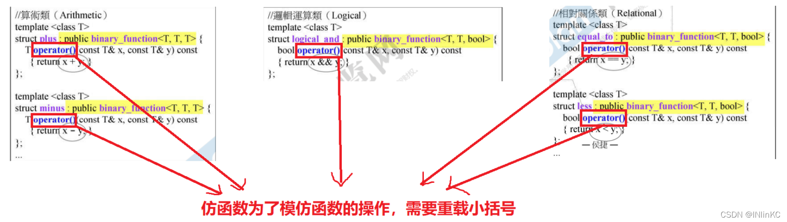

### 让`functor`融入STL，允许被adapter改造

我们可以自行编写我们需要的`functor`，但是如果我们希望将它纳入STL，==允许被adapter改造，那就必须遵循STL的规范，让它继承一些东西。==

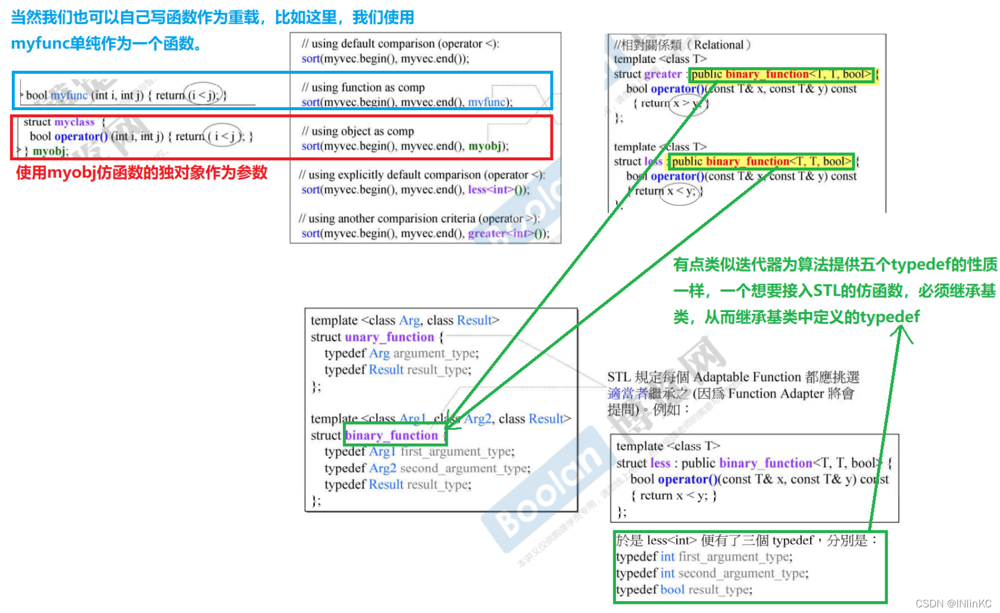


## 适配器 Adapter

### 适配器简介

适配器在STL组件的灵活组合运用功能上，扮演着轴承、转换器的角色。以复合的方式包含其他的STL组件

STL所提供的各种适配器中：

-   改变仿函数接口者，称为函数适配器；
-   改变容器接口者，称为容器适配器；
-   改变迭代器接口者，称为迭代器适配器

对于函数适配器，适配器他也需要获得对应的仿函数一些信息。

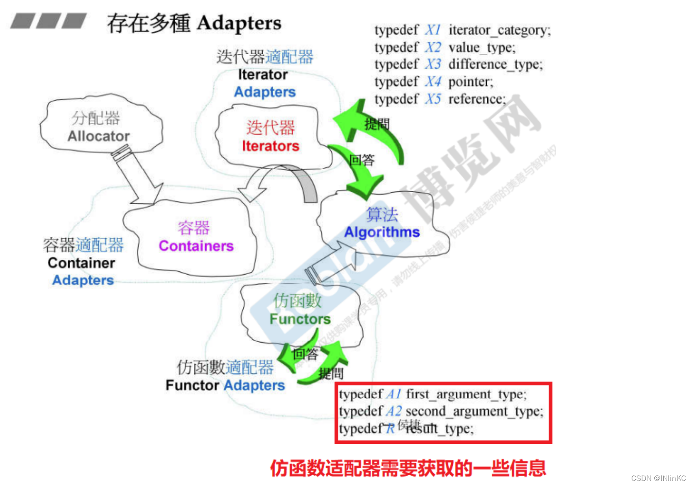


### 适配器分类：

#### 容器适配器

创建新类，包含某个容器（复合的方式），对容器的操作进行重新定义。例如stack内含一个deque，重新定义了部分函数。

-   STL提供两个容器适配器：queue和stack，它们修饰deque的接口而生成新的容器风貌stack的底层由deque构成。
-   stack封锁住了所有的deque对外接口，只开放符合stack原则的几个函数
    queue的底层也由deque构成。
-   queue封锁住了所有的deque对外接口，只开放符合queue原则的几个函数

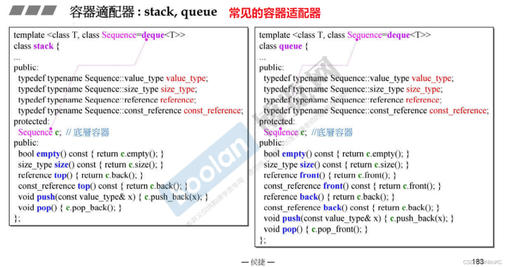

#### 函数适配器 

内含原来的函数对象，对函数操作进程重定义，需要函数提供三个type的定义(这也是为什么仿函数需要继承的原因)。如下图例子，op是一个函数，本来需要两个参数，适配器固定了其中一个参数(即重定义了)


从==bind2nd==这个函数，我们可以看到函数适配器的一些巧妙之处

这里先复习一些前置知识
对于模板，我们知道：

-   对于类模板，它必须指明类中元素的类型，而不能由类自己推导
-   对于函数模板，它有能力自己推导传入的参数类型。

```cpp
vector<int> vec;    //这个int表明我们必须声明类中元素类型
max(1,2);           //即使我们不声明参数1和2的类型，函数max也可以为我们自动推导出他们的类型。
```

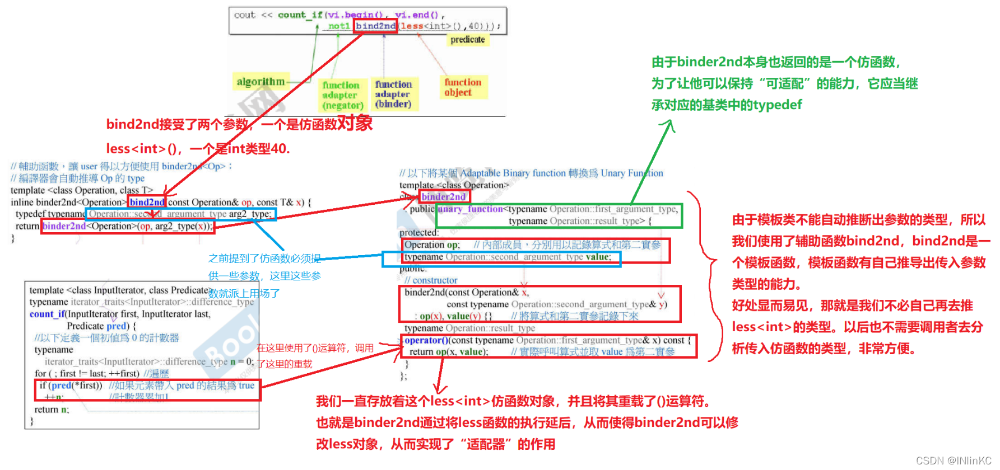

==not1==

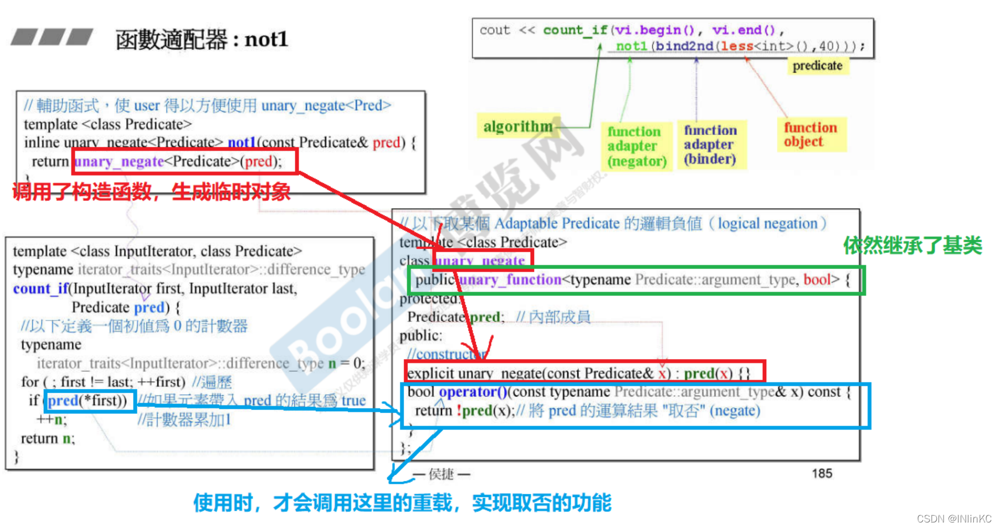

#### 新型适配器bind

在C++11中，之前的适配器有一些被重新取代了，如图

第一列为现在用的

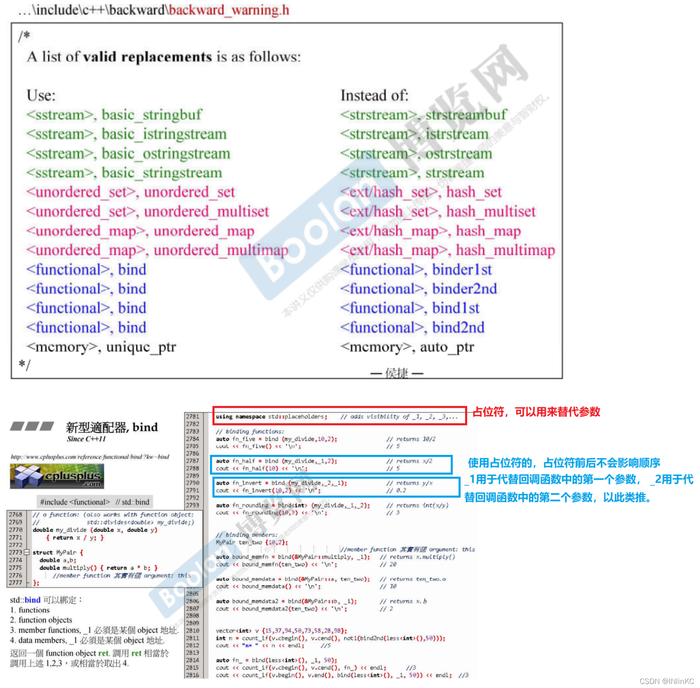


#### 迭代器适配器

类似容器适配器，包含一个迭代器，重定义迭代器的所有操作。下例为逆向迭代器的实现：

##### reverse_iterator

可以通过一个双向顺序容器调用rbegin()，和rend()来获取相应的逆向迭代器。只要双向顺序容器提供了begin(),end()，它的rbegin()和rend()就如同下面的形式。

单向顺序容器slist不可使用reserve iterators。有些容器如stack、queue、priority_queue并不提供begin()，end()，当然也就没有rbegin()和rend()

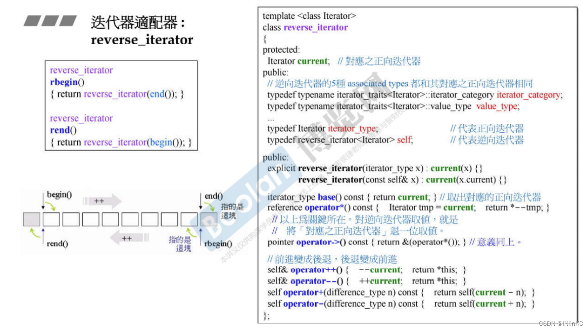

##### insert_iterator

insert iterators：可以将一般迭代的赋值操作转变为插入操作，可以分为下面几个

insert iterators实现的主要观念是：每一个insert iterators内部都维护有一个容器（必须由用户指定）；容器当然有自己的迭代器，于是，当客户端对insert iterators做赋值操作时，就在insert iterators中被转为对该容器的迭代器做插入操作（也就是说，调用底层容器的push_front()或push_back()或insert()）

| insert iterator       | 作用                       |
| --------------------- | -------------------------- |
| back_insert_iterator  | 专门负责尾端的插入操作     |
| front_insert_iterator | 专门负责首部的插入操作     |
| insert_iterator       | 可以从任意位置执行插入操作 |

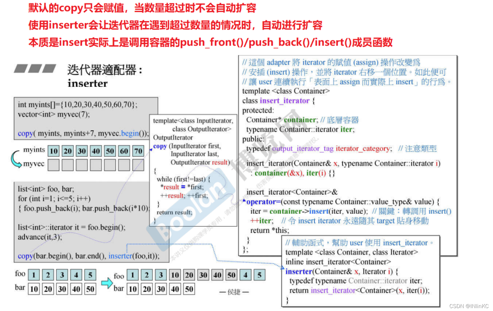


#### 未知适配器

iostream_iterator严格来说不属于上面任何一种适配器，所以我们这里称之为“未知适配器”

##### ostream_iterator

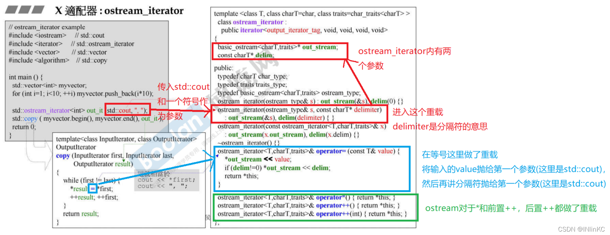

##### istream_iterator

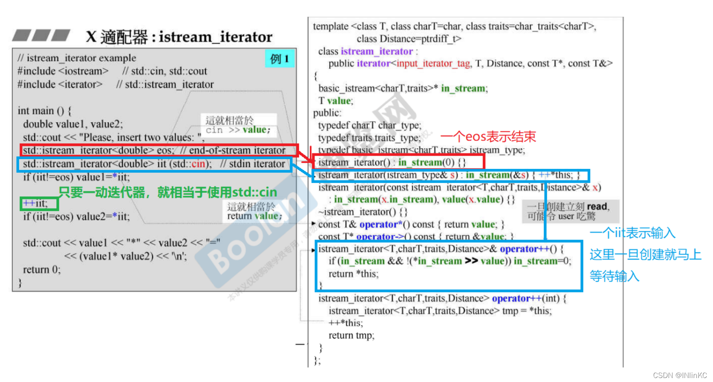