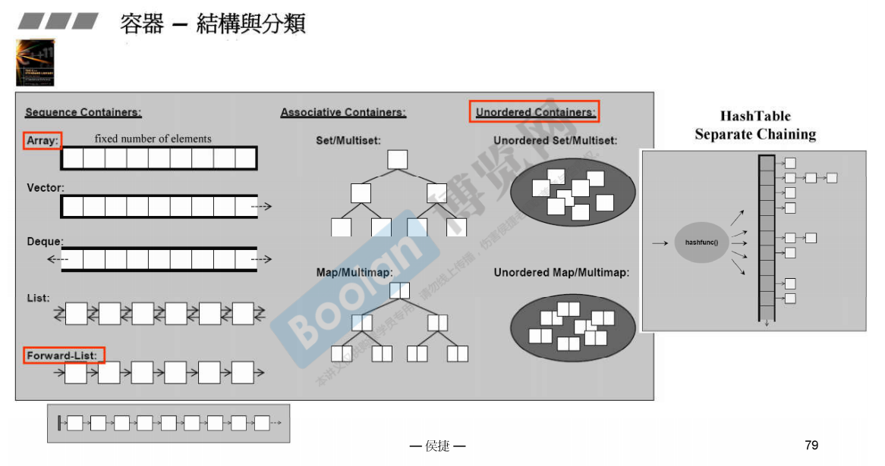
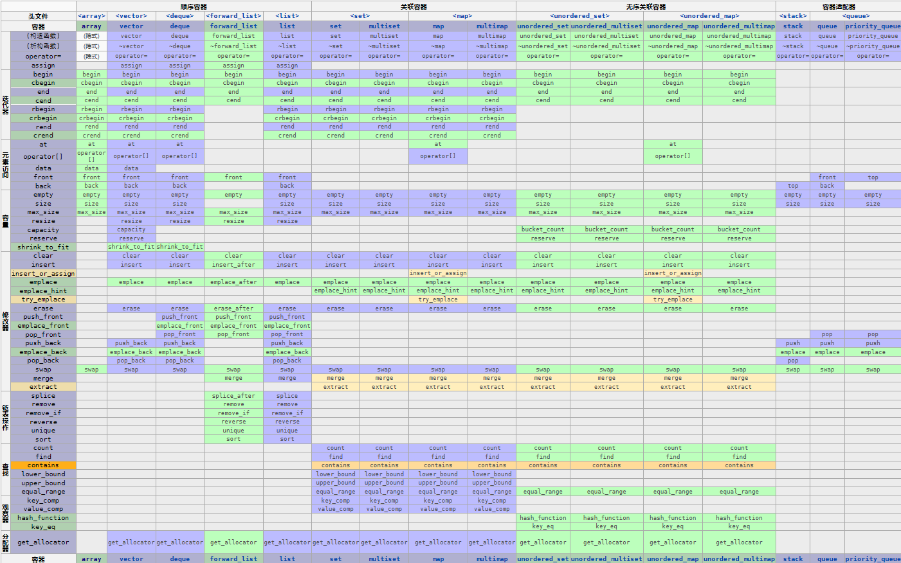

# 内存结构
容器各个种类和内存中的样子：

# 容器性能
| **类型** | **名称** | **插入数据性能** | **删除数据性能** | **查找性能** |
| --- | --- | --- | --- | --- |
| 顺序容器 | array | 不允许 | 不允许 | O1 |
|  | vector | 末尾插入：O1其他位置：On | 末尾删除：O1其他位置：On | O1 |
|  | list | O1 | O1 | 开头和末尾：O1其他位置：On |
|  | forward_list | O1 | O1 | 开头：O1其他位置：On |
|  | deque | 开头末尾：O1其他位置：On | 开头末尾：O1其他位置：On | O1 |
| 容器适配器 | queue | 取决于包含的底层容器list/deque：O1 | 取决于包含的底层容器list/deque：O1 | 不允许 |
|  | priority_queue | 取决于包含的底层容器vector/deque：OlogN | 取决于包含的底层容器vector/deque：OlogN | 不允许 |
|  | stack | 取决于包含的底层容器list/edque/vector：O1 | 取决于包含的底层容器list/edque/vector：O1 | 不允许 |
| 有序关联容器 | set/multiset | OlogN | OlogN | OlogN |
|  | map/multimap | OlogN | OlogN | OlogN |
| 无序关联容器 | unordered_set/unordered_multiset | 平均：O1最坏情况：On | 平均：O1最坏情况：On | 平均：O1最坏情况：On |
|  | unordered_map/unordered_multimap | 平均：O1最坏情况：On | 平均：O1最坏情况：On | 平均：O1最坏情况：On |
| 特殊 | bitset | 不允许 | 不允许 | O1 |

# 容器操作函数
容器支持的各种操作和相应函数，参照[https://zh.cppreference.com/w/cpp/container](https://zh.cppreference.com/w/cpp/container)最后一个表格。

# 如何选择容器类型

