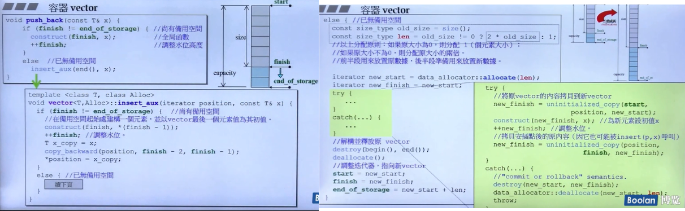
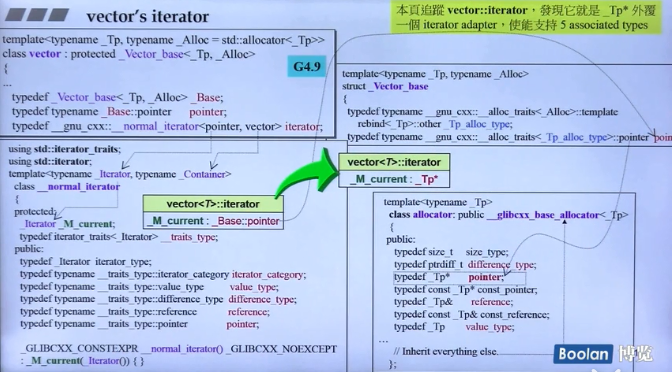
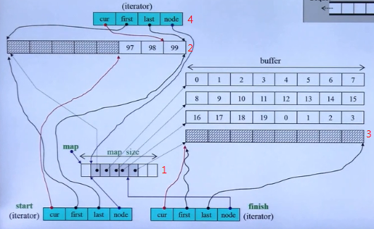
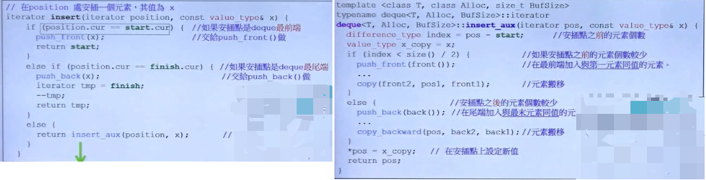
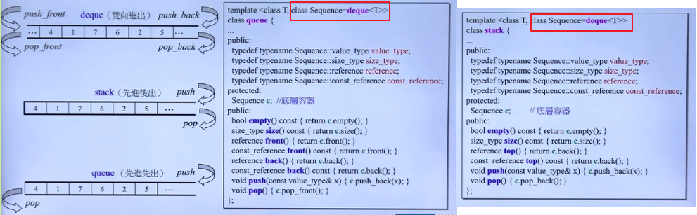
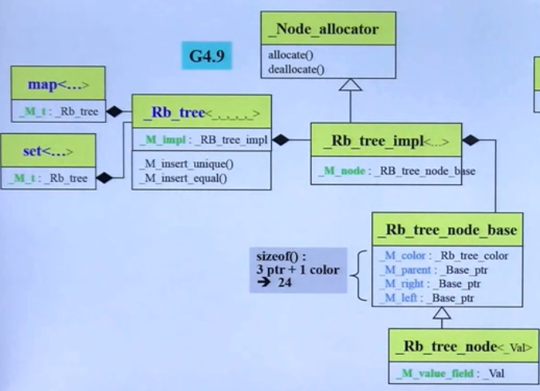
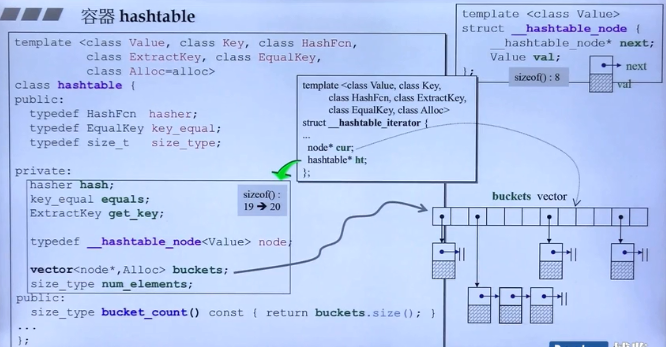
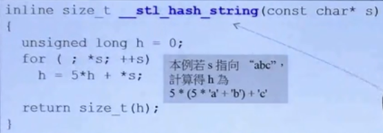
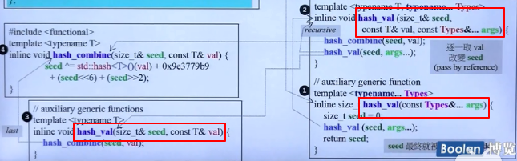

# vector

## vector的扩充方式：二倍成长
vector定义中有如下三个指针：

- iterator **start**：vector的起始位置
- iterator **finish**: vector数据结束的位置
- iterator **end_of_range**: vector预分配空间的结束位置

在每次插入新元素时，vector会判断当前预空间是否够用，如果不够用，就会重新申请一个**当前空间*2**空间，称为二倍成长：

## vector iterator的实现



# deque

## 保存方式：分段连续空间
deque是双向开口的队列，和基于deque的stack和queue都是**分段连续空间**的保存方式，只是对外接口好像是连续的空间：

- 图中1：deque的基本结构，是一个vector，保存着每个连续空间的起始地址（图示5个分段空间）
- 图中2：deque往前添加元素的操作，如果一个连续空间满了，再申请一个连续空间，同时在1中添加起始位置，从后往前添加元素，实现添加元素到头部的功能
- 图中3： deque往后添加元素的操作。同样如果空间满了，再申请一个连续空间，同时在1中添加起始位置指针，从前往后添加元素。
- 图中4：deque的iterator，其中node保存的是1中的位置。current，first，last是连续空间的指针。

## insert任意位置保存如何实现？
deque的insert方法可以在任意位置保存值，由于是分段的连续空间，如果在中间某个位置保存，其他元素就需要迁移。deque的做法是：

1. 判断是否在头部，直接插入在开头
2. 判断是否在尾部，直接插入在末尾
3. 不是1&2，判断距离哪边元素比较少，迁移较少的一边，然后插入元素




## queue和stack
queue和stack都是基于deque的， 在deque的基础上减少部分功能的：


# _Rb_tree
**_Rb_tree**在是非公开的STL实现，很少有文档记录，但是map和set都是基于_Rb_tree的。下图为_Rb_tree的类图：
下面代码是_Rb_tree的模版声明，如果直接使用_Rb_tree需要提供5个参数：
```cpp
//stl_tree.h
template<typename _Key, typename _Val, typename _KeyOfValue,
	   typename _Compare, typename _Alloc = allocator<_Val> >
class _Rb_tree
```

_Rb_tree的使用示例:
```cpp
#include <bits/stl_tree.h>
#include <iostream>

using namespace std;

int main()
{
    _Rb_tree<int, int, _Identity<int>, less<int>> tree;
    cout<<tree.empty()<<endl; //1
    cout<<tree.size()<<endl; //0
    
    tree._M_insert_unique(3);
    tree._M_insert_unique(8);
    tree._M_insert_unique(5);
    tree._M_insert_unique(9);
    tree._M_insert_unique(13);
    tree._M_insert_unique(5); //no effect
    
    cout<<tree.empty()<<endl; //0
    cout<<tree.size()<<endl; //5
    cout<<tree.count(5)<<endl;//返回值为5的个数
    
    tree._M_insert_equal(5);//可以插入相同值
    tree._M_insert_equal(5);
    cout<<tree.size()<<endl; //7
    cout<<tree.count(5)<<endl;//3
    return 0;
}
```


# set和map

## set 的定义
```cpp
//stl_set.h
  template<typename _Key, typename _Compare = std::less<_Key>,
	   typename _Alloc = std::allocator<_Key> >
class set
{
public:
      typedef _Key     key_type;
      typedef _Key     value_type;
      typedef _Compare key_compare;
      typedef _Compare value_compare;
      typedef _Alloc   allocator_type;
private:
    typedef _Rb_tree<key_type, value_type, _Identity<value_type>,
		       key_compare, _Key_alloc_type> _Rep_type;//包含一个红黑树
public:
      typedef typename _Rep_type::const_iterator	 iterator; //迭代器是const，所以无法通过迭代器修改set里的值
}
```

## map的定义
```cpp
//stl_map.h
template <typename _Key, typename _Tp, typename _Compare = std::less<_Key>,
	    typename _Alloc = std::allocator<std::pair<const _Key, _Tp> > >
    class map
    {
    public:
      typedef _Key					key_type;
      typedef _Tp					mapped_type;
      typedef std::pair<const _Key, _Tp>		 value_type;
      typedef _Compare					key_compare;
      typedef _Alloc					allocator_type;

    private:
      typedef _Rb_tree<key_type, value_type, _Select1st<value_type>,
		       key_compare, _Pair_alloc_type> _Rep_type;//红黑树
   public:
     typedef typename _Rep_type::iterator		 iterator;//迭代器不是const，可以用于修改value，key不能改
```


# hashtable

## hashtable的定义
hashtable有六个模板参数： **key, value, hash函数, Extract函数，相等函数，allocator**：

## hash函数
hash函数的目的： 希望根据元素值算出一个**hash code**（一个可进行取余运算的值），使得元素经hash code映射之后能够**够杂够乱够随机**的被放置在hash table中。**越是杂乱，越不容易发生碰撞**。例如char数组的hash函数，乱算：

### 一个万用的hash函数


# tuple
tuple可以保存N个不同类型的元素，其实现是借助了可变长度模版参数。可变长度参数是C++11新标准引入的，符号为**...**:
