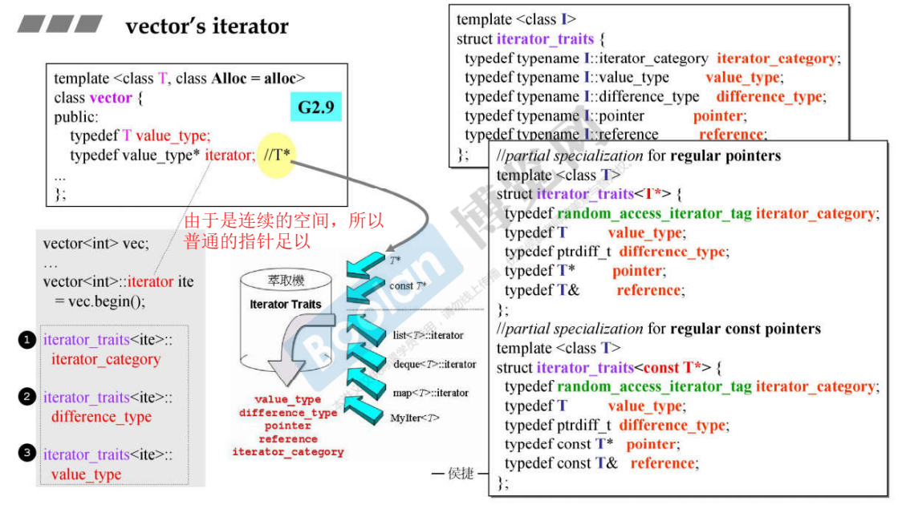
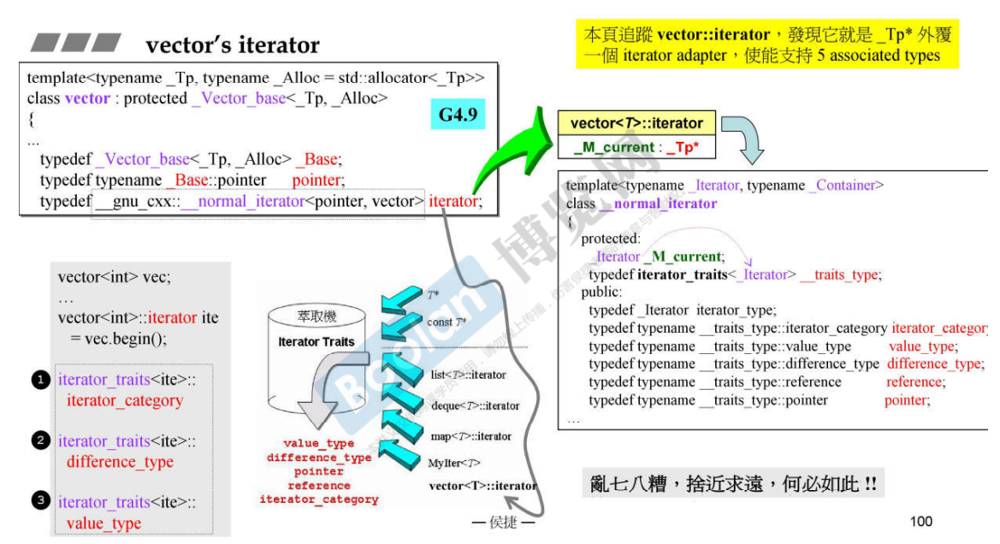
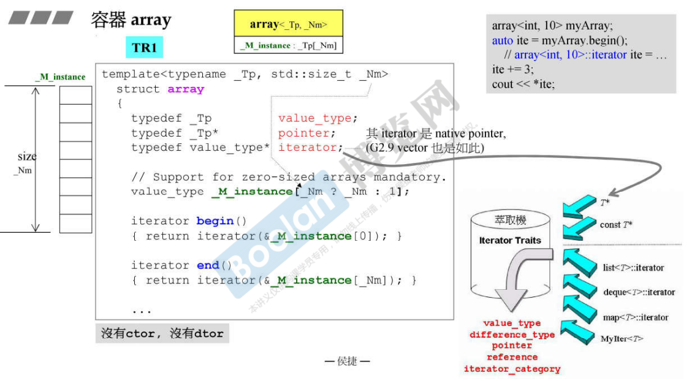
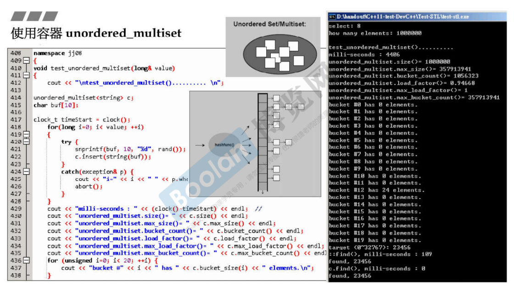
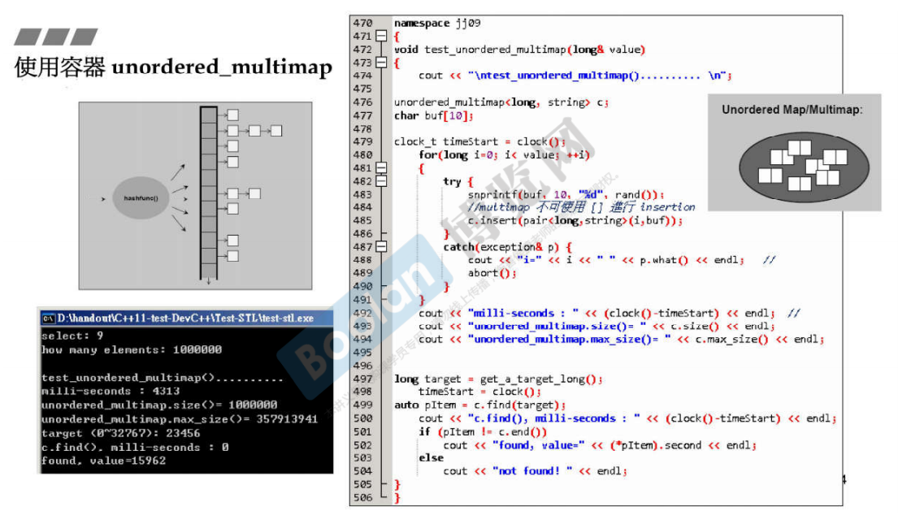
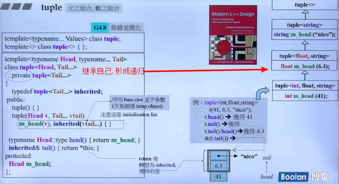

# 各容器之间的关系


# list

## list结构

-   list 本身只含有一个指针 node ，故 list 大小为 4（32位电脑）
-   这个指针所指向的内容的结构体如图所示，包含两个指针（双向链表），一个数据
-   list 含有一个迭代器，它通过自定义类来实现`++/--`等功能（常规的指针没有`++/--`的功能）


## list iterator 的实现

### iterator 定义


### 操作符 ++ 重载

前 ++ 与后 ++：

-   区别：前 ++ 无参数，后 ++ 有参数，但无实际意义；后 ++ 需要调用前 ++
-   前 ++ 实现过程，取 `node`的第二个参数，也就是图中的 `next`指针，然后赋值给自己，并返回
-   后 ++ 实现过程，分为三个过程：
    -   记录原值
    -   进行操作，调用前 ++
    -   返回原值


### * 和 -> 操作符重载


## G2.9 到 G4.9 的改进


# vector

## vector的扩充方式：二倍成长
vector定义中有如下三个指针（故 `sizeof(vector) = 12`）：

- iterator **start**：vector的起始位置
- iterator **finish**: vector数据结束的位置
- iterator **end_of_range**: vector预分配空间的结束位置

在每次插入新元素时，vector会判断当前预空间是否够用，如果不够用，就会重新申请一个==当前空间*2==的连续空间，称为二倍成长：


## vector iterator的实现

不同版本的实现，G2.9、G4.9





# array

-   array 的大小是需要由外界来确定的，如果是int 型，那么就是4 字节，以此类推
-   array 的长度是固定不变的，最小为 1
-   array 没有构造函数，也没有析构函数

两个版本TR1、G4.9




# deque

## 保存方式：分段连续空间
deque是双向开口的队列，和基于deque的stack和queue都是==分段连续空间==的保存方式，只是对外接口好像是连续的空间：


- 图中1：deque的基本结构，是一个vector（图中map所示），保存着每个连续空间的起始地址（图示5个分段空间）
- 图中2：deque==往前添加元素==的操作，如果一个连续空间满了，再申请一个连续空间，同时在1中添加起始位置，==从后往前添加元素==，实现添加元素到头部的功能
- 图中3： deque==往后添加元素==的操作。同样如果空间满了，再申请一个连续空间，同时在1中添加起始位置指针，==从前往后添加元素==。
- 图中4：deque的iterator，其中node保存的是1中的位置。current，first，last是连续空间的指针。

## insert任意位置保存如何实现？
deque的insert方法可以在任意位置保存值，由于是分段的连续空间，如果在中间某个位置保存，其他元素就需要迁移。deque的做法是：

1. 判断是否在头部，直接插入在开头
2. 判断是否在尾部，直接插入在末尾
3. 不是1&2，判断距离哪边元素比较少，迁移较少的一边，然后插入元素


## deque 如何模拟连续空间

除了图中的批注外，还有`++/--/+=`等操作符重载，来实现通过迭代器访问 deque 中不同位置的元素


## queue 和 stack
queue 和 stack 都是基于 deque 的， 在 deque 的基础上减少部分功能而实现的（其实也可以使用 list 作为底层，可能 deque 更高效吧）：


### Note

==queue, stack 由于其特性: 先进先出, 后进先出, 无法提供 iterator 迭代器的操作, 即无法通过迭代器去修改元素==


# _Rb_tree

红黑树保持了BST（平衡二叉树）的性质，但是同时保证最长路径不超过最短路径的二倍，因而近似平衡，避免树左右失衡导致插入和查找效率降低。
因为红黑树是一颗BST，这样迭代器不应该修改那些已经排序插入的节点值。但是由于在C++中红黑树是作为set和map的底层，而map支持修改value，所以在C++中，红黑树没有阻止我们去修改节点值。

红黑树对外界提供了两种插入形式，insert_unique() 和 insert_equal()，前者代表key在这颗红黑树中是唯一的，否则插入失败；而后者不是。


下面代码是Rb_tree的模版声明，如果直接使用Rb_tree需要提供5个参数：

```cpp
//stl_tree.h
template<typename _Key, typename _Val, typename _KeyOfValue,
	   typename _Compare, typename _Alloc = allocator<_Val> >
class _Rb_tree
```

_Rb_tree的使用示例:
```cpp
#include <bits/stl_tree.h>
#include <iostream>

using namespace std;

int main()
{
    _Rb_tree<int, int, _Identity<int>, less<int>> tree;
    cout<<tree.empty()<<endl; //1
    cout<<tree.size()<<endl; //0
    
    tree._M_insert_unique(3);
    tree._M_insert_unique(8);
    tree._M_insert_unique(5);
    tree._M_insert_unique(9);
    tree._M_insert_unique(13);
    tree._M_insert_unique(5); //no effect
    
    cout<<tree.empty()<<endl; //0
    cout<<tree.size()<<endl; //5
    cout<<tree.count(5)<<endl;//返回值为5的个数
    
    tree._M_insert_equal(5);//可以插入相同值
    tree._M_insert_equal(5);
    cout<<tree.size()<<endl; //7
    cout<<tree.count(5)<<endl;//3
    return 0;
}
```


# set和map

## set 的定义
```cpp
//stl_set.h
  template<typename _Key, typename _Compare = std::less<_Key>,
	   typename _Alloc = std::allocator<_Key> >
class set
{
public:
      typedef _Key     key_type;
      typedef _Key     value_type;
      typedef _Compare key_compare;
      typedef _Compare value_compare;
      typedef _Alloc   allocator_type;
private:
    typedef _Rb_tree<key_type, value_type, _Identity<value_type>,
		       key_compare, _Key_alloc_type> _Rep_type;//包含一个红黑树
public:
      typedef typename _Rep_type::const_iterator	 iterator; //迭代器是const，所以无法通过迭代器修改set里的值
}
```

## map的定义

```cpp
//stl_map.h
template <typename _Key, typename _Tp, typename _Compare = std::less<_Key>,
	    typename _Alloc = std::allocator<std::pair<const _Key, _Tp> > >
    class map
    {
    public:
      typedef _Key					key_type;
      typedef _Tp					mapped_type;
      typedef std::pair<const _Key, _Tp>		 value_type;
      typedef _Compare					key_compare;
      typedef _Alloc					allocator_type;

    private:
      typedef _Rb_tree<key_type, value_type, _Select1st<value_type>,
		       key_compare, _Pair_alloc_type> _Rep_type;//红黑树
   public:
     typedef typename _Rep_type::iterator		 iterator;//迭代器不是const，可以用于修改value，key不能改
```

## set  和 multiset

### 注意点

结构如图所示


set和multiset其实也只是调用红黑树的部分函数，某种意义上它也只是一种适配器

-   set的 key == value
-   虽然set/multiset底层的红黑树支持修改节点值，但是set/multiset的迭代器并==不支持修改节点值==
-   set 和 multiset 的插入函数不相同，前者为 insert_unique()，后者为 insert_equal()，故前者的键值唯一，后者的键值不唯一
-   虽然C++有全局泛化的::find()函数，但是它的效率远远不如set中定义的set::find()，我们==应当尽量优先使用容器中定义的函数==

### 底层实现


## map 和 multimap

### 注意点

-   map 的 key != value
-   map / multimap 的迭代器==禁止修改 key==（将 key 设置为了 const），但是==允许修改 value==
-   map 和 multimap 的插入函数不相同，前者为 insert_unique()，后者为 insert_equal()，故前者的键值唯一，后者的键值不唯一

### 底层实现


### map 和 multimap 独有的 [ ] 运算符设计


## unordered_set 和 unordered_multiset

结构如图所示，`multi`代表`key`可以重复



-   底层是hashmap,  一个篮子,  连接着一个链表

-   篮子的数量一般大于元素的数量，因为并不是所有的篮子里都有元素
    -   当篮子的数量小于元素时，篮子的数量就会扩大一倍

## unordered_map 和 unordered_multimap

结构如图所示，`multi`代表`key`可以重复




# hashtable

## hashtable

### 基础概念

-   哈希表是为了实现高效的**存储**以及高效**查找**而实现的。具体操作就是将我们需要存放的数据进行哈希运算之后得到哈希值，然后将哈希值取模（取余数），插入哈希表中对应的篮子（basket）中去。

-   哈希表的长度是一个**质数**，这样的目的是尽可能生成不同的余数
-   Separate Chaining：当出现哈希碰撞时，将相同哈希值的节点组成一个链表挂在这个值对应的哈希值的后面。
-   Rehashing：当哈希表中的总元素数量 >= 哈希表长度时，将哈希表的长度扩展到它两倍原本大小的最近的质数（不是vector的两倍扩容，而是寻找离它两倍大小值最近的一个质数，作为新的大小），然后将元素重新插入。


### 容器分析

| 名称       | 作用                                                         |
| ---------- | ------------------------------------------------------------ |
| Value      | 和红黑树中一样，是键值的合成包                               |
| Key        | 键的类型                                                     |
| HashFcn    | 用来计算传入key的哈希值，得到hashcode，从而在哈希表中找到插入位置 |
| ExtractKey | 由于哈希表中存放元素也是key和value包，ExtractKey就是为了拿出这个包中的key值 |
| EqualKey   | 告诉哈希表key“相等”的定义                                    |
| Alloc      | 分配器                                                       |


### hash函数
hash函数的目的： 希望根据元素值算出一个**hash code**（一个可进行取余运算的值），使得元素经hash code映射之后能够**够杂够乱够随机**的被放置在hash table中。**越是杂乱，越不容易发生碰撞**。以下是c++中为我们封装好的一些哈希函数：


## 无序容器

和有序容器相比，最大的区别就是底层实现变了。一个是红黑树，一个是哈希表。

## 红黑树实现和哈希表实现的这四个容器的区别

-   map始终保证遍历的时候是按key的大小顺序的，这是一个主要的功能上的差异。（有序无序）
-   时间复杂度上，红黑树的插入删除查找性能都是O(logN)而哈希表的插入删除查找性能理论上都是O(1)，他是相对于稳定的，最差情况下都是高效的。哈希表的插入删除操作的理论上时间复杂度是常数时间的，这有个前提就是哈希表不发生数据碰撞。在发生碰撞的最坏的情况下，哈希表的插入和删除时间复杂度最坏能达到O(n)。注释：最坏情况就是所有的哈希值全部都在同一个链表上
-   map可以做范围查找，而unordered_map不可以。
-   unordered_map内存占用比map高。
-   扩容导致迭代器失效。 map的iterator除非指向元素被删除，否则永远不会失效。unordered_map的iterator在对unordered_map修改时有时会失效。因为在操作 unordered_map 容器过程（尤其是向容器中添加新键值对）中，一旦当前容器的负载因子超过最大负载因子（默认值为 1.0），该容器就会适当增加桶的数量（通常是翻一倍），并自动执行 rehash() 成员方法，重新调整各个键值对的存储位置（此过程又称“重哈希”），此过程很可能导致之前创建的迭代器失效。

# tuple
tuple可以保存N个不同类型的元素，其实现是借助了可变长度模版参数。可变长度参数是C++11新标准引入的，符号为**...**:



# Note

-   所有的容器，除了array 和 vector 之外，他们的迭代器 iterator 必须是智能指针，必须是一个 class 
-   关联式容器在 STL 中，底层是由==红黑树==或==哈希表==来支持的

[参考链接](https://blog.csdn.net/weixin_45067603/article/details/122770539)

