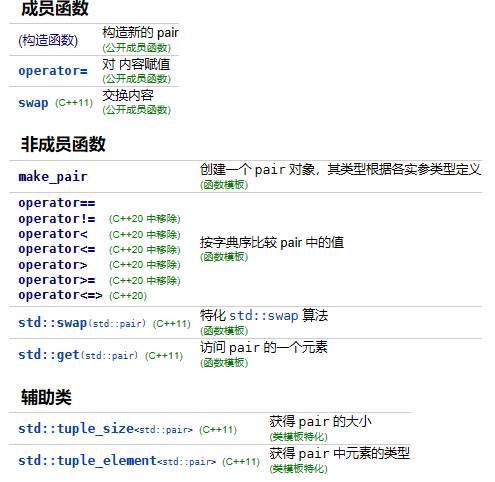
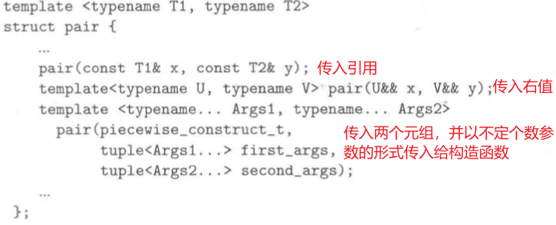

# 1 键值对std::pair

## 1.1 基本成员和方法
`std::pair`将两个值组成一个单元，如下STL容器使用pair作为基本的处理结构（key-value结构）

- map
- multimap
- unordered_map
- unordered_multimap


`std::pair`定义在`<utility>`头文件中，其声明结构如下：
```cpp
namespace std {
    template <typename T1, typename T2>
    struct pair {
        // member
        T1 first;
        T2 second;
        //...
    };
}
```
pair支持的操作函数如下：

## 1.2 构造函数
pair有多个构造函数，其中三个构造函数比较常用。**当然更推荐使用`std::make_pair()`代替构造函数。**
```cpp
//std::pair的使用示例
#include <iostream>
#include <utility>
#include <tuple>

using namespace std;

class Foo
{
public:
    Foo(tuple<int, float>)
    {
        cout << "Foo::Foo(tuple)" << endl;
    }
    template <typename... Args>
    Foo(Args... args)
    {
        cout << "Foo::Foo(args...)" << endl;
    }
};

int main()
{
    tuple<int, float> t(1, 2.22); //创建一个元组
    //构建Foo时，传入t为元组，所以默认使用第一个构造函数
    pair<int, Foo> p1(1, t);
    //创建pair时限传入了piecewise_construct，表示pair的参数使用不定个数参数的形式
    //所以这里，first为42，Foo构建时使用第二个构造函数
    pair<int, Foo> p2(std::piecewise_construct, make_tuple(2), t);

    //打印一下pair的key-value
    cout << p1.first << endl;//直接打印first，second
    cout << get<0>(p2) << endl;//使用get模板函数
}
```

# 2 元组std::tuple

## 2.1 创建和访问
元组在C++11开始得到了全面支持，可以包含任意数量的类型，是pair的进阶版（pair只能容纳两个类型）。定义如下：
```cpp
template<typename... _Elements>//变长模板，可以接收任意数量类型
class tuple : public _Tuple_impl<0, _Elements...>
{};
```
tuple的基本使用和pair一样：

- 通过构造函数或`make_tuple()`创建tuple
- 通过`get<>()`获取元组的不同成员或重新赋值，**注意get中的索引必须是确定的，不能传入运行时索引值（比如for i）**
- 使用`tie()`解包提取元组的成员为独立的变量，并通过`std::ignore`略过不需要的成员
```cpp
 //创建并初始化tuple
tuple<int, float, string> t1{41, 6.3, "nice"};
//打印值
cout << get<0>(t1) << "  ";
cout << get<1>(t1) << "  ";
cout << get<2>(t1) << "  ";
cout << endl;

//使用make_tuple创建tuple
auto t2 = make_tuple(22, 33, "nice");
cout << get<0>(t2) << "  ";
cout << get<1>(t2) << "  ";
cout << get<2>(t2) << "  ";
cout << endl;

//给元组第二个值赋值
get<1>(t1) = 44;
cout << get<1>(t1) << "  ";

//比较元组大小
cout << "is t1 > t2: " << (t1 > t2) << endl;

//使用tie解包
int a;
string s;
std::tie(a, std::ignore, s) = t1; //ignore为略过部分成员
cout << a << "  " << s << endl;
```

## 2.2 重载<<打印元组
```cpp
//重载<<运算符，支持打印tuple
#include <tuple>
#include <iostream>

template <int IDX, int MAX, typename... Args>
class PRINT_TUPLE
{
public:
    static void print(std::ostream &strm, const std::tuple<Args...> &t)
    {
        strm << std::get<IDX>(t) << (IDX + 1 == MAX ? "" : ",");
        PRINT_TUPLE<IDX + 1, MAX, Args...>::print(strm, t);
    }
};

template <int MAX, typename... Args>
class PRINT_TUPLE<MAX, MAX, Args...>
{
public:
    static void print(std::ostream &strm, const std::tuple<Args...> &t)
    {
        //最后一个，什么都不需要打印
    }
};

template <typename... Args>
std::ostream &operator<<(std::ostream &strm, const std::tuple<Args...> &t)
{
    strm << "[";
    PRINT_TUPLE<0, sizeof...(Args), Args...>::print(strm, t);
    return strm << "]";
}
```

