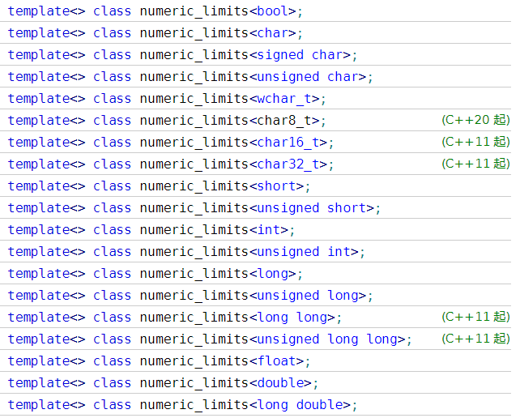

`numeric_limits `类模板提供查询各种数据类型类型属性的标准化方式，支持的类型和**偏特化版本**格式如下：
简单示例如下：
```cpp
//numeric_limits的使用示例
#include <iostream>
#include <limits>
#include <string>
using namespace std;

int main()
{
    cout << boolalpha; //打开bool的文本表示，用于标准输出
    //打印整型类型的最大值，输出和平台有关
    cout<<"max(short): "<<numeric_limits<short>::max()<<endl;
    cout<<"max(int): "<<numeric_limits<int>::max()<<endl;
    cout<<"max(long): "<<numeric_limits<long>::max()<<endl;
    cout<<endl;

    //打印浮点类型的最大值，输出和平台有关
    cout<<"max(float): "<<numeric_limits<float>::max()<<endl;
    cout<<"max(double): "<<numeric_limits<double>::max()<<endl;
    cout<<"max(long double): "<<numeric_limits<long double>::max()<<endl;
    cout<<endl;

    //打印char类型是否是有符号类型
    cout<<"is_signed(char): "<<numeric_limits<char>::is_signed<<endl;
    cout<<endl;

    //打印string类型是否有偏特化类版本
    cout<<"is_specialized(string): "<<numeric_limits<string>::is_specialized<<endl;
}
```
最后一行code可以看出，即使传入的类型不是数值类型，没有特化版本，也可以正常使用，不会造成编译和运行问题。
