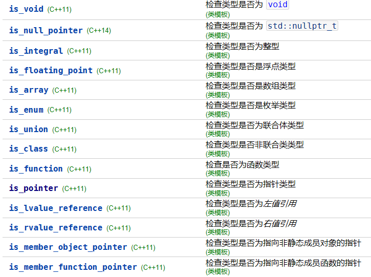
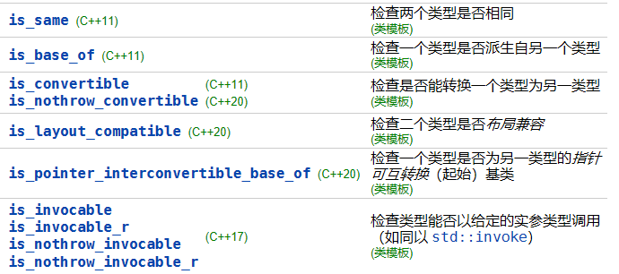
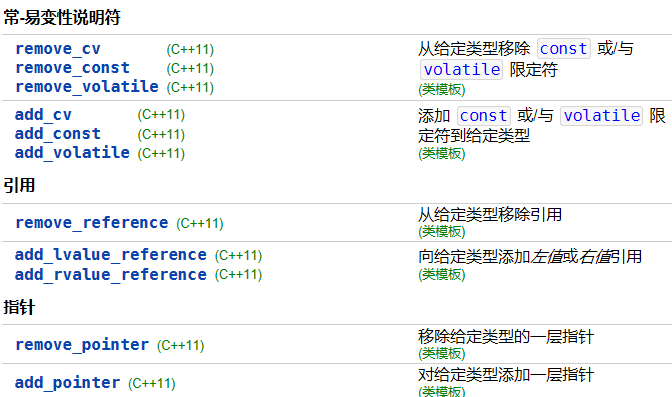

# 1 类型特征相关函数
type_traits（**类型的特征）**是C++11提供的模板元基础库，是模板编程的基石。type_traits可实现在编译期计算、判断、转换、查询等等功能，提供了编译期的true和false：`std::true_type`和`std::false_type`。type trait主要分为如下几类：

- **基本类型判断**：传入类型参数，返回`std::true_type`和`std::false_type`。比如：
- 
- **检查类型之间关系**：传入多参数。比如：



- **类型修饰符**：改动类型，为类型添加或删除属性



- 其他：用于查询特殊属性、检查类型关系、提供类型变换等

# 2 一个应用示例
比如有一个函数foo()，对于整型和浮点数的参数，需要有不同的实现。这就用到了重载，但是有一个问题：整型和浮点数有多种不同的类型，导致需要实现多个重载函数：
```cpp
//整型重载
void foo(short);
void foo(unsigned short);
void foo(int);
...
//浮点数重载
void foo(float);
void foo(double);
void foo(long double);
```
有了type trait提供的函数，我们可以仅仅实现两个重载函数，通过trait返回值决定调用哪个函数：
```cpp
//整型
template <typename T>
void foo_impl(T val, std::true_type);
//浮点数
template <typename T>
void foo_impl(T val, std::false_type);

//入口函数
template <typename T>
void foo(T val)
{
    foo_impl(val, std::is_intergral<T>());//通过trait函数判断是不是整型
}
```
