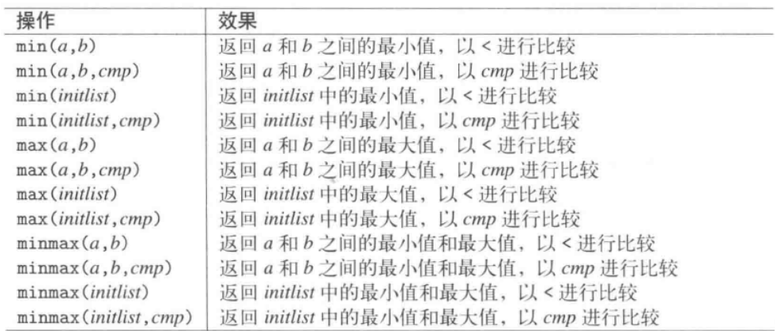

# 1 挑选最大值最小值函数


- 版本1：传入引用，返回引用
```cpp
namespace std
{
	template <typename T>
    const T& min(const T& a, const T& b);
}
```

- 版本2：传入初始化列表，返回值的拷贝，函数内部需要一块**临时空间**保存初始化列表的内容
```cpp
namespace std
{
	template <typename T>
    T min(initializer_list<T> initlist);
}
```

使用示例：
```cpp
int main()
{
    int x = 17;
    int y = 42;
    int z = 33;

    //调用min第一版本
    cout << min(17, 42) << endl;
    cout << min(x, y) << endl;

    //调用min第二版本
    cout << min({x, y, z}) << endl;
}
```

# 2 两值互换函数
std::swap函数可以方便的进行两值互换，其泛化实现为（利用了move语义）：
```cpp
namespace std
{
	template <typename T>
    inline void swap (T& a, T& b)
    {
        T tmp(std::move(a));
        a = std::move(b);
        b = std::move(tmp);
    }
}
```
swap要求：

- T 必须满足**可移动赋值** (MoveAssignable) 和 **可移动构造** (MoveConstructible) 的要求。  
- T2 必须满足可交换 (Swappable) 的要求。  


swap还提供了复杂类型的特化版本，比如支持vector，array等类型：

