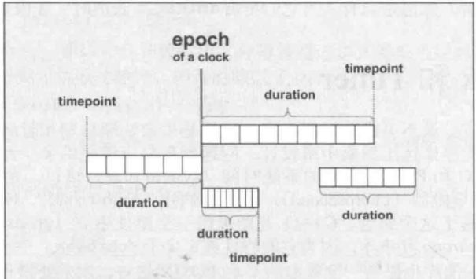
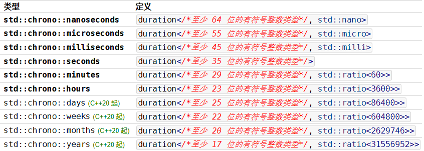
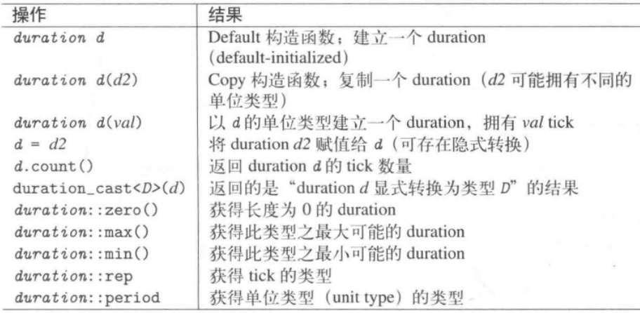
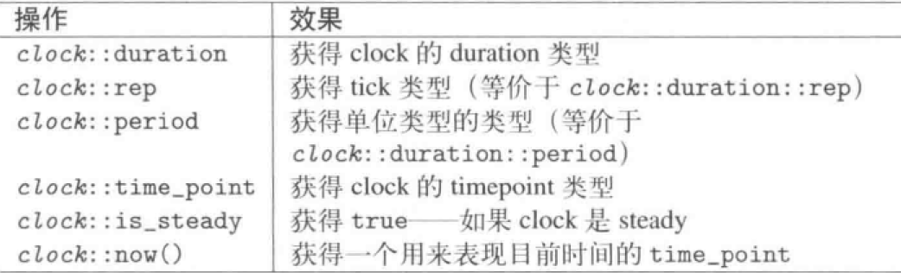
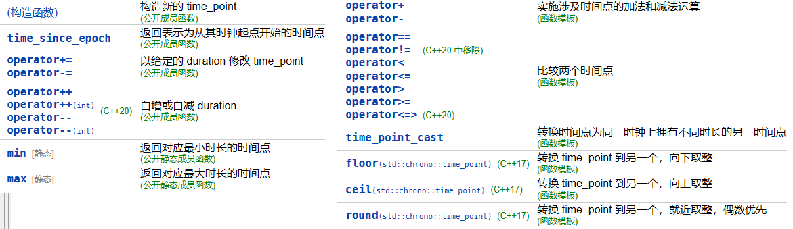
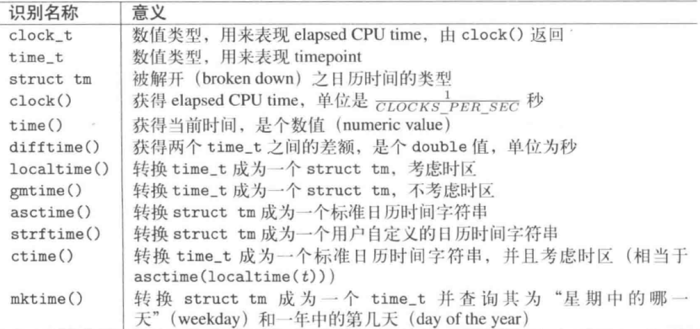

`chrono`提供了一个精度中立的时间日期处理库，提供了抽象层用于隔离不同系统调用的兼容，并抽象化出如下概念以区别系统具体的时间类型：

- epoch起始点：一个明确的时间点，作为基准参考
- duration时间段：某时间单位上一个明确的时间数
- timepoint时间点：起始点+时间段的组合


# 1 std::chrono::duration

## 1.1 基本类型
duration是一个tick个数和一个时间单位（tick）的组合，第一个模板参数表示tick个数的类型，第二个模板参数表示**以秒计**的单位类型。
```cpp
//duration的定义，第二个参数默认以1秒为单位
template<class Rep, class Period = std::ratio<1>>
class duration;
```
duration支持基本的加减乘除和比较等基本运算（**不同的类型也可以计算，但最好不要这样）**。另外，chrono库提供了如下辅助类型用于声明常见的时间类型：

## 1.2 基本成员函数


# 2 std::chrono::clock
STL提供了三种clock，并具备如下通用接口函数：

- system_clock：关联系统的real-time clock
- steady_clock：保证不会被调整，前进速率稳定
- high_resolution_clock：当前系统带有最短tick周期的clock

通用函数如下：

# 3 std::chrono::time_point
类模板 std::chrono::time_point 表示时间中的一个点。它被实现成如同存储一个 Duration 类型的自 Clock 的纪元起始开始的时间间隔的值。主要函数如下：

# 4 C和Posix时间函数
传统的C语言的时间函数都被包含在`<ctime>`中，主要有：

# 5 C++并发编程中时间库的说明

 [4条件变量与future.md](..\..\现代C++\C++并发\4条件变量与future.md) 

