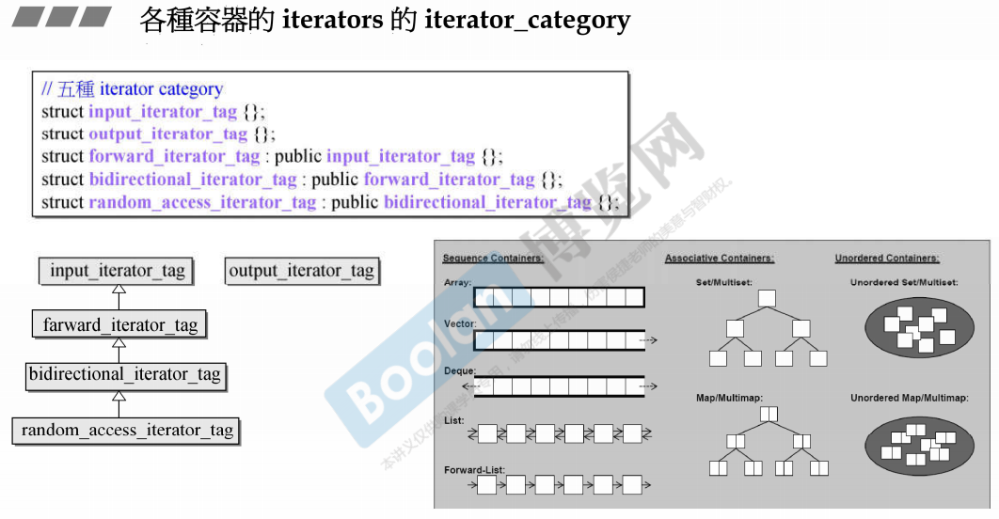
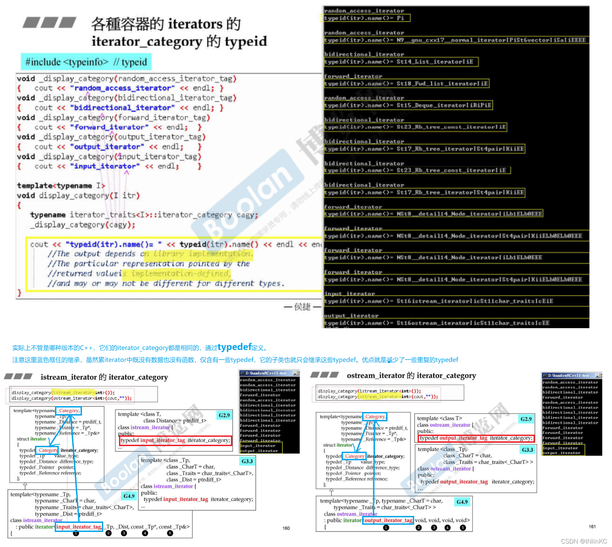
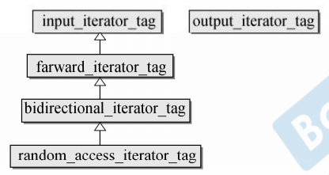
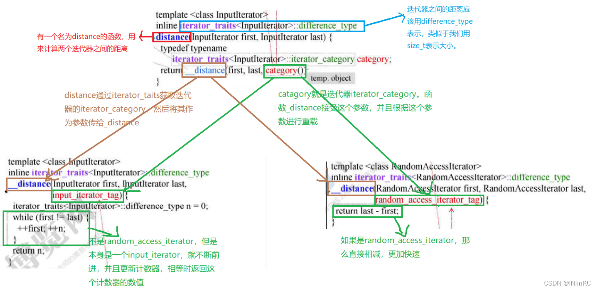
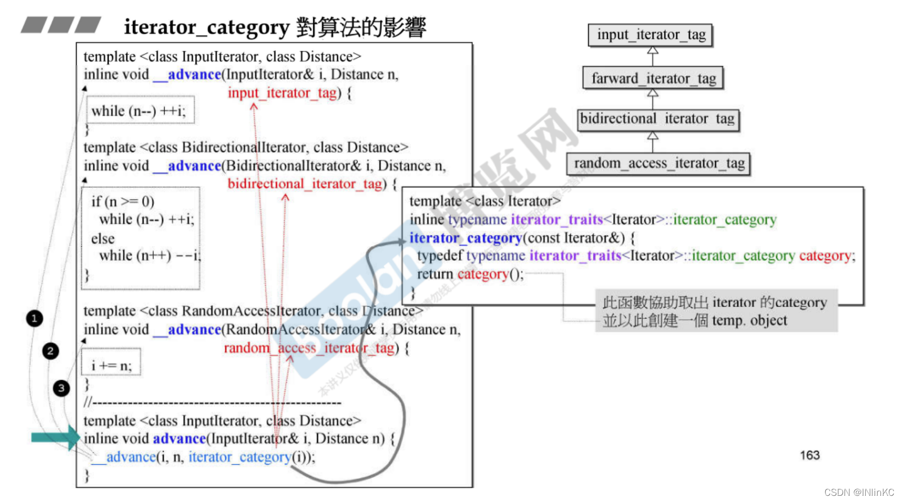
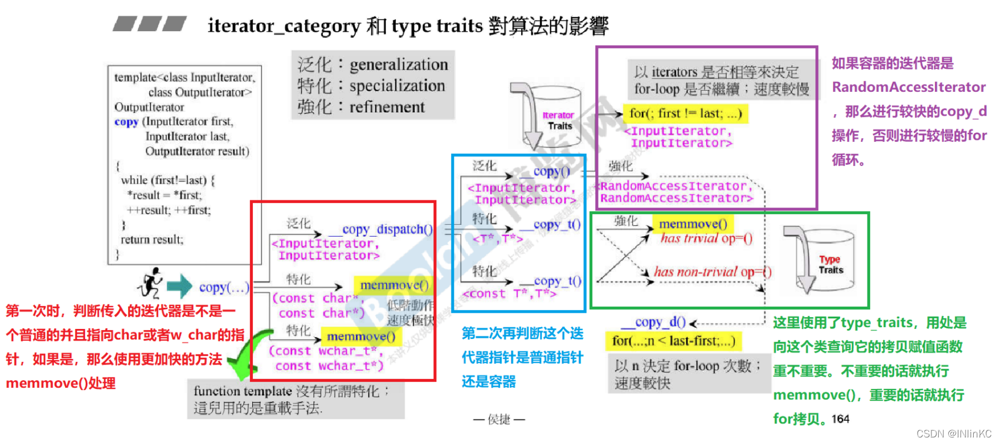
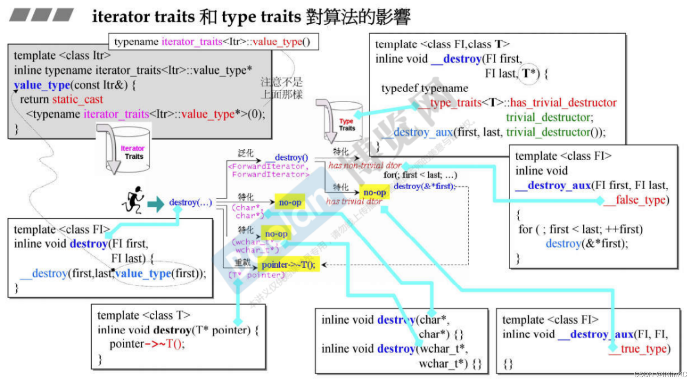
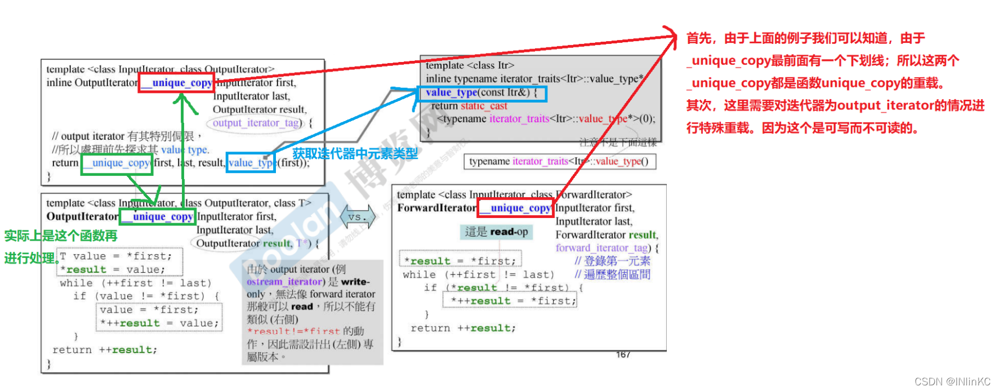
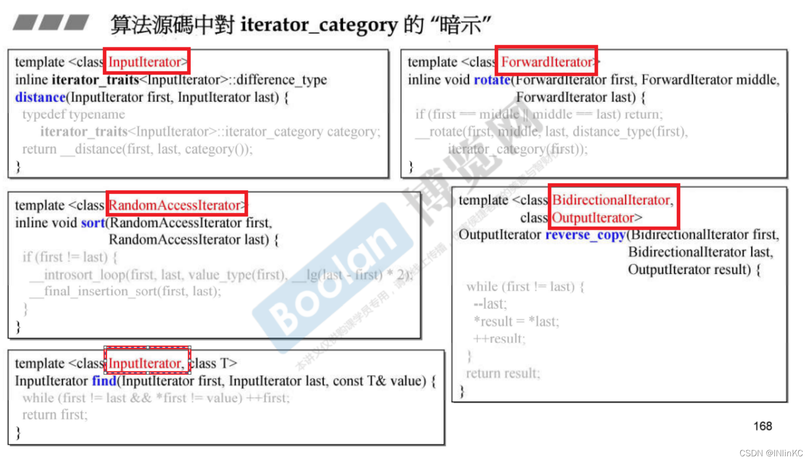
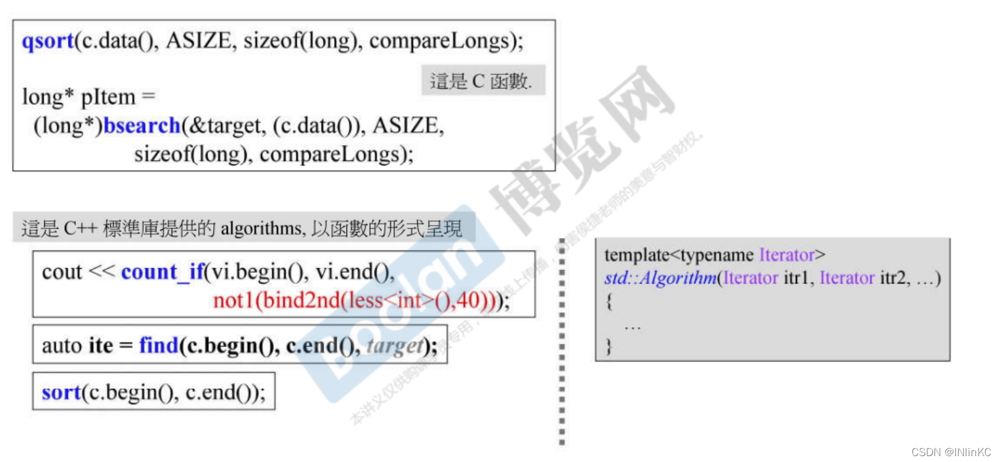

==算法==

-   算法实际上看不到容器，它通过迭代器来进行运算。
-   算法通过询问迭代器（之前有说迭代器需要提供的五个相关类型）来完成自己的工作。
-   算法在语言层面是是一个函数模板，具体是一个仿函数。

# 迭代器

## 迭代器分类

-   一共有五种iterator_category，它们的关系如图所示

| iterator_category          | 简述                 | 容器                                                         |
| -------------------------- | -------------------- | ------------------------------------------------------------ |
| forward_iterator_tag       | 仅单向前进           | forward_list，unordered_set，unordered_map，unordered_multiset，unordered_multimap |
| bidirectional_iterator_tag | 双向，允许前进和后退 | list，set，map，multiset，multimap                           |
| random_access_iterator_tag | 允许访问随机下标     | array，vector，deque                                         |

-   另外两种比较特殊，他们各自仅包含了一种迭代器

| iterator_category   | 包含的迭代器     |
| ------------------- | ---------------- |
| input_iterator_tag  | istream_iterator |
| output_iterator_tag | ostream_iterator |

-   通过 typeid( ) 可以获取iterator_category

可以注意到这些打印出来的iterator_category名称前后有一些无规律字符和数字，这些是编译器中的库实现方法决定的，编译器不同，这些数据也不同。但是实际上为了符合C++标准，它的实际类型都是一样的。

## 迭代器对算法的影响的四个实例

### distance

图中只列出了两种迭代器类型的情况。那么还有剩余的两种情况怎么办呢？

-   对于 `farwward_iterator_tag` ，它继承了 `input_iterator_tag` ，故按照其父类来操作
-   对于 `random_access_iterator_tag`， 它继承了 `bidirectional_iterator_tag`，故按照其父类来操作

### advance

和distance的做法基本相同 

### copy

-   copy用了很多次泛化和特化，除了iterator traits以外还用了type traits。
-   copy对其template参数所要求的条件非常宽松。其输入区间只需由 `inputIterators` 构成即可，输出区间只需要由 `OutputIterator` 构成即可。这意味着可以使用copy算法，将任何容器的任何一段区间的内容，复制到任何容器的任何一段区间上

### destory

和copy近似

## 迭代器的特殊情况

## 算法对迭代器中 iterator_category 的暗示

由于算法必须接受所有的迭代器，但是算法本身可以选择不对其进行处理。对于这些算法不想处理的迭代器，算法会在源代码中进行一些暗示。

比如说这里就是特意修改了模板参数名（没有用 T），来暗示使用者这个算法的适用范围。

# 算法实例

Q：如何判断是C的算法还是C++中的算法？

A：首先C++的算法应该在标准库 `std` 中，其次查看它的形参，C++需要满足接受接受至少两个参数来表示迭代器。

## 十一个算法举例

