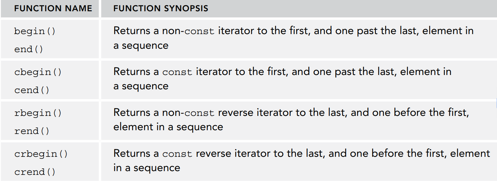

==迭代器iterators是STL容器和算法之间的桥梁，算法应用于容器内的数据，容器需要迭代器提供访问数据的接口。==

如果容器是连续的空间，那么迭代器iterator可以是一个简单的指针，如果不是，则需要是一个class

# 迭代器分类
迭代器类似于指针，用于访问数据，不过STL中迭代器有更详细的分类，用于不同的STL算法。

| **迭代器类型** | **支持的操作** | **说明** |
| --- | --- | --- |
| input iterator输入迭代器 | operator++ operator* operator-> operator= operator== operator!= copy constructor | 提供只读的访问，并且只能++向后访问iterator本身可以赋值、复制和比较 |
| output iterator输出迭代器 | operator++operator*operator= copy constructor | 提供可写的访问，只能++向后访问iterator可以赋值、复制，但不能比较 |
| forward iterator向前迭代器 | 输入迭代器的运算+default constructor | 提供可写的访问，向前访问，++表示向前iterator本身可以赋值、复制和比较 |
| bidirectional iterator双向迭代器 | 向前迭代器的运算+operator--  | 提供向前迭代器所有功能并且可以移动到前一个element(--运算符) |
| random access iterator随机访问迭代器 | 双向迭代器的运算+operator+operatoroperator+=operator-=operator<operator>operator<=operator>=operator[] | 相当于原始指针：支持指针运算，数组索引语法和所有形式的比较 |
| r连续迭代器(C++17) | 随机访问能力 + 逻辑上相邻的元素容器必须在内存中物理含义的相邻 | 比如std::array, vector (notvector<bool>), string, string_view的迭代器 |

# 获取容器的迭代器
每个STL中的容器都提供了`public iterator`，可以通过如下**全局非成员函数**获取（**推荐使用全局非成员函数，不要使用容器内同名的成员函数**）：如下全局函数在头文件`<iterator>`中：

# Iterator Traits
`std::iterator_traits`是迭代器特性模板类，为迭代器类型的属性提供统一的接口，可以通过此类获取如下信息：

- difference_type - 可用来标识迭代器间距离的类型
- value_type - 迭代器指向的值的类型。对于输出迭代器，该类型为 void 。
- pointer - 指向被迭代类型 (value_type) 的指针
- reference - 被迭代类型 (value_type) 的引用类型
- iterator_category - 迭代器类别（见上面的分类）。


示例：
```cpp
//使用iterator_traits的示例，可以获取迭代器的信息
#include <iterator>
#include <iostream>
#include <format>
#include <vector>
using namespace std;

//因为此模板函数中，不知道迭代器指向的什么类型的数据
//所有创建一个iterator_traits，然后返回value_type作为函数参数类型
template <typename Iter>
auto myFind(Iter begin, Iter end,
	const typename iterator_traits<Iter>::value_type& value)
{
	for (auto iter{ begin }; iter != end; ++iter) {
		if (*iter == value) { return iter; }
	}
	return end;
}

int main()
{
	vector values{ 11, 22, 33, 44 };//根据赋值自动推导出vector中都是int类型数据
	auto result{ myFind(cbegin(values), cend(values), 22) };
	if (result != cend(values))
	{
		//打印迭代器间的举例
und value at position {}", distance(cbegin(values), result));
	}
}


# stream迭代器
C++提供了四个流迭代器，其构造函数的第一个参数为文件流，表示对迭代器的最终表现在哪里

# iterator适配器
迭代器适配器，其本质也是一个**模板类**，比较特殊的是，该模板类是借助以上6种基础迭代器实现的。换句话说，**迭代器适配器模板类的内部实现，是通过对以上6种基础迭代器拥有的成员方法进行整合、修改，甚至为了实现某些功能还会添加一些新的成员方法**。迭代器适配器仍属于迭代器，可以理解为是基础迭代器的“翻新版”或者“升级版”。


```