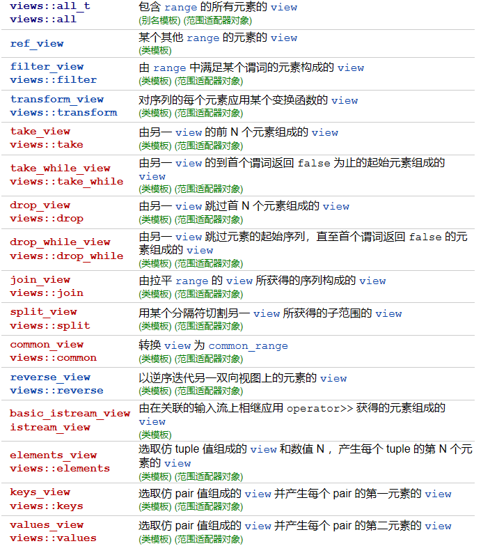
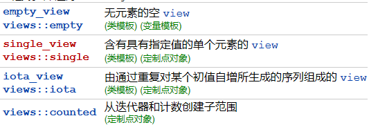

# 范围库的组成
Ranges可以理解为迭代器更上一层的抽象，封装提供了更高级的操作。Ranges有如下组成部分：

- range：range是一个`concept`，用于一个类型迭代访问自己的数据。range表示一个范围，支持`begin()`和`end()`的类型就是一个range。比如array，vector，C数组等
- Range-based algorithms：算法库使用迭代器访问容器数据，C++20开始也能接受range作为参数来访问容器。
- Projection：很多range算法有projection**投影回调参数**，投影回调会作用于容器的每个元素，在开始算法前对容器数据进行一些**转换**操作。
- VIews：view用于转换或过滤底层range中的数据，是容器数据的一个视图。通过视图可以对数据进行访问个修改。
- Factories：factory用于构建view

# range algorithm
这些算法函数在`**std::ranges**`命名空间下，接受range变量作为参数
```cpp
vector data { 33, 11, 22 };
sort(begin(data), end(data));//普通算法使用迭代器，需要传递begin/end

ranges::sort(data);//range based算法使用range，vector就是一个range，所以直接传给函数
```

# projection
看一个投影的例子：
```cpp
class Person
{
public:
    Person(string first, string last)
        : m_firstName{move(first)}, m_lastName{move(last)} {}
    const string &getFirstName() const { return m_firstName; }
    const string &getLastName() const { return m_lastName; }

private:
    string m_firstName;
    string m_lastName;
};

vector persons { Person {"John", "White"}, Person {"Chris", "Blue"} };
//尝试进行排序
sort(begin(persons), end(persons)); // Error: does not compile
ranges::sort(persons); // Error: does not compile
```
使用vector保存了Person类的对象，但是因为Person没有实现比较运算符(<)的重载，所以编译器不知道如何比较Person的大小，无法进行排序。所以使用映射，在开始排序时，取出每个对象的firstName作为排序的依据：
```cpp
//使用映射，告诉sort使用什么规则判断Person大小
ranges::sort(persons, {}, &Person::getFirstName);
//第二个参数表示使用什么排序函数，这里不改
```

# view
view有以下特点：

- 对view的操作不会影响底层的range数据，也就不会影响容器被原始数据
- **view没有数据的所有权**，仅仅是查看数据的另一种方式（参照一下数据库的视图）
- view也是一个range
- **标准容器是range，但不是view，因为容器拥有数据的所有权**

## range adapter
range adapter接受range或view，加上其他参数，然后返回一个新的view对象。常见的range adapter如下：

## 创建view
可以看到上面的adapter都是成对出现的，对应两种创建view的方式：

- `auto v = std::ranges::xxx_view { range, arguments... };`
- `auto v = range | std::ranges::views::xxx(arguments...);`


使用view的示例：
```cpp
//使用range adapter创建view，不同的adapter代表不同的操作
#include <algorithm>
#include <iostream>
#include <ranges>
#include <string>
#include <vector>
using namespace std;

void printRange(string_view message, auto& range)
{
	cout << message;
	for (const auto& value : range) {
		cout << value << " ";
	}
	cout << endl;
}

int main()
{
	vector values{ 1, 2, 3, 4, 5, 6, 7, 8, 9, 10 };
	printRange("原始容器数据: ", values);

	//创建filter view，并设置筛选函数
	auto result1{ values | views::filter([](const auto& value) { return value % 2 == 0; }) };
	printRange("filter view values: ", result1);

	//创建transform view，修改view数据
	auto result2{ result1 | views::transform([](const auto& value) { return value * 2.0; }) };
	printRange("transform view，Values doubled: ", result2);

	// drop view，跳过前两个数据
	auto result3{ result2 | views::drop(2) };
	printRange("Drop view，First two dropped: ", result3);

	// Reverse view. 反向迭代
	auto result4{ result3 | views::reverse };
	printRange("Reverse view: ", result4);

	//view之后看看原始数据
	printRange("view后容器数据: ", values);
}
```

## 通过view修改原始数据
前面说过，view本身的创建和操作不会影响到range中的原始数据。不过我们依然可以通过view手动的修改view，view会将修改传递到容器中。**要求range和view不能是只读的，要有可写权限。**比如上面例子，我们先去掉transform view，因为它是一个只读的view，会导致最终的result4也是只读的。然后如果手动去修改`result4`中的数据，vector中相应位置的数据也会被修改：
```cpp
vector values{ 1, 2, 3, 4, 5, 6, 7, 8, 9, 10 };
	printRange("原始容器数据: ", values);

	//创建filter view，并设置筛选函数
	auto result1{ values | views::filter([](const auto& value) { return value % 2 == 0; }) };
	printRange("filter view values: ", result1);

	// drop view，跳过前两个数据
	auto result3{ result1 | views::drop(2) };
	printRange("Drop view，First two dropped: ", result3);

	// Reverse view. 反向迭代
	auto result4{ result3 | views::reverse };
	printRange("Reverse view: ", result4);

	// 通过view result4修改数据
	for (auto& value : result4) { value *= 10; }
	printRange("After modifying elements through a view, vector contains: ", values);
```
最终根据result4中数据在容器中的位置，修改容器原始数据，结果为：Reverse view: 10 8 6vector contains: 1 2 3 4 5 60 7 80 9 100

# Factories
range库提供了很多工厂用于创建view。和adapter的区别是，工**厂是从头创建view，adapter是从range中直接获取。**
```cpp
auto values { views::iota(10) };//创建一个从10开始自增的view，没有使用adapter

// 在view基础上使用adapter创建filter view
auto result1 { values | views::filter([](const auto& value) { return value % 2 == 0; })};

// transform view
auto result2 { result1 | views::transform([](const auto& value) { return value * 2.0; })};

// 取前10个数据，结果为20 24 28 32 36 40 44 48 52 56
auto result3 { result2 | views::take(10) };
```
