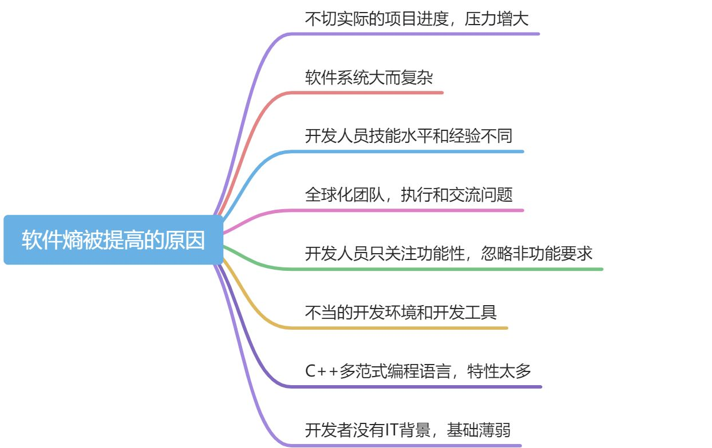
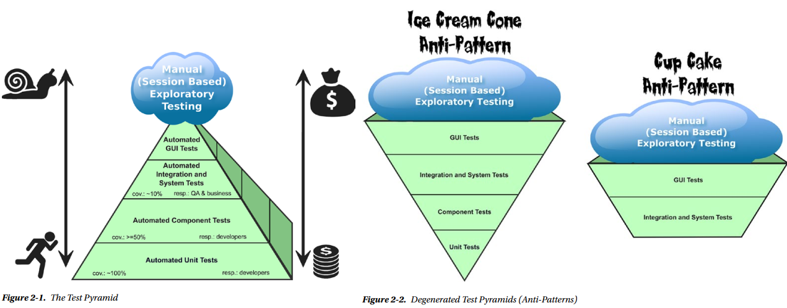
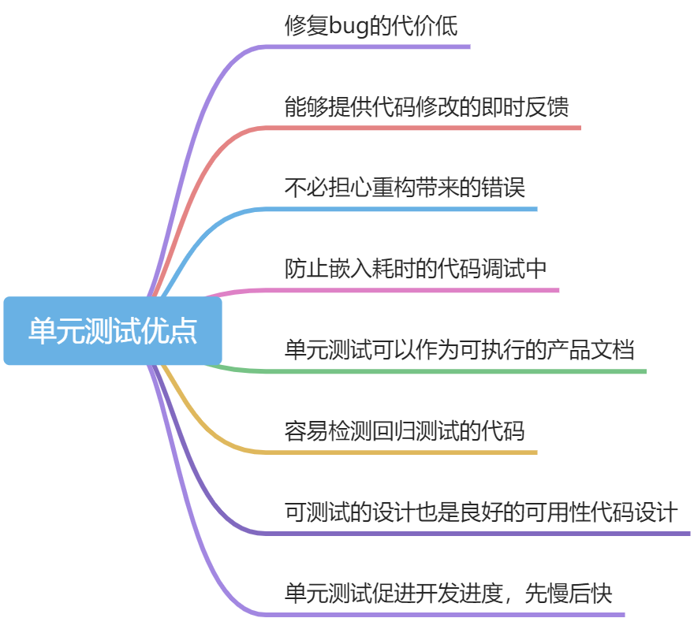

> 基于笔记做的分享ppt：


# 1 软件熵
> C可以让你很容易的搬起石头砸自己的脚，C++则困难得多，但当砸到的时候，你就会失去整条腿。
> ————Bjarne Stroustrup


C++程序员已经被哪些促进软件工艺和整洁代码开发的人员忽视了，很多熟知的原则和实践在C++领域似乎不被人所知道。一些开创性书籍（比如《clean code》）也是如此。**C++有很多令人兴奋的技巧，但这些通常不是整洁代码的精神，也不是现代C++的代码风格。**


# 2 单元测试
退化的测试金字塔：

# 3 单元测试原则

## 3.1 测试代码也要高质量
产品代码和测试代码没有任何区别，同等对待。

## 3.2 测试命名要有直观性和描述性
单元测试命名的模板：`<PreconditionAndStateOfUnitUnderTest>_<TestedPartOfAPI>_<ExpectedBehavior>`

- 前置条件：执行单元测试前的状态
- 被测试的部分：被测试的过程、函数或方法
- 预期测试结果


另一种容易理解的测试命名是：**在单元测试名称中显示特定的需求**，比如：`void UserAccountTest::creatingNewAccountWithExistingEmailAddressThrowsException();`

## 3.3 单元测试的独立性
每个单元测试与其他的测试case都必须是独立的，**永远不要编写“一个测试的输出是另一个测试的输入”这样的单元测试。**

## 3.4 一个测试一个断言
一个单元测试只使用一个断言，一来容易命名，二来一旦测试失败可以很容易的知道错误原因。如果测试中存在多个断言，前面的断言失败会掩盖其他的错误。

## 3.5 环境的独立初始化
每一个单元测试都要在一个干净整洁的环境中，测试完成后，于该单元测试相关的所有状态都必须消失。

## 3.6 不要对getter和setter做测试
不要为类的getter和setter编写单元测试，这些简单的接口已经在其他测试代码中被调用并测试。**注意：如果这些接口不简单，有复杂的逻辑，那就需要测试。**

## 3.7 不要对第三方代码做单元测试

## 3.8 不要对外部系统做单元测试
外部系统或系统环境不是你的责任，不需要测试。**测试你的代码，而不是他们的代码**。

## 3.9 避免直接访问数据库
能不使用数据库进行单元测试，就不使用。最好的做法是**模拟数据库，指在内存中执行所有的单元测试**。

## 3.10 不要混淆测试代码和产品代码
看下面的例子：
```cpp
using class DataAccessObjectPtr = std::unique_ptr<DataAccessObject>;

class Customer
{
private:
	DataAccessObjectPtr getDataAccessObject() const 
	{
		if (inTestMode)  // 测试代码和产品代码糅合在一起，并且需要一个单独的flag
			return std::make_unique<StubDAOForTest>();
		else
			return std::make_unique<CustomerDAO>();
	}
public:
	void save()
	{
		DataAccessObjectPtr object = getDataAccessObject();
		//......
	}
};
```
去除代码糅合，修改为：
```cpp
using class DataAccessObjectPtr = std::unique_ptr<DataAccessObject>;

class Customer
{
private:
	DataAccessObjectPtr m_DataAccessObject;  //成员，可以测试和正式代码传入不同的对象，分离依赖
public:
	Customer() = delete; // C++11, 不生成默认构造函数
	Customer(DataAccessObjectPtr& ptr):m_DataAccessObject(ptr){}
	void save()
	{
		DataAccessObjectPtr object = m_DataAccessObject;
		//......
	}
};
```

## 3.11 测试必须快速执行
单元测试是为开发者建立快速反馈机制，所以测试耗费的时间要短，并且可以通过配置关闭不想关的测试组。

## 3.12 测试替身
如果要测试的单元与其他模块或外部系统有依赖性，就需要**测试替身**来替换，可以叫**伪对象或桩**。
