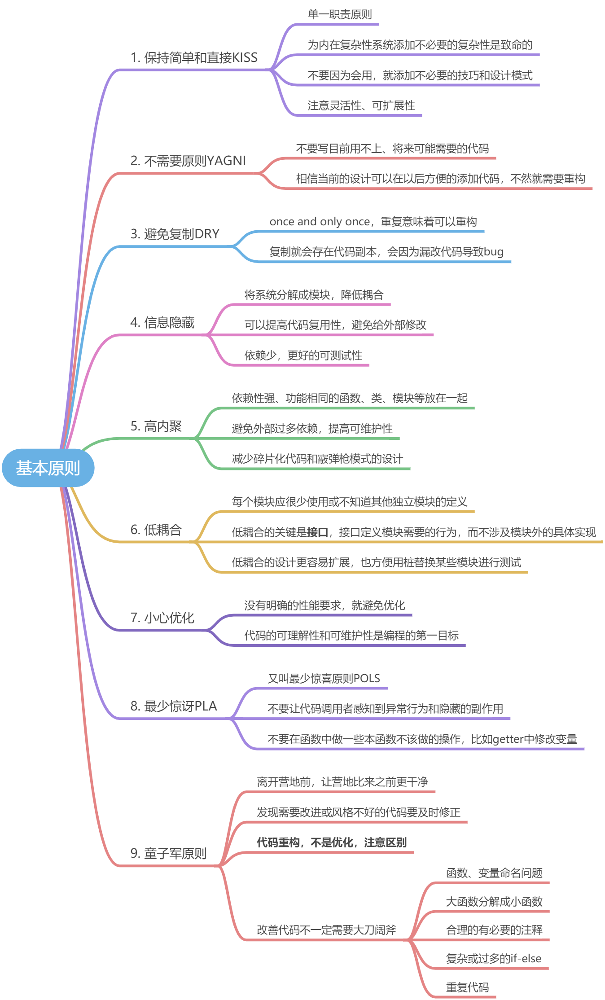
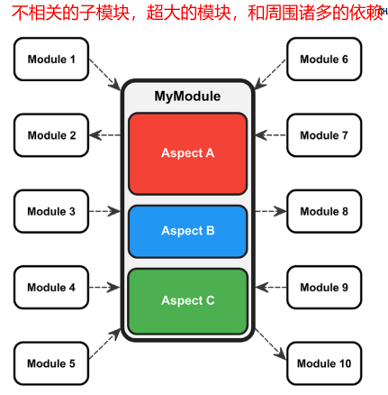
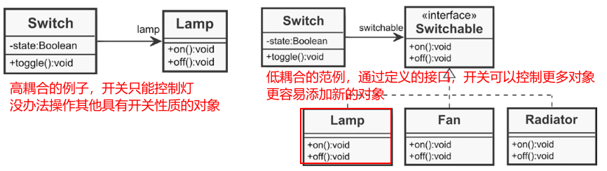

# 1 信息隐藏的例子
```cpp
class Door
{
public:
	enum State
	{
		closed = 1;
		opening,
		open,
		closing
	};
	//这里，枚举State需要在类外声明才能调用get函数，枚举的信息被暴露
	State getState() const
	{
		return m_state;
	}
private
	State m_state;
};
```
需要对get函数进行修改，同时使用**枚举类**防止被转换成其他类型：
```cpp
class Door
{
public:
	//这回，类外只知道true or false
	bool isClosed() const;
	bool isClosing() const;
	bool isOpen() const;
	bool isOpening() const;
private
	enum class State //枚举类
	{
		closed = 1;
		opening,
		open,
		closing
	};
	State m_state;
};
```

# 2 高内聚的例子


# 3 低耦合的例子



