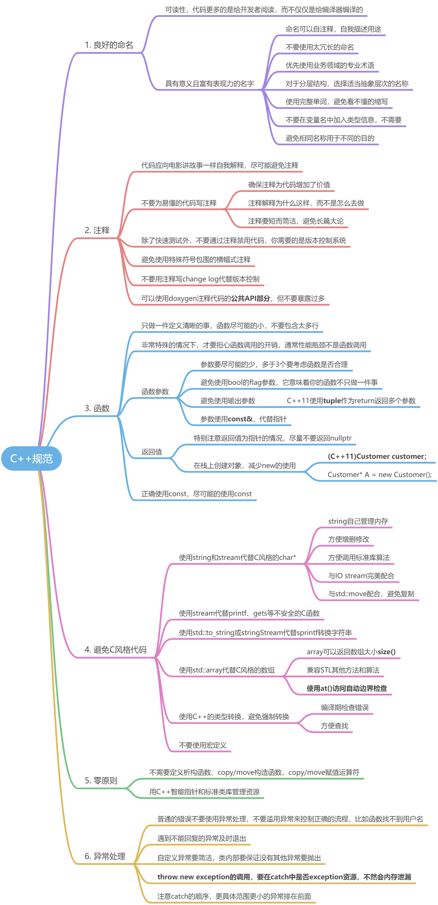

# 1 Doxygen的简单使用
Doxygen是一个程序的文档产生工具，可以将程序中的注释转换成说明文档或者说是API参考手册，从而减少程序员整理文档的时间。当然这里程序中的注释需要遵循一定的规则书写，才能让Doxygen识别和转化。目前Doxygen可处理的程序语言包含C/C++、Java、Objective-C、IDL等，可产生出来的文档格式有HTML、XML、LaTeX、RTF等，此外还可衍生出不少其它格式，如HTML可以打包成CHM格式，而LaTeX可以通过一些工具产生出PS或是PDF文档等。

## 1.1 Doxygen注释语法

- 单行注释：///或者//!
- 多行注释：/**或者/*!
- @author          作者
- @brief             摘要
- @version         版本号
- @date             日期
- @file                文件名，可以默认为空，DoxyGen会自己加
- @class             类名
- @param           函数参数
- @return           函数返回值描述
- @exception      函数抛异常描述
- @warning         函数使用中需要注意的地方
- @remarks        备注
- @see               see also字段
- @note             brief下空一行后的内容表示详细描述，但也可以不空行用note表示
- @par               开始一个段落，段落名称描述由你自己指定，比如可以写一段示例代码
- @code             引用代码段
- @endcode        引用代码段结束
- @pre               函数前置条件，比如对输入参数的要求
- @post             函数后置条件，比如对系统状态的影响或返回参数的结果预期


附带我感觉不太会常用到的其他标记：

- @defgroup       模块名
- @name            分组名
- @{                  模块开始
- @}                  模块结束
- @deprecated    今后可能将被废弃或已经有替代品的函数
- @todo             被标记的代码会在ToDo列表中出现
- @bug              被标记的代码会在Bug列表中出现
- @test              被标记的代码会在Test列表中出现​

## 1.2 应用示例
```cpp
/**
 * @brief main function
 * @details the program start point
 *
 * @param argc input parameter counts
 * @param argv input parameters array
 * @return exec result
 *     @retval 0 run OK
 *     @retval 1 run failed
 * @note just a sample example
*/
int main(int argc, char* argv[])
{
    return 0;
};
```
使用doxygen解析之后，会生成html的文件，打开之后显示如下（简直就是API文档）：

## 1.3 注意事项

1. 不要使用@file <name>标签，因为文件名可能会变化；可以不带<name>，让doxygen自动读取文件名
1. 不要手动编辑@version、@author、@date标签，版本控制系统可以自动填充。
1. 不要使用@bug、@todo标签，说明代码有缺陷或没有完成，应该由bug管理系统记录
1. 建议使用@mainpage标签描述项目的主页
1. 建议使用doxygen分组机制表达内聚的子模块，@defgroup、@addgroup、@ingroup

# 2 const的多种用途

- 将变量定义为常量：`const long double PI = 3.141592653589794;`
- 防止参数参数被修改：例如
   - 输入指针参数指向Car的**常量对象**，对象不能被修改：`unsigned int determineWeightOfCar(Car ``const``* car);`
   - 输入指针参数指向Car的**指针常量**，对象可以修改，指针的指向不能修改：`void lacquerCar(Car* ``const ``car);`
   - 结合1&2，对象和指针指向都不能修改：`unsigned int determineWeightOfCar(Car const* const car);`
   - **const引用**，message在函数内不能修改：`void printMessage(const std::string& message);`
   - **也是const引用**，效果一样：`void printMessage(std::string const& message);`
- 将类的成员函数声明为const，表示**不能修改类中成员变量**:
```cpp
class Car {
public:
	std::string getRegistrationCode() const
    {
     	std::string toBeReturned = registrationCode;
		_registrationCode = "foo"; // 这里要修改成员变量，编译出错
		return toBeReturned;
	}   
private:
	std::string _registrationCode;
};


```
> 记忆方法：
> - **const总是修饰它左边的内容**
> - **如果const在开头，则修饰它右边的内容**


# 3 C++ IO Stream

## 3.1 stringStream操作字符串

## 3.2 类重载<<运算符
```cpp
class Invoice
{
private:
	//使用friend重载<<运算符，之后就可以用cout打印了
	friend std::ostream& operator<<(std::ostream& outstream, const Invoice& invoice)
	{
		outstream << "Invoice No.: " << invoice.invoiceNumber << "\n";
		outstream << "Recipient: " << *(invoice.recipient) << "\n";
		outstream << "Date/time: " << invoice.getDateTimeOfInvoicingAsString() << "\n";
		outstream << "Items:" << "\n";
		for (const auto& item : invoice.invoiceLineItems)
		{
			outstream << " " << *item << "\n";
		}
		outstream << "Amount invoiced: " << invoice.getSum() << std::endl;
		return outstream;
	}


	UniqueIdentifier invoiceNumber;
	DateTime dateTimeOfInvoicing;
	InvoiceRecipientPtr recipient;
	InvoiceLineItems invoiceLineItems;
};
```

# 4 C++类型转换
**C++的类型转换会在编译器编译期间进行检查**，而C风格的强制转换不会做任何检查，所以在运行时会出错，导致严重问题或崩溃。比如下面的例子：
```cpp
#include <iostream>
#include <string>
#include <string.h>
#include <stdio.h>
using namespace std;

int main(int argc, char* argv[])
{
    int a = 200;  //4个字节
    long* b = (long*)&a; //8个字节的指针，强制指向4字节内存地址
    cout<<*b<<endl;
    *b = 9223372036854775807; //这里数字会溢出，程序崩溃
    cout<<*b<<endl;
    return 0;
};
```
将上面的强制转换用C++风格重新编写后，在编译时会检测到错误：`long* b = static_cast<long*>(&a);``a.cpp:10:36: error: invalid static_cast from type 'int*' to type 'long int*'`
C++支持的cast类型转换如下：使用建议如下：

- **不要使用dynamic_cast**，它被认为时一个糟糕的设计，表明当前的特殊化层次结构出现了问题
- **永远不要使用reinterpret_cast**，不安全、不可移植且依赖于实现

# 5 异常处理

## 5.1 自定义异常要简洁

## 5.2 throw new要释放资源
```cpp
try
{
    CFile f(_T("M_Cause_File.dat"), CFile::modeWrite);
    // If "M_Cause_File.dat" does not exist, the constructor of CFile throws an exception
    throw new CFileException() //这里异常是在堆上new出来的
}
catch(CFileException* e)
{
    if( e->m_cause == CFileException::fileNotFound)
    	TRACE(_T("ERROR: File not found\n"));
    e->Delete(); //堆上的内存要在catch中释放
}
```
