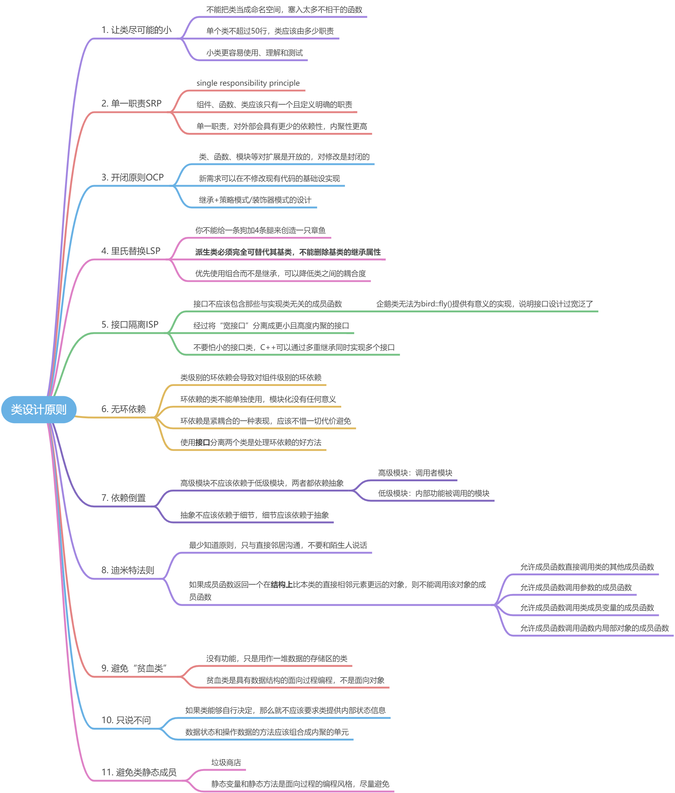
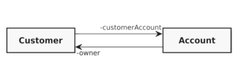
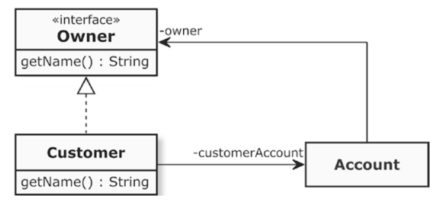
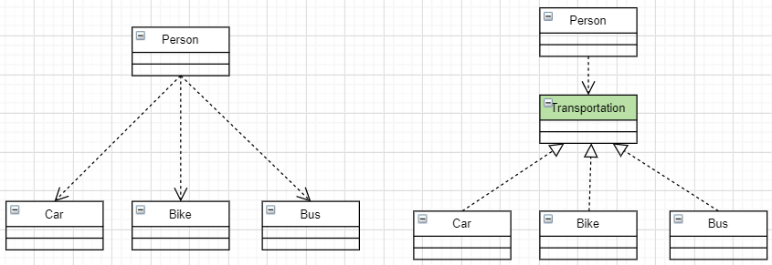
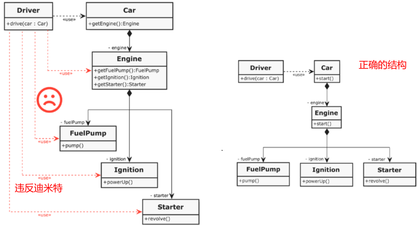

> 我见过许多用C++语言或者像Java这样的纯OO语言编写的程序，其中使用了类，但这些只是由程序组成的大型命名空间而已。


# 1 环依赖和依赖倒置

## 1.1 环依赖的例子
A类中包含B类的成员变量，B类也包含A类的成员变量，导致A和B相互依赖，称为“**环依赖**”。两个类不能分开，不能独立地使用。
```cpp
#ifndef HUAN_YI_LAI
#define HUAN_YI_LAI

class Customer;

class Account
{
public:
	void setOwner(Customer* customer)
	{
		owner = customer;
	}
private:
	Customer* owner;
};

class Customer
{
public:
	void setAccount(Account* account)
	{
		customerAccount = account;
	}
private:
	Account* customerAccount;
};
#endif // !HUAN_YI_LAI
```
两个类的关系图如下：

## 1.2 如何修改？
构建一个抽象的Owner接口基类，将Customer与Account的的关联关系变为如下所示：
```cpp
#ifndef HUAN_YI_LAI
#define HUAN_YI_LAI
#include <string>

class Owner
{
public:
	virtual ~Owner() = default;
	virtual std::string getName() const = 0;
};

class Account
{
public:
	void setOwner(Owner* customer)
	{
		owner = customer;
	}
private:
	Owner* owner;
};

class Customer : public Owner
{
public:
	void setAccount(Account* account)
	{
		customerAccount = account;
	}
	virtual std::string getName() const override
	{
		// return something
	}
private:
	Account* customerAccount;
};
#endif // !HUAN_YI_LAI
```
有了Owner的接口基类之后，我们在给Account设置Owner的时候就可以进行**依赖注入**，Account需要什么样的Owner，我们就可以通过setter注入什么Owner（可以是customer、User或其他子类）。最终我们通过**依赖倒置和依赖注入**将Customer和Accoutn进行了分离。

## 1.3 依赖倒置更直观的例子


# 2 迪米特法则的例子
下面的例子中，Driver可以直接操作Car类，但是不能直接调用Engine、FuelPump等结构上更底层的类：
