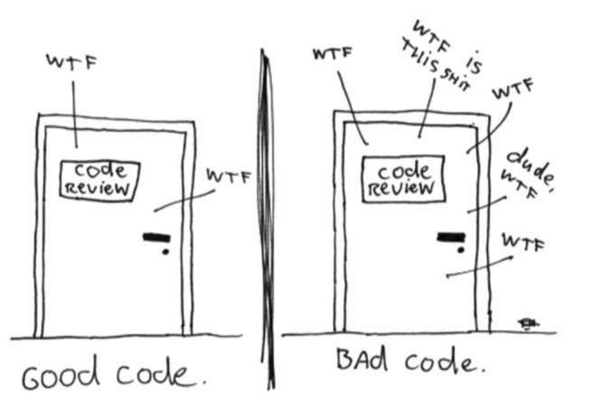

## 代码猴子


> 我们就是一群**代码猴子**，上蹿下跳，自以为领略了变成的真谛。可惜，当我们抓着几个酸桃子，得意洋洋的坐在树枝上，却对自己造成的混乱熟视无睹。那堆“可以运行”的乱麻程序，就在我们的眼皮底下慢慢腐烂。


衡量代码质量的唯一有效标准：**What the Fuck/min**




## 第一章 整洁代码


- 我们都曾经瞟一眼自己亲手造成的混乱，决定弃之而不顾，走向新一天。我们都曾经看到自己的烂程序居然能运行，然后断言能运行的烂程序总比什么都没有强。我们都曾经说过有朝一日再回头清理。当然，在那些日子里，我们都没听过勒布朗（LeBlanc）法则：**稍后等于永不**（Later equals never）


## 第二章 有意义的命名


1. **名副其实**：如果名称需要注释来补充，就不是名副其实
```c
//bad code:
int d;//消失的时间，以日记
//good code：
int elapsedTimeInDays；
```

2. **问题不在于代码的简洁度，而是在于代码的模糊度**：即上下文在代码中未被明确体现的程度
3. **避免误导**：
   1. 不使用专有名词作为变量名，**避免思维映射**，例如hp，aix
   2. 提放不同之处较小的名称，例如XYZControllerForEfficientHandlingOfStrings和XYZControllerForEfficientStorageOfStrings
   3. 避免使用小写字母l和大写字母O作为变量名
4. **做有意义的区分**
   1. 以数字系列命名（a1、 a2， ……aN）纯属误导，没有提供意图的任何线索
   2. 废话都是冗余，名称不同，意思却无区别，例如productInfo和productData
5. **使用读的出来的名称**：便于记忆
6. **使用可搜索的名称**：单字母名称和数字变量很难在文件中搜索出来。长名称胜于短名称，搜得到的名称胜于用自造编码代写就的名称
7. 不必用**m_前缀**来表明成员变量，人们只看到名称中有意义的部分，前缀会被忽略
8. **类名和对象名应该是名词或名词短语**，不应该是动词。
9. 方法名应该是动词或动词短语。属性访问器/修改器应该根据其值命名
10. **每个概念对应一个词，并且一以贯之**。例如get/fetch含义相同，避免混用，最好只选其一
10. **使用解决方案领域和所涉及的问题领域的名称**：比如计算机术语，算法名，模式名，数学术语等


## 第三章 函数

1. 函数的第一准则是**要短小**。函数的**缩进层级不该多于一层或两层**。当然，这样的函数易于阅读和理解。
1. 函数应该做一件事。做好这件事。只做这一件事。要判断函数是否不止做了一件事，还有一个方法，就是看是否能再拆出一个函数，该函数不仅只是单纯地重新诠释其实现。
1. 最理想的参数数量是零（零参数函数），其次是一（单参数函数），再次是二（双参数函数），应尽量避免三（三参数函数）
1. 如果函数要对输入参数进行转换操作，转换结果就该体现为返回值。
1. 向**函数传入布尔值简直就是骇人听闻的做法**。这样做，方法签名立刻变得复杂起来，大声宣布本函数不止做一件事。（视具体情况而定，不通用）
1. 如果函数看来需要两个、三个或三个以上参数，就说明其中一些参数应该封装为类或结构体
1. **使用异常处理结构**代替返回错误码。
1. 重复可能是软件中一切邪恶的根源。许多原则与实践规则都是为控制与消除重复而创建。


## 第四章 注释

1. **什么也比不上放置良好的注释来得有用。什么也不会比乱七八糟的注释更有本事搞乱一个模块。什么也不会比陈旧、提供错误信息的注释更有破坏性**。
1. 代码在变动，在演化。从这里移到那里。彼此分离、重造又合到一处。很不幸，注释并不总是随之变动——不能总是跟着走。
1. 程序员应当负责将注释保持在可维护、有关联、精确的高度。我同意这种说法。但**我更主张把力气用在写清楚代码上，直接保证无须编写注释**。
1. **TODO** 是一种程序员认为应该做，但由于某些原因目前还没做的工作。它可能是要提醒删除某个不必要的特性，或者要求他人注意某个问题。
1. **简单函数，其头部位置的注释全属多余**。读这段注释花的时间没准比读代码花的时间还要长。
1. 源代码控制系统非常善于记住是谁在何时添加了什么。**没必要用那些小小的签名搞脏代码**。例如再一行后面添加`/* Added by Rick */`
1. **直接把代码注释掉是讨厌的做法**。别这么干! 其他人不敢删除注释掉的代码。他们会想，代码依然放在那儿，一定有其原因，而且这段代码很重要，不能删除。


## 第五章 格式

1. 或许你认为“让代码能工作”才是专业开发者的头等大事。然而，我希望本书能让你抛掉那种想法。**你今天编写的功能，极有可能在下一版本中被修改，但代码的可读性却会对以后可能发生的修改行为产生深远影响**。原始代码修改之后很久，其代码风格和可读性仍会影响到可维护性和扩展性。即便代码已不复存在，你的风格和律条仍存活下来。
1. 靠近的代码行则暗示了它们之间的紧密关系。所以，紧密相关的代码应该互相靠近。  
1. 若某个函数调用了另外一个，就应该把它们放到一起，而且调用者应该尽可能放在被调用者上面
1. 应该尽力保持代码行短小。死守 80 个字符的上限有点僵化，而且我也并不反对代码行长度达到 100 个字符或 **120 个字符**。再多的话，大抵就是肆意妄为了。
1. 好的软件系统是由一系列读起来不错的代码文件组成的。 它们需要拥有一致和顺畅的风格。读者要能确信，他们在一个源文件中看到的格式风格在其他文件中也是同样的用法。


## 第六章 对象和数据结构

1. 类并不简单地用取值器和赋值器将其变量推向外间，而是**曝露抽象接口**，以便用户无需了解数据的实现就能操作数据本体  
1. 在任何一个复杂系统中，都会有需要添加新数据类型而不是新函数的时候。这时，对象和面向对象就比较适合。另一方面，也会有想要添加新函数而不是数据类型的时候。在这种情况下，过程式代码和数据结构更合适。因为**过程式代码难以添加新数据结构，因为必须修改所有函数。面向对象代码难以添加新函数，因为必须修改所有类**。
1. **得墨忒耳律**又叫**最少知识原则（Principle of Least Knowledge）**：模块不应该了解所操作对象的内部情形，即**更好的信息隐藏和更少的信息重载**。类C的方法f只应该调用以下对象的方法：
   - C对象本身
   - 由f创建的对象
   - 传递给f的对象参数
   - C对象直接依赖的对象


```java
//对象应尽可能地避免调用由另一个方法返回的对象的方法
//面向对象程序设计语言通常使用 "." 作为访问标识，LoD 可以被简化为 "仅使用一个点（use only one dot）"。也就是说，代码 a.b.Method() 违反了 LoD，而 a.Method() 则符合 LoD。打个比方，人可以命令一条狗行走，但是不应该直接指挥狗的腿行走，应该由狗去指挥它的腿行走。
//下面代码不符合此原则
final String outputDir = ctxt.getOptions().getScratchDir().getAbsolutePath();
```


## 第七章 错误处理

1. 错误处理很重要，但如果它搞乱了代码逻辑，就是错误的做法。
1. **使用异常处理，而不是返回错误码**。返回错误码搞乱了调用者代码。调用者必须在调用之后即刻检查错误，而且这个步骤容易被遗忘。
1. 先写**try-catch-finally**语句。try代码块是正常的事务逻辑，catch处理异常情况，finally处理收尾。
1. 应创建信息充分的错误消息，并和异常一起传递出去。在消息中，包括失败的操作和失败类型。
1. 在业务逻辑和错误处理代码之间就会有良好的区隔。大量代码会开始变得像是整洁而简朴的算法。
1. **别返回null值**。  如果你打算在方法中返回 null 值，不如抛出异常，或是返回特例对象。如果你在调用某个第三方 API 中可能返回 null 值的方法，可以考虑用新方法打包这个方法，在新方法中抛出异常或返回特例对象。
1. **别传递null参数**。在大多数编程语言中，没有良好的方法能对付由调用者意外传入的 null 值。事已如此，恰当的做法就是禁止传入 null 值。


## 第八章 边界整洁

1. 设想第三方代码库的使用方法并不清楚。我们可能会花上一两天（或者更多）时间阅读文档，决定如何使用。然后，我们会编写使用第三方代码的代码，看看是否如我们所愿地工作。陷入长时间的调试、找出在我们或他们代码中的缺陷，这可不是什么稀罕事。  
1. 学习第三方代码很难。整合第三方代码也很难。同时做这两件事难上加难。如果我们采用不同的做法呢？不要在生产代码中试验新东西，而是**编写测试来遍览和理解第三方代码**。 Jim Newkirk 把这叫做**学习性测试**。


## 第十章 类

1. 关于类的第一条规则是**类应该短小**。
1. 类的名称应当描述其权责。**如果无法为某个类命以精确的名称，这个类大概就太长了**。类名越含混，该类越有可能拥有过多权责。例如，如果类名中包括含义模糊的词，如 Processor 或 Manager或 Super，这种现象往往说明有不恰当的权责聚集情况存在。  
1. **单一权责原则**（SRP）：类应该只有一个权责，有且只有一条加以修改的理由，并与少数其他类一起协同达成期望的系统行为。
1. 有大量短小类的系统并不比有少量庞大类的系统拥有更多移动部件，其数量大致相等。问题是：你是想把工具归置到有许多抽屉、每个抽屉中装有定义和标记良好的组件的工具箱中呢，还是想要少数几个能随便把所有东西扔进去的抽屉？  
1. 内聚性高，意味着类中的方法和变量互相依赖、互相结合成一个逻辑整体。  
1. 我们希望将系统打造成在添加或修改特性时尽可能少惹麻烦的架子。在理想系统中，我们通过扩展系统而非修改现有代码来添加新特性。


## 总结

后面几章不太相关，不做记录，完！
