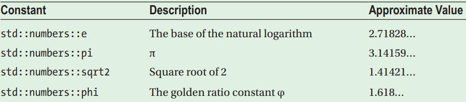
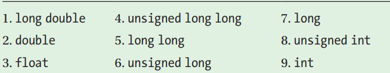

# 1 变量赋值的三种方式
从C++11开始，变量赋值有三种方式：

- **初始化列表（推荐）**：`int apple_count {15};`，可以自动检测类型不匹配的赋值，编译时上报error或warning，并且使基本类型、结构体、类对象等初始化格式一致
   - 对于基本类型，`{}`表示赋值该类型的默认值，此功能称为零值初始化
- **函数符号**：`int apple_count (15);`，没有检测功能，自动隐式转换
- **赋值运算符**：`int apple_count = 15;`，没有检测功能，自动隐式转换
# 2 数学常量库<numbers>
C++20开始提供了numbers库，可以引用标准的数学常量，比如常见的：

# 3 类型转换
## 隐式类型转换
对于不同类型的数的操作，编译器都会选择具有**更有限值范围的操作数**作为要转换为另一个操作数类型的操作数，其优先级为：

```cpp
unsigned int x {20u};
int y {30};
std::cout << x - y << std::endl;
```
比如上面代码，执行`x - y`时，编译器优先把y隐式转换为unsigned int类型，之后继续计算，结果为-10。而unsigned int类型无法表示-10，所以结果会变为232 - 10, or 4294967286。
## cast类型转换
**C++的cast类型转换会在编译器编译期间进行检查**，而C风格的强制转换不会做任何检查，所以在运行时会出错，导致严重问题或崩溃。所以应该使用cast类型转换，杜绝强制类型转换。
​

截至C++20，提供了如下显示类型转换：

- **static_cast**：任何明确定义的类型转换，只要不包含底层const，都可以使用。 `double slope = static_cast<double>(j);`
- **const_cast**：只能改变运算对象的底层const，一般可**用于去除或添加const性质**。 
   - `const char *pc; char *p = const_cast<char*>(pc)`
- **dynamic_cast**：支持运行时类型识别。
- **reinterpret_cast**：通常为运算对象的位模式提供低层次上的重新解释。
- **std::bit_cast**：C++20新增，
# 4 基本类型的最大值最小值
`<limits>`库提供了`std::numeric_limits`类模板，可以获取指定类型的各种属性。其中最常用的式`max()`和`min()`，用于获取最大值和最小值。
```cpp
 std::cout << "int\t"
              << std::numeric_limits<int>::lowest() << '\t'
              << std::numeric_limits<int>::min() << '\t'
              << std::numeric_limits<int>::max() << '\n';
```
# 5 namespace与using
从C++17开始，对于嵌套的namespace，可以使用如下简化写法（在此之前只能使用多层作用域方式）：
```cpp
namespace MyLibraries::Networking::FTP
{
}

//旧写法，C++17之前编译错误
namespace MyLibraries
{
    namespace Networking
    {
     	namespace FTP
        {
        }
    }
}
```
另外还可以直接定义已存在namespace的别名：
```cpp
namespace MyFTP = MyLibraries::Networking::FTP;
```
当然，最好还是使用`using`定义别名，`using`当前有如下三个功能：

- `using namespace xxx;`：导入整个命名空间，这样空间中所有的变量和函数都可以直接使用
- `using std::cout;`：像这种格式，只导入某个name，仅仅该name可以直接使用。**建议保持namespace导入的最小影响，将using语句放在最小最合适的范围内，尽量避免全局的导入。**
- `using new_name = name;`：为某个内置或自定义的类型设置类型别名，**忘记**`**typedef**`**吧。**
# 6 <=>运算符
从C++20开始，新增了<=>运算符，返回一个`strong_ordering`（**int）**或`partial_ordering`（**浮点数**）类型表示比较结果。我们可以通过判断result的值获取比较结果，不需要重复比较源数据：
```cpp
//C++20新增三元比较运算符，一次比较得到得到结果，不需要重复比较原数据
#include <iostream>
#include <compare>
using namespace std;

int main()
{
    int i{11};
    //result保存比较结果，不能用switch比较
    strong_ordering result{i <=> 0};
    if (result == strong_ordering::less)
    {
        cout << "less" << endl;
    }
    if (result == strong_ordering::greater)
    {
        cout << "greater" << endl;
    }
    if (result == strong_ordering::equal)
    {
        cout << "equal" << endl;
    }
    //可以使用辅助函数比较result，不直接不叫枚举类
    if (is_lt(result))
    {
        cout << "less" << endl;
    }
    if (is_gt(result))
    {
        cout << "greater" << endl;
    }
    if (is_eq(result))
    {
        cout << "equal" << endl;
    }
    return 0;
}
```
