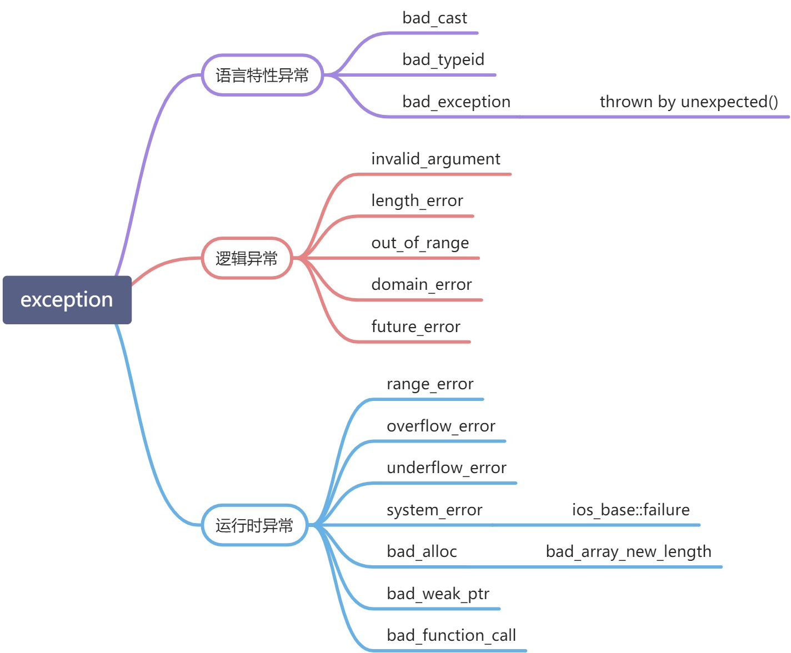

# 1 STL中异常类
STL中所有内建的异常类（exception class）都继承自`std::exception`基类，可以分为如下三个类别：    

# 2 获取exception的信息

## 2.1 what()
我们可以通过exception具体子类的`what()`方法获取异常的具体信息，该方法原型如下：
```cpp
namespace std {
	class exception {
	public:
		virtual const char* what() const noexcept;
		...
	};
}
```

## 2.2 code()
对于如下三种异常，可以通过`code()`方法获取**erro_code或error_condition类型**（可以通过其value用于进一步的判断，而不仅仅输出异常描述信息）。

- std::system_error：返回系统错误，对应枚举类`std::errc`，与errno.h中定义的系统错误码一一对应
- ios_base::failure：返回IO stream错误，对应枚举类`std::io_errc`
- std::future：返回多线程同步错误，对应枚举类`std::future_errc`

# 3 异常处理模板
```cpp
// util/exception.hpp
#include <exception>
#include <system_error>
#include <future>
#include <iostream>

template <typename T>
void processCodeException(const T& e)
{
	using namespace std;
	auto c = e.code();//获取error_code对象
	cerr << "- category: " << c.category().name() << endl;
	cerr << "- value: " << c.value() << endl;//error code值
	cerr << "- msg: " << c.message() << endl;//等同与e.what()
	cerr << "- def category: " << c.default_error_condition().category().name() << endl;
	cerr << "- def value: " << c.default_error_condition().value() << endl;
	cerr << "- def msg: " << c.default_error_condition().message() << endl;
}

void processException()
{
	using namespace std;
	try {
		throw; // rethrow exception to deal with it here
	}
	catch (const ios_base::failure& e) {
		cerr << "I/O EXCEPTION: " << e.what() << endl;
		processCodeException(e);
	}
	catch (const system_error& e) {
		cerr << "SYSTEM EXCEPTION: " << e.what() << endl;
		processCodeException(e);
	}
	catch (const future_error& e) {
		cerr << "FUTURE EXCEPTION: " << e.what() << endl;
		processCodeException(e);
	}
	catch (const bad_alloc& e) {
		cerr << "BAD ALLOC EXCEPTION: " << e.what() << endl;
	}
	catch (const exception& e) {
		cerr << "EXCEPTION: " << e.what() << endl;
	}
	catch (...) {
		cerr << "EXCEPTION (unknown)" << endl;
	}
}
```

