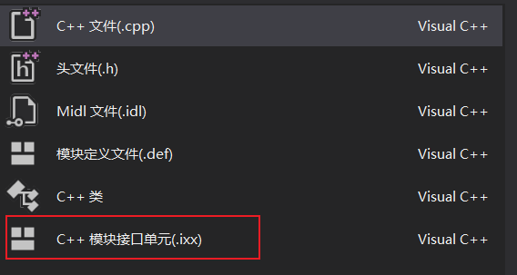
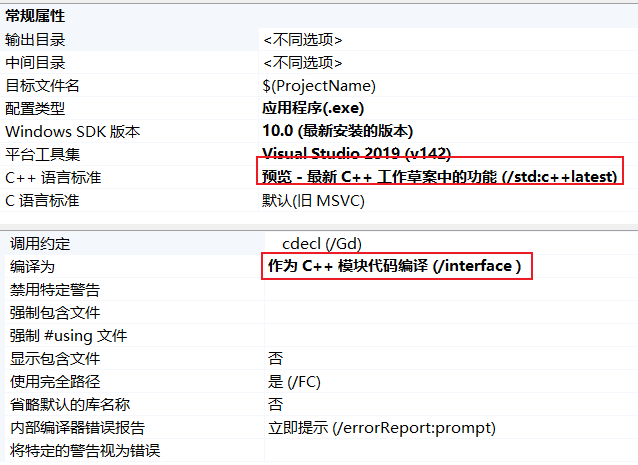

# modules的作用
头文件体系最大的痛点就是编译慢，头文件的重复替换,。比如你有多个翻译单元, 每一个都调用了`iostream`, 就得都处理一遍，预处理完的源文件就会立刻膨胀，编译就会变得很慢。C++20支持modules以后，我们可以模块化的处理。**已经编译好的 modules 直接变成编译器的中间表示进行保存**，需要什么就取出什么，不需要将整个头文件包含进来。**这样就加快了重新编译的速度（即每个头文件只预处理了一次）。**比如你只是用了 cout 的函数, 那么编译器下次就不需要处理几万行，直接找 cout 相关函数用就行了。除此之外，封装什么的也可以做得很好，**可以控制 modules 的哪些部分可以暴露于外界**，需要暴露的使用`export`，其他默认不暴露给外部。

# module应用示例

## MSVC module示例
目前（2021-7-19），MSVC已经提供了完整的module支持，GCC可能需要等到12版本才能支持。与GCC和Clang不同的是，MSVC使用**特殊的**`**ixx**`**后缀的文件**定义module:

比如要定义一个module，module有一个结构体给外部使用，我们就可以这样写：
```cpp
//使用module特性，声明一个结构体并导出
export module employee;

export struct Employee
{
	char firstInitial;
	char lastInitial;
	int employeeNumber;
	int salary;
};
```
在cpp中使用时，直接import module名即可使用其中定义的类型或函数：
```cpp
//使用module到处的结构体示例.导入结构体，初始化并打印内容
//如果module之间有依赖关系，则需要注意import的顺序
import <iostream>;
import <format>;
import employee;

int main()
{
	Employee emp = { 'J','D',42,8000 };
	using std::cout;
	using std::endl;
	using std::format;
	cout << format("Employee:{} {}", emp.firstInitial, emp.lastInitial) << endl;
	cout << format("Number: {}, Salary: {}", emp.employeeNumber, emp.salary) << endl;
	return 0;
}
```
为保证编译成功，需要在visual studio中修改项目的属性：

# 模块定义与实现

## 模块接口文件
目前关于接口文件的扩展名还没有统一的标准，各个编译器有自己要求的格式。MSVC要求**.ixx文件**，Clang和GCC没有实际测试。

- import：模块文件中可以导入其他模块内部使用
- #include：对于C++头文件，优先使用import，当然也可以使用include（不推荐）。对于C头文件必须使用include，并添加global module fragment，格式如下：
```cpp
module; // Start of the global module fragment
#include <cstddef> // Include legacy header files

export module person; // Named module declaration
import <string>;
export class Person { /* ... */ };
```

- export：
   - 模块定义必须导出`export module`，在文件第一行，不然其他文件无法使用import
   - export可以用于结构体、类、函数、变量/常量、命名空间等各种对象。
   - 不加export默认外部不可访问

## 模块实现文件
可以在接口文件中直接添加实现，不过为了分离，最常见的还是使用单独的实现文件。实现文件还是使用cpp文件，然后像include头文件一样，首先需要声明模块。

- 声明模块只需要在文件第一行指定`module关键字+模块名`即可，**不需要export（这是实现，不是导出）**。实际上是import module，不过import不需要显式写出来。
- 如果有include C头文件，那实现文件需要在首行添加和接口文件一样的global module fragment声明


示例：
```cpp
//模块接口文件person.ixx
export module person; // Module declaration
import<string>;

export class Person
{
public:
    Person(std::string firstName, std::string lastName);
    const std::string &getFirstName() const;
    const std::string &getLastName() const;

private:
    std::string m_firstName;
    std::string m_lastName;
};

//模块实现文件person.cpp
module person; // Module declaration, but without the export keyword
using namespace std;

Person::Person(string firstName, string lastName)
    : m_firstName{move(firstName)}, m_lastName{move(lastName)}
{
}
const string &Person::getFirstName() const { return m_firstName; }
const string &Person::getLastName() const { return m_lastName; }
```

## 接口文件中的实现
**注意：即使实现部分写在了定义文件，编译后接口文件还是只包含模块接口（类定义、函数原型等），但不包括任何函数或方法实现。**这样做的目的是将实现分离出去，实现部分的修改不会导致调用模块的文件都重新编译。​

有两个例外，此两种情况下实现会包含在编译后的接口文件中：

- 显式使用`inline`声明内联函数（和头文件不同，头文件函数默认都是内联函数）
- template function/method


既然默认情况下编译后接口文件不会包含实现代码，那么我们**可以直接在接口文件中编写实现代码，但要与export接口部分分离开**。示例如下：
```cpp
//模块接口文件person.ixx
export module person; // Module declaration
import<string>;

export class Person
{
public:
    Person(std::string firstName, std::string lastName);
    const std::string &getFirstName() const;
    const std::string &getLastName() const;

private:
    std::string m_firstName;
    std::string m_lastName;
};
//函数实现部分，不带export
Person::Person(std::string firstName, std::string lastName)
    : m_firstName{move(firstName)}, m_lastName{std::move(lastName)}
{
}
const std::string &Person::getFirstName() const { return m_firstName; }
const std::string &Person::getLastName() const { return m_lastName; }
```
