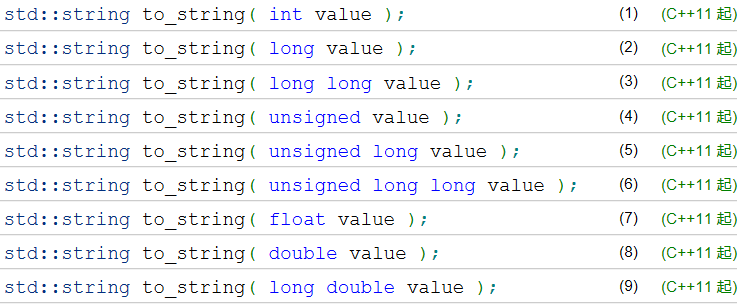
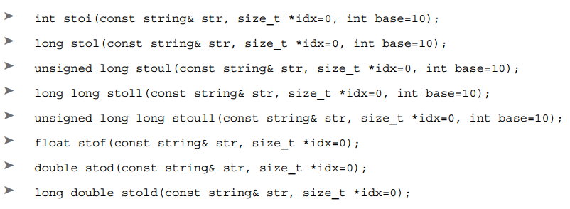

# string.data()
C++14开始，string类的新函数data()可以和c_str()一样返回C风格字符数组（const char*);C++17开始，对于non-const string变量，返回char*数组，非const char*:
```cpp
std::string a="hello";
char b[10];
strcpy(b, a.data());
```

# string_literals与auto
当使用auto作为字符串的类型并进行字面量赋值时，默认auto会推导为`const char*`类型，表示这是一个字面量。如果要auto推导为string类型，则需要使用`string_literals::""s`，`""s`是一个运算符，返回string类型：
```cpp
using namespace std::string_literals;

auto str1{"string"}; //auto = const char*
auto str2{"string"s}; //auto = std::string
str1[1]='T'; //编译错误，不能修改const
str2[1]='T'; //可以修改
```

# string与数值的转换

## std::to_string
各数值类型转换为string，例如123--->"123"，等同于之前的`sprintf`函数:

## 转为数值
string转换为int/double等类型，代替atoi，idx返回第一个不能转换为数字的字符位置：

# std::string_view
C++17引入了新的类std::string_view，**用于代替**`**const string&**`**或**`**const char***`。string_view提供了一个字符串的只读视图并且有string类似的操作函数。​

创建string_view的时候**用char*和长度来构造，这个长度可以自由确定**，它表示string_view希望引用的字符串的长度。因为它只是引用其他字符串（不能让string_view指向临时字符串），所以它不会分配内存，不会像string那样容易产生临时变量，节省内存和运行时间。​

**例子**:
```cpp
#include <iostream>
#include <string>
#include <string_view>
#include <ctime>
using namespace std::string_view_literals; //用于使用sv标记


int main(int argc, char const *argv[])
{
    auto view="it is a test"sv;//sv表示字符串是string_view类型
    std::string str="it is a test";
  
    std::clock_t time1=clock();
    for(int i=0; i<1000000; i++)
    {
        auto s1=view.substr(3);
    }
    std::clock_t time2=clock();
    std::cout<<static_cast<double>(time2-time1)/CLOCKS_PER_SEC*1000<<std::endl;

    time1=clock();
    for(int i=0; i<1000000; i++)
    {
        auto s2=str.substr(3);
    }
    time2=clock();
    std::cout<<static_cast<double>(time2-time1)/CLOCKS_PER_SEC*1000<<std::endl;  

    return 0;
}

//输出
//16
//115
```

stringh_view提供和string类似的方法，但是并不能相互转化。可以通过`**data()**`获取字符串再与string类型计算。
```cpp
string str = "Hello";
string_view sv = " world";
auto result = str + sv;  //错误
auto result = str + sv.data(); //正确
```
