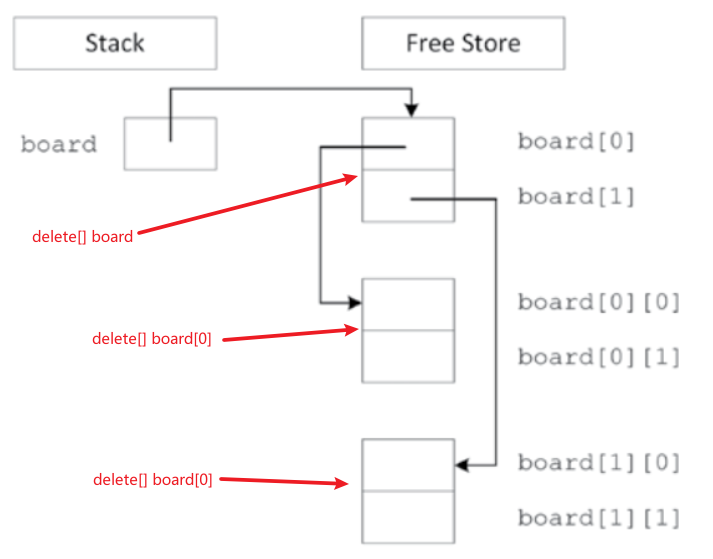
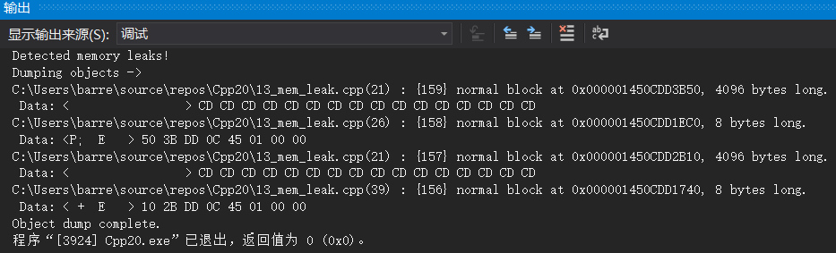

# new/delete相关

## std::bad_alloc与srd::nothrow
使用new申请内存时，如果申请内存失败，会抛出`std::bad_alloc`异常，该异常的默认处理是终止进程。当然我们可以自己对该异常进行处理：

- try/catch：收到`bad_alloc`异常表示资源申请失败，进行自定义异常处理
- 使用`std::nothrow`，不让new运算符抛出异常，我们通过检查指针是否等于`nullptr`判断内存申请是否成功


针对上面两种处理的示例如下：
```cpp
//使用new申请内存时，nothrow可以控制在申请失败时，是否需要抛出异常
#include <iostream>
#include <new> //用于使用nothrow
 
int main()
{
    //自定义异常处理
    try {
        while (true) {
            new int[100000000ul];   // 抛出重载
        }
    } catch (const std::bad_alloc& e) {
        std::cout << e.what() << '\n';
    }
 
    while (true) {
        int* p = new(std::nothrow) int[100000000ul]; // 不抛出异常
        if (p == nullptr) {//直接判断指针
            std::cout << "Allocation returned nullptr\n";
            break;
        }
    }
}
```

## 保存指针的数组
普通类型的数组，使用`new[]/delete[]即可`申请是否内存。但如果数组里保存的是指针，那么`delete[]`仅仅是把数组的空间被释放了，而数组内指针指向的内存地址仍然存在，而且再也访问不到了。这时候就需要**先遍历指针，把最后指向的内存先释放，然后一层一层释放上层内存，直到最后数组内存被释放。**​

下面例子是用new动态申请了一个二维数组，用二维指针指向基地址。可以借助下面的图理解一下内存分布：
```cpp
//对于保存指针的数组，delete时需要遍历一个一个delete[]，最后delete[]整个数组
#include <iostream>

using namespace std;

int main()
{
    const int size{2};
    int **board{new int *[size]};
    for (int i = 0; i < size; i++)
    {
        board[i] = new int[size]{i};
    }
    //开始delete内存
    for (int i = 0; i < size; i++)
    {
        delete[] board[i]; //delete内层地址
        board[i] = nullptr;
    }
    delete[] board;//delete最上层地址
    board = nullptr;
    return 0;
}
```
太复杂难理解而且容易出错了，所以**推荐使用**`**std::array**`**和**`**std::vector**`**模板实现相同的功能，不用考虑内存申请释放，避免像上面例子一样使用原始的数组**。

# 内存泄漏检测工具

## MSVC
MSVC 调试库内建了内存泄漏检查工具，默认情况下没有开启，可以通过如下步骤开始​

1. 在代码开头加入一下三行代码
```cpp
#define _CRTDGB_MAP_ALLOC
#include <cstdlib>
#include <crtdbg.h>
```

2. 重新定义new运算符
```cpp
#ifdef _DEBUG
    #ifndef _DGB_NEW
        #define DGB_NEW new ( _NORMAL_BLOCK, __FILE__,__LINE__)
        #define new DGB_NEW
    #endif // _DGB_NEW
#endif // _DEBUG
```

3. 开启内存检测，在main函数的第一行加入以下代码
```cpp
_CrtSetDbgFlag(_CRTDBG_ALLOC_MEM_DF | _CRTDBG_LEAK_CHECK_DF);
```

4. 之后开始F5调试程序，即可在调试窗口显示检测到的问题[

](https://blog.csdn.net/Timeinsist/article/details/113154929)

使用示例：
```cpp
//存在内存泄漏的代码示例，用MSVC调试检测内存错误
#include <iostream>

//引入msvc调试头文件
#define _CRTDGB_MAP_ALLOC
#include <cstdlib>
#include <crtdbg.h>

//重定义new运算符
#ifdef _DEBUG
#ifndef _DGB_NEW
#define DGB_NEW new (_NORMAL_BLOCK, __FILE__, __LINE__)
#define new DGB_NEW
#endif // _DGB_NEW
#endif // _DEBUG

class Simple
{
public:
    //构造和析构没有问题，new/delete成对出现
    Simple() : mIntPtr(new int[1024]) {}
    ~Simple() { delete mIntPtr; }

    void DoSomeThing(Simple *&outParam)
    {
        outParam = new Simple();
        //这里有问题，outParam直接指向新创建的对象，原来传入的对象没有释放
    }

protected:
    int *mIntPtr;
};

int main(int argc, char **argv)
{
    //开启内存检测
    _CrtSetDbgFlag(_CRTDBG_ALLOC_MEM_DF | _CRTDBG_LEAK_CHECK_DF);

    auto simplePtr = new Simple;
    simplePtr->DoSomeThing(simplePtr);

    std::cout << "Hello world" << std::endl;

    return 0;
}
```
visual studio调试窗口结果：有两处内存泄漏，line 26和line 39申请的两个内存都没有释放。

## Linux with Valgrind 

 [Valgrind动态分析.md](..\..\..\Linux环境编程\调试技术\其他调试工具\4Valgrind动态分析.md) 

# 智能指针

 [智能指针.md](新特性速览\5智能指针.md) 
