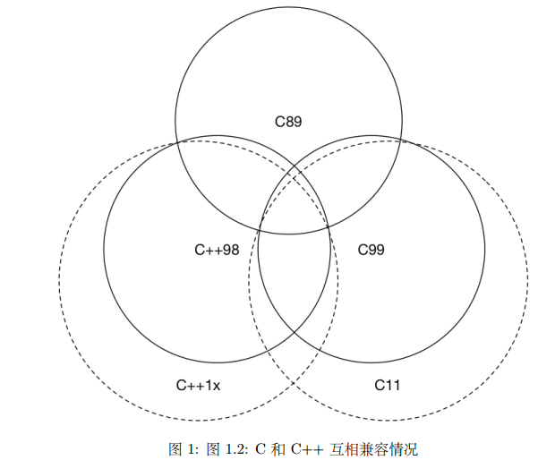

**Note：**编译时使用-std=c++17编译标志。**Note：**example code见[https://github.com/BarretRen/CppCodeCollections](https://github.com/BarretRen/CppCodeCollections)**Note：**参考资料[https://github.com/changkun/modern-cpp-tutorial](https://github.com/changkun/modern-cpp-tutorial)


# 1. 被弃用的特性


1. C 语言风格的类型转换被弃用（即在变量前使用 (convert_type)） ，应该使用**static_cast、 reinterpret_cast、 const_cast 、dynamic_cast**来进行类型转换。
1. 在编写 C++ 时，也应该尽可能的避免使用诸如 void* 之类的程序风格。在不得不使用C时，应该注意使用extern "C" 这种特性，将 C 语言的代码与 C++ 代码进行分离编译，再统一链接的做法。example_1 code


# 2. nullptr
**替代NULL（0），代表空指针**。nullptr 的类型 为 nullptr_t，能够隐式的转换为任何指针或成员指针的类型，也能和他们进行相等或者不等的比较。
**原因**： 将NULL定义为0会是C++重载特性出现混乱：
```cpp
void foo(char*);
void foo(int);
//当调用foo(NULL)时，实际调用的是foo(int), 代码违反直觉。
```

**例子**example_2 code
```cpp
#include <iostream>
#include <type_traits>

void foo(char *);
void foo(int);

int main()
{
    if (std::is_same<decltype(NULL), decltype(0)>::value)
       std::cout << "NULL == 0" << std::endl;

    if (std::is_same<decltype(NULL), decltype((void*)0)>::value)
       std::cout << "NULL == (void *)0" << std::endl;

    if (std::is_same<decltype(NULL), std::nullptr_t>::value)
       std::cout << "NULL == nullptr" << std::endl;

    foo(0);
    foo(nullptr);
    //foo(NULL);  编译失败

    return 0;
}

void foo(char *)
{
    std::cout << "foo (char *) is called" << std::endl;
}

void foo(int i)
{    
	std::cout << "foo (int) is called" << std::endl;
}
```

# 3 原生字符串r
C++11开始提供了和Python中r关键字一样的R关键字，可以使字符串中的特殊字符失效，让编译器当作普通的原始字符串，对于文件路径等字符串非常关键。原生字符串格式为：`R"(字符串内容)"`，例如：`std::string str = R"(C:\\What\\The\\Path )";`

# 4 字符串编码
如下编码标志可以指定字符串的编码类型：

- **u8**：UTF-8编码，对应类型为const char
- **u**：char16_t.
- **U**：char32_t.
- **L**：wchar_t

# 5 noexcept
noexcept作为函数的后缀，表示该函数**不会抛出异常**。例如：`void foo() noexcept;`

# 6 constexpr
C++11 提供了 constexpr 让用户显式的声明运算、函数或对象构造函数**在编译阶段就计算出结果**。从 C14 开始， 移除了一些限制，constexptr 函数可以在内部使用局部变量、循环和分支等简单语句。C14之前必须是一个return表达式，不然编译会出错。

## 用法

- **constexpr 变量**：`constexpr int theAnswer= 10 + 20 + 12;` 变量为const常量，在编译时被赋初值
- **constexpr 函数**：表示函数在编译阶段就可以调用返回结果。比如可以用到上面的constexpr变量赋值。
- **constexpr 类**：类的成员函数和构造函数也可以用constexpr修饰，但要注意**不能有虚成员函数（编译时没有多态）**
   - **constexpr成员函数可以调用其他constexpr函数**
   - **constexpr构造函数可以为成员指定常量值**
- **模板变量**：模板中的变量和函数也能使用constexpr
```cpp
template <typename T>
constexpr T pi = T(3.1415926535897932384626433L);

template <typename T>
constexpr T computeCircumference(const T radius) {
	return 2 * radius * pi<T>;
}
```

## constexpr函数例子
```cpp
#include <iostream>
//constexpr函数，编译期间可以返回结果
constexpr unsigned long long factorial(const unsigned short n) {
	return n > 1 ? n * factorial(n - 1) : 1;
}

int main() {
	unsigned short number = 6;
	auto result1 = factorial(number);//正常调用，需要运行时才计算结果
	constexpr auto result2 = factorial(10);//constexpr变量，在编译时就得到结果

	std::cout << "result1: " << result1 << ", result2: " << result2 << std::endl;
	return 0;
}
```
再比如，我们想动态的创建一个数组，但编译器需要在编译期间就指定数组的大小。这时候可以使用constexpr完成：
```cpp
//constexpr函数，编译期间可以返回结果
constexpr int getArraySize(int a)
{
	return 32 + a;
}
int main()
{
	constexpr int a{ 8 };
	int myArray2[getArraySize(a)]; // 函数在编译期可以调用返回32+a
}
```

## constexpr类例子
构造函数和成员函数指定为constexpr，就可以在编译期创建constexpr类的对象，并使用类的函数。再以创建数组为例：
```cpp
class Rect
{
public:
	constexpr Rect(size_t width, size_t height) : m_width { width }, m_height { height } {}
	constexpr size_t getArea() const { return m_width * m_height; }
private:
	size_t m_width { 0 }, m_height { 0 };
};

//创建对象
constexpr Rect r { 8, 2 };//调用constexpr构造函数
int myArray[r.getArea()];
```

# 7 consteval
C++20新增了consteval关键字，用来修饰函数时常量值的表达式，而且是强制性的。如果函数本身不是常量值的表达式的话则会编译失败。被修饰的函数变为**立即函数。**​
