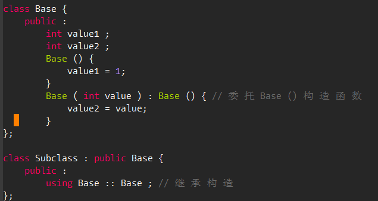

# 1 if/switch()变量声明
在传统 C++ 中，变量的声明在虽然能够位于任何位置，甚至于 for 语句内能够声明一个个临时变量 int，但始终没有办法在 if 和 switch 语句中声明一个临时的变量。例如：

```cpp
// 在 c ++17 之 前
const std::vector <int >::iterator itr = std::find(vec.begin() , vec.end() , 2);
if (itr != vec .end ()) {
	*itr = 3;
}
```

现在C++17中，可以在if和switch语句中进行变量定义，既缩小了作用域(仅在if/switch语句内部有效），又避免了多个变量命名。**语法**：

- `if (<initializer> ; <conditional_expression>) { <body> }`
- `switch (<initializer> ; <expression>) { <body> }`


```cpp
// 将 临 时 变 量 放 到 if 语 句 内
if (const std::vector <int >::iterator itr = std::find(vec. begin() , vec.end() , 3);
    itr != vec. end ()) 
{
	*itr = 4;
}
```


# 2 initializer list
在传统 C++ 中， 不同的对象有着不同的初始化方法，例如普通数组、 POD （Plain Old Data，即没有构造、析构和虚函数的类或结构体）类型都可以使用 {} 进行初始化，也就是初始化列表。而对于类对象的初始化，要么需要通过拷贝构造、要么就需要使 () 进行。这些不同方法都针对各自对象，不能通用。
C++11把初始化列表的概念绑定到了类型上，并将其称之为std::initializer_list（include <initializer_list>），**允许构造函数或其他函数像数组赋值一样使用初始化列表**。

## 基本用法
对于基本类型，带有自动检查功能：
```cpp
int x1(5.3); // OK, but OUCH: x1 becomes 5
int x2 = 5.3; // OK, but OUCH: x2 becomes 5
int x3{5.0}; // ERROR: narrowing
int x4 = {5.3}; // ERROR: narrowing
char c1{7}; // OK: even though 7 is an int, this is not narrowing
char c2{99999}; // ERROR: narrowing (if 99999 doesn’t fit into a char)
std::vector<int> v1 { 1, 2, 4, 5 }; // OK
std::vector<int> v2 { 1, 2.3, 4, 5.6 }; // ERROR: narrowing doubles to ints
```
**例子：**给函数传递初始化列表作为参数
```cpp
void print (std::initializer_list<int> vals)
{
	for (auto p=vals.begin(); p!=vals.end(); ++p) { // process a list of values
		std::cout << *p << "\n";
	}
}
print ({12,3,5,7,11,13,17}); // pass a list of values to print()
```

**例子**：对于类的构造函数，可以直接使用｛｝，也可以初始化列表，注意调用的函数不同。
```cpp
class P
{
public:
	P(int,int);
	P(std::initializer_list<int>);
};
//调用构造函数
P p(77,5); // calls P::P(int,int)
P q{77,5}; // calls P::P(initializer_list)
P r{77,5,42}; // calls P::P(initializer_list)
P s = {77,5}; // calls P::P(initializer_list)
```

## designated initializers 
初始化列表的一个缺点是，只能按照顺序赋值，无法跳过某些参数。这时候就需要使用designated initializers，指定每个参数的值，不显式指定的自动使用默认值。并且**即使结构体或类构造函数的成员顺序变化也不影响**。示例如下：
```cpp
struct Employee {
	char firstInitial;
	char lastInitial;
	int employeeNumber;
	int salary;
};
//使用初始化列表
Employee anEmployee { 'J', 'D', 42, 80'000 };

使用designated initializers，这里跳过employeeNumber
Employee anEmployee {
	.firstInitial = 'J',
	.lastInitial = 'D',
	.salary = 80'000
};
```

# 3 结构化绑定
C17提供了结构化绑定，结构化绑定提供了类似其他语言中提供的多返回值的功能。例如C17中可以这样写(example_5 code)：

```cpp
#include <iostream>
#include <string>
#include <tuple>

std::tuple<int , double , std::string> f() {
    return std::make_tuple (1, 2.3 , " 456 ");
}

int main () {
    auto [x, y, z] = f(); //这里，像极了Python
    std :: cout << x << ", " << y << ", " << z << std :: endl ;
    return 0;
}
```


# 4 类型自动推导
C++11 引入了 auto 和 decltype 这两个关键字实现了类型推导，让编译器来操心变量的类型。这使得 C 也具有了和其他现代编程语语言样，某种意义上提供了无需操心变量类型的习惯。

## 4.1 auto
auto作为存储类型的指示符，具体类型让编译器决定。

### 基本用途
auto一般用作以下用途：

- 用于**声明函数返回值**，让编译器自动决定返回值类型。要求
   - 函数return的类型需要保持一致
   - 递归函数，第一个return必须是确定的值
- 用作**结构化绑定**的类型声明
- 用作**变量、表达式**的类型声明
- 用作**模板参数**的类型声明
- 作于**lambda表达式**的参数和表达式返回对象的类型声明
- `**decltype(auto)**`


例如用auto来代替冗长的vector迭代器：
```cpp
//C++11之前：
for (vector<int>::const_iterator it = vec.cbegin(); itr != vec.cend (); ++it)
//C++11之后：
for (auto it = vec.cbegin(); itr != vec.cend (); ++it)
```

### 注意事项

- **注意**：auto不能用于函数参数类型，也不能用于推导数组的类型。
```cpp
int add(auto x, auto y){} //错误
auto arr2[10] = arr ; //错误, 无法推导数组元素类型
```

- **注意**： 如果用auto去表示const变量，默认会创建一个copy。如果只想引用原const常量，需要使用const auto&（**常量引用）**。
```cpp
const std::string message = "Test";
const std::string& foo()
{
	return message;
}
auto f1 = foo(); //F1是一个新的copy，值为Test
const auto& f2 = foo(); //F2为message常量
```

- **注意**：修饰指针要使用`auto*`，尤其是与const一起使用时，不要直接使用`auto`
```cpp
int i { 123 };
//auto+const，导致语义与想象的不一样
const auto p1 { &i };//以为的含义：const int*；实际的含义：int* const
auto const p2 { &i };//以为的含义：int* const；实际的含义：int* const

//使用auto*避免该问题
const auto* p3 { &i };//含义：const int*
auto* const p4 { &i };//含义：int* const
```

- **注意**：auto变量使用直接初始化列表时表示**具体的类型**；使用复制初始化列表时表示`initializer_list<T>`本身：
```cpp
// Copy list initialization
auto a = {11};     // auto = initializer_list<int>
auto b = {11, 22}; // auto = initializer_list<int>
// Direct list initialization
auto c{11};     // auto = int
auto d{11, 22}; // auto = int不能有多个值. Error, too many elements.
```

## 4.2 decltype
decltype 关键字是为了解决 auto 关键字只能对变量进行类型推导的缺陷而出现的。通常用于**获取指定表达式的类型，然后作为新的变量或返回值的类型**：`decltype (表达式)`使用示例：
```cpp
struct A { double x; };
const A* a;

decltype(a->x) y;       // y 的类型是 double（其声明类型）
decltype((a->x)) z = y; // z 的类型是 const double&（左值表达式）
```
**注意**：以下表达式无法通过编译，因为编译器读到decltype时，无法知道函数参数的具体类型, 应该使用auto：
```cpp
template <typename T1, typename T2>
decltype(x+y) add(T1 x, T2 y);//这里要获取返回值类型

//改为
template <typename T1, typename T2>
auto add(T1 x, T2 y) -> decltype(x+y);
```

# 5 Range-Based for语句
对于数组，vector等支持初始化列表的类型，可以在for中使用类似python遍历的方式获取所有项，修改所有项。**例子**example_6 code:
```cpp
#include <iostream>
#include <vector>

int main()
{
    std::vector<int> vec = {1,2,3,4,5};
    for (auto element : vec)
        std::cout << element << std::endl;

    for (auto &element : vec)   // wtire element
        element += 1;

    for (auto element : vec)     // read element
        std::cout << element << std::endl;

    int array[5] = {1,2,3,4,5}; //数字也同样适用
    for (auto e : array)
        std::cout<<e<<std:tendl;
}
```
C++20开始，已经支持在range-based for循环中使用**initializer**，这样可以在一个语句中完成列表的定义和遍历，示例如下：
```cpp
for (array arr { 1, 2, 3, 4 }; int i : arr)
{ 
    cout << i << endl;
}
```

# 6 模版

## 6.1 using代替typedef
模版是用来产生类型的，单模版不是类型，所以无法使用`typedef 旧名称 新名称`来重命名模版。C++11开始可以使用using对模版进行重命名：不合法的typedef：
```cpp
template < typename T>
typedef MagicType <std::vector <T>, std::string> FakeDarkMagic;  //错误
```

使用using代替：
```cpp
template <typename T>
using TrueDarkMagic = MagicType <std::vector <T>, std::string>;
```


## 6.2 默认模版参数
定义模版时，可以指定默认的模版类型, 不用每次使用时输入类型：
```cpp
template < typename T = int , typename U = int >
auto add(T x, U y){
	return x+y;
}
```


## 6.3 变长模版参数
C++11 加入了新的表示方法，允许任意个数、任意类别的模板参数，同时也不需要再定义时将参数的个数固定：0-n个参数： `template < typename ... Ts > class Magic ;`1-n个参数：`template < typename Require , typename ... Args > class Magic ;`那如何获取每个参数呢，目前C++17中有两种方法(example_6 code)：

1. **递归获取每个参数**
```cpp
#include <iostream>

template<typename T0, typename... T>
void printf(T0 t0, T... t)
{
    std::cout << t0 <<std::endl;
    if constexpr (sizeof...(t) > 0) printf(t...);
}

int main()
{
    printf(1, 2, "123", 1.1);
    return 0;
}
```


2. **初始化列表**
```cpp
template<typename T0, typename... T>
auto print(T0 t0, T... t)
{
    std::cout << t0 << std::endl;
    return std::initializer_list<T0>{ //中括号里是lambda表达式
        ([&] {
            std::cout << t << std::endl;
         }(), t0)...};
}

int main()
{
    print(1, 2, "123", 1.1);
    return 0;
}
```


# 7 类和对象

## 7.1 委托构造和继承构造
C++11 引入了委托构造的概念，这使得构造函数可以在同一个类中一个构造函数调用另一个构造函 数，从而达到简化代码的目的：
在传统 C++ 中，构造函数如果需要继承是需要将参数一一传递的，这将导致效率低下。 C++11 利用关键字 using 引用了继承构造函数的概念：
**例子**example_8 code:


## 7.2 override和final
子类可能并不是程序员尝试重载虚函数，只是恰好加入了一个与父类虚函数具有相同名字的普通函数。
另一个可能的情形是，当基类的虚函数被删除后，子类拥有旧的函数就不再重载该虚拟函数并摇⾝⼀变成为了一个普通的类方法，这将造成灾难性的后果。
**override和final**在C++11引入，用于防止上述问题。

- **override**： 当重载虚函数时，引入 override 关键字将显式的告知编译器进行重载，编译器将检查基函数是否存在这样的虚函数，否则将无法通过编译：


```cpp
struct Base {
	virtual void foo( int );
};
struct SubClass : Base {
	virtual void foo( int ) override ; // 合 法
	virtual void foo( float ) override ; // 非 法 , 父 类 没 有 此 虚 函 数
};
```


- **final**: final是为了防止类被继续继承以及终止虚函数继续重载。 Final可以用于类和虚函数。
```cpp
struct Base {
	virtual void foo () final ;
};
struct SubClass1 final : Base {
}; // 合 法

struct SubClass2 : SubClass1 {
}; // 非 法 , SubClass1 已 final

struct SubClass3 : Base {
	void foo (); // 非 法 , foo 已 final
};
```


## 7.3 枚举类

# 8. lambda

## 8.1 语法格式
Lambda 表达式是 C++11 中最重要的新特性之一，Lambda 表达式，实际上就是提供了一个类似**匿名函数**的特性，而匿名函数则是在需要一个函数，但是又不想费心去命名一个函数的情况下去使用的。语法格式如下：
```shell
//总体语法：
[capture_block] <template_params> (parameters) mutable constexpr noexcept/exception attributes -> return_type requires {body}
```

- capture_block：捕获列表
- template_params：C++20新增，用于编写模板lambda表达式
```cpp
//模板lambda表达式
[] <typename T> (const vector<T>& values) {
	T someValue { };
	T::some_static_function();
}
```

- parameters：表达式参数，也就是函数参数
- mutable：标记表达式为可修改的
- constexpr：标记表达式编译期间可用
- noexcept/exception：是否抛出异常
- attributes：C++ attributes，不能跟普通函数一样卸载定义最前面
- return_type：返回值类型
- requires：C++20新增，模板类型约束


一般我们会使用如下简化格式
```cpp
//简化变种
[ capture-list ] { body }
[ capture-list ] ( params ) { body }
[ capture-list ] ( params ) -> ret { body }
[ capture-list ] ( params ) mutable exception attribute -> ret { body }
```

## 8.2 捕获列表
捕获列表可以起到传递外部数据的作用，用于**在lambda内部使用函数外部的变量**。有以下几种类型：

- 值捕获： 与参数传值一样，变量可以拷贝，不同之处则在于，被捕获的变量在lambda表达式被创建时拷贝，而不是调用时才拷贝。
```cpp
void learn_lambda_func_1()
{
	int value_1 = 1;
	//创建lambda表达式
	auto copy_value_1 = [value_1](){ return value_1;};
	//改变变量的值
	value_1 = 100;
	auto saved_value_1 = copy_value_1();//调用lambda
	//这里value_1为100， saved_value_1为1，因为在lambda创建的时候保存了一份value_1的拷贝
}
```

- 引用捕获： 引用捕获保存的是**引用，值会发生变化**。**全局变量总是使用引用捕获，即使指定了值捕获**！
```cpp
void learn_lambda_func_2()
{
	int value_2 = 1;
	//创建lambda表达式
	auto copy_value_2 = [&value_2](){ return value_2;};
	//改变变量的值
	value_2 = 100;
	auto saved_value_2 = copy_value_2();//调用lambda
	//这里value_2为100， saved_value_2为1，因为在lambda创建的时候保存的是引用
}
```

- 隐式捕获： 简略模式，让编译器自动推导要传入的变量
| 格式示例 | 含义 |
| --- | --- |
| [] | 空捕获列表，不需要外部变量 |
| [x, y] | 捕获x、y的值 |
| [=] | 值捕获，让编译器自动推导需要的外部变量，不建议使用 |
| [&] | 引用捕获，让编译器自动推导需要的外部变量，不建议使用 |
| [=, &x] | 值捕获其他需要的变量，引用捕获x |
| [&, x] | 值捕获下，引用捕获其他需要的变量 |
| [this] | 捕获当前对象 |
| [*this] | 捕获当前对象的拷贝 |


## 8.3 返回类型
编译器从lambda表达式生成一个未指定类型的**仿函数类**，该表达式在运行时实例化并指定给变量。**捕获列表中的内衣会被转换成仿函数类的构造函数参数和成员变量。**返回类型要使用**auto**，因为我们不知道具体的返回类型，但编译器知道。

> 也就是说，lambda表达式可以直接当作仿函数，用在STL标准库的模板函数里。


注意： auto不能用作函数参数，但是可以用在lambda表达式中，指定泛型的函数参数。
```cpp
auto add = []( auto x, auto y) {//auto可以用作表达式返回类型，也能用于参数类型
	return x + y;
};
```

