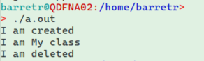
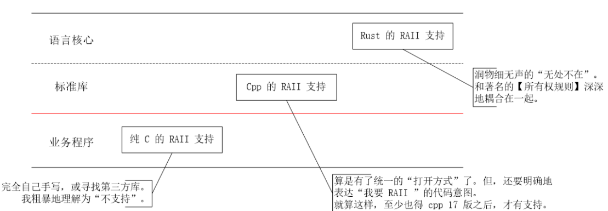

# 1. 导语
在C语言中，有三种类型的内存分配:

1. 从**静态存储区域**分配。内存在程序编译的时候就已经分配好，这块内存在程序的整个运行期间都存在。例如全局变量static变量。
1. 在**栈**上创建。在执行函数时，函数内局部变量的存储单元都可以在栈上创建，函数执行结束时，这些存储单元自动被释放。栈内存分配运算内置于处理器的指令集中，效率很高，但是分配的内存容量有限。
1. 从**堆**上分配，亦称**动态内存分配**。程序在运行的时候用malloc或new申请任意多少的内存，程序员自己负责在何时用free或delete释放内存。动态内存的生存期由我们决定，使用非常灵活，但问题也最多。


程序员使用四个基本操作明确地分配和释放动态内存:malloc、realloc、calloc和free。前两个不执行任何初始化，内存可能包含碎片。除了自由，他们都可能失败。在这种情况下，它们返回一个空指针，其访问是未定义的行为；在最好的情况下，你的程序会崩溃。在最坏的情况下，你的程序看起来会工作一段时间，在崩溃前处理垃圾数据。
例如：

```cpp
int main() {
   char *str = (char *) malloc(7); 
   strcpy(str, "toptal");
   printf("char array = \"%s\" @ %u\n", str, str);

   str = (char *) realloc(str, 11);
   strcat(str, ".com");
   printf("char array = \"%s\" @ %u\n", str, str);

   free(str);
   return(0);
}
```

输出：

```cpp
char array = "toptal" @ 2762894960
char array = "toptal.com" @ 2762894960
```

尽管代码很简单，但它已经包含了一个反模式和一个有问题的决定。在现实生活中，你**不应该直接写字节数，而应该使用sizeof函数**。类似地，我们将char *数组精确地分配给我们需要的字符串大小的两倍(比字符串长度多一倍，以说明空终止)，这是一个相当昂贵的操作。一个更复杂的程序可能会构建一个更大的字符串缓冲区，允许字符串大小增长。


# 2. RAII的发明
至少可以说，所有手动管理都是令人不快的。 在80年代中期，Bjarne Stroustrup为他的全新语言C ++发明了一种新的范例。 他将其称为“资源获取就是初始化”，其基本见解如下：**可以指定对象具有构造函数和析构函数，这些构造函数和析构函数在适当的时候由编译器自动调用，这为管理给定对象的内存提供了更为方便的方法。**并且该技术对于不是内存的资源也很有用。
意味着上面的例子在c++中更简洁：

```cpp
int main() {
   std::string str = std::string ("toptal");
   std::cout << "string object: " << str << " @ " << &str << "\n";
   
   str += ".com";
   std::cout << "string object: " << str << " @ " << &str << "\n";
   
   return(0);
}
```

输出：

```cpp
string object: toptal @ 0x7fffa67b9400
string object: toptal.com @ 0x7fffa67b9400
```

在上述例子中，我们没有手动内存管理！构造string对象，调用重载方法，并在函数退出时自动销毁。不幸的是，同样的简单也会导致其他问题。让我们详细地看一个例子：

```cpp
vector<string> read_lines_from_file(string &file_name) {
    vector<string> lines;
    string line;
    
    ifstream file_handle (file_name.c_str());
    while (file_handle.good() && !file_handle.eof()) {
        getline(file_handle, line);
        lines.push_back(line);
    }
    
    file_handle.close();
    return lines; //返回lines,值传递，重新创建一个vector进行复制
}

int main(int argc, char* argv[]) {
    // get file name from the first argument
    string file_name (argv[1]);
    int count = read_lines_from_file(file_name).size();
    cout << "File " << file_name << " contains " << count << " lines.";
    
    return 0;
}
```

输出：

```cpp
File makefile contains 38 lines.
```

这看起来很简单。`vector`被填满、返回和调用。然而，作为关心性能的高效程序员，这方面的一些问题困扰着我们:在return语句中，**由于使用了值传递，**`**vector**`**在销毁之前不久就被复制到一个新**`**vector**`**中**。

> 在现代C中，这不再是严格的要求了。 C11引入了**移动语义**的概念，其中将原点保留在有效状态（以便仍然可以正确销毁）但未指定状态。 对于编译器而言，返回调用是最容易优化以优化语义移动的情况，因为它知道在进行任何进一步访问之前不久将销毁源。 但是，该示例的目的是说明为什么人们在80年代末和90年代初发明了一大堆垃圾收集的语言，而在那个时候C++ move语义不可用。


让我们对其进行优化，只返回一个指针。 语法进行了一些更改，但其他代码相同：
```cpp
vector<string> * read_lines_from_file(string &file_name) { //修改：返回vector指针
    vector<string> * lines = new vector<string>; //申请堆内存
    string line;
    
    ifstream file_handle (file_name.c_str());
    while (file_handle.good() && !file_handle.eof()) {
        getline(file_handle, line);
        lines->push_back(line);
    }
    
    file_handle.close();
    return lines; //这里会自动使用std::move,将右值变为左值传递出去
}
int main(int argc, char* argv[]) {
    // get file name from the first argument
    string file_name (argv[1]);
    int count = read_lines_from_file(file_name).size();
    cout << "File " << file_name << " contains " << count << " lines.";
    
    return 0;
}
```

不幸的是，尽管这看起来很完美，但它仍然有一个缺陷:**它会泄露内存**（main函数里没有释放返回的vector指针）。在C中，指向堆的指针在不再需要后必须手动删除；否则，一旦最后一个指针超出范围，该内存将变得不可用，并且直到进程结束时操作系统对其进行管理后才会恢复。惯用的现代C将在这里使用`unique_ptr`，它实现了期望的行为。它删除指针超出范围时指向的对象。然而，这种行为直到C++11才成为语言的一部分。
在这里，可以直接使用C++11之前的语法，只是把main中改一下即可：

```cpp
vector<string> * read_lines_from_file(string &file_name) {
    vector<string> * lines = new vector<string>;
    string line;
    
    ifstream file_handle (file_name.c_str());
    while (file_handle.good() && !file_handle.eof()) {
        getline(file_handle, line);
        lines->push_back(line);
    }
    
    file_handle.close();
    return lines;
}

int main(int argc, char* argv[]) {
    // get file name from the first argument
    string file_name (argv[1]);
    vector<string> * file_lines = read_lines_from_file(file_name);
    int count = file_lines->size();
    delete file_lines; //添加delete vector
    cout << "File " << file_name << " contains " << count << " lines.";
    
    return 0;
}
```

**不幸的是，随着程序扩展到上述范围之外，很快就变得更加难以推理指针应该在何时何地被删除。当一个函数返回指针时，你现在拥有它吗？您应该在完成后自己删除它，还是它属于某个稍后将被一次性释放的数据结构？一方面出错，内存泄漏，另一方面出错，你已经破坏了正在讨论的数据结构和其他可能的数据结构，因为它们试图取消引用现在不再有效的指针。**


# 3. 使用垃圾收集器
垃圾收集器不是一项新技术。 它们由John McCarthy在1959年为Lisp发明。 1980年，随着Smalltalk-80的出现，垃圾收集开始成为主流。 但是，1990年代代表了该技术的真正发芽：在1990年至2000年之间，发布了多种语言，所有语言都使用一种或另一种垃圾回收：Python，Java，JavaScript和C#是最著名的。
什么是垃圾收集？ 简而言之，这是一组用于自动执行手动内存管理的技术。 它通常作为具有手动内存管理的语言（例如C和C ++）的库提供，但在需要它的语言中更常用。 最大的优点是_程序员根本不需要考虑内存。 都被抽象了_。
例如，相当于我们上面的文件读取代码的Python就是这样：

```python
def read_lines_from_file(file_name):
    lines = []
    with open(file_name) as fp: 
        for line in fp:
            lines.append(line)
    return lines
    
if __name__ == '__main__':
    import sys
    file_name = sys.argv[1]
    count = len(read_lines_from_file(file_name))
    print("File {} contains {} lines.".format(file_name, count))
```

行数组是在第一次分配给它时出现的，并且不复制到调用范围就返回。 由于时间不确定，它会在超出该范围后的某个时间被垃圾收集器清理。
尽管简化了内存管理，但要付出很大的代价。 在引用计数垃圾回收中，所有变量赋值和作用域出口都会获得少量成本来更新引用。 在标记清除系统中，在GC清除内存的同时，所有程序的执行都以不可预测的时间间隔暂停。 这通常称为世界停止事件。 同时使用这两种系统的Python之类的实现都会受到两种惩罚。 这些问题降低了垃圾收集语言在**性能至关重要或需要实时应用程序**的情况下的适用性。
即使在上面的文件读取程序上，也可以看到实际的性能下降：

```cpp
$ make cpp && time ./c++ makefile
g++ -o c++ c++.cpp
File makefile contains 38 lines.
real    0m0.016s
user    0m0.000s
sys     0m0.015s

$ time python3 python3.py makefile
File makefile contains 38 lines.

real    0m0.041s
user    0m0.015s
sys     0m0.015s
```

Python版本的实时时间几乎是C++版本的三倍。 尽管并非所有这些差异都可以归因于垃圾收集，但它仍然是可观的。


# 4. 所有权：RAII

我们知道**对象的生存期由其范围决定**。但是，有时我们需要创建一个对象，该对象与创建对象的作用域无关，这是有用的，或者很有用。
在C++中，运算符new用于创建这样的对象。 为了销毁对象，可以使用运算符delete。 由new操作员创建的对象是动态分配的，即在动态内存（也称为堆或空闲存储）中分配。 因此，由new创建的对象将继续存在，直到使用delete将其明确销毁为止。使用new和delete时可能发生的一些错误是：

- 对象（或内存）泄漏：使用new分配对象，而忘记删除该对象。
- 过早删除（或悬挂引用）：持有指向对象的另一个指针，删除该对象，然而还有其他指针在引用它。
- 双重删除：尝试两次删除一个对象。


通常，范围变量是首选。 但是，RAII可以用作new和delete的替代方法，以使对象独立于其范围而存在。 这种技术包括将指针分配到在堆上分配的对象，并将其放在句柄/管理器对象中。 后者具有一个析构函数，将负责销毁该对象。 这将确保该对象可用于任何想要访问它的函数，并且该对象在句柄对象的生存期结束时将被销毁，而无需进行显式清理。

## 4.1 简单的RAII管理模板
RAII的核心就是：**构造时获得，析构时释放**。我们可以创建一个管理模板类，用于管理不同类型资源的申请和释放。
```cpp
#include <iostream>
#include <string>
#include <string.h>
#include <stdio.h>
using namespace std;

class My
{
public:
    My() {cout<<"I am created"<<endl;}
    ~My() {cout<<"I am deleted"<<endl;}
    void printMe()
    {
        cout<<"I am My class"<<endl;
    }
};

template <typename RESTYPE>
class ScopedResource final 
{
public:
    //构造时new
    ScopedResource() { managedResource = new RESTYPE(); }
    //析构时delete
    ~ScopedResource() { delete managedResource; }
    //重载->符号
    RESTYPE* operator->() const { return managedResource; }
private:
    RESTYPE* managedResource;
};

int main(int argc, char* argv[])
{
    ScopedResource<My> raii;
    raii->printMe();
    return 0;
};
```
上述代码执行结果如下，其实这个简单的模板就是智能指针的雏形：

## 4.2 智能指针也是RAII

来自C++标准库的使用RAII的示例为`std::string`和`std::vector`。考虑这段代码：

```cpp
void fn(const std::string& str)
{
    std::vector<char> vec;
    for (auto c : str)
        vec.push_back(c);
    // do something
}
```

当创建`vector`,并将元素推入`vector`时，您不必担心分配和取消分配此类元素内存。 `vector`使用new为其堆上的元素分配空间，并使用delete释放该空间。 作为vector的用户，您无需关心实现细节，并且会相信vector不会泄漏。 在这种情况下，向量是其元素的句柄对象。

> 标准库中使用RAII的其他示例是`std::shared_ptr`，`std::unique_ptr`和`std::lock_guard`。


现在，我们将上述读取文件例子，进行修改：

```cpp
#include <iostream>
#include <vector>
#include <cstring>
#include <fstream>
#include <bits/unique_ptr.h>

using namespace std;

unique_ptr<vector<string>> read_lines_from_file(string &file_name) {
    unique_ptr<vector<string>> lines(new vector<string>); //使用智能指针代替一般的vector指针
    string line;

    ifstream file_handle (file_name.c_str());
    while (file_handle.good() && !file_handle.eof()) {
        getline(file_handle, line);
        lines->push_back(line);
    }

    file_handle.close();

    return lines;
}
int main(int argc, char* argv[]) {
    // get file name from the first argument
    string file_name (argv[1]);
    int count = read_lines_from_file(file_name).get()->size();
    cout << "File " << file_name << " contains " << count << " lines.";

    return 0;
}
```


# 5. RAII总结

最后，RAII总结如下：

- **资源在析构函数中被释放**
- **该类的实例是堆栈分配的**
- **资源是在构造函数中获取的**


当前语言的支持情况：
RAII代表“资源获取即初始化”。常见的例子有：

- 文件操作
- 智能指针
- 互斥量

C++并发笔记中一个自定义RAII管理类的示例，可以对应上面的三条原则：

