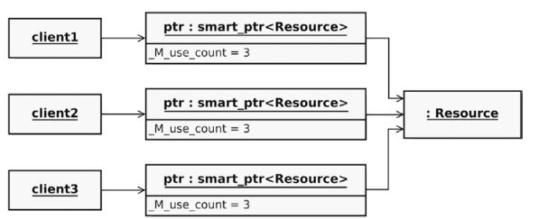

C++11 引入了智能指针的概念，使用了引用计数的想法，让程序员不再需要关心手动释放内存。使用它们需要包含头文件**memory**，这些智能指针就包括

- **std::shared_ptr**
- **std::unique_ptr**
- **std::weak_ptr**

# 1 std::shared_ptr<T>
std::shared_ptr可以与其他实例共享指针的所有权，T类型的资源管理的责任,由所有的shared_ptr实例一起接管。使用内部的引用计数器来监控当前由多少个管理T类型的实例。**当智能指针的最后一个实例被销毁时，T的资源才会被释放。**

## 1.1 创建共享指针
```cpp
#include <iostream>
#include <string>
#include <vector>
#include <memory>
using namespace std;

int main()
{
    //创建shared pointer的三种方式
    //shared_ptr<string> p1(new string("nico"));
    shared_ptr<string> p1(new string("nico"), [](string *p) { //这种方式，可以自定义deleter
        cout << "delete " << *p << " in customer deleter" << endl;
        delete p;
    });
    shared_ptr<string> p2 = make_shared<string>("jutta");//推荐使用
    
    //C++20引入，自动按照默认值初始化
    shared_ptr<string> p3 = make_shared_for_overwrite<string>();//默认空字符串

    //填充vector
    vector<shared_ptr<string>> whoMadeCoffee;
    whoMadeCoffee.push_back(p2);
    whoMadeCoffee.push_back(p2);
    whoMadeCoffee.push_back(p1);
    whoMadeCoffee.push_back(p2);
    whoMadeCoffee.push_back(p1);

    //打印vector
    for (auto vec : whoMadeCoffee)
    {
        cout << *vec << "  "; //vec是共享指针
    }
    cout << endl;

    //借助指针修改内容
    (*p1)[0] = 'N';
    p2->replace(0, 1, "J");

    //重新打印vector，内容被修改
    for (auto vec : whoMadeCoffee)
    {
        cout << *vec << "  ";
    }
    cout << endl;

    //打印指针的引用计数
    cout << "p1 count:" << p1.use_count() << endl; //打印3
    cout << "p2 count:" << p2.use_count() << endl; //打印4
    return 0;
}
```

## 1.2 自定义deleter
共享指针提供的默认deleter是`**delete**`。我们可以在创建共享指针时，指定自定义的删除器。**注意：**`**make_shared()**`**函数不能指定deleter。**比如：
```cpp
shared_ptr<string> p1(new string("nico"), [](string *p) { //这种方式，可以自定义deleter
	cout << "delete " << *p << " in customer deleter" << endl;
	delete p;
});
```
下面是需要自定义deleter的几个示例，充分说明了自定义删除器的重要性：
```cpp
//共享智能指针，自定自定义删除器的示例
#include <string>
#include <fstream>
#include <memory>
#include <cstdio>

class FileDeleter
{
private:
    std::string filename;

public:
    FileDeleter(const std::string &fn) : filename(fn) {}
    void operator()(std::ofstream *fp)
    {
        fp->close();                   //关闭文件
        std::remove(filename.c_str()); //删除文件
    }
};

int main()
{
    //创建临时文件，并指定删除器
    std::shared_ptr<std::ofstream> fp(new std::ofstream("tmpfile.txt"), FileDeleter("tmpfile.txt"));
    //...
}
```
**其实通过RAII的方式，我们可以让上面的代码更加优雅：定义一个类，让其构造函数执行初始化工作，让其析构函数执行清理工作（比如这里的关闭和删除文件）。这样智能指针只负责管理类的实例对象，并可以在默认delete时调用析构函数进行清理**。

## 1.3 处理数组指针
由于C语言的规则，我们可能用一个类型指针表示一个数组（指针指向数组的首地址）。如果我们想用shared_prt管理数组的内存就会存在一个问题，因为shared_ptr默认删除器是**delete ptr**，这里我们需要的是**delete[] ptr**。所以，管理数组指针时，我们需要自定义一个删除器：
```cpp
//方法1：自定义删除器
std::shared_ptr<int> p(new int[10], [](int* p){delete[] p;});

//方法2：使用辅助函数替换默认删除器
std::shared_ptr<int> p(new int[10], std::default_delete<int[]>());
```

# 2 std::unique_ptr<T>

## 2.1 使用示例
std::unique_ptr 是一种独占的智能指针，它禁止其他智能指针与其共享同一个对象，从而保证代码的安全。
```cpp
std::unique_ptr<int> pointer = std::make_unique<int>(10); // make_unique 从 C++14 引入
std::unique_ptr<int> pointer2 = pointer; // 非法，独占，不能赋值给其他指针
std::unique_ptr<int> pointer3(pointer); //非法，拷贝构造函数不能使用

//make_unique_for_overwrite是C++20新增，自带默认值初始化
std::unique_ptr<int> pointer = std::make_unique_for_overwrite<int>(); //值默认为0
```
**注意:  C++不允许定义**`**std::unique_ptr<void>**`**类型**，因为unique_ptr没有实现类型删除，不知道类型的话就无法正确释放内存。shared_ptr是可以的。一个简单的示例：
```cpp
//独占智能指针
#include <iostream>
#include <string>
#include <thread>
#include <memory>
#include <chrono>

class Person
{
public:
    Person() = default;
    Person(std::string name, std::uint32_t age)
        : _name(std::move(name)), _age(age)
    {
    }
    ~Person()
    {
        std::cout << "delete the class" << std::endl;
    }

    void show()
    {
        std::cout << _name << "\t" << _age << std::endl;
    }

private:
    std::string _name;
    std::uint32_t _age;
};

int main()
{
    {
        auto ptr = std::make_unique<Person>("barret", 30);
        ptr->show();
        //开启一个线程，看指针是否会在线程中释放
        std::thread([person = std::move(ptr)] {
            person->show();//结果是会在子线程结束后释放
        }).detach();
    }
    std::this_thread::sleep_for(std::chrono::seconds(3));//主线程等待3秒
    std::cout << "end main function" << std::endl;
    return 0;
}
```

## 2.2 转移所有权
unique_ptr不能被赋值和拷贝，那有没有方法转移unique_ptr的所有权呢？方法如下：

- `release()`：放弃所有权，返回原始对象指针
- `std::move()`：move语义转移所有权


使用示例如下：
```cpp
std::unique_ptr<ClassA> up(new ClassA());
ClassA* a=up.release();up失去所有权，返回ClassA对象指针

std::unique_ptr<ClassA> up2（std::move(up));//up失去所有权，所有权转移给up2
```

## 2.3 自定义deleter
当然，也可以像shared_ptr一样自定义删除器，不过稍有不同的是，**unique_ptr必须指定删除器的函数签名：**
```cpp
std::unique_ptr<std::string[], void(*)(std::string*)> up{new std::string[10],
                                                        [](std::string* p){
                                                           delete[] p;
                                                        }};
//或者使用std::function
std::unique_ptr<std::string[], std::function<void(std::string*)>> up{new std::string[10],
                                                        [](std::string* p){
                                                           delete[] p;
                                                        }};
//或者使用decltype自动推导删除器的类型
void my_free(std::string* p) { delete[] p; }
std::unique_ptr<std::string[], decltype(&my_free)> up{new std::string[10], my_free};
```

## 2.4 处理数组指针
unique_ptr提供了一个偏特化的版本用于处理数组指针，这个版本会默认调用**delete[]**。需要注意的是，这个版本无法使用指针操作符`*`和`->`，只能使用数组操作符`[]`，并且无法调用多态。
```cpp
std::unique_ptr<std::string[]> up(new std::string[10]); // OK
std::cout << *up << std::endl; //编译失败
std::cout << up[0] << std::endl;  //OK
```

# 3 std::weak_ptr<T>
**弱引用指针std::weak_ptr不会引起计数增加**，它没有所有权。std::weak_ptr 没有 * 运算符和 -> 运算符，所以不能够对资源进行操作，它的作用是

- weak_ptr创建需要通过shared_ptr赋值，表示指向此shared_ptr但不增加计数
- 检查 std::shared_ptr 是否存在， expired()在资源已经被删除释放时返回 true，否则返回 false。**比判断**`**use_count()**`**效率高**。
- 通过lock()函数返回强指针，用于在短暂时间内将弱指针提升为强指针操作数据


shared_ptr无法释放的**循环依赖**例子：
```cpp
#include <iostream>
#include <memory>
struct A;
struct B;

struct A{
	std::shared_ptr<B> p;
	~A()
	{
		std::cout<<"A deleted"<<std::endl;
	}
};
struct B{
	std::shared_ptr<A> p;
	~B()
	{
		std::cout<<"B deleted"<<std::endl;
	}
};

int main()
{
	auto a=std::make_shared<A>(); //A计数1
	auto b=std::make_shared<B>(); //B计数1
	a->p = b; //B计数为2，无法释放
	b->p = a; //A计数为2，无法释放
	return 0;
}
```

这里将A和B中p改为weak_ptr指针，则不会增加引用计数，A和B的计数为1，在main之后可以直接释放。
```cpp
#include <iostream>
#include <memory>
struct A;
struct B;

struct A{
	std::weak_ptr<B> p; //改为弱引用
	~A()
	{
		std::cout<<"A deleted"<<std::endl;
	}
};
struct B{
	std::weak_ptr<A> p; //改为弱引用
	~B()
	{
		std::cout<<"B deleted"<<std::endl;
	}
};

int main()
{
	auto a=std::make_shared<A>(); //A计数1
	auto b=std::make_shared<B>(); //B计数1
	a->p=b; //B计数为1，b超过作用域可以释放B
	b->p=a; //A计数为1，a超过作用域可以释放A
	return 0;
}
```

# 4 std::enable_shared_from_this

## 4.1 返回对象共享所有权
一个类继承`std::enable_shared_from_this`后，可以在方法中通过如下两个方法返回**自身的智能指针**：

- **shared_from_this()**: 返回当前对象**所有权**的shared_ptr指针
- **weak_from_this()**: 返回当前对象**所有权**的weak_ptr指针


**注意：不能在构造函数中使用上面两个函数，因为调用构造函数时对象还没有创建完成，无法返回自身指针。**

```cpp
//enable_shared_from_this使用示例
#include <iostream>
#include <string>
#include <vector>
#include <memory>
using namespace std;

class Person : public std::enable_shared_from_this<Person>
{
public:
    string name;
    shared_ptr<Person> mother;
    shared_ptr<Person> father;
    //改为弱指针，这样kid就不会增加计数了：kid到parent为强指针，parent到kid为弱指针
    vector<weak_ptr<Person>> kids;

    Person(const string &n, shared_ptr<Person> m = nullptr,
           shared_ptr<Person> f = nullptr)
        : name(n), mother(m), father(f)
    {
    }

    ~Person()
    {
        cout << "delete " << name << endl;
    }

    void setParentAndTheirKids(shared_ptr<Person> m = nullptr,
                               shared_ptr<Person> f = nullptr)
    {
        mother = m;
        father = f;
        if (m != nullptr)
        {
            m->kids.push_back(weak_from_this()); //返回当前对象的weak_ptr
        }
        if (f != nullptr)
        {
            f->kids.push_back(weak_from_this());
        }
    }
};

shared_ptr<Person> initFamily(const string &name)
{
    shared_ptr<Person> mom = make_shared<Person>(name + "'s mom");
    shared_ptr<Person> dad = make_shared<Person>(name + "'s dad");
    shared_ptr<Person> kid = make_shared<Person>(name);
    kid->setParentAndTheirKids(mom, dad);
    return kid;
}

int main()
{
    shared_ptr<Person> p = initFamily("barret");

    cout << "barret's family exists" << endl;
    cout << "- barret is shared " << p.use_count() << " times" << endl;
    cout << "- name of 1st kid of barret's mom: "
         << p->mother->kids[0].lock()->name << endl;
    //正常释放
}
```

## 4.2 类内不能使用shared_ptr<T>(this)
可能会有疑问，为什么一定要使用`share_fron_this()`和`weak_from_this()`来返回智能指针呢，我可以直接在成员函数中`return shared_ptr<T>(this)`啊，一样和函数返回值能匹配起来。答案是**不能使用！！**​

智能指针使用的时引用计数，就需要针对某个对象指针在一个地方统一计数。所以我更愿意使用**所有权（ownership）**的概念，不仅仅称呼其为指针。所有权只能在一个地方进行管理，比如你有一万块钱存入了某银行，那这个银行就拥有了这笔钱的所有权，你所有的存取支付都需要通过这个银行来操作（shared_ptr就像是支付宝和微信关联同一个银行卡）。你无法通过其他银行处理这笔钱，其他银行没有这笔钱的所有权。而`return shared_ptr<T>(this`)会打破统一所有权，它会返回一个智能指针，但是带着新的所有权，而不是和已经存在的其他智能指针共享同一个所有权。这就出现了两个银行同时宣布拥有某一笔钱所有权的问题。引用计数这时候就失效了，因为它压根不知道在另一个地方还有一个堆同一对象的所有权管理。​

看下面例子：ptr1和ptr2都认为自己独立拥有Foo对象的所有权，函数结束会导致对象释放两遍。
```cpp
//演示类对象如何返回自身共享所有权
//以及return shared_ptr<T>(this)导致引用计数失效的问题
#include <iostream>
#include <memory>
using namespace std;

class Foo : public enable_shared_from_this<Foo>
{
public:
    ~Foo()
    {
        cout << "Foo is deleted" << endl;
    }
    shared_ptr<Foo> getPointer()
    {
        // return shared_from_this(); //返回对象所有权的共享指针
        return shared_ptr<Foo>(this);//返回共享指针,但跟其他指针不共享所有权
    }
};
int main()
{
    //创建两个智能指针
    auto ptr1{make_shared<Foo>()};
    auto ptr2{ptr1->getPointer()};
    //shared_from_this,所有权引用计数是2
    //shared_ptr<Foo>(this),所有权引用计数是1,导致内存重复释放
    cout << ptr1.use_count() << endl;
    cout << ptr2.use_count() << endl;
}
```

# 5 智能指针如何与vector配合??
记住两个原则：

- **C++的Vector 保存原始指针，Vector 析构的时候是不会释放指针指向的堆对象,**
- **如果用Vector保存智能指针，可以释放智能指针所指向的对象的**

示例如下：结果是四次create，两次delete。
```cpp
#include <iostream>
#include <vector>
#include <memory>

using namespace std;

class Human
{
public:
	Human() { cout << "create Human" << endl; }
	~Human() { cout << "delete Human" << endl; }
};

int main()
{
	vector<Human*> list1 = { new Human(), new Human() };
	vector<shared_ptr<Human>> list2 = { make_shared<Human>() ,make_shared<Human>() };
	return 0;
}
```

# 6 智能指针类型转换
和基本类型、原始指针一样，智能指针也能进行类型转换。从一个类型的指针转换为另一个类型的指针，其cast函数和普通类型的cast函数很相似：

- std::static_pointer_cast
- std::dynamic_pointer_cast
- std::const_pointer_cast
- std::reinterpret_pointer_cast


上述函数可以直接转换只能指针。如果想用不带`_pointer_`系列的cast函数，需要**提取出原始指针再转换，不能直接转换智能指针**。示例：
```cpp
#include <iostream>
#include <memory>

struct BaseClass {};

struct DerivedClass : BaseClass
{
	void f() const
	{
		std::cout << "Hello World!\n";
	}
	~DerivedClass() { // 注意：它不是虚的
		std::cout << "~DerivedClass\n";
	}
};

int main()
{
	std::shared_ptr<BaseClass> ptr_to_base(std::make_shared<DerivedClass>());

	//ptr_to_base->f(); // 错误不会编译： BaseClass 无名为 'f' 的成员

	std::static_pointer_cast<DerivedClass>(ptr_to_base)->f(); // OK
	// （构造临时 shared_ptr ，然后调用 operator-> ）

	static_cast<DerivedClass*>(ptr_to_base.get())->f(); // 亦 OK
	// （直接转型，不构造临时 shared_ptr ）
}
```
