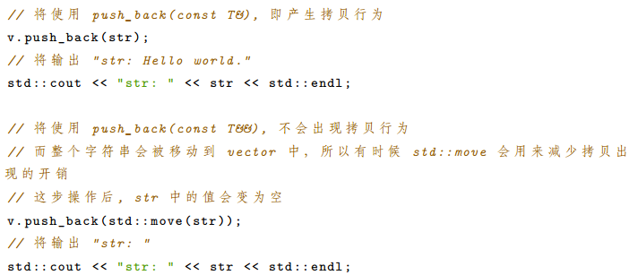
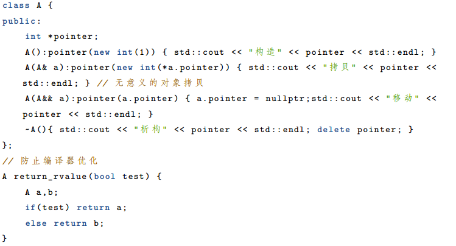

# 1 左值？右值？
- **左值（lvaue）**：赋值符号左边的值。准确来说，左值是表达式（不一定是赋值表达式）后依然存在的持久对象，具有可以访问和识别的内存地址。
- **右值（rvalue）**：右边的值，是指表达式结束后就不再存在的临时对象，没有名字，无法修改。


C++11 中为了引入右值引用，将右值的概念进行了进一步的划分，分为：纯右值、将亡值。

- **纯右值 (prvalue)**：纯粹的右值
   - 纯粹的字面量，例如 10, true；
   - 表达式求值，结果相当于字面量或匿名临时对象，例如 1+2。
   - 非引用返回的临时变量、运算表达式产生的临时变量、原始字面量、 Lambda 表达式都属于纯右值。
- **将亡值 (xvalue)**：C11 为了引入右值引用而提出的概念（因此在传统 C 中，纯右值和右值是同一个概念），也就是即将被销毁、却能够被移动的值。例如函数返回一个vector列表: `std::vector<int> v = foo();` 右边即为将亡值。

# 2 右值引用
使用`std::move`或者`&&`可以左值变成一个**临时的右值**，可以被赋值给其他对象。**就像Rust中的所有权传递**。标准库中定义如下：从move的定义可以看出，move自身除了做一些参数的推断之外，返回右值引用本质上还是靠static_cast<T&&>完成的。
```cpp
  template<typename _Tp>
    constexpr typename std::remove_reference<_Tp>::type&&
    move(_Tp&& __t) noexcept
    { return static_cast<typename std::remove_reference<_Tp>::type&&>(__t); }
//所有下面调用是等价的
void func(int&& a)
{
    cout << a << endl;
}
int a = 6;
func(std::move(a));
int b = 10;
func(static_cast<int&&>(b)); 
```

引入右值后，右值引用可以作为函数的参数，用法如下：

| 函数定义 | 允许的参数类型 |
| --- | --- |
| void function(Type param)；void X::method(Type param)； | 接受**左值或右值**作为参数 |
| void function(Type& param)；void function(const Type& param)；void X::method(Type& param)；void X::method(const Type& param)； | 只接受**左值** |
| void function(Type&& param)；void X::method(Type&& param)； | 只接受**右值** |

函数可能的返回值类型，比传统C++多了右值引用的情况：

| 函数定义 | 可能的返回值类型 |
| --- | --- |
| int function()；int X::method()； | - [const] int- [const] int&- [const] int&& |
| int& function();int& X::method(); | - non-const int- int& |
| int&& function();int&& X::method(); | - 字面值- 对象右值引用，int&&
（对象所有权被转移到函数外，生命周期比函数长） |


# 3 新的构造函数
由于右值引用的引入，对于类定义来说，也相应的多了两种构造函数。类的所有构造函数如下：
```cpp
class Clazz {
public:
	Clazz() noexcept; // 默认构造函数---->Class a;
	Clazz(const Clazz& other); //拷贝构造函数---->Class a(b);
	Clazz& operator=(const Clazz& other); //复制赋值运算符---->Class a = b;
    
    Clazz(Clazz&& other) noexcept; //新增：Move构造函数---->Class a(std::move(b));
	Clazz& operator=(Clazz&& other) noexcept; //新增：Move赋值运算符---->Class a = std::move(b);
	virtual ~Clazz() noexcept; //析构函数
};
```
一个简单的示例如下：
```cpp
class Data
{
private:
    uint16_t age;
    uint16_t id;
    unsigned char *bytes;

public:
    Data(uint16_t _age, uint16_t _id)
        : age(_age), id(_id), bytes(nullptr)
    {
        printf("ctor\n");
    }
	//移动构造函数
    Data(Data &&_data)
    {
        age = _data.age;
        id = _data.id;
        bytes = _data.bytes;
        //传进来的参数需要清零
        _data.bytes = nullptr;
        printf("move ctor\n");
    }
    ~Data()
    {
        if (bytes)
        {
            delete[] bytes;
            bytes = nullptr;
        }
    }
};
```

# 4 右值引用的用途

## 4.1 vector push_back
vector.push_back的右值引用，避免拷贝行为：


## 4.2 move构造函数代替拷贝构造函数
用作Class的移动构造函数，避免拷贝构造函数的拷贝行为

## 4.3 move与函数返回值
**由于编译器自动优化，我们不需要在函数返回值中显示的调用move**。C++11之后，编译器支持**返回值优化**，具体规则如下：对于如下函数，编译器会按照下面优先级进行优化

- 如果X有一个可访问的copy或move构造函数，编译器可以选择省略copy
- 如果X有一个move构造函数，X被移动。类似显示的调用std::move
- 如果X有一个复制构造函数，则复制X
- 两种构造函数都不存在，编译器报错
```cpp
X foo ()
{
	X x;
    ...
    return x;
}
```

# 5 完美转发std::forward
**完美转发实现了参数在传递过程中保持其值属性的功能，即若是左值，则传递之后仍然是左值，若是右值，则传递之后仍然是右值。**std::move和std::forward本质都是转换。std::move执行到右值的无条件转换（必然按右值引用转换）。std::forward只有在它的参数绑定到一个右值上的时候，它才转换它的参数到一个右值。std::forward<T>()不仅可以保持左值或者右值不变，同时还可以保持const、Lreference、Rreference、validate等属性不变。
比如下面示例：
```cpp
class Foo
{
public:
    std::string member;

    template<typename T>
    Foo(T&& member): member{std::forward<T>(member)} {}//构造函数接受一个右值引用
};
```

- 传递一个lvalue或者传递一个const lvaue
   - 传递一个lvalue，模板推导之后 `T = std::string&`，即左值引用
   - 传递一个const lvaue, 模板推导之后`T = const std::string&`，即左值引用
   - 上面两种情况下，`T& &&`将折叠为T&，即`std::string& && 折叠为 std::string&`
   - 最终函数为: `Foo(string& member): member{std::forward<string&>(member)} {}`
   - **std::forward<string&>(member)将返回一个左值，最终调用拷贝构造函数**
- 传递一个rvalue
   - 传递一个rvalue，模板推导之后 `T = std::string`
   - 最终函数为: `Foo(string&& member): member{std::forward<string>(member)} {}`
   - **std::forward<string>(member) 将返回一个右值，最终调用移动构造函数**
