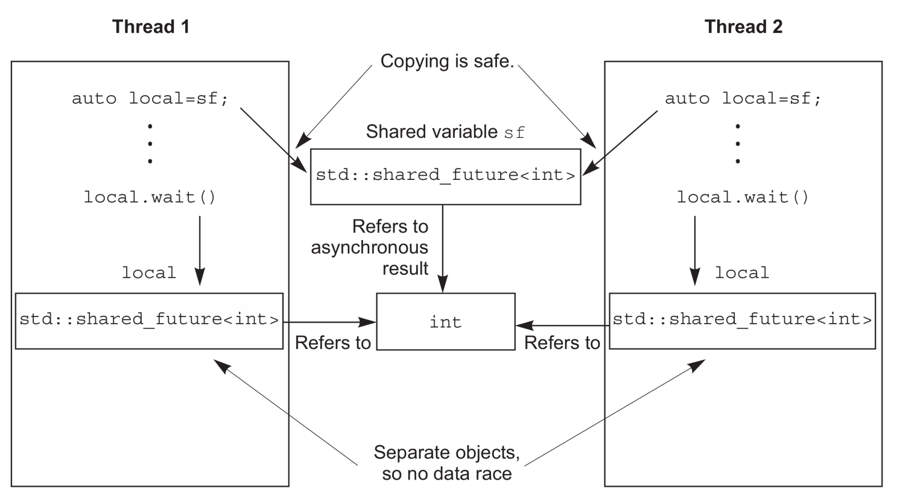

# 1 条件变量condition_variable
当一个线程等待另一个线程完成任务时，它会有很多选择：

1. 可以持续的检查共享数据标志(用于做保护工作的互斥量)，直到另一线程完成工作时对这个标志进行重设。
1. 在等待线程在检查间隙，使用`std::this_thread::sleep_for()`进行周期性的间歇：
```cpp
bool flag;
std::mutex m;

void wait_for_flag()
{
  std::unique_lock<std::mutex> lk(m);
  while(!flag)
  {
    lk.unlock();  // 1 解锁互斥量
    std::this_thread::sleep_for(std::chrono::milliseconds(100));  // 2 线程休眠100ms
    lk.lock();   // 3 再锁互斥量
  }
}
```

3. **最优选择**：使用C++标准库提供的工具**条件变量**去等待事件的发生。


C++标准库对条件变量有两套实现：`std::condition_variable`和`std::condition_variable_any`。这两个实现都包含在`<``condition_variable``>`头文件的声明中。两者都需要与一个互斥量一起才能工作(互斥量是为了同步)；前者仅限于与`std::mutex`一起工作，而后者可以和任何满足最低标准的互斥量一起工作，从而加上了*_any*的后缀。因为`std::condition_variable_any`更加通用，这就可能从体积、性能，以及系统资源的使用方面产生额外的开销，所以`std::condition_variable`一般作为首选的类型，当对灵活性有硬性要求时，我们才会去考虑`std::condition_variable_any`。
示例如下：
```cpp
#include <iostream>
#include <string>
#include <thread>
#include <mutex>
#include <condition_variable>

std::mutex m;
std::condition_variable cv;//定义条件变量用于同步
std::string data;
bool ready = false;
bool processed = false;

void worker_thread()
{
    // 等待直至 main() 发送数据
    std::unique_lock<std::mutex> lk(m);
    //条件变量设置监控对象和等待条件lambda表达式，条件为ready变为true，否则阻塞本线程一直等待
    cv.wait(lk, [] {return ready; });

    // 等待后，我们占有锁。
    std::cout << "Worker thread is processing data\n";
    data += " after processing";

    // 发送数据回 main()
    processed = true;
    std::cout << "Worker thread signals data processing completed\n";

    // 通知前完成手动解锁，以避免等待线程才被唤醒就阻塞
    lk.unlock();
    cv.notify_one();//通知一个等待的线程，显然这里是通知主线程
}

int main()
{
    std::thread worker(worker_thread);

    data = "Example data";
    // 发送数据到 worker 线程
    {
        std::lock_guard<std::mutex> lk(m);
        ready = true;
        std::cout << "main() signals data ready for processing\n";
    }
    cv.notify_one();//ready已经设置好，通知子线程

    // 等候 worker
    {
        std::unique_lock<std::mutex> lk(m);
        cv.wait(lk, [] {return processed; });//主线程设置条件变量，等到子线程将processed改为true
    }
    std::cout << "Back in main(), data = " << data << '\n';

    worker.join();
}
```

- wait()会去检查这些条件(通过调用所提供的lambda函数)，当条件满足(lambda函数返回true)时返回。如果条件不满足(lambda函数返回false)，wait()函数将**解锁互斥量，并且将这个线程置于阻塞或等待状态**。
- 当准备数据的线程调用notify_one()或notify_all()通知条件变量时，处理数据的线程从睡眠状态中苏醒，重新获取互斥锁，并且再次检查条件是否满足。在条件满足的情况下，从wait()返回并继续持有锁；当条件不满足时，线程将对互斥量解锁，并且重新开始等待。
- 推荐使用`std::unique_lock`，等待中的线程必须在等待期间解锁互斥量，并在这之后对互斥量再次上锁，而`std::lock_guard`没有这么灵活。


# 2 期望值future**
C++标准库模型提供了**访问异步操作结果**的机制。当线程需要等待特定的一次性事件时，某种程度上来说就需要知道这个事件在未来的期望结果。之后，这个线程会周期性(较短的周期)的等待或检查，事件是否触发；检查期间也会执行其他任务。
C++标准库中，有两种期望值，使用两种类型模板实现，声明在`<future>`头文件中:** **

- **_唯一期望值_**(`std::future<>`)：只能与一个指定事件相关联
- **_共享期望值_**(`std::shared_future<>`)：关联多个事件。所有实例会在同时变为就绪状态，并且他们可以访问与事件相关的任何数据。


`std::future`有局限性。很多线程在等待的时候，只有一个线程能获取等待结果。当多个线程需要等待相同的事件的结果，就需要使用`std::shared_future`来替代`std::future`了。

## 2.1 async与thread返回值
默认`std::thread` 执行的任务不能有返回值，不过可以使用期望值来传递返回值。当不着急要任务结果时，可以使用`std::async`启动一个异步任务。与`std::thread`对象等待的方式不同，`std::async`会返回一个`std::future`对象，这个对象持有最终计算出来的结果。当需要这个值时，只需要调用这个对象的get()成员函数；并且会阻塞线程直到期望值状态为就绪为止；之后，返回计算结果。

```cpp
#include <future>
#include <iostream>

int find_the_answer(int a, int b)
{
    return a + b;
}
void do_other_stuff()
{
    std::cout << "main thread do something" << std::endl;
}
int main()
{
    // 来自 async() 的 future，异步任务
    std::future<int> the_answer = std::async(find_the_answer, 1, 2);
    do_other_stuff();
    std::cout << "The answer is " << the_answer.get() << std::endl;//返回值通过future get()方法获得
}
```
在函数调用之前向`std::async`传递一个额外参数，这个参数的类型可以是：

- `std::launch::async` 表明函数必须在其所在的独立线程上执行
- `std::launch::defered`，表明函数调用被延迟到wait()或get()函数调用时才执行
```cpp
auto f6=std::async(std::launch::async,Y(),1.2);  // 在新线程上执行
auto f7=std::async(std::launch::deferred,baz,std::ref(x));  // 在wait()或get()调用时执行
auto f8=std::async(
              std::launch::deferred | std::launch::async,
              baz,std::ref(x));  // 实现选择执行方式
```


## 2.2 packaged_task与期望值
`std::packaged_task<>`对一个函数或可调用对象，使得能异步调用它，并绑定一个期望值。当调用`std::packaged_task<>` 对象时，它就会调用相关函数或可调用对象，将期望状态置为就绪，返回值也会被存储。

- 当构造出一个`std::packaged_task<>`实例时，就必须传入一个函数或可调用对象；这个函数或可调用的对象，需要能接收指定的参数和返回可转换为指定返回类型的值。
- 函数签名的返回类型可以用来标识从**get_future()**返回的`std::future<>`的类型，而函数签名的参数列表，可用来指定packaged_task的函数调用操作符。


packaged_task的三种具体的初始化和运行方式如下：
```cpp
#include <future>
#include <iostream>
#include <thread>

int find_the_answer(int a, int b)
{
    return a + b;
}

int main()
{
	//2.1传入函数，在调用task时传入参数
    std::packaged_task<int(int, int)> task1(find_the_answer); //传入函数，模板中指定返回值和输入参数的类型
    std::future<int> f1 = task1.get_future();  // 获取 future
    task1(2, 3);//直接运行task，同时传入内部函数需要参数
    std::cout << "The task1 answer is " << f1.get() << std::endl;//打印返回值

    //2.2 使用std::thread初始化时为task输入参数
    std::packaged_task<int(int, int)> task2(find_the_answer); //传入函数，模板中指定返回值和输入参数的类型
    std::future<int> f2 = task2.get_future();
    std::thread task2_th(std::move(task2), 3, 4);//传入参数
    task2_th.join();
    std::cout << "The task1 answer is " << f2.get() << std::endl;

    //2.3 使用std::bind包装函数和输入参数
    std::packaged_task<int()> task3(std::bind(find_the_answer, 4, 5));//模板中只需要指定返回值类型
    std::future<int> f3 = task3.get_future();
    task3();//直接运行task，不再需要传递参数
    std::cout << "The task1 answer is " << f3.get() << std::endl;   
}
```

## 2.3 promise与期望值
`std::promise<T>`提供设定值的方式(类型为T)，这个类型会和后面看到的`std::future<T>` 对象相关联。一对`std::promise/std::future`会为这种方式提供一个可行的机制；期望值可以阻塞等待线程，同时，提供数据的线程可以使用组合中的_承诺值_来对相关值进行设置，并将期望值的状态置为“就绪”。

- 可以通过一个给定的`std::promise`的get_future()成员函数来获取与之相关的`std::future`对象，跟`std::packaged_task`的用法类似。
- 当承诺值已经设置完毕(使用set_value()成员函数)，对应期望值的状态变为“就绪”，并且可用于检索已存储的值。
- 当在设置值之前销毁`std::promise`，将会存储一个异常。


```cpp
#include <future>
#include <iostream>
#include <thread>

void calculate_sum(int a, int b, std::promise<int> p)
{
    int sum = a + b;
    p.set_value(sum);//设置承诺值，通知future
}

void main()
{
    //使用std::promise和future作为线程间信号
    std::promise<int> sum_promise;
    std::future<int> promise_future = sum_promise.get_future();
    std::thread promise_th(calculate_sum, 6, 7, std::move(sum_promise));//构建线程，传入函数，参数和promise对象
    promise_th.join();
    // // future::get() 将等待直至该 future 拥有合法结果并取得它, 无需在 get() 前调用 wait()
    std::cout << "The promise_th answer is " << promise_future.get() << std::endl;
}
```


## 2.4 异常保存到期望值中
三种future使用方式中抛出异常的处理：

- 函数作为`std::async`的一部分时，当调用抛出一个异常时，这个异常就会存储到期望值中，之后期望值的状态被置为“就绪”，之后调用get()会抛出这个已存储异常(**注意：标准级别没有指定重新抛出的这个异常是原始的异常对象，还是一个拷贝；不同的编译器和库将会在这方面做出不同的选择**)。
- 将函数打包入`std::packaged_task`任务包中后，到任务被调用时，同样的事情也会发生；打包函数抛出一个异常，这个异常将被存储在期望值中，准备在get()调用时再次抛出。
- 通过函数的显式调用，`std::promise`也能提供同样的功能。当存入的是一个异常而非一个数值时，就需要调用set_exception()成员函数，而非set_value()。


另外，在没有调用承诺值上的任何设置函数前，或正在调用包装好的任务时，销毁与`std::promise`或`std::packaged_task`相关的期望值对象。任何情况下，**当期望值的状态还不是“就绪”时，调用`std::promise`或`std::packaged_task`的析构函数，将会存储一个与`std::future_errc::broken_promise`错误状态相关的`std::future_error`异常。**
下面是一个简单的future携带异常信息的示例：
```cpp
#include <iostream>
#include <future>

double square_root(double x)
{
    if (x < 0)
    {
        throw std::out_of_range("x < 0");
    }
    return sqrt(x);
}

int main()
{
    std::future<double> f = std::async(square_root, -1);
	try
	{
		//调用get()函数，如果没有问题，则返回函数值；如果存在异常，则future会抛出保存到异常，被下面的catch捕获到
		double y = f.get();
	}
	catch (const std::exception& e)
	{
		std::cout << e.what() << std::endl;//打印结果："x < 0"
	}
	return 0;
}
```
相较于串行算法，并行算法常会格外要求注意异常问题。当一个操作在串行算法中抛出一个异常，算法只需要考虑对其本身进行处理，以避免资源泄露和损坏不变量；这里允许异常传递给调用者，由调用者对异常进行处理。**在并行算法中很多操作要运行在独立的线程上。这种情况下，异常就不再允许被传播**，因为这将会使调用堆栈出现问题。


## 2.5 shared_future
`std::future`可以处理所有在线程间数据转移的同步，但是调用某一特殊`std::future`对象的成员函数，就会让这个线程的数据和其他线程的数据不同步。多线程在没有额外同步的情况下，访问一个独立的`std::future`对象时，就会有数据竞争和未定义的行为。这是因为`std::future`模型独享同步结果的所有权，并且通过调用get()函数，一次性的获取数据，这就让并发访问变的毫无意义——**只有一个线程可以获取结果值，因为在第一次调用get()后，就没有值可以再获取了**。
`std::shared_future`可以来帮你解决。因为`std::future`是只移动的，所以其所有权可以在不同的实例中互相传递，但是只有一个实例可以获得特定的同步结果，而`std::shared_future`实例是可拷贝的，所以多个对象可以引用同一关联期望值的结果。优先使用的办法：为了替代只有一个拷贝对象的情况，可以**让每个线程都拥有自己对应的拷贝对象**。这样，当每个线程都通过自己拥有的`std::shared_future`对象获取结果，那么多个线程访问共享同步结果就是安全的。
shared_future的构造需要基于已有的future：
```cpp
//方法1，std::move将future的所有权转移给shared_future
std::promise<int> p;
std::future<int> f(p.get_future());
assert(f.valid());  // 期望值 f 是合法的
std::shared_future<int> sf(std::move(f));
assert(!f.valid());  // 期望值 f 现在是不合法的
assert(sf.valid());  // sf 现在是合法的

//方法2，隐式转移所有权
std::promise<std::string> p;
std::shared_future<std::string> sf(p.get_future());  //隐式转移所有权

//方法3，std::future的share()成员函数
std::promise<std::string> p;
auto sf=p.get_future().share();//自动推导类型
```

# 3 线程等待时间
之前介绍过阻塞调用，会阻塞一段不确定的时间，将线程挂起到等待的事件发生。很多情况下，这样的方式很不错，但是在一些情况下，就需要限制一下线程等待的时间。两种指定超时方式：是

- “时延”：需要指定一段时间(例如，30毫秒)。例如`std::condition_variable`的成员函数**wait_for**()（wait_for的返回结果见3.2节）
- “绝对时间点”：指定一个时间点(例如，世界标准时间[UTC]17:30:15.045987023，2011年11月30日)。例如`std::condition_variable`的两个成员函数**wait_until**()


可设置等待时间的函数汇总如下：

| 类型/命名空间 | 函数 | 返回值 |
| --- | --- | --- |
| std::this_thread | - sleep_for(duration)- sleep_until(time_point) | 线程暂停多少时间，没有返回值 |
|  |  | 
| std::condition_variable 或 std::condition_variable_any | - wait_for(lock, duration)- wait_until(lock, time_point) | std::cv_status::time_out 或 std::cv_status::no_timeout |
|  |  | 
|  | - wait_for(lock, duration, predicate)- wait_until(lock, duration, predicate) | bool —— 当唤醒时，返回谓词的结果 |
|  |  | 
| std::timed_mutex 或 std::recursive_timed_mutex | - try_lock_for(duration)- try_lock_until(time_point) | bool —— 获取锁时返回true，否则返回fasle |
|  |  | 
| std::unique_lock<TimedLockable> | unique_lock(lockable, duration) | N/A —— 对新构建的对象调用owns_lock(); |
|  | unique_lock(lockable, time_point) | 当获取锁时返回true，否则返回false |
|  | - try_lock_for(duration)- try_lock_until(time_point) | bool —— 当获取锁时返回true，否则返回false |
|  |  | 
| std::future<ValueType>或std::shared_future<ValueType> | - wait_for(duration)- wait_until(time_point) | - 当等待超时，返回std::future_status::timeout- 当期望值持有一个为启动的延迟函数，返回std::future_status::deferred- 当期望值准备就绪时，返回std::future_status::ready |
|  |  | 
|  |  | 


## 3.1 C++标准库时钟
对于C++标准库`std::chrono`来说，时钟就是时间信息源。并且，时钟是一个类，提供了四种不同的信息：

- **当前时间**：`std::chrono::system_clock::now()`是将返回系统时钟的当前时间
- **时间类型**：特定的时间点类型可以通过time_point的数据typedef成员来指定。例如：some_clock::now()的类型就是some_clock::time_point。
- **时钟节拍**：被指定为1/x(x在不同硬件上有不同的值)秒，这是由时间周期所决定。例如：一个时钟一秒有25个节拍，因此一个周期为`std::ratio<1, 25>`
- **通过时钟节拍的分布，判断时钟是否稳定**：当时钟节拍均匀分布(无论是否与周期匹配)，并且不可调整，这种时钟就称为稳定时钟。is_steady静态数据成员为true时，表明这个时钟就是稳定的；否则，就是不稳定的。


C++11提供了如下几个常用的时钟：

- `std::chrono::system_clock`是来自系统范畴的实时时钟，不稳定的，因为时钟是可调的。
- `std::chrono::steady_clock绝不会调整的时钟，稳定时钟`
- `std::chrono::high_resolution_clock` ：标准库中提供的具有最小节拍周期(因此具有最高的精度)的时钟


C++20又新增了几种特定用途的时钟：utc_clock，tai_clock， gps_clock， file_clock等。


## 3.2 时延
`std::chrono::duration<>`函数模板能够对时延进行处理(**线程库使用到的所有C++时间处理工具，都在`std::chrono`命名空间内**)。

- 第一个模板参数是一个类型表示(比如，int，long或double)
- 第二个模板参数是定制部分，表示每一个单元所用秒数。标准库在`std::chrono`命名空间内，为延时变量提供一系列预定义类型：nanoseconds[纳秒] , microseconds[微秒] , milliseconds[毫秒] , seconds[秒] , minutes[分]和hours[时]。


```cpp
std::future<int> f=std::async(some_task);
if(f.wait_for(std::chrono::milliseconds(35))==std::future_status::ready)
  do_something_with(f.get());
```
示例代码中调用future的wait_for函数等待固定的35毫秒，可能有如下三种结果：

1. 当函数等待超时时，会返回`std::future_status::timeout`；
1. 当期望值状态改变，函数会返回`std::future_status::ready`；
1. 当与期望值相关的任务延迟了，函数会返回`std::future_status::deferred`


## 3.3 绝对时间点
时间点可以用`std::chrono::time_point<>`类型模板来表示

- 第一个参数用来指定所要使用的时钟
- 第二个函数参数用来表示时间的计量单位


示例代码：
```cpp
#include <condition_variable>
#include <mutex>
#include <chrono>

std::condition_variable cv;
bool done;
std::mutex m;

bool wait_loop()
{
    //当前时间加上500毫秒得到一个未来的时间点
 	auto const timeout= std::chrono::steady_clock::now()+std::chrono::milliseconds(500);
  	std::unique_lock<std::mutex> lk(m);
  	while(!done)
  	{
    	if(cv.wait_until(lk,timeout)==std::cv_status::timeout)
      	break;
  	}
  	return done;
}
```
这里调用的条件变量的wait_until函数，返回两种可能的结果：

- 当函数等待超时时，会返回`std::cv_status::timeout`；
- 当条件变量条件达成，函数会返回`std::cv_status::no_timeout`；


