## 1 Template模板模式


### 问题

在面向对象系统的分析与设计过程中经常会遇到这样一种情况：对于某一个业务逻辑（算法实现）在不同的对象中有不同的细节实现，但是逻辑（算法）的框架（或通用的应用算法）是相同的。Template 提供了这种情况的一个实现框架。
Template 模式是**采用继承**的方式实现这一点：**将逻辑（算法）框架放在抽象基类中，并定义好细节的接口，子类中实现细节**。Strategy 模式解决的是和 Template 模式类似的问题，但是**Strategy 模式是将逻辑（算法）封装到一个类中，并采取组合（委托）的方式**解决这个问题。


### 模式结构图

一个通用的 Template 模式的结构图为：

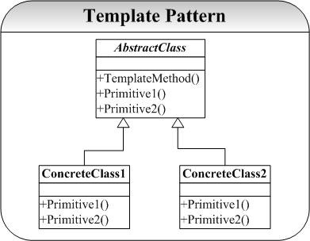

设计流程的变化，以前 -> 现在

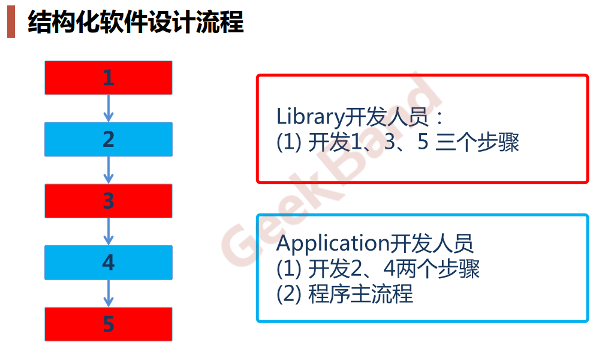

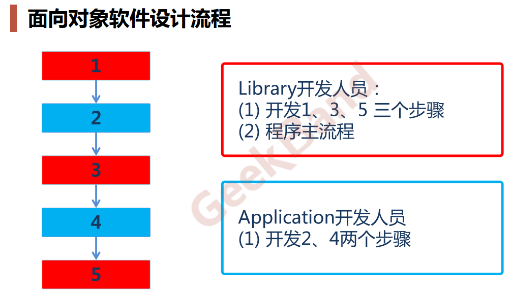


Template 模式实际上就是利用**面向对象中多态的概念**实现算法实现细节和高层接口的松耦合。可以看到 Template 模式采取的是继承方式实现这一点的，由于继承是一种强约束性的条件，因此也给 Template 模式带来一些许多不方便的地方（有关这一点将在总结中展开)。


### 实现


#### Template


```cpp
#ifndef TEMPLATE_HPP_INCLUDED
#define TEMPLATE_HPP_INCLUDED

class AbstractClass
{
public:
    virtual ~AbstractClass(){};	// 基类的虚构函数通常写为虚函数
    void templateMethod();
protected:
    virtual void operation1()=0;	// 将具体的实现让子类来实现，并且将其设置为 protected
    virtual void operation2()=0;
    AbstractClass(){};
};

class SubAbstractClass1: public AbstractClass
{
public:
    SubAbstractClass1(){};
    ~SubAbstractClass1(){};
protected:
    void operation1();
    void operation2();

};

class SubAbstractClass2: public AbstractClass
{
public:
    SubAbstractClass2(){};
    ~SubAbstractClass2(){};
protected:
    void operation1();
    void operation2();

};
#endif // TEMPLATE_HPP_INCLUDED
```


```cpp
#include "Template.hpp"
#include <iostream>
using namespace std;

void AbstractClass::templateMethod()
{
    operation1();
    operation2();
}

void SubAbstractClass1::operation1()
{
    cout<<"SubAbstractClass1::operation1()"<<endl;
}
void SubAbstractClass1::operation2()
{
    cout<<"SubAbstractClass1::operation2()"<<endl;
}


void SubAbstractClass2::operation1()
{
    cout<<"SubAbstractClass2::operation1()"<<endl;
}
void SubAbstractClass2::operation2()
{
    cout<<"SubAbstractClass2::operation2()"<<endl;
}
```


#### main.cpp


```cpp
#include <iostream>
#include "Template.hpp"
using namespace std;

int main()
{
    AbstractClass* p1=new SubAbstractClass1();
    AbstractClass* p2=new SubAbstractClass2();

    p1->templateMethod();
    p2->templateMethod();

    return 0;
}
```


### 总结

- Template 模式是很简单模式，但是也应用很广的模式。如上面的分析和实现中阐明的 Template 是采用继承的方式实现算法的异构。其**关键是将通用算法（逻辑）封装起来，而将算法细节让子类实现（多态）**。唯一注意的是我们将原语操作（细节算法）定义为**保护（Protected）成员，只供模板方法调用（子类可以）**。
- Template 模式获得一种反向控制结构效果，这也是面向对象系统的分析和设计中一个原则 DIP（**依赖倒置：Dependency Inversion Principles**）。其含义就是父类调用子类的操作（高层模块调用低层模块的操作），低层模块实现高层模块声明的接口。这样控制权在父类（高层模块），低层模块反而要依赖高层模块。
- 继承的强制性约束关系也让 Template 模式有不足的地方，我们可以看到对于 ConcreteClass 类中的实现的原语方法 Primitive1()，是**不能被别的类复用**。假设我们要创建一个 AbstractClass 的变体 AnotherAbstractClass，并且两者只是通用算法不一样，其原语操作想复用 AbstractClass 的子类的实现。但是这是不可能实现的，因为 ConcreteClass 继承自 AbstractClass，也就继承了 AbstractClass 的通用算法，AnotherAbstractClass 是复用不了 ConcreteClass 的实现，因为后者不是继承自前者。
- Template 模式暴露的问题也正是继承所固有的问题，Strategy 模式则通过组合（委托）来达到和 Template 模式类似的效果，其代价就是**空间和时间上的代价**，关于 Strategy 模式的详细讨论请参考 Strategy 模式解析。


## 2 Strategy策略模式


### 问题

Strategy 模式和 Template 模式要解决的问题是相同（类似）的，都是为了给业务逻辑（算法）具体实现和抽象接口之间的解耦。Strategy 模式将逻辑（算法）封装到一个类（Context）里面，通过组合的方式将具体算法的实现在组合对象中实现，再通过委托的方式将抽象接口的实现委托给组合对象实现。State 模式也有类似的功能，他们之间的区别将在总结中给出。


### 模式结构图

Strategy 模式典型的结构图为：

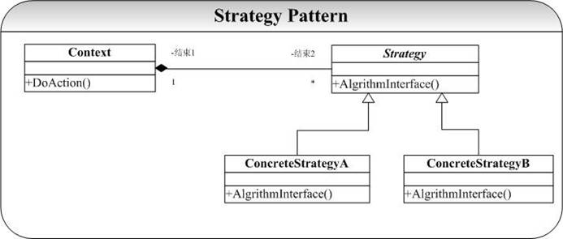


### 实现


#### Strategy


```cpp
#ifndef STRATEGY_HPP_INCLUDED
#define STRATEGY_HPP_INCLUDED

class Strategy
{
public:
    Strategy(){};
    virtual ~Strategy();
    virtual void AlgrithmInterface() = 0;
};

class ConcreteStrategyA: public Strategy
{
public:
    ConcreteStrategyA(){};
    virtual ~ConcreteStrategyA();
    void AlgrithmInterface();
};

class ConcreteStrategyB: public Strategy
{
public:
    ConcreteStrategyB(){};
    virtual ~ConcreteStrategyB();
    void AlgrithmInterface();
};

#endif // STRATEGY_HPP_INCLUDED
```


```cpp
#include "Strategy.hpp"
#include <iostream>
using namespace std;

Strategy::~Strategy()
{
	cout<<"~Strategy....."<<endl;
}

ConcreteStrategyA::~ConcreteStrategyA()
{
	cout<<"~ConcreteStrategyA....."<<endl;
}
void ConcreteStrategyA::AlgrithmInterface()
{
	cout<<"test ConcreteStrategyA....."<<endl;
}


ConcreteStrategyB::~ConcreteStrategyB()
{
	cout<<"~ConcreteStrategyB....."<<endl;
}
void ConcreteStrategyB::AlgrithmInterface()
{
	cout<<"test ConcreteStrategyB....."<<endl;
}
```


#### Context


```cpp
#ifndef CONTEXT_HPP_INCLUDED
#define CONTEXT_HPP_INCLUDED
#include "Strategy.hpp"

/**
*这个类是Strategy模式的关键，也是Strategy模式和Template模式的根本区别所在。
*Strategy通过“组合”（委托）方式实现算法（实现）的异构，而Template模式则采取的是继承的方式
*这两个模式的区别也是继承和组合两种实现接口重用的方式的区别
*/

class Context
{
public:
    Context(Strategy* stg);
    ~Context();
    void doAction();
private:
    Strategy* _stg;
};

#endif // CONTEXT_HPP_INCLUDED
```


```cpp
#include "Context.hpp"

Context::Context(Strategy* stg)
{
    _stg=stg;
}

Context::~Context()
{
    if(!_stg)
        delete _stg;
}

void Context::doAction()
{
    _stg->AlgrithmInterface();
}
```


#### main.cpp


```cpp
#include <iostream>
#include "Context.hpp"
using namespace std;

int main()
{
    Strategy* ps;
    ps = new ConcreteStrategyA();
    Context* pc = new Context(ps);
    pc->doAction();
    if (NULL != pc)
        delete pc;
    return 0;
}
```


### 总结

可以看到 Strategy 模式和 Template 模式解决了类似的问题，也正如在 Template 模式中分析的，**Strategy 模式和 Template 模式实际是实现一个抽象接口的两种方式：继承和组合之间的区别**。要实现一个抽象接口，继承是一种方式：我们将抽象接口声明在基类中，将具体的实现放在具体子类中。组合（委托）是另外一种方式：我们将接口的实现放在被组合对象中，将抽象接口放在组合类中。这两种方式各有优缺点，先列出来：
**继承**：

- 优点
   1. 易于修改和扩展那些被复用的实现。
- 缺点
   1. 破坏了封装性，继承中父类的实现细节暴露给子类了；
   2. “白盒”复用，原因在 1）中；
   3. 当父类的实现更改时，其所有子类将不得不随之改变
   4. 从父类继承而来的实现在运行期间不能改变（编译期间就已经确定了）。


**组合**:

- 优点
   1. “黑盒”复用，因为被包含对象的内部细节对外是不可见的；
   2. 封装性好，原因为 1）；
   3. 实现和抽象的依赖性很小（组合对象和被组合对象之间的依赖性小）；
   4. 可以在运行期间动态定义实现（通过一个指向相同类型的指针，典型的是抽象基类的指针）。
- 缺点
   1. 系统中对象过多。


- 从上面对比中我们可以看出，组合相比继承可以取得更好的效果，因此在面向对象的设计中的有一条很重要的原则就是：**优先使用（对象）组合，而非（类）继承**（Favor Composition Over Inheritance）。
- 实际上，继承是一种强制性很强的方式，因此也使得基类和具体子类之间的耦合性很强。例如在Template 模式中在 ConcreteClass1 中定义的原语操作别的类是不能够直接复用（除非你继承自 AbstractClass，具体分析请参看 Template 模式文档）。而组合（委托）的方式则有很小的耦合性，实现（具体实现）和接口（抽象接口）之间的依赖性很小，例如在本实现中，ConcreteStrategyA 的具体实现操作很容易被别的类复用，例如我们要定义另一个 Context 类 AnotherContext，只要组合一个指向 Strategy 的指针就可以很容易地复用 ConcreteStrategyA 的实现了。
- 我们在 Bridge 模式的问题和 Bridge 模式的分析中，正是说明了继承和组合之间的区别。请参看相应模式解析。另外 Strategy 模式和 State 模式也有相似之处，但是 State 模式注重的对象在不同的状态下不同的操作。两者之间的区别就是 State 模式中具体实现类中有一个指向 Context 的引用，而 Strategy 模式则没有。具体分析请参看相应的 State 模式分析中。


## 3 State状态机模式


### 问题

每个人、事物在不同的状态下会有不同表现（动作），而一个状态又会在不同的表现下转移到下一个不同的状态（State）。 简单的一个生活中的例子就是：地铁入口处，如果你放入正确的地铁票，门就会打开让你通过。在出口处也是验票，如果正确你就可以 ok，否则就不让你通过（如果你动作野蛮，或许会有报警（Alarm）。
**有限状态自动机**（FSM）也是一个典型的状态不同，对输入有不同的响应（状态转移）。通常我们在实现这类系统会使用到很多的 Switch/Case 语句，Case 某种状态，发生什么动作，Case 另外一种状态，则发生另外一种状态。但是这种实现方式至少有以下两个问题：

- 当状态数目不是很多的时候，Switch/Case 可能可以搞定。但是当状态数目很多的时候（实际系统中也正是如此），维护一大组的 Switch/Case 语句将是一件异常困难并且容易出错的事情。
- 状态逻辑和动作实现没有分离。在很多的系统实现中，动作的实现代码直接写在状态的逻辑当中。这带来的后果就是系统的扩展性和维护得不到保证。


### 模式结构图

State 模式就是被用来解决上面列出的两个问题的，在 State 模式中我们**将状态逻辑和动作实现进行分离**。当一个操作中要维护大量的 case 分支语句，并且这些分支依赖于对象的状态。State 模式将每一个分支都封装到独立的类中。State 模式典型的结构图为：

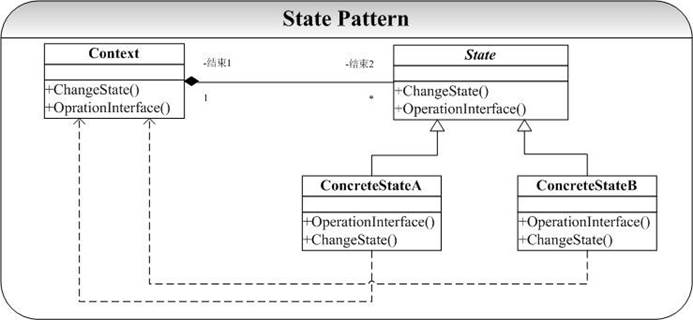


### 实现


#### state


```cpp
//state.h 
#ifndef _STATE_H_ 
#define _STATE_H_

class Context; //前置声明

class State  
{
public: 
 	State();  
 	virtual ~State(); 
  	virtual void OperationInterface(Context* ) = 0; 
 	virtual void OperationChangeState(Context*) = 0; 
protected: 
	bool ChangeState(Context* con,State*  st); 
private: 
  	//bool ChangeState(Context* con,State* st);  
}; 
 
class ConcreteStateA:public State 
{ 
public:  
 	ConcreteStateA(); 
   	virtual ~ConcreteStateA(); 
  	virtual void OperationInterface(Context* ); 
 	virtual void OperationChangeState(Context*);
protected: 
private:  
}; 

class ConcreteStateB:public State 
{
public: 
 	ConcreteStateB();
	virtual ~ConcreteStateB(); 
	virtual void OperationInterface(Context* ); 
 	virtual void OperationChangeState(Context*);
protected: 
private: 
}; 
#endif //~_STATE_H_
```


```cpp
//State.cpp 
#include "State.h" 
#include "Context.h" 
#include <iostream> 
using namespace std; 

State::State() 
{} 

State::~State() 
{} 

void State::OperationInterface(Context* con) 
{ 
 	cout<<"State::.."<<endl; 
}

bool State::ChangeState(Context* con,State* st)
{ 
 	con->ChangeState(st);
	return true; 
} 
void State::OperationChangeState(Context* con)
{ 
}
 
ConcreteStateA::ConcreteStateA() 
{ } 
ConcreteStateA::~ConcreteStateA() 
{ }

void ConcreteStateA::OperationInterface(Context* con) 
{ 
 	cout<<"ConcreteStateA::OperationInterfa ce......"<<endl; 
} 

void ConcreteStateA::OperationChangeState(Contex t* con) 
{ 
 	OperationInterface(con);
	this->ChangeState(con,new ConcreteStateB());  
} 
 
ConcreteStateB::ConcreteStateB() 
{ } 
ConcreteStateB::~ConcreteStateB() 
{ } 

void ConcreteStateB::OperationInterface(Context* con) 
{ 
 	cout<<"ConcreteStateB::OperationInterfa ce......"<<endl; 
}

void ConcreteStateB::OperationChangeState(Contex t* con) 
{ 
 	OperationInterface(con);
	this->ChangeState(con,new ConcreteStateA());  
}
```


#### context


```cpp
//context.h 
#ifndef _CONTEXT_H_
#define _CONTEXT_H_ 
class State; 

class Context 
{
public: 
 	Context(); 
 	Context(State* state);  	
	~Context();
	void OprationInterface();
	void OperationChangState();
protected:
	friend class State; //表明在 State 类中可以访问 Context 类的 private 字段 
 	bool ChangeState(State* state); 
private: 
 	State* _state; 
}; 
#endif //~_CONTEXT_H_
```


```cpp
//context.cpp 
#include "Context.h" 
#include "State.h" 

Context::Context() 
{ 
} 

Context::Context(State* state) 
{  	this->_state = state; 
}
 
Context::~Context() 
{ 
 	delete _state; 
} 

void Context::OprationInterface() 
{ 
 	_state->OperationInterface(this); 
} 

bool Context::ChangeState(State* state) 
{
	this->_state = state;
	return true; 
} 
 
void Context::OperationChangState() 
{ 
 	_state->OperationChangeState(this); 
}
```


#### main.cpp


```cpp
//main.cpp 
#include "Context.h" 
#include "State.h" 
#include <iostream> 
 
using namespace std; 
 
int main(int argc,char* argv[]) 
{ 
 	State* st = new ConcreteStateA(); 
  	Context* con = new Context(st);  	
	con->OprationInterface(); 
 	con->OprationInterface(); 
  	con->OprationInterface();
	if (con != NULL) 
 	 	delete con;
	if (st != NULL) 
 	 	st = NULL; 
 
 	return 0; 
}
```

State 模式在实现中，有两个关键点：

- 将 State 声明为 Context 的友元类（friend class），其作用是让 State 模式访问 Context 的 protected 接口 ChangeSate（）。
- State 及其子类中的操作都将 Context*传入作为参数，其主要目的是 State 类可以通过这个指针调用 Context 中的方法（在本示例代码中没有体现）。这也是 State 模式和 Strategy 模式的最大区别在。


运行了示例代码后可以获得以下的结果：连续 3 次调用了 Context 的 OprationInterface（）因为每次调用后状态都会改变（A－B－A），因此该动作随着 Context 的状态的转变而获得了不同的结果


### 总结

State 模式的应用也非常广泛，从最高层逻辑用户接口 GUI 到最底层的通讯协议（例如 GoF 在《设计模式》中就利用 State 模式模拟实现一个 TCP 连接的类。）都有其用武之地。
State 模式和 Strategy 模式又很大程度上的相似：它们都有一个 Context 类，都是通过委托（组合）给一个具有多个派生类的多态基类实现 Context 的算法逻辑。两者最大的差别就是 **State 模式中派生类持有指向 Context 对象的引用，并通过这个引用调用 Context 中的方法，但在 Strategy 模式中就没有这种情况**。因此可以说一个 State 实例同样是 Strategy 模式的一个实例，反之却不成立。实际上 State 模式和 Strategy 模式的区别还在于它们所关注的点不尽相同：State 模式主要是要适应对象对于状态改变时的不同处理策略的实现，而 Strategy 则主要是具体算法和实现接口的解耦（coupling），Strategy 模式中并没有状态的概念（虽然很多时候有可以被看作是状态的概念），并且更加不关心状态的改变了。
State 模式很好地实现了对象的状态逻辑和动作实现的分离，状态逻辑分布在 State 的派生类中实现，而动作实现则可以放在 Context 类中实现（这也是为什么 State 派生类需要拥有一个指向 Context 的指针）。这使得两者的变化相互独立，改变 State 的状态逻辑可以很容易复用 Context 的动作，也可以在不影响 State 派生类的前提下创建 Context 的子类来更改或替换动作实现。
State 模式问题主要是逻辑分散化，状态逻辑分布到了很多的 State 的子类中，**很难看到整个的状态逻辑图，这也带来了代码的维护问题**。


## 4 Observer观察者模式


### 问题

Observer 模式应该可以说是应用 多、影响 广的模式之一，因为 Observer 的一个实例 Model/View/Control（MVC）结构在系统开发架构设计中有着很重要的地位和意义，MVC 实现了业务逻辑和表示层的解耦。个人也认为 **Observer模式是软件开发过程中必须要掌握和使用的模式之一**。在 MFC 中，Doc/View（文档视图结构）提供了实现 MVC 的框架结构。
在 Java 阵容中，Struts 则提供和 MFC 中 Doc/View 结构类似的实现 MVC 的框架。另外 Java 语言本身就提供了 Observer 模式的实现接口，这将在总结中给出。
当然，**MVC 只是 Observer 模式的一个实例**。Observer 模式要解决的问题为：**建立一个一（Subject）对多（Observer）的依赖关系，并且做到当“一”变化的时候，依赖这个“一” 的多也能够同步改变**。 常见的一个例子就是：对同一组数据进行统计分析时候，我们希望能够提供多种形式的表示（例如以表格进行统计显示、柱状图统计显示、百分比统计显示等）。这些表示都依赖于同一组数据，我们当然需要当数据改变的时候，所有的统计的显示都能够同时改变。Observer 模式就是解决了这一个问题。


### 模式结构图

Observer 模式典型的结构图为：

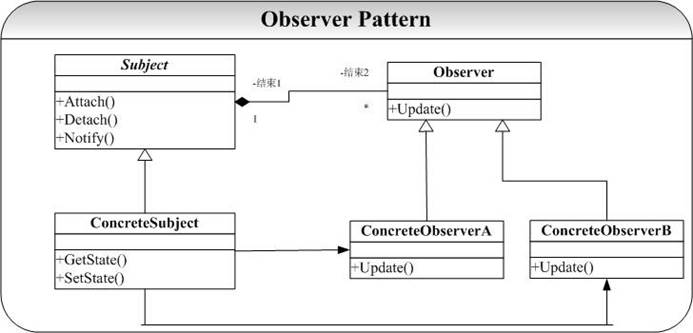
这里的目标 Subject 提供依赖于它的观察者 Observer 的注册（Attach）和注销（Detach）操作，并且提供了使得依赖于它的所有观察者同步的操作（Notify）。观察者 Observer 则提供一个 Update 操作，注意这里的 Observer 的 Update 操作并不在 Observer 改变了 Subject 目标状态的时候就对自己进行更新，这个更新操作要延迟到 Subject 对象发出 Notify 通知所有Observer 进行修改（调用 Update）。


### 实现


#### subject


```cpp
#ifndef SUBJECT_HPP_INCLUDED
#define SUBJECT_HPP_INCLUDED
#include <list>
#include <string>
using namespace std;

typedef string State;

class Observer;
class Subject
{
public:
    virtual ~Subject(){};
    virtual void Attach(Observer* obv);
    virtual void detach(Observer* obv);
    virtual void notify();
    virtual void setState(const State& st);
    virtual State getState();
    Subject();
private:
    list<Observer*>* _obvs;
    State _st;
};

#endif // SUBJECT_HPP_INCLUDED
```


```cpp
#include "Subject.hpp"
#include "Observer.hpp"

Subject::Subject()
{
    _obvs=new list<Observer*>;
    _st='\0';
}

void Subject::Attach(Observer* obv)
{
    _obvs->push_front(obv);
}

void Subject::detach(Observer* obv)
{
    if(obv != 0)
        _obvs->remove(obv);
}

void Subject::notify()
{
    //通知每一个观察者
    list<Observer*>::iterator it=_obvs->begin();
    for(;it != _obvs->end();it++)
        (*it)->update(_st);
}

void Subject::setState(const State& st)
{
    _st=st;
}

State Subject::getState()
{
    return _st;
}
```


#### Observer


```cpp
#include <string>
#include "Subject.hpp"
using namespace std;

class Observer
{
public:
    Observer();
    ~Observer();
    void update(State st);
    void printInfo();
private:
    State _st;
};
```


```cpp
#include "Observer.hpp"
#include <iostream>

Observer::Observer()
{
    _st='\0';
}

Observer::~Observer()
{
}

void Observer::printInfo()
{
    cout<<"Observer......"<<endl;
}

void Observer::update(State st)
{
    _st=st;
    printInfo();
}
```


#### main.cpp


```cpp
#include <iostream>
#include "Subject.hpp"
#include "Observer.hpp"
using namespace std;

int main()
{
    Subject* sub=new Subject();
    Observer* obv=new Observer();
    sub->Attach(obv);//注册观察者
    sub->setState("old");
    sub->notify();//通知观察者
    return 0;
}
```

在 Observer 模式的实现中，Subject 维护一个 list 作为存储其所有观察者的容器。每当 调用Notify操作就遍历list中的Observer对象，并广播通知改变状态（调用Observer的Update操作）。目标的状态 state 可以由 Subject 自己改变（示例），也可以由 Observer 的某个操作引起 state 的改变（可调用 Subject 的 SetState 操作）。Notify 操作可以由 Subject 目标主动广播（示例），也可以由 Observer 观察者来调用（因为 Observer 维护一个指向 Subject 的指针）。运行示例程序，可以看到当 Subject 处于状态“old”时候，依赖于它的两个观察者都显示“old”，当目标状态改变为“new”的时候，依赖于它的两个观察者也都改变为“new”。


### 总结

Observer 是影响极为深远的模式之一，也是在大型系统开发过程中要用到的模式之一。除了 MFC，Struts 提供了 MVC 的实现框架，在 Java 语言中还提供了专门的接口实现 Observer模式：通过专门的类 **Observable** 及 **Observer** 接口来实现 MVC 编程模式，其 UML 图可以表示为：

**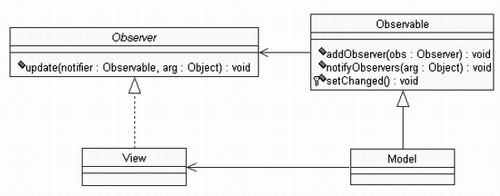
这里的 Observer 就是观察者，Observable 则充当目标 Subject 的角色。
Observer 模式也称为**发布－订阅**（publish-subscribe），目标就是通知的发布者，观察者则是通知的订阅者（接受通知）。


## 5 Memento备忘录模式


### 问题

没有人想犯错误，但是没有人能够不犯错误。犯了错误一般只能改过，却很难改正（恢复）。世界上没有后悔药，但是我们在进行软件系统的设计时候是要给用户后悔的权利（实际上可能也是用户要求的权利），我们对一些关键性的操作肯定需要提供诸如撤销（Undo）的操作。那这个后悔药就是 Memento 模式提供的。


### 模式结构图

Memento 模式的关键就是要**在不破坏封装的前提下，捕获并保存一个类的内部状态，这样就可以利用该保存的状态实施恢复操作**。为了达到这个目标，可以在后面的实现中看到我们采取了一定语言支持的技术。Memento 模式的典型结构图为：

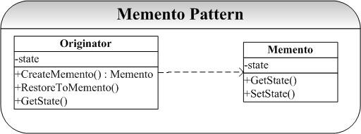


### 实现


#### Memento


```cpp
#ifndef MEMENTO_HPP_INCLUDED
#define MEMENTO_HPP_INCLUDED
#include "Originator.hpp"
#include <string>
using namespace std;

class Memento
{
private:
    string _str;
    //将Originator设置为友元类，可以访问Memento构造函数
    friend class Originator;
    Memento(){};
    Memento(const string& str)
    {
        _str=str;
    };
    ~Memento(){};
    void setState(const string& str)
    {
        _str=str;
    };
    string getState()
    {
        return _str;
    };
};
#endif // MEMENTO_HPP_INCLUDED
```


#### Originator


```cpp
#ifndef ORIGINATOR_HPP_INCLUDED
#define ORIGINATOR_HPP_INCLUDED
#include <string>
#include "Memento.hpp"
using namespace std;

class Originator
{
public:
    Originator();
    Originator(const string& str);
    ~Originator(){};
    Memento* createMemento();
    void restoreToMemento(Memento* mt);
    string getState()
    {
        return _str;
    };
    void setState(const string& str)
    {
        _str=str;
    };
    void printState();
private:
    string _str;
};

#endif // ORIGINATOR_HPP_INCLUDED
```


```cpp
#include "Originator.hpp"
#include <iostream>

Originator::Originator()
{
    _str='\0';
}

Originator::Originator(const string& str)
{
    _str=str;
}

Memento* Originator::createMemento()
{
    return new Memento(_str);
}

void Originator::restoreToMemento(Memento* men)
{
    _str=men->getState();
}

void Originator::printState()
{
    cout<<"now state is "<<_str<<endl;
}
```


#### main.cpp


```cpp
#include <iostream>
#include "Originator.hpp"
#include "Memento.hpp"
using namespace std;

int main()
{
    Originator* o=new Originator();
    //设置状态
    o->setState("old");
    o->printState();
    //设置备忘录
    Memento* men=o->createMemento();

    //设置新状态
    o->setState("new");
    o->printState();

    //恢复状态
    o->restoreToMemento(men);
    o->printState();

    return 0;
}
```


### 总结

Memento 模式的关键就是`friend class Originator;`我们可以看到，Memento 的接口都声明为 private，而将 Originator 声明为 Memento 的友元类。我们将 Originator 的状态保存在Memento 类中，而将 Memento 接口 private 起来，也就达到了封装的功效。
在 Originator 类中我们提供了方法让用户后悔：RestoreToMemento(Memento* mt)；我们可以通过这个接口让用户后悔。在测试程序中，我们演示了这一点：Originator 的状态由 old 变为 new 后又回到了 old。
在 Command 模式中，Memento 模式经常被用来维护可以撤销（Undo）操作的状态。这一点将在 Command 模式具体说明。


## 6 Mediator终结者模式


### 问题

在面向对象系统的设计和开发过程中，对象之间的交互和通信是最为常见的情况，因为**对象间的交互本身就是一种通信**。在系统比较小的时候，可能对象间的通信不是很多、对象也比较少，我们可以直接硬编码到各个对象的方法中。但是当系统规模变大，对象的量变引起系统复杂度的急剧增加，对象间的通信也变得越来越复杂，这时候我们就要**提供一个专门处理对象间交互和通信的类，这个中介者就是 Mediator 模式**。
Mediator 模式提供将对象间的交互和通讯封装在一个类中，各个对象间的通信不必显势去声明和引用，大大降低了系统的复杂性能（了解一个对象总比深入熟悉 n 个对象要好）。另外 Mediator 模式还带来了系统对象间的松耦合，这些将在总结中详细给出。


### 模式结构图

Mediator 模式典型的结构图为：

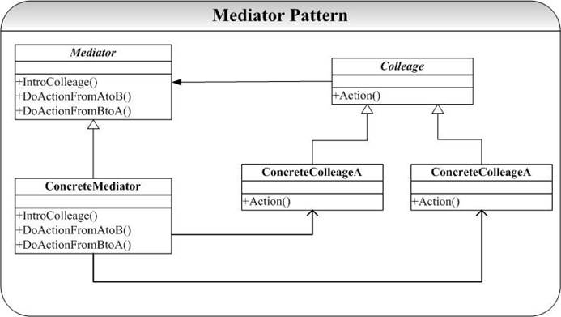
Mediator 模式中，每个 Colleague 维护一个 Mediator，当要进行交互，例如图中ConcreteColleagueA 和 ConcreteColleagueB 之间的交互就可以通过 ConcreteMediator 提供的 DoActionFromAtoB 来处理，ConcreteColleagueA 和 ConcreteColleagueB 不必维护对各自的引用，甚至它们也不知道各个的存在。Mediator 通过这种方式将多对多的通信简化为了一（Mediator）对多（Colleague）的通信。


### 实现


#### Colleage


```cpp
#ifndef COLLEAGE_HPP_INCLUDED
#define COLLEAGE_HPP_INCLUDED
#include <string>
#include <iostream>
using namespace std;

class Mediator;

class Colleage
{
public:
    Colleage(Mediator* md);
    virtual ~Colleage(){};
    virtual void action()=0;
    void setState(const string& str)
    {
        _str=str;
    };
    string getState()
    {
        return _str;
    };
protected:

    string _str;
    Mediator* _md;
};

class SubColleageA: public Colleage
{
public:
    SubColleageA(Mediator* md):Colleage(md){};
    void action();
};

class SubColleageB: public Colleage
{
public:
    SubColleageB(Mediator* md):Colleage(md){};
    void action();
};
#endif // COLLEAGE_HPP_INCLUDED
```


```cpp
#include "Colleage.hpp"
#include "Mediator.hpp"
Colleage::Colleage(Mediator* md)
{
    _md=md;
}

void SubColleageA::action()
{
    _md->doActionFromAtoB();
    cout<<"state of A: "<<getState()<<endl;
}

void SubColleageB::action()
{
    _md->doActionFromBtoA();
    cout<<"state of B: "<<getState()<<endl;
};
```


#### Mediator


```cpp
#ifndef MEDIATOR_HPP_INCLUDED
#define MEDIATOR_HPP_INCLUDED
#include "Colleage.hpp"

class Mediator
{
public:
    Mediator(){};
    ~Mediator(){};
    void doActionFromAtoB();
    void doActionFromBtoA();
    void setColleage(Colleage* a, Colleage* b);
private:
    Colleage* _a;
    Colleage* _b;
};
#endif // MEDIATOR_HPP_INCLUDED
```


```cpp
#include "Mediator.hpp"

void Mediator::doActionFromAtoB()
{
    _b->setState(_a->getState());
}

void Mediator::doActionFromBtoA()
{
    _a->setState(_b->getState());
}
void Mediator::setColleage(Colleage* a, Colleage* b)
{
    _a=a;
    _b=b;
}
```


#### main.cpp


```cpp
#include <iostream>
#include "Mediator.hpp"
#include "Colleage.hpp"

using namespace std;

int main()
{
    Mediator* media=new Mediator();
    Colleage* a=new SubColleageA(media);
    Colleage* b=new SubColleageB(media);
    media->setColleage(a,b);

    a->setState("Old");
    b->setState("new");
    a->action();
    b->action();


    return 0;
}
```


### 总结

Mediator 模式的实现关键就是将对象 Colleague 之间的通信封装到一个类种单独处理，为了模拟Mediator 模式的功能，这里给每个 Colleague 对象一个 string 型别以记录其状态，并通过状态改变来演示对象之间的交互和通信。这里主要就 Mediator 的示例运行结果给出分析：

1. 将 ConcreteColleageA 对象设置状态“old”，ConcreteColleageB 也设置状态“old”；
2. ConcreteColleageA 对象改变状态，并在 Action 中和 ConcreteColleageB 对象进行通信，并改变ConcreteColleageB 对象的状态为“new”；
3. ConcreteColleageB 对象改变状态，并在 Action 中和 ConcreteColleageA 对象进行通信，并改变ConcreteColleageA 对象的状态为“new”；


注意到，**两个 Colleague 对象并不知道它交互的对象，并且也不是显示地处理交互过程，这一切都是通过 Mediator 对象完成的**，示例程序运行的结果也正是证明了这一点。
Mediator 模式是一种很有用并且很常用的模式，它通过将对象间的通信封装到一个类中，将多对多的通信转化为一对多的通信，降低了系统的复杂性。Mediator 还获得系统解耦的特性，通过 Mediator，各个 Colleague 就不必维护各自通信的对象和通信协议，降低了系统的耦合性，Mediator 和各个 Colleague 就可以相互独立地修改了。
Mediator 模式还有一个很显著额特点就是将控制集中，集中的优点就是便于管理，也正式符合了 OO 设计中的每个类的职责要单一和集中的原则。


## 7 Command命令模式


### 问题

Command 模式通过**将请求封装到一个对象（Command）中**，并**将请求的接受者存放到具体的ConcreteCommand 类中（Receiver）中**，从而实现调用操作的对象和操作的具体实现者之间的解耦。


### 模式结构图

Command 模式的典型结构图为：

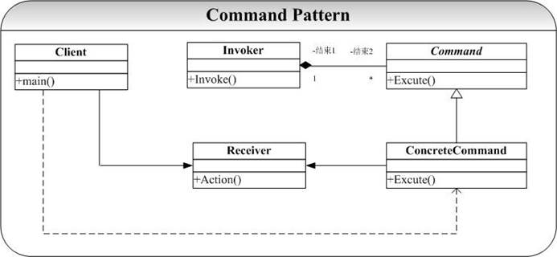


### 实现


#### receiver


```cpp
#ifndef RECEIVER_HPP_INCLUDED
#define RECEIVER_HPP_INCLUDED
#include <iostream>
using namespace std;

class Receiver
{
public:
    Receiver(){};
    ~Receiver(){};
    void action()
    {
        cout<<"received the action..."<<endl;
    };
};
#endif // RECEIVER_HPP_INCLUDED
```


#### command


```cpp
#ifndef COMMAND_HPP_INCLUDED
#define COMMAND_HPP_INCLUDED

class Receiver;
typedef void (Receiver::* Action)();//定义函数指针

class Command
{
public:
    Command(Receiver* r)
    {
        _r=r;
    };
    Command(Receiver* r, Action act)
    {
        _r=r;
        _act=act;
    }
    ~Command()
    {
        if(_r)
            delete _r;
    };
    void execute()
    {
        _r->action();//第一种通知方式，调用接受者函数处理该消息
    };

    void execute2()
    {
        //第二种方式，调用callback方法处理
        (_r->*_act)();
    };
private:
    Receiver* _r;
    Action _act;
};

#endif // COMMAND_HPP_INCLUDED
```


#### main.cpp


```cpp
#include <iostream>
#include "Receiver.hpp"
#include "Command.hpp"
using namespace std;

int main()
{
    Receiver* r=new Receiver();
    Command* cmd=new Command(r);
    cmd->execute();

    Command* cmd2=new Command(r,&Receiver::action);
    cmd2->execute2();
    return 0;
}
```


### 总结

Command 模式在实现的实现和思想都很简单，其关键就是**将一个请求封装到一个类中（Command），再提供处理对象（Receiver）， 后 Command 命令由 Invoker 激活**。另外，我们可以将请求接收者的处理抽象出来作为参数传给 Command 对象，实际也就是回调的机制（Callback）来实现这一点，也就是说将处理操作方法地址（在对象内部）通过参数传递给 Command 对象，Command 对象在适当的时候（Invoke 激活的时候）再调用该函数。
Command 模式也十分常见，并且威力不小。实际上，Command 模式关键就是提供一个抽象的Command 类，并将执行操作封装到 Command 类接口中，Command 类中一般就是只是一些接口的集合，并不包含任何的数据属性（当然在示例代码中，我们的 Command 类有一个处理操作的 Receiver 类的引用，但是其作用也仅仅就是为了实现这个 Command 的 Excute 接口）。这种方式在是纯正的面向对象设计者 为鄙视的设计方式，就像 OO 设计新手做系统设计的时候，仅仅将 Class 作为一个关键字，将C 种的全局函数找一个类封装起来就以为是完成了面向对象的设计。
但是世界上的事情不是绝对的，上面提到的方式在 OO 设计种绝大部分的时候可能是一个不成熟的体现，但是在 Command 模式中却是起到了很好的效果。主要体现在：

- Command 模式将调用操作的对象和知道如何实现该操作的对象解耦。在上面 Command 的结构图中，Invoker 对象根本就不知道具体的是那个对象在处理 Excute操作（当然要知道是 Command 类别的对象，也仅此而已）。
- 在Command 要增加新的处理操作对象很容易，我们可以通过创建新的继承自Command 的子类来实现这一点。
- Command 模式可以和 Memento 模式结合起来，支持取消的操作。


## 8 Visitor访问者模式


### 问题

在面向对象系统的开发和设计过程，经常会遇到一种情况就是需求变更（Requirement Changing），经常我们做好的一个设计、实现了一个系统原型，咱们的客户又会有了新的需求。我们又因此不得不去修改已有的设计， 常见就是解决方案就是给**已经设计、实现好的类添加新的方法去实现客户新的需求**，这样就陷入了设计变更的梦魇：不停地打补丁，其带来的后果就是设计根本就不可能封闭、编译永远都是整个系统代码。
Visitor 模式则提供了一种解决方案：**将更新（变更）封装到一个类中（访问操作），并由待更改类提供一个接收接口**，则可达到效果。


### 模式结构图

Visitor 模式典型的结构图为：

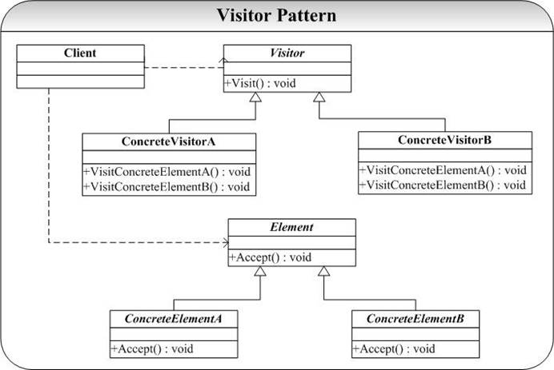
Visitor 模式在不破坏类的前提下，为类提供增加新的新操作。Visitor 模式的关键是**双分派**（Double-Dispatch）的技术（双分派意味着执行的操作将取决于请求的种类和接收者的类型）。C++语言支持的是**单分派**。
在 Visitor 模式中 Accept（）操作是一个双分派的操作。具体调用哪一个具体的 Accept（）操作，有两个决定因素：

- Element 的类型。因为 Accept（）是多态的操作，需要具体的 Element 类型的子类才可以决定到底调用哪一个 Accept（）实现；
- Visitor 的类型。Accept（）操作有一个参数（Visitor* vis），要决定了实际传进来的 Visitor 的实际类别才可以决定具体是调用哪个 VisitConcrete（）实现。


### 实现


#### visitor


```cpp
#ifndef VISITOR_HPP_INCLUDED
#define VISITOR_HPP_INCLUDED

class ConcreteElementA;
class ConcreteElementB;
class Element;

class Visitor
{
public:
    ~Visitor(){};
    virtual void visitElementA(Element*)=0;
    virtual void visitElementB(Element*)=0;
protected:
    Visitor(){};
};

class SubVisitorA:public Visitor
{
public:
    SubVisitorA(){};
    ~SubVisitorA(){};
    void visitElementA(Element*);
    void visitElementB(Element*);
};

class SubVisitorB:public Visitor
{
public:
    SubVisitorB(){};
    ~SubVisitorB(){};
    void visitElementA(Element*);
    void visitElementB(Element*);
};
#endif // VISITOR_HPP_INCLUDED
```


```cpp
#include "Element.hpp"
#include "Visitor.hpp"
#include <iostream>
using namespace std;

void SubVisitorA::visitElementA(Element* ele)
{
    cout<<"SubVisitorA I will visit Element A..."<<endl;
}
void SubVisitorA::visitElementB(Element* ele)
{
    cout<<"SubVisitorA I will visit Element B..."<<endl;
}

void SubVisitorB::visitElementA(Element* ele)
{
    cout<<"SubVisitorB I will visit Element A..."<<endl;
}
void SubVisitorB::visitElementB(Element* ele)
{
    cout<<"SubVisitorB I will visit Element B..."<<endl;
}
```


#### element


```cpp
#ifndef ELEMENT_HPP_INCLUDED
#define ELEMENT_HPP_INCLUDED

class Visitor;

class Element
{
public:
    virtual ~Element(){};
    virtual void accpet(Visitor* vis)=0;
protected:
    Element(){};
};

class ConcreteElementA:public Element
{
public:
    ConcreteElementA(){};
    ~ConcreteElementA(){};
    void accpet(Visitor* vis);
};

class ConcreteElementB:public Element
{
public:
    ConcreteElementB(){};
    ~ConcreteElementB(){};
    void accpet(Visitor* vis);
};
#endif // ELEMENT_HPP_INCLUDED
```


```cpp
#include "Element.hpp"
#include "Visitor.hpp"
#include <iostream>
using namespace std;

void ConcreteElementA::accpet(Visitor* vis)
{
    vis->visitElementA(this);
    cout<<"visiting element A..."<<endl;
}

void ConcreteElementB::accpet(Visitor* vis)
{
    vis->visitElementB(this);
    cout<<"visiting element B..."<<endl;
}
```


#### main.cpp


```cpp
#include <iostream>
#include "Element.hpp"
#include "Visitor.hpp"
using namespace std;

int main()
{
    Visitor* v=new SubVisitorA();
    Element* e=new ConcreteElementA();
    e->accpet(v);
    return 0;
}
```


### 总结

Visitor 模式的实现过程中有以下的地方要注意： Visitor 类中的 Visit（）操作的实现。

- 这里我们可以向 Element 类仅仅提供一个接口 Visit（），而在 Accept（）实现中具体调用哪一个 Visit（）操作则通过**函数重载**（overload）的方式实现：我们提供 Visit （）的两个重载版本
   - Visit（ConcreteElementA* elmA）
   - Visit（ConcreteElementB* elmB）。
- C++中我们还可以通过 RTTI（**运行时类型识别**：Runtime type identification）来实现，即我们只提供一个 Visit（）函数体，传入的参数为 Element*型别参数 ，然后用 RTTI 决定具体是哪一类的 ConcreteElement 参数，再决定具体要对哪个具体类施加什么样的具体操作。（RTTI 给接口带来了简单一致性，但是付出的代价是时间（RTTI 的实现）和代码的 Hard 编码（要进行强制转换））。


有时候我们需要为 Element 提供更多的修改，这样我们就可以通过为 Element 提供一系列的 Visitor 模式可以使得 Element 在不修改自己的同时增加新的操作，但是这也带来了至少以下的两个显著问题：

- **破坏了封装性**。Visitor 模式要求 Visitor 可以从外部修改 Element 对象的状态，这一般通过两个方式来实现，但是无论那种情况，特别是后者都将是破坏了封装性原则（实际上就是 C++的 friend 机制得到了很多的面向对象专家的诟病）：
   - Element 提供足够的 public 接口，使得 Visitor 可以通过调用这些接口达到修改 Element 状态的目的
   - Element 暴露更多的细节给 Visitor，或者让 Element 提供 public 的实现给 Visitor（当然也给了系统中其他的对象），或者将 Visitor 声明为 Element 的 friend 类，仅将细节暴露给Visitor。
- ConcreteElement 的**扩展很困难**：每增加一个 Element 的子类，就要修改 Visitor 的接口，使得可以提供给这个新增加的子类的访问机制。从上面我们可以看到，或者增加一个用于处理新增类的Visit（）接口，或者重载一个处理新增类的 Visit（）操作，或者要修改 RTTI 方式实现的 Visit（）实现。无论那种方式都给扩展新的 Element 子类带来了困难。


## 9 Chain of Responsibility责任链模式


### 问题

熟悉 VC/MFC 的都知道，VC 是“基于消息，事件驱动”，消息在 VC 开发中起着举足轻重的作用。在 MFC 中，消息是通过一个向上递交的方式进行处理，例如一个WM_COMMAND 消息的处理流程可能为：

1. MDI 主窗口（CMDIFrameWnd）收到命令消息 WM_COMMAND，其 ID 位 ID_×××；
2. MDI 主窗口将消息传给当前活动的 MDI 子窗口（CMDIChildWnd）；
3. MDI 子窗口给自己的子窗口（View）一个处理机会，将消息交给 View；
4. View 检查自己 Message Map；
5. 如果 View 没有发现处理该消息的程序，则将该消息传给其对应的 Document 对象；否则 View 处理，消息流程结束。
6. Document 检查自己 Message Map，如果没有该消息的处理程序，则将该消息传给其对象的 DocumentTemplate 处理；否则自己处理，消息流程结束；
7. 如果在6中消息没有得到处理，则将消息返回给 View；
8. view 再传回给 MDI 子窗口；
9. MDI 子窗口将该消息传给 CwinApp 对象，CwinApp 为所有无主的消息提供了处理。


MFC 提供了**消息的处理的链式处理策略**，处理消息的请求将沿着预先定义好的路径依次进行处理。消息的发送者并不知道该消息最后是由那个具体对象处理的，当然它也无须也不想知道，但是结构是该消息被某个对象处理了，或者一直到一个终极的对象进行处理了。
Chain of Responsibility 模式描述其实就是这样一类问题**将可能处理一个请求的对象链接成一个链，并将请求在这个链上传递，直到有对象处理该请求**（可能需要提供一个默认处理所有请求的类，例如 MFC 中的 CwinApp 类）


### 模式结构图

Chain of Responsibility 模式典型的结构图为：

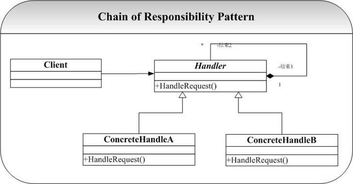
Chain of Responsibility 模式中 ConcreteHandler 将自己的后继对象（向下传递消息的对象）记录在自己的后继表中，当一个请求到来时，ConcreteHandler 会先检查看自己有没有匹配的处理程序，如果有就自己处理，否则传递给它的后继。当然这里示例程序中为了简化，ConcreteHandler 只是简单的检查看自己有没有后继，有的话将请求传递给后继进行处理，没有的话就自己处理。


### 实现


#### handle


```cpp
#ifndef HANDLE_HPP_INCLUDED
#define HANDLE_HPP_INCLUDED

class Handle
{
public:
    virtual ~Handle()
    {
        delete _succ;
    };
    virtual void handleRequest()=0;
    void setSuccessor(Handle* succ)
    {
        _succ=succ;
    };
    Handle* getSuccessor()
    {
        return _succ;
    };
protected:
    Handle()
    {
        _succ=0;
    };
    Handle(Handle* succ)
    {
        _succ=succ;
    };
private:
    Handle* _succ;
};

class ConcreteHandleA:public Handle
{
public:
    ConcreteHandleA(){};
    ~ConcreteHandleA(){};
    ConcreteHandleA(Handle* succ):Handle(succ){};
    void handleRequest();
};

class ConcreteHandleB:public Handle
{
public:
    ConcreteHandleB(){};
    ~ConcreteHandleB(){};
    ConcreteHandleB(Handle* succ):Handle(succ){};
    void handleRequest();
};

#endif // HANDLE_HPP_INCLUDED
```


```cpp
#include "Handle.hpp"
#include <iostream>
using namespace std;

void ConcreteHandleA::handleRequest()
{
    if(getSuccessor() != 0)
    {
        cout<<"ConcreteHandleA,将操作传递给后继对象处理..."<<endl;
        getSuccessor()->handleRequest();
    }
    else
    {
        cout<<"ConcreteHandleA,没有后继对象处理，自己处理..."<<endl;
    }
}

void ConcreteHandleB::handleRequest()
{
    if(getSuccessor() != 0)
    {
        cout<<"ConcreteHandleB 将操作传递给后继对象处理..."<<endl;
        getSuccessor()->handleRequest();
    }
    else
    {
        cout<<"ConcreteHandleB 没有后继对象处理，自己处理..."<<endl;
    }
}
```


#### main.cpp


```cpp
#include <iostream>
#include "Handle.hpp"
using namespace std;

int main()
{
    Handle* h1=new ConcreteHandleA();
    Handle* h2=new ConcreteHandleB();
    //设置h1的后继对象为h2
    h1->setSuccessor(h2);

    h1->handleRequest();
    return 0;
}
```


### 总结

Chain of Responsibility 模式的示例代码实现很简单，这里就其测试结果给出说明： ConcreteHandleA 的对象和 h1 拥有一个后继 ConcreteHandleB 的对象 h2,当一个请求到来时候，h1 检查看自己有后继，于是 h1 直接将请求传递给其后继 h2 进行处理，h2 因为没有后继，当请求到来时候，就只有自己提供响应了。于是程序的输出为：

1. ConcreteHandleA 我把处理权给后继节点.....；
2. ConcreteHandleB 没有后继了，我必须自己处理....


Chain of Responsibility 模式的最大的一个有点就是给系统降低了耦合性，请求的发送者完全不必知道该请求会被哪个应答对象处理，极大地降低了系统的耦合性


## 10 Iterator迭代器模式


### 问题

Iterator 模式应该是最为熟悉的模式了， 简单的证明就是在实现 Composite 模式、 Flyweight 模式、Observer 模式中就直接用到了 STL 提供的 Iterator 来遍历 Vector 或者 List 数据结构。
Iterator 模式也正是用来解决对**一个聚合对象的遍历问题**，将对聚合的遍历封装到一个类中进行，这样就避免了暴露这个聚合对象的内部表示的可能。


### 模式结构图

Iterator 模式典型的结构图为：

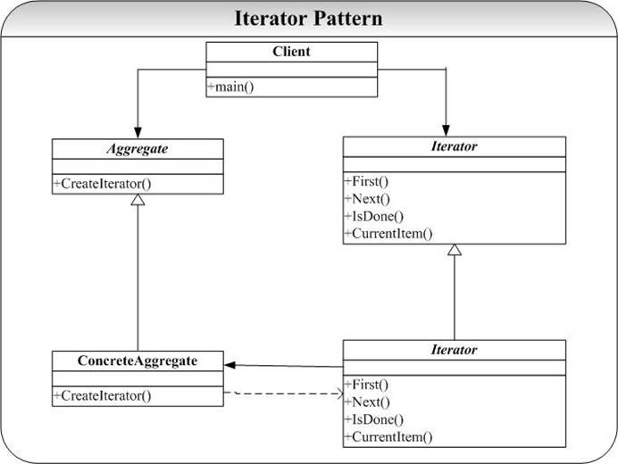
Iterator 模式中定义的对外接口可以视客户成员的便捷定义，但是基本的接口在图中的Iterator 中已经给出了（参考 STL 的 Iterator 就知道了）


### 实现


#### collection


```cpp
#ifndef COLLECTION_HPP_INCLUDED
#define COLLECTION_HPP_INCLUDED

const int SIZE=3;
class Iterator;

class Collection
{
public:
    Collection();
    ~Collection(){};
    Iterator* createIterator();

private:
    friend class Iterator;
    int lst[SIZE];
    int getItem(int index);
};

#endif // COLLECTION_HPP_INCLUDED
```


```cpp
#include "Collection.hpp"
#include "Iterator.hpp"

Collection::Collection()
{
    for(int i=0;i<SIZE; i++)
        lst[i]=i;
}

Iterator* Collection::createIterator()
{
    return new Iterator(this);
}

int Collection::getItem(int index)
{
    if(index < SIZE)
        return lst[index];
    else
        return -1;
}
```


#### iterator


```cpp
#ifndef ITERATOR_HPP_INCLUDED
#define ITERATOR_HPP_INCLUDED

class Collection;

class Iterator
{
public:
    Iterator(){};
    Iterator(Collection* c, int idx=0);
    void first();
    void next();
    bool isDone();
    int currentItem();
private:
    Collection* _c;
    int _idx;
};

#endif // ITERATOR_HPP_INCLUDED
```


```cpp
#include "Collection.hpp"
#include "Iterator.hpp"

Iterator::Iterator(Collection* c, int idx)
{
    _c=c;
    _idx=idx;
}

void Iterator::first()
{
    _idx=0;
}

void Iterator::next()
{
    if(_idx < SIZE)
        _idx++;
}

bool Iterator::isDone()
{
    return (_idx == SIZE);
}

int Iterator::currentItem()
{
    return _c->getItem(_idx);
}
```


#### main.cpp


```cpp
#include <iostream>
#include "Collection.hpp"
#include "Iterator.hpp"
using namespace std;

int main()
{
    Collection* c=new Collection();
    Iterator* I=c->createIterator();

    for(;!(I->isDone());I->next())
    {
        cout<<I->currentItem()<<endl;
    }
    return 0;
}
```


### 总结

Iterator 模式的应用很常见，我们在开发中就经常会用到 STL 中预定义好的 Iterator 来对STL 类进行遍历（Vector、Set 等）


## 11 Interpreter解释器模式


### 问题

一些应用提供了内建（Build-In）的脚本或者宏语言来让用户可以定义他们能够在系统中进行的操作。Interpreter 模式的目的就是**使用一个解释器为用户提供一个一门定义语言的语法表示的解释器，然后通过这个解释器来解释语言中的句子**


### 模式结构图

Interpreter 模式典型的结构图为：

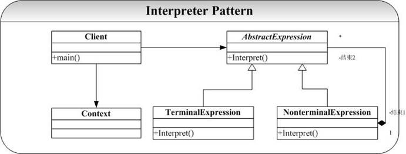
Interpreter 模式中，提供了 TerminalExpression 和 NonterminalExpression 两种表达式的解释方式，Context 类用于为解释过程提供一些附加的信息（例如全局的信息）


### 实现


#### context


```cpp
class Context
{
public:
    Context() {};
    ~Context() {};
};
```


#### interpreter


```cpp
#ifndef INTERPRETER_HPP_INCLUDED
#define INTERPRETER_HPP_INCLUDED
#include <string>
using namespace std;
class AbstractExpression
{
public:
    virtual ~AbstractExpression();
    virtual void Interpret(const Context& c);
protected:
    AbstractExpression();
private:
};
class TerminalExpression:public AbstractExpression
{
public:
    TerminalExpression(const string& statement);
    ~ TerminalExpression();
    void Interpret(const Context& c);
protected:
private:
    string _statement;
};
class NonterminalExpression:public AbstractExpression
{
public:
    NonterminalExpression(AbstractExpression* expression,int times);
    ~ NonterminalExpression();
    void Interpret(const Context& c);
protected:
private:
    AbstractExpression* _expression;
    int _times;
};


#endif // INTERPRETER_HPP_INCLUDED
```


```cpp
#include "Interpreter.hpp"
#include <iostream>
using namespace std;
AbstractExpression::AbstractExpression()
{
}
AbstractExpression::~AbstractExpression()
{
}
void AbstractExpression::Interpret(const Context& c)
{
}
TerminalExpression::TerminalExpression(const string& statement)
{
    this->_statement = statement;
}
TerminalExpression::~TerminalExpression()
{
}
void TerminalExpression::Interpret(const Context& c)
{
    cout<<this->_statement<<" TerminalExpression"<<endl;
}
NonterminalExpression::NonterminalExpression(AbstractExpression* expression,int times)
{
    this->_expression = expression;
    this->_times = times;
}
NonterminalExpression::~NonterminalExpression()
{
}
void NonterminalExpression::Interpret(const Context& c)
{
    for (int i = 0; i < _times ; i++)
    {
        this->_expression->Interpret(c);
    }
}
```


#### main.cpp


```cpp
#include "Interpreter.hpp"
#include "Context.hpp"
#include <iostream>
using namespace std;

int main(int argc,char* argv[])
{
    Context* c = new Context();
    AbstractExpression* te = new TerminalExpression("hello");
    AbstractExpression* nte = new NonterminalExpression(te,2);
    nte->Interpret(*c);
    return 0;
}
```

Interpreter 模式的示例代码很简单，只是为了说明模式的组织和使用，实际的解释Interpret 逻辑没有实际提供。


### 总结

XML 格式的数据解析是一个在应用开发中很常见并且有时候是很难处理的事情，虽然目前很多的开发平台、语言都提供了对 XML 格式数据的解析，但是例如到了移动终端设备上，由于处理速度、计算能力、存储容量的原因解析 XML 格式的数据却是很复杂的一件事情，最近也提出了很多的移动设备的 XML 格式解析器，但是总体上在项目开发时候还是需要自己去设计和实现这一个过程（痛苦经历）。
Interpreter 模式则提供了一种很好的组织和设计这种解析器的架构。
Interpreter 模式中使用类来表示文法规则，因此可以很容易实现文法的扩展。另外对于终结符我们可以使用 Flyweight 模式来实现终结符的共享。
