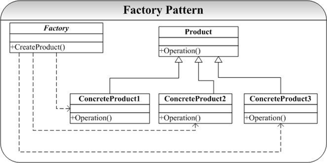
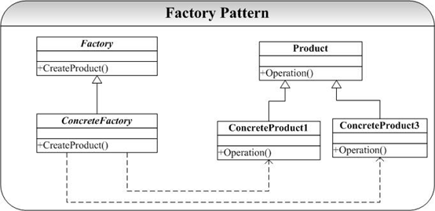
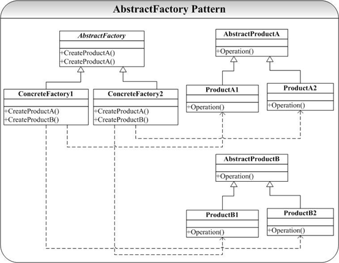
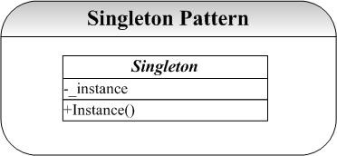
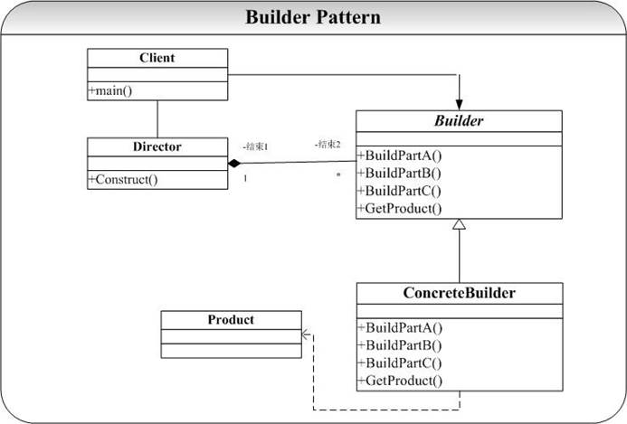
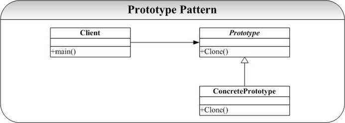

## 1 Factory工厂模式

### 模式定义

定义一个用于创建对象的接口，让子类决定实例化哪一个类。Factory Method使得一个类的实例化延迟（目的：解耦，手段：虚函数）到子类。

​																																																											——《设计模式》GoF

### 问题

在面向对象系统设计中经常可以遇到以下的两类问题：

1. 为了提高内聚（Cohesion）和松耦合（Coupling），我们经常会抽象出一些类的公共接口以形成抽象基类或者接口。这样我们可以通过声明一个指向基类的指针来指向实际的子类实现，达到了多态的目的。这里很容易出现的一个问题 n 多的子类继承自抽象基类，我们不得不在每次要用到子类的地方就编写诸如 new ×××;的代码。这里带来两个问题
   1. 客户程序员必须知道实际子类的名称（当系统复杂后，命名将是一个很不好处理的问题，为了处理可能的名字冲突，有的命名可能并不是具有很好的可读性和可记忆性，就姑且不论不同程序员千奇百怪的个人偏好了）。
   2. 程序的扩展性和维护变得越来越困难。
2. 还有一种情况就是在父类中并不知道具体要实例化哪一个具体的子类。这里的意思为：假设我们在类 A 中要使用到类 B，B 是一个抽象父类，在 A 中并不知道具体要实例化哪一个 B 的子类，但是在类 A 的子类 D 中是可以知道的。在 A 中我们没有办法直接使用类似于 new ×××的语句，因为根本就不知道×××是什么。


以上两个问题也就引出了 Factory 模式的两个 重要的功能：

- ==定义创建对象的接口，封装了对象的创建==
- ==使得具体化类的工作延迟到了子类中。==


### 模式结构图

我们通常使用 Factory 模式来解决上面给出的两个问题。在第一个问题中，我们经常就是声明一个创建对象的接口，并封装了对象的创建过程。Factory 这里类似于一个真正意义上的工厂（生产对象）。在第二个问题中，我们需要提供一个对象创建对象的接口，并在子类中提供其具体实现（因为只有在子类中可以决定到底实例化哪一个类）。
第一中情况的 Factory 的结构示意图为：



图 1 所示的 Factory 模式经常在系统开发中用到，但是这并不是 Factory 模式的最大威力所在（因为这可以通过其他方式解决这个问题）。Factory 模式不单是提供了创建对象的接口，其最重要的是延迟了子类的实例化（第二个问题），以下是这种情况的一个 Factory 的结构示意图：



图 2 中关键中 Factory 模式的应用并不是只是为了封装对象的创建，而是要把对象的创建放到子类中实现：Factory 中只是提供了对象创建的接口，其实现将放在 Factory 的子类`ConcreteFactory` 中进行。这是图 2 和图 1 的区别所在。


### 实现

#### Product


```cpp
#ifndef PRODUCT_HPP_INCLUDED
#define PRODUCT_HPP_INCLUDED

class Product
{
public:
	virtual ~Product()=0;
protected:
	Product();
};

//子类定义
class SubProduct: public Product
{
public:
	SubProduct();
	~SubProduct();
};

#endif // PRODUCT_HPP_INCLUDED
```


```cpp
//产品的cpp文件类 Product.cpp
#include "Product.h"
#include <iostream>
using namespace std;

Product::Product()
{
	//TODO
}

Product::~Product()
{
	//TODO
}

SubProduct::SubProduct()
{
	cout<<"SubProduct create function..."<<endl;
}

SubProduct::~SubProduct()
{
	//TODO
}
```


#### Factory


```cpp
#ifndef FACTORY_HPP_INCLUDED
#define FACTORY_HPP_INCLUDED

class Product; //引用一个产品类

class Factory
{
public:
    ~Factory();
    virtual Product* createProduct()=0;

protected:
    Factory();
};

class SubFactory: public Factory
{
public:
    SubFactory();
    ~SubFactory();
    Product* createProduct();
};

#endif // FACTORY_HPP_INCLUDED
```


```cpp
//产品工厂的cpp文件,Factory.cpp
#include "Factory.h"
#include "Product.h"
#include <iostream>
using namespace std;

Factory::Factory()
{
	//TODO
}

Factory::~Factory()
{
	//TODO
}

SubFactory::SubFactory()
{
	cout<<"SubFactory create function..."<<endl;
}

SubFactory::~SubFactory()
{

}

Product* SubFactory::createProduct()
{
	return new SubProduct();
}
```


#### main.cpp


```cpp
//程序入口，main.cpp
#include "Factory.h"
#include "Product.h"
#include <iostream>
using namespace std;

int main()
{
	//创建子工厂类
	Factory* factory = new SubFactory();
	//生产子产品
	Product* product = factory->createProduct();

	return 0;
}
```


### 总结

示例代码中给出的是 Factory 模式解决父类中并不知道具体要实例化哪一个具体的子类的问题，至于为创建对象提供接口问题，可以由 Factory 中附加相应的创建操作例如`CreateProduct`（）即可。
Factory 模式在实际开发中应用非常广泛，面向对象的系统经常面临着对象创建问题：要创建的类实在是太多了。而 Factory 提供的创建对象的接口封装（第一个功能），以及其将类的实例化推迟到子类（第二个功能）都部分地解决了实际问题。
Factory 模式也带来至少以下两个问题：

1. 如果为每一个具体的 `ConcreteProduct` 类的实例化提供一个函数体，那么我们可能不得不在系统中添加了一个方法来处理这个新建的 `ConcreteProduct`，这样 Factory 的接口永远就不可能封闭（Close）。当然我们可以通过创建一个 Factory 的子类来通过多态实现这一点，但是这也是以新建一个类作为代价的。
2. 在实现中我们可以通过参数化工厂方法，即==给 `FactoryMethod`（）传递一个参数用以决定是创建具体哪一个具体的 Product==。当然也可以通过模板化避免 1）中的子类创建子类，其方法就是将具体 Product 类作为模板参数，实现起来也很简单。

可以看出，Factory 模式对于对象的创建给予开发人员提供了很好的实现策略，但是 Factory 模式仅仅局限于一类类（就是说 Product 是一类，有一个共同的基类），如果我们要为不同类的类提供一个对象创建的接口，那就要用 `AbstractFactory` 了。


-   Factory Method模式用于隔离类对象的使用者和具体类型之间的耦合关系。面对一个经常变化的具体类型，紧耦合关系（new）会导致软件的脆弱。
-   Factory Method模式通过面向对象的手法，将所要创建的具体对象工作延迟到子类，从而实现一种扩展（而非更改）的策略，较好地解决了这种紧耦合关系。
-   Factory Method模式解决“单个对象”的需求变化。缺点在于要求创建方法/参数相同。


## 2 AbstractFactory抽象工厂模式


### 问题

假设我们要开发一款游戏，当然为了吸引更多的人玩，游戏难度不能太大（让大家都没有信心了，估计游戏也就没有前途了），但是也不能太简单（没有挑战性也不符合玩家的心理）。于是我们就可以采用这样一种处理策略：为游戏设立等级，初级、中级、高级甚至有`BT` 级。假设也是过关的游戏，每个关卡都有一些怪物（monster）守着，玩家要把这些怪物干掉才可以过关。作为开发者，我们就不得不创建怪物的类，然后初级怪物、中级怪物等都继承自怪物类（当然不同种类的则需要另创建类，但是模式相同）。在每个关卡，我们都要创建怪物的实例，例如初级就创建初级怪物（有很多种类）、中级创建中级怪物等。可以想象在这个系统中，将会有成千上万的怪物实例要创建，问题是还要保证创建的时候不会出错：初级不能创建 `BT` 级的怪物（玩家就郁闷了，玩家一郁闷，游戏也就挂挂了），反之也不可以。
`AbstractFactory` 模式就是用来解决这类问题的：**要创建一组相关或者相互依赖的对象**。


### 模式结构图

`AbstractFactory` 模式典型的结构图为：


`AbstractFactory` 模式关键就是将这一组对象的创建封装到一个用于创建对象的类（`ConcreteFactory`)中，维护这样一个创建类总比维护 n 多相关对象的创建过程要简单的多。


### 实现


#### Product.h


```cpp
#ifndef ABSTRACTPRODUCT_HPP_INCLUDED
#define ABSTRACTPRODUCT_HPP_INCLUDED

class AbstractProductA
{
public:
    virtual ~AbstractProductA();
protected:
    AbstractProductA();
};

class AbstractProductB
{
public:
    virtual ~AbstractProductB();
protected:
    AbstractProductB();
};

class ProductA1:public AbstractProductA
{
public:
    ProductA1();
    ~ProductA1();
};

class ProductA2:public AbstractProductA
{
public:
    ProductA2();
    ~ProductA2();
};

class ProductB1:public AbstractProductB
{
public:
    ProductB1();
    ~ProductB1();
};

class ProductB2:public AbstractProductB
{
public:
    ProductB2();
    ~ProductB2();
};
#endif // ABSTRACTPRODUCT_HPP_INCLUDED
```


```cpp
#include "Product.hpp"
#include <iostream>
using namespace std;

AbstractProductA::AbstractProductA()
{

}
AbstractProductA::~AbstractProductA()
{

}

AbstractProductB::AbstractProductB()
{

}
AbstractProductB::~AbstractProductB()
{

}

ProductA1::ProductA1()
{
    cout<<"ProductA1 ....."<<endl;
}
ProductA1::~ProductA1()
{

}

ProductA2::ProductA2()
{
    cout<<"ProductA2 ....."<<endl;
}
ProductA2::~ProductA2()
{

}

ProductB1::ProductB1()
{
    cout<<"ProductB1 ....."<<endl;
}
ProductB1::~ProductB1()
{

}

ProductB2::ProductB2()
{
    cout<<"ProductB2 ....."<<endl;
}
ProductB2::~ProductB2()
{

}
```


#### Factory


```cpp
#ifndef ABSTRACTFACTORY_HPP_INCLUDED
#define ABSTRACTFACTORY_HPP_INCLUDED

class AbstractProductA;
class AbstractProductB;

class AbstractFactory
{
public:
    virtual ~AbstractFactory();
    virtual AbstractProductA* createProductA()=0;
    virtual AbstractProductB* createProductB()=0;
protected:
    AbstractFactory();
};

class SubFactory1:public AbstractFactory
{
public:
    SubFactory1();
    ~SubFactory1();
    AbstractProductA* createProductA();
    AbstractProductB* createProductB();
};

class SubFactory2:public AbstractFactory
{
public:
    SubFactory2();
    ~SubFactory2();
    AbstractProductA* createProductA();
    AbstractProductB* createProductB();
};


#endif // ABSTRACTFACTORY_HPP_INCLUDED
```


```cpp
#include "Factory.hpp"
#include "Product.hpp"
#include <iostream>
using namespace std;

AbstractFactory::AbstractFactory()
{

}
AbstractFactory::~AbstractFactory()
{

}
//工厂1生产产品A1和B1
SubFactory1::SubFactory1()
{

}
SubFactory1::~SubFactory1()
{

}
AbstractProductA* SubFactory1::createProductA()
{
    return new ProductA1();
}
AbstractProductB* SubFactory1::createProductB()
{
    return new ProductB1();
}
//工厂2生产产品A2和B2
SubFactory2::SubFactory2()
{

}
SubFactory2::~SubFactory2()
{

}
AbstractProductA* SubFactory2::createProductA()
{
    return new ProductA2();
}
AbstractProductB* SubFactory2::createProductB()
{
    return new ProductB2();
}
```


#### main.cpp


```cpp
#include <iostream>
#include "Factory.hpp"
#include "Product.hpp"
using namespace std;

int main()
{
    AbstractFactory* f1=new SubFactory1();
    f1->createProductA();
    f1->createProductB();

    AbstractFactory* f2=new SubFactory2();
    f2->createProductA();
    f2->createProductB();

    return 0;
}
```


### 总结

`AbstractFactory` 模式的实现代码很简单，在测试程序中可以看到，当我们要创建一组对象（`ProductA1`，`ProductA2`）的时候我们只用维护一个创建对象（~），大大简化了维护的成本和工作。
`AbstractFactory` 模式和 Factory 模式的区别是初学（使用）设计模式时候的一个容易引起困惑的地方。实际上，**`AbstractFactory` 模式是为创建一组（有多类）相关或依赖的对象提供创建接口**，而 **Factory 模式正如我在相应的文档中分析的是为一类对象提供创建接口或延迟对象的创建到子类中实现**。并且可以看到，`AbstractFactory` 模式通常都是使用 Factory 模式实现（`ConcreteFactory1`）。


## 3 Singleton单例模式


### 问题

Singleton 模式解决问题十分常见，我们怎样去创建一个唯一的变量（对象）？在基于对象的设计中我们可以通过创建一个全局变量（对象）来实现，在面向对象和面向过程结合的设计范式（如 C++中）中，我们也还是可以通过一个全局变量实现这一点。但是当我们遇到了纯粹的面向对象范式中，这一点可能就只能是通过 Singleton 模式来实现了，可能这也正是很多公司在招聘 Java 开发人员时候经常考察 Singleton 模式的缘故吧。


### 模式结构图

Singleton 模式典型的结构图为：


在 Singleton 模式的结构图中可以看到，我们通过维护一个 static 的成员变量来记录这个唯一的对象实例。通过提供一个 staitc 的接口 instance 来获得这个唯一的实例


### 实现


#### Singleton


```cpp
#ifndef SINGLETON_HPP_INCLUDED
#define SINGLETON_HPP_INCLUDED

class Singleton
{
public:
    static Singleton* getInstance();
private:
    Singleton();
    static Singleton* instance;
};

#endif // SINGLETON_HPP_INCLUDED
```


```cpp
#include "Singleton.hpp"
#include <iostream>
using namespace std;

Singleton* Singleton::instance=0;

Singleton::Singleton()
{
    cout<<"Singleton..."<<endl;
}

Singleton* Singleton::getInstance()
{
    if(instance == 0)
        instance = new Singleton();
    return instance;
}
```


#### main.cpp


```cpp
#include <iostream>
#include "Singleton.hpp"
using namespace std;

int main()
{
    Singleton* s1=Singleton::getInstance();
    Singleton* s2=Singleton::getInstance();

    if(s1==s2)
        cout<<"the same object"<<endl;
    else
        cout<<"the different object"<<endl;
    return 0;
}
```


### 总结

Singleton 模式在开发中经常用到，且不说我们开发过程中一些变量必须是唯一的，比如说打印机的实例等等。
Singleton 模式经常和 Factory（AbstractFactory）模式在一起使用，因为系统中工厂对象一般来说只要一个，因为系统我们就只要一个工厂来创建对象就可以了。


## 4 Builder建造者模式


### 问题

生活中有着很多的Builder的例子，个人觉得大学生活就是一个Builder模式的 好体验：要完成大学教育，一般将大学教育过程分成 4 个学期进行，因此每个学期学习可以看作是构建完整大学教育的一个部分构建过程，每个人经过这 4 年的（4 个阶段）构建过程得到的 后的结果不一样，因为可能在四个阶段的构建中引入了很多的参数（每个人的机会和际遇不完全相同）。
Builder 模式要解决的也正是这样的问题：当我们要创建的对象很复杂的时候（通常是由很多其他的对象组合而成），我们要把复杂对象的创建过程和这个对象的表示（展示）分离开来，这样做的好处就是通过一步步的进行复杂对象的构建，由于在每一步的构造过程中可以引入参数，使得经过相同的步骤创建 后得到的对象的展示不一样。


### 模式结构图

Builder 模式的典型结构图为：


Builder 模式的关键是其中的 Director 对象并不直接返回对象，而是通过一步步（BuildPartA，BuildPartB，BuildPartC）来一步步进行对象的创建。当然这里 Director 可以提供一个默认的返回对象的接口（即返回通用的复杂对象的创建，即不指定或者特定唯一指定 BuildPart 中的参数）。


### 实现


#### Product


```cpp
#ifndef PRODUCT_HPP_INCLUDED
#define PRODUCT_HPP_INCLUDED

class Product
{
public:
    Product();
    ~Product();
    void ProducePart();
};

#endif // PRODUCT_HPP_INCLUDED
```


```cpp
#include "Product.hpp"
#include <iostream>
using namespace std;

Product::Product()
{

}

Product::~Product()
{

}

void Product::ProducePart()
{
    cout<<"Produce part......"<<endl;
}
```


#### Builder


```cpp
#ifndef BUILDER_HPP_INCLUDED
#define BUILDER_HPP_INCLUDED
#include "Product.hpp"
#include <string>
using namespace std;


class Builder
{
public:
    virtual ~Builder();
    virtual void buildPartA(const string& buildPartA)=0;
    virtual void buildPartB(const string& buildPartB)=0;
    virtual void buildPartC(const string& buildPartC)=0;
    virtual Product* getProduct()=0;
protected:
    Builder();
};

class SubBuilder:public Builder
{
public:
    SubBuilder();
    ~SubBuilder();
    void buildPartA(const string& buildPartA);
    void buildPartB(const string& buildPartB);
    void buildPartC(const string& buildPartC);
    Product* getProduct();
};
#endif // BUILDER_HPP_INCLUDED
```


```cpp
#include "Builder.hpp"
#include <iostream>
using namespace std;

Builder::Builder()
{

}
Builder::~Builder()
{

}
SubBuilder::SubBuilder()
{

}
SubBuilder::~SubBuilder()
{

}

void SubBuilder::buildPartA(const string& buildPartA)
{
    cout<<"Step1: build Product Part A..."<<buildPartA<<endl;
}

void SubBuilder::buildPartB(const string& buildPartB)
{
    cout<<"Step1: build Product Part B..."<<buildPartB<<endl;
}

void SubBuilder::buildPartC(const string& buildPartC)
{
    cout<<"Step1: build Product Part C..."<<buildPartC<<endl;
}

Product* SubBuilder::getProduct()
{
    cout<<"get your product"<<endl;
    return new Product();
}
```


#### Director


```cpp
#ifndef DIRECTOR_HPP_INCLUDED
#define DIRECTOR_HPP_INCLUDED
#include "Product.hpp"
class Builder;

class Director
{
public:
    Director(Builder* bld);
    ~Director();
    void Construct();
    Product* getMyProduct();
private:
    Builder* _bld;
};

#endif // DIRECTOR_HPP_INCLUDED
```


```cpp
#include "Director.hpp"
#include "Builder.hpp"

Director::Director(Builder* bld)
{
    _bld=bld;
}
Director::~Director()
{

}
void Director::Construct()
{
    _bld->buildPartA("user-defined 1");
    _bld->buildPartB("user-defined 2");
    _bld->buildPartC("user-defined 3");
}

Product* Director::getMyProduct()
{
    return _bld->getProduct();
}
```


#### main.cpp


```cpp
#include <iostream>
#include "Director.hpp"
#include "Product.hpp"
#include "Builder.hpp"
using namespace std;

int main()
{
    Director* d=new Director(new SubBuilder());
    //设置产品的各个属性
    d->Construct(/*这里可以改为传入各个参数*/);
    //得到产品
    d->getMyProduct();
    return 0;
}
```


### 总结

Builder 模式的示例代码中，`BuildPart` 的参数是通过客户程序员传入的，这里为了简单说明问题，使用“user-defined”代替，实际的可能是在 Construct 方法中传入这 3 个参数，这样就可以得到不同的细微差别的复杂对象了。
`GoF` 在《设计模式》一书中给出的关于 Builder 模式的意图是非常容易理解、间接的：将一个复杂对象的构建与它的表示分离，使得同样的构建过程可以创建不同的表示（在示例代码中可以通过传入不同的参数实现这一点）。
Builder 模式和 `AbstractFactory` 模式在功能上很相似，因为都是用来创建大的复杂的对象，它们的区别是：**Builder 模式强调的是一步步创建对象，并通过相同的创建过程可以获得不同的结果对象，一般来说 Builder 模式中对象不是直接返回的**。而在 **`AbstractFactory` 模式中对象是直接返回的，`AbstractFactory` 模式强调的是为创建多个相互依赖的对象提供一个同一的接口**。


## 5 Prototype原型模式


### 问题

关于这个模式，突然想到了小时候看的《西游记》，齐天大圣孙悟空再发飙的时候可以通过自己头上的 3 根毛立马复制出来成千上万的孙悟空，对付小妖怪很管用（数量最重要）。
Prototype 模式也正是提供了**自我复制**的功能，就是说**新对象的创建可以通过已有对象进行创建**。在 C++中拷贝构造函数（Copy Constructor）曾经是很对程序员的噩梦，浅层拷贝和深层拷贝的魔魇也是很多程序员在面试时候的阻碍和系统崩溃时候的根源之一。


### 模式结构图

Prototype 模式典型的结构图为：


Prototype 模式提供了一个通过已存在对象进行新对象创建的接口（Clone），Clone()实现和具体的实现语言相关，在 C++中我们将通过拷贝构造函数实现之


### 实现


#### Prototype


```cpp
#ifndef PROTOTYPE_HPP_INCLUDED
#define PROTOTYPE_HPP_INCLUDED

class Prototype
{
public:
    virtual ~Prototype();
    virtual Prototype* clone() const=0;
protected:
    Prototype();
};

class SubPrototype:public Prototype
{
public:
    SubPrototype();
    //拷贝构造函数
    SubPrototype(const SubPrototype& sp);
    ~SubPrototype();
    Prototype* clone() const;
};
#endif // PROTOTYPE_HPP_INCLUDED
```


```cpp
#include "Prototype.hpp"
#include <iostream>
using namespace std;

Prototype::Prototype()
{

}
Prototype::~Prototype()
{

}
Prototype* Prototype::clone() const
{
    return 0;
}

SubPrototype::SubPrototype()
{

}
SubPrototype::~SubPrototype()
{

}
SubPrototype::SubPrototype(const SubPrototype& sp)
{
    cout<<"拷贝构造函数"<<endl;
}

Prototype* SubPrototype::clone() const
{
    return new SubPrototype(*this);
}
```


#### main.cpp


```cpp
#include <iostream>
#include "Prototype.hpp"
using namespace std;

int main()
{
    Prototype* p=new SubPrototype();
    Prototype* p2=p->clone();

    if(p==p2)
        cout<<"the same object"<<endl;
    else
        cout<<"the different object"<<endl;

    return 0;
}
```


### 总结

Prototype 模式的结构和实现都很简单，其关键就是（C中）拷贝构造函数的实现方式，这也是 C实现技术层面上的事情。由于在示例代码中不涉及到深层拷贝（主要指有指针、复合对象的情况），因此我们通过编译器提供的默认的拷贝构造函数（按位拷贝）的方式进行实现。说明的是这一切只是为了实现简单起见，也因为本文档的重点不在拷贝构造函数的实现技术，而在 Prototype 模式本身的思想。
Prototype 模式通过复制原型（Prototype）而获得新对象创建的功能，这里 Prototype 本身就是“对象工厂”（因为能够生产对象），实际上 Prototype 模式和 Builder 模式、`AbstractFactory` 模式都是通过一个类（对象实例）来专门负责对象的创建工作（工厂对象），它们之间的区别是：Builder 模式重在复杂对象的一步步创建（并不直接返回对象）， `AbstractFactory` 模式重在产生多个相互依赖类的对象，而 Prototype 模式重在从自身复制自己创建新类。
