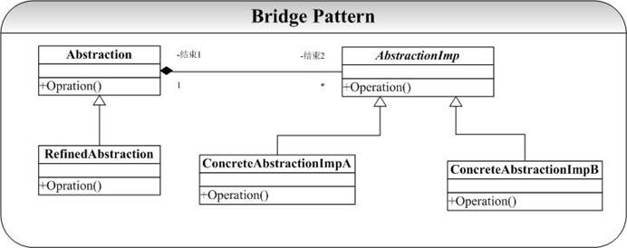
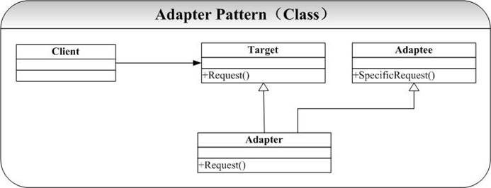
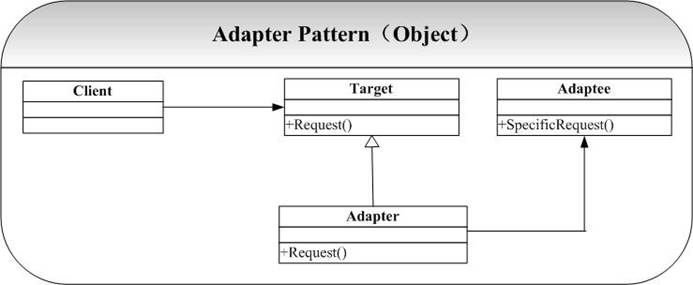
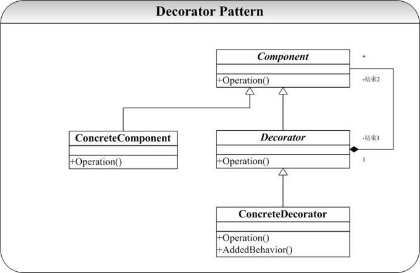
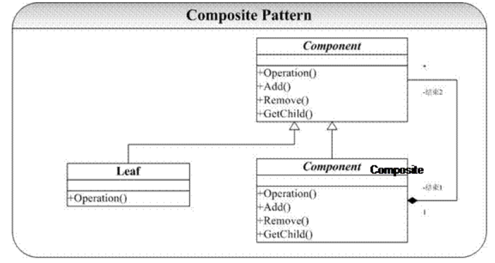
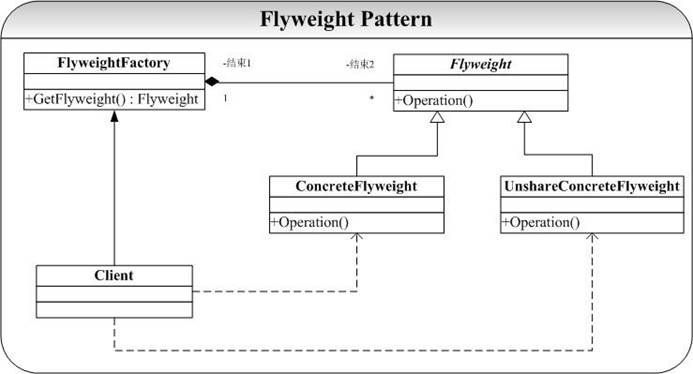
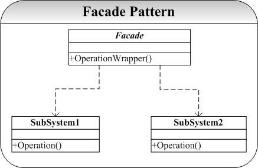
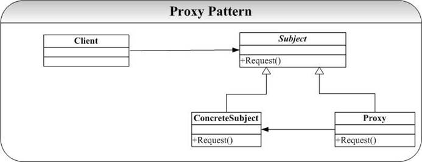

## 1 Bridge桥接模式


### 问题

总结面向对象实际上就两句话：一是**松耦合（Coupling）**，二是**高内聚（Cohesion）**。面向对象系统追求的目标就是尽可能地提高系统模块内部的内聚（Cohesion）、尽可能降低模块间的耦（Coupling）。然而这也是面向对象设计过程中最难把握的部分，大家肯定在OO 系统的开发过程中遇到这样的问题：

1. 客户给了你一个需求，于是使用一个类来实现（A）；
2. 客户需求变化，有两个算法实现功能，于是改变设计，我们通过一个抽象的基类，再定义两个具体类实现两个不同的算法（A1 和 A2）；
3. 客户又告诉我们说对于不同的操作系统，于是再抽象一个层次，作为一个抽象基类A0，在分别为每个操作系统派生具体类（A00 和 A01，其中 A00 表示原来的类 A）实现不同操作系统上的客户需求，这样我们就有了一共 4 个类。
4. 可能用户的需求又有变化，比如说又有了一种新的算法……..
5. 我们陷入了一个需求变化的郁闷当中，也因此带来了类的迅速膨胀。


Bridge 模式则正是解决了这类问题。


### 模式结构图

Bridge 模式典型的结构图为：


在 Bridge 模式的结构图中可以看到，系统被分为两个相对独立的部分，左边是抽象部分，右边是实现部分，这两个部分可以互相独立地进行修改：
例如上面问题中的客户需求 变化，当用户需求需要从 Abstraction 派生一个具体子类时候，并不需要像上面通过继承方式实现时候需要添加子类 A1 和 A2 了。另外当上面问题中由于算法添加也只用改变右边实现（添加一个具体化子类），而左边不用在变化，也不用添加具体子类了。一切都变得 elegant！


### 实现


#### Abstraction


```cpp
#ifndef ABSTRACTION_HPP_INCLUDED
#define ABSTRACTION_HPP_INCLUDED
#include "AbstractionImp.hpp"

class Abstraction
{
public:
    virtual ~Abstraction();
    virtual void Operation()=0;
protected:
    Abstraction();
};

class RefinedAbstraction:public Abstraction
{
public:
    RefinedAbstraction(AbstractionImp* imp);
    ~RefinedAbstraction();
    void Operation();
private:
    AbstractionImp* _imp;
};
#endif // ABSTRACTION_HPP_INCLUDED
```


```cpp
#include "Abstraction.hpp"
#include <iostream>
using namespace std;

Abstraction::Abstraction()
{

}
Abstraction::~Abstraction()
{

}

RefinedAbstraction::RefinedAbstraction(AbstractionImp* imp)
{
    _imp=imp;
}
RefinedAbstraction::~RefinedAbstraction()
{

}
void RefinedAbstraction::Operation()
{

    _imp->Operation();
}
```


#### AbstractionImp


```cpp
#ifndef ABSTRACTIONIMP_HPP_INCLUDED
#define ABSTRACTIONIMP_HPP_INCLUDED

class AbstractionImp
{
public:
    virtual ~AbstractionImp();
    virtual void Operation()=0;
protected:
    AbstractionImp();
};

class SubAbstractionImpA:public AbstractionImp
{
public:
    SubAbstractionImpA();
    ~SubAbstractionImpA();
    virtual void Operation();
};

class SubAbstractionImpB:public AbstractionImp
{
public:
    SubAbstractionImpB();
    ~SubAbstractionImpB();
    virtual void Operation();
};
#endif // ABSTRACTIONIMP_HPP_INCLUDED
```


```cpp
#include "AbstractionImp.hpp"
#include <iostream>
using namespace std;

AbstractionImp::AbstractionImp()
{

}
AbstractionImp::~AbstractionImp()
{

}
void AbstractionImp::Operation()
{
    cout<<"AbstractionImp...imp..."<<endl;
}

SubAbstractionImpA::SubAbstractionImpA()
{

}
SubAbstractionImpA::~SubAbstractionImpA()
{

}
void SubAbstractionImpA::Operation()
{
    cout<<"SubAbstractionImpA...imp..."<<endl;
}

SubAbstractionImpB::SubAbstractionImpB()
{

}
SubAbstractionImpB::~SubAbstractionImpB()
{

}
void SubAbstractionImpB::Operation()
{
    cout<<"SubAbstractionImpB...imp..."<<endl;
}
```


#### main.cpp


```cpp
#include <iostream>
#include "Abstraction.hpp"
#include "AbstractionImp.hpp"
using namespace std;

int main()
{
    AbstractionImp* imp=new SubAbstractionImpA();
    Abstraction* abs=new RefinedAbstraction(imp);

    abs->Operation();
    return 0;
}
```


### 总结

Bridge 模式将抽象和实现分别独立实现，在代码中就是 Abstraction 类和 AbstractionImp 类。
Bridge 是设计模式中比较复杂和难理解的模式之一，也是 OO 开发与设计中经常会用到的模式之一。**使用组合（委托）的方式将抽象和实现彻底地解耦，这样的好处是抽象和实现可以分别独立地变化，系统的耦合性也得到了很好的降低**。
GoF 在说明 Bridge 模式时，在意图中指出 Bridge 模式“将抽象部分与它的实现部分分离，使得它们可以独立地变化”。这句话很简单，但是也很复杂，连 Bruce Eckel 在他的大作《Thinking in Patterns》中说“Bridge 模式是 GoF 所讲述得最不好（Poorly－described）的模式”，个人觉得也正是如此。原因就在于 GoF 的那句话中的“实现”该怎么去理解：“实现” 特别是和“抽象”放在一起的时候我们“默认”的理解是“实现”就是“抽象”的具体子类的实现，但是这里 GoF 所谓的“实现”的含义不是指抽象基类的具体子类对抽象基类中虚函数（接口）的实现，是和继承结合在一起的。而这里的“实现”的含义指的是怎么去实现用户的需求，并且指的是通过组合（委托）的方式实现的，因此**这里的实现不是指的继承基类、实现基类接口，而是指的是通过对象组合实现用户的需求**。理解了这一点也就理解了Bridge 模式，理解了 Bridge 模式，你的设计就会更加 Elegant 了。
实际上上面使用 Bridge 模式和使用带来问题方式的解决方案的根本区别在于是通过继承还是通过组合的方式去实现一个功能需求。因此面向对象分析和设计中有一个原则就是：Favor Composition Over Inheritance(**优先选择组合而不是继承**)。其原因也正在这里。


## 2 Adapter适配器模式


### 问题

Adapter 模式解决的问题在生活中经常会遇到：比如我们有一个 Team 为外界提供 S 类服务，但是我们 Team 里面没有能够完成此项人物的 member，然后我们得知有 A 可以完成这项服务（他把这项人物重新取了个名字叫 S’，并且他不对外公布他的具体实现）。为了保证我们对外的服务类别的一致性（提供 S 服务），我们有以下两种方式解决这个问题：

1. 把 B 君直接招安到我们 Team 为我们工作，提供 S 服务的时候让 B 君去办就是了
2. B 君可能在别的地方有工作，并且不准备接受我们的招安，于是我们 Team 可以想这样一种方式解决问题：我们安排 C 君去完成这项任务，并做好工作（Money:）; 让 A 君工作的时候可以向 B 君请教，因此 C 君就是一个复合体（提供 S 服务，但是是 B 君的继承弟子）。


实际上在软件系统设计和开发中，这种问题也会经常遇到：我们为了完成某项工作购买了一个第三方的库来加快开发。这就带来了一个问题：**我们在应用程序中已经设计好了接口，与这个第三方提供的接口不一致，为了使得这些接口不兼容的类（不能在一起工作）可以在一起工作了，Adapter 模式提供了将一个类（第三方库）的接口转化为客户（购买使用者）希望的接口**。
在上面生活中问题的解决方式也就正好对应了 Adapter 模式的两种类别：**类模式和对象模式**。


### 模式结构图

Adapter类模式典型的结构图为：

Adapter对象模式典型的结构图为：


在 Adapter 模式的结构图中可以看到，类模式的 Adapter 采用**继承**的方式复用 Adaptee 的接口，而在对象模式的 Adapter 中我们则采用**组合**的方式实现 Adaptee 的复用。有关这些具体的实现和分析将在代码说明和讨论中给出。


### 实现（类模式）


#### Adapter


```cpp
#ifndef ADAPTER_HPP_INCLUDED
#define ADAPTER_HPP_INCLUDED

class Target
{
public:
    Target();
    virtual ~Target();
    virtual void Request();
};

class Adaptee
{
public:
    Adaptee();
    ~Adaptee();
    void SpecificRequest();
};

class Adapter:public Target
{
public:
    Adapter(Adaptee* ade);
    ~Adapter();
    void Request();
private:
    Adaptee*_ade;
};

#endif // ADAPTER_HPP_INCLUDED
```


```cpp
#include "Adapter.hpp"
#include <iostream>
using namespace std;

Target::Target(){}
Target::~Target(){}
void Target::Request()
{
    cout<<"target::request"<<endl;
}

Adaptee::Adaptee(){}
Adaptee::~Adaptee(){}
void Adaptee::SpecificRequest()
{
    cout<<"Adaptee::SpecificRequest"<<endl;
}

Adapter::Adapter(Adaptee* ade)
{
    _ade=ade;
}
Adapter::~Adapter(){}
void Adapter::Request()
{
    _ade->SpecificRequest();
}
```


#### main.cpp


```cpp
#include <iostream>
#include "Adapter.hpp"
using namespace std;

int main()
{
    Adaptee* ade=new Adaptee();
    Target* adt=new Adapter(ade);
    adt->Request();
    return 0;
}
```


### 总结

Adapter 模式实现上比较简单，要说明的是在类模式 Adapter 中，我们通过 private 继承 Adaptee 获得实现继承的效果，而通过 public 继承 Target 获得接口继承的效果。
在 Adapter 模式的两种模式中，有一个很重要的概念就是**接口继承**和**实现继承**的区别和联系。接口继承和实现继承是面向对象领域的两个重要的概念：

- 接口继承指的是通过继承，子类获得了父类的接口
- 实现继承指的是通过继承子类获得了父类的实现（并不统共接口）。


在 C++中的 **public 继承既是接口继承又是实现继承**，因为子类在继承了父类后既可以对外提供父类中的接口操作，又可以获得父类的接口实现。当然我们可以通过一定的方式和技术模拟单独的接口继承和实现继承，例如我们可以通过 private 继承获得实现继承的效果（private 继承后，父类中的接口都变为 private，当然只能是实现继承了）。
通过纯抽象基类模拟接口继承的效果，但是在 C++中 pure virtual function 也可以提供默认实现，因此这是不纯正的接口继承，但是在 Java 中我们可以 interface 来获得真正的接口继承了。


## 3 Decorator装饰器模式


### 问题

在 OO 设计和开发过程，可能会经常遇到以下的情况：我们需要为一个已经定义好的类添加新的职责（操作），通常的情况我们会给定义一个新类继承自定义好的类，这样会带来一个问题（将在本模式的讨论中给出）：通过继承的方式解决这样的情况还带来了系统的复杂性，因为继承的深度会变得很深。
而 **Decorator 提供了一种给类增加职责的方法，不是通过继承实现的，而是通过组合**。


### 模式结构图

Decorator 模式典型的结构图为：


在结构图中， ConcreteComponent 和 Decorator 需要有同样的接口，因此 ConcreteComponent 和 Decorator 有着一个共同的父类。
这里有人会问，让 Decorator 直接维护一个指向ConcreteComponent 引用（指针）不就可以达到同样的效果，答案是肯定并且是否定的。肯定的是你可以通过这种方式实现，否定的是你不要用这种方式实现，因为通过这种方式你就只能为这个特定的 ConcreteComponent 提供修饰操作了，当有了一个新的 ConcreteComponent 你又要去新建一个 Decorator 来实现。
但是通过结构图中ConcreteComponent 和 Decorator 有一个公共基类，就可以利用 OO 中多态的思想来实现只要是 Component 型别的对象都可以提供修饰操作的类，这种情况下你就算新建了 100 个 Component 型别的ConcreteComponent，也都可以由 Decorator 一个类搞定。这也正是Decorator 模式的关键和威力所在了。
当然如果你只用给 Component 型别类添加一种修饰，则 Decorator 这个基类就不是很必要了。


### 实现


#### Decorator


```cpp
#ifndef DECORATOR_HPP_INCLUDED
#define DECORATOR_HPP_INCLUDED

class Component
{
public:
    virtual ~Component(){};
    virtual void Operation();
};

class SubComponent:public Component
{
public:
    void Operation();
};

//修饰器，通过组合的方式添加新的方法
class Decorator:public Component
{
public:
    Decorator(Component* com);
    virtual ~Decorator();
    void Operation();
    void addNewOperation();
private:
    Component* _com;
};
#endif // DECORATOR_HPP_INCLUDED
```


```cpp
#include "Decorator.hpp"
#include <iostream>
using namespace std;

void Component::Operation()
{
    cout<<"Component::Operation"<<endl;
}
void SubComponent::Operation()
{
    cout<<"SubComponent::Operation"<<endl;
}

Decorator::Decorator(Component* com)
{
    _com=com;
}
Decorator::~Decorator()
{
    delete _com;
}
void Decorator::Operation()
{
    cout<<"Decorator::Operation"<<endl;
    _com->Operation();
    addNewOperation();
}
void Decorator::addNewOperation()
{
    cout<<"Decorator::addNewOperation"<<endl;
}
```


#### main.cpp


```cpp
#include <iostream>
#include "Decorator.hpp"
using namespace std;

int main()
{
    Component* com=new SubComponent();
    Decorator* dec=new Decorator(com);
    dec->Operation();

    delete dec;
    return 0;
}
```


### 总结

Decorator 模式和 Composite 模式有相似的结构图，其区别会在 Composite 模式详细讨论，请参看下一节。
另外 GoF 在《设计模式》中也讨论到 Decorator 和 Proxy 模式有很大程度上的相似，初学设计模式可能实在看不出这之间的一个联系和相似，并且它们在结构图上也很不相似。实际上，让 Decorator 直接拥有一个 ConcreteComponent 的引用（指针）也可以达到修饰的功能，大家再把这种方式的结构图画出来，就和 Proxy 很相似了！
**Decorator 模式和 Proxy 模式的相似的地方在于它们都拥有一个指向其他对象的引用（指针）**，即通过组合的方式来为对象提供更多操作（或者 Decorator 模式）间接性（Proxy 模式）。但是他们的区别是，Proxy 模式会提供使用其作为代理的对象一样接口，使用代理类将其操作都委托给 Proxy 直接进行。这里可以简单理解为组合和委托之间的微妙的区别了。
Decorator 模式除了采用组合的方式取得了比采用继承方式更好的效果，Decorator 模式还给设计带来一种“即用即付”的方式来添加职责。在 OO 设计和分析经常有这样一种情况：为了多态，通过父类指针指向其具体子类，但是这就带来另外一个问题，当具体子类要添加新的职责，就必须向其父类添加一个这个职责的抽象接口，否则是通过父类指针是调用不到这个方法了。这样处于高层的父类就承载了太多的特征（方法），并且继承自这个父类的所有子类都不可避免继承了父类的这些接口，但是可能这并不是这个具体子类所需要的。而在 Decorator 模式提供了一种较好的解决方法，当需要添加一个操作的时候就可以通过Decorator 模式来解决，你可以一步步添加新的职责。


## 4 Composite组合模式


### 问题

在开发中，我们经常可能要递**归构建树状的组合结构**，Composite 模式则提供了很好的解决方案。


### 模式结构图

Composite 模式的典型结构图为：



### 实现


#### Component


```cpp
#ifndef COMPONENT_HPP_INCLUDED
#define COMPONENT_HPP_INCLUDED

class Component
{
public:
    Component(){};
    virtual ~Component(){};
    virtual void Operation()=0;
    virtual void add(const Component*){};
    virtual void Remove(const Component*){};
    virtual Component* getChild(int){return 0;};
};

#endif // COMPONENT_HPP_INCLUDED
```


#### Composite


```cpp
#ifndef COMPOSITE_HPP_INCLUDED
#define COMPOSITE_HPP_INCLUDED
#include "Component.hpp"
#include <vector>
using namespace std;

class Composite:public Component
{
public:
    void Operation();
    void add(Component* com);
    void Remove(Component* com);
    Component* getChild(int index);
private:
    vector<Component*> vec;
};


#endif // COMPOSITE_HPP_INCLUDED
```


```cpp
#include "Composite.hpp"

void Composite::Operation()
{
    vector<Component*>::iterator iter=vec.begin();
    for(;iter!=vec.end();iter++)
    {
        (*iter)->Operation();
    }
}

void Composite::add(Component* com)
{
    vec.push_back(com);
}

void Composite::Remove(Component* com)
{
    vector<Component*>::iterator iter=vec.begin();
    for(;iter!=vec.end();iter++)
    {
        if(com == (*iter))
        {
            vec.erase(iter);
            break;
        }
    }

}

Component* Composite::getChild(int index)
{
    return vec[index];
}
```


#### leaf


```cpp
#ifndef LEAF_HPP_INCLUDED
#define LEAF_HPP_INCLUDED
#include <iostream>
#include "Component.hpp"
using namespace std;

class Leaf:public Component
{
public:
    void Operation()
    {
        cout<<"Leaf operation..."<<endl;
    };
};

#endif // LEAF_HPP_INCLUDED
```


#### main.cpp


```cpp
#include <iostream>
#include "Composite.hpp"
#include "Leaf.hpp"
using namespace std;

int main()
{
    Leaf* leaf=new Leaf();
    leaf->Operation();

    Composite* com=new Composite();
    com->add(leaf);
    com->Operation();

    Component* l=com->getChild(0);
    l->Operation();
    return 0;
}
```


### 总结

Composite 模式在实现中有一个问题就是要提供对于子节点（Leaf）的管理策略，这里使用的是 STL 中的 vector，可以提供其他的实现方式，如数组、链表、Hash 表等。
Composite 模式通过和 Decorator 模式有着类似的结构图，但是 Composite 模式旨在构造类，而 Decorator 模式重在不生成子类即可给对象添加职责。**Decorator 模式重在修饰，而Composite 模式重在表示**。


## 5 Flyweight轻量模式


### 问题

在面向对象系统的设计何实现中，创建对象是最为常见的操作。
这里面就有一个问题：如果一个应用程序使用了太多的对象，就会造成很大的存储开销。特别是对于大量轻量级（细粒度）的对象，比如在文档编辑器的设计过程中，我们如果为没有字母创建一个对象的话，系统可能会因为大量的对象而造成存储开销的浪费。
例如一个字母“a”在文档中出现了 100000 次，而实际上我们可以让这一万个字母“a”共享一个对象，当然因为在不同的位置可能字母“a”有不同的显示效果（例如字体和大小等设置不同），在这种情况我们可以为将对象的状态分为“外部状态”和“内部状态”，**将可以被共享（不会变化）的状态作为内部状态存储在对象中**，而**外部对象（例如上面提到的字体、大小等）我们可以在适当的时候将外部对象为参数传递给对象**（例如在显示的时候，将字体、大小等信息传递给对象）。


### 模式结构图

上面解决问题的方式被称作 Flyweight 模式解决上面的问题，其典型的结构图为：


可以从图中看出，Flyweight 模式中有一个类似 Factory 模式的对象构造工厂 FlyweightFactory，当客户程序员（Client）需要一个对象时候就会向 FlyweightFactory 发出请求对象的消息 GetFlyweight（）消息，FlyweightFactory 拥有一个管理、存储对象的“仓库”（或者叫对象池，vector 实现），**GetFlyweight（）消息会遍历对象池中的对象，如果已经存在则直接返回给 Client，否则创建一个新的对象返回给 Client**。
当然可能也有不想被共享的对象（例如结构图中的 UnshareConcreteFlyweight），但不在本模式的讲解范围，故在实现中不给出。


### 实现


#### Flyweight


```cpp
#ifndef FLYWEIGHT_HPP_INCLUDED
#define FLYWEIGHT_HPP_INCLUDED
#include <string>
using namespace std;

class Flyweight
{
public:
    virtual ~Flyweight();
    virtual void Operation(const string& state);
    string getIntrinsicState();
protected:
    Flyweight(string state);
private:
    string _state;
};

class SubFlyweight:public Flyweight
{
public:
    SubFlyweight(string state);
    ~SubFlyweight(){};
    void Operation(const string& state);
};
#endif // FLYWEIGHT_HPP_INCLUDED
```


```cpp
#include "Flyweight.hpp"
#include <iostream>
using namespace std;

Flyweight::Flyweight(string state)
{
    _state=state;
}
Flyweight::~Flyweight(){}

void Flyweight::Operation(const string& state)
{

}
string Flyweight::getIntrinsicState()
{
    return _state;
}

SubFlyweight::SubFlyweight(string state):Flyweight(state)
{
    cout<<"SubFlyweight build "<<state<<endl;
}

void SubFlyweight::Operation(const string& state)
{
    cout<<"SubFlyweight: 内涵["<<getIntrinsicState()<<"] 外涵["<<state<<"]"<<endl;
}
```


#### FlyweightFactory


```cpp
#ifndef FLYWEIGHTFACTORY_HPP_INCLUDED
#define FLYWEIGHTFACTORY_HPP_INCLUDED
#include "Flyweight.hpp"
#include <string>
#include <vector>
using namespace std;

class Factory
{
public:
    Flyweight* getFlyweight(const string& key);
private:
    vector<Flyweight*> _fly;
};


#endif // FLYWEIGHTFACTORY_HPP_INCLUDED
```


```cpp
#include "FlyweightFactory.hpp"
#include <iostream>
#include <cassert>
using namespace std;

Flyweight* Factory::getFlyweight(const string& key)
{
    vector<Flyweight*>::iterator it=_fly.begin();
    for(;it!=_fly.end();it++)
    {
        //如果找到key对应的对象
        if((*it)->getIntrinsicState()==key)
        {
            cout<<"already create the object by user"<<endl;
            return *it;
        }

    }
    Flyweight* fn=new SubFlyweight(key);
    _fly.push_back(fn);
    return fn;
}
```


#### main.cpp


```cpp
#include <iostream>
#include "FlyweightFactory.hpp"
#include "Flyweight.hpp"
using namespace std;

int main()
{
    Factory* fact=new Factory();
    Flyweight* f1=fact->getFlyweight("hello");
    Flyweight* f2=fact->getFlyweight("world");
    Flyweight* f3=fact->getFlyweight("hello");

    return 0;
}
```


### 总结

Flyweight 模式在实现过程中主要是**要为共享对象提供一个存放的“仓库”（对象池）**，这里是通过 C++ STL 中 Vector 容器，当然就牵涉到 STL 编程的一些问题（Iterator 使用等）。另外应该注意的就是对对象“仓库”（对象池）的管理策略（查找、插入等），这里是通过直接的顺序遍历实现的，当然我们可以使用其他更加有效的索引策略，例如 **Hash 表的管理策略**，当时这些细节已经不是 Flyweight 模式本身要处理的了。
我们在 State 模式和 Strategy 模式中会产生很多的对象，因此我们可以通过 Flyweight 模式来解决这个问题。


## 6 Facade外观模式


### 问题

举一个生活中的小例子，但凡开过学或者毕过业的都会体会到这样一种郁闷：你要去 n 个地方办理 n 个手续（现在大学合并后就更加麻烦，因为可能那 n 个地方都隔的比较远）。但是实际上我们需要的就是一个 后一道手续的证明而已，对于前面的手续是怎么办的、到什么地方去办理我们都不感兴趣。
实际上在软件系统开发中也经常回会遇到这样的情况，可能你实现了一些接口（模块），而这些接口（模块）都分布在几个类中（比如 A 和 B、C、D）：A 中实现了一些接口，B 中实现一些接口（或者 A 代表一个独立模块，B、C、D 代表另一些独立模块）。然后你的客户程序员（使用你设计的开发人员）只有很少的要知道你的不同接口到底是在那个类中实现的，绝大多数只是想简单的组合你的 A－D 的类的接口，他并不想知道这些接口在哪里实现的。
这里的客户程序员就是上面生活中想办理手续的郁闷的人！在现实生活中我们可能可以很快想到找一个人代理所有的事情就可以解决你的问题（你只要维护和他的简单的一个接口而已了！），在软件系统设计开发中我们可以通过一个叫做 Façade 的模式来解决上面的问题。


### 模式结构图

我们通过 Facade 模式解决上面的问题，其典型的结构图为：


Façade 模式的想法、思路和实现都非常简单，但是其思想却是非常有意义的。并且 Façade 设计模式在实际的开发设计中也是应用最广、 多的模式之一。一个简单的例子就是，我在开发 Visual CMCS项目时候，在 Visual CMCS 中我们将允许用户独立访问我们的编译子系统（词法、语法、语义、代码生成模块），这些都是通过特定的类实现的，我们通过使用 Façade 模式给用户提供一个高层的接口，供用户在不想了解编译器实现的情况下去使用或重用我们的设计和实现。我们将提供一个 Compile 类作为 Façade 对象。


### 实现


#### Facade


```cpp
#ifndef FACADE_HPP_INCLUDED
#define FACADE_HPP_INCLUDED

class Subsystem1
{
public:
    void Operation();
};

class Subsystem2
{
public:
    void Operation();
};

class Facade
{
public:
    Facade();
    ~Facade();
    void operationWrapper();
private:
    Subsystem1* _sub1;
    Subsystem2* _sub2;
};
#endif // FACADE_HPP_INCLUDED
```


```cpp
#include "Facade.hpp"
#include <iostream>
using namespace std;

void Subsystem1::Operation()
{
    cout<<"systerm 1 operation"<<endl;
}

void Subsystem2::Operation()
{
    cout<<"systerm 2 operation"<<endl;
}

Facade::Facade()
{
    _sub1=new Subsystem1();
    _sub2=new Subsystem2();
}

Facade::~Facade()
{
    delete _sub1;
    delete _sub2;
}

void Facade::operationWrapper()
{
    _sub1->Operation();
    _sub2->Operation();
}
```


#### main.cpp


```cpp
#include <iostream>
#include "Facade.hpp"
using namespace std;

int main()
{
    Facade* f=new Facade();
    f->operationWrapper();
    return 0;
}
```


### 总结

Façade 模式在高层提供了一个统一的接口，解耦了系统。设计模式中还有另一种模式 Mediator 也和 Façade 有类似的地方。但是 Mediator 主要目的是对象间的访问的解耦（通讯时候的协议），具体请参见 Mediator 章节。


## 7 Proxy代理模式


### 问题

至少在以下集中情况下可以用 Proxy 模式解决问题：

- 创建开销大的对象时候，比如显示一幅大的图片，我们将这个创建的过程交给代理去完成，GoF 称之为**虚代理**（Virtual Proxy）；
- 为网络上的对象创建一个局部的本地代理，比如要操作一个网络上的一个对象（网络性能不好的时候，问题尤其突出），我们将这个操纵的过程交给一个代理去完成，GoF 称之为**远程代理**（Remote Proxy）；
- 对对象进行控制访问的时候，比如在 Jive 论坛中不同权限的用户（如管理员、普通用户等）将获得不同层次的操作权限，我们将这个工作交给一个代理去完成，GoF 称之为**保护代理**（Protection Proxy）。
- 智能指针（Smart Pointer），关于这个方面的内容，建议参看 Andrew Koenig 的《C++ 沉思录》中的第 5 章。


### 模式结构图

Proxy 模式典型的结构图为：




### 实现


#### Proxy


```cpp
#ifndef PROXY_HPP_INCLUDED
#define PROXY_HPP_INCLUDED

class Subject
{
public:
    virtual ~Subject(){};
    virtual void Request()=0;
protected:
    Subject(){};
};

class SubSubject:public Subject
{
public:
    SubSubject(){};
    ~SubSubject(){};
    void Request();
};

class Proxy
{
public:
    Proxy(){};
    Proxy(Subject* sub);
    ~Proxy();
    void request();
private:
    Subject* _sub;
};
#endif // PROXY_HPP_INCLUDED
```


```cpp
#include "Proxy.hpp"
#include <iostream>
using namespace std;

void SubSubject::Request()
{
    cout<<"SubSubject request..."<<endl;
}

Proxy::Proxy(Subject* sub)
{
    _sub=sub;
}

Proxy::~Proxy()
{
    delete _sub;
}

void Proxy::request()
{
    cout<<"Proxy request..."<<endl;
    _sub->Request();
}
```


#### main.cpp


```cpp
#include <iostream>
#include "Proxy.hpp"
using namespace std;

int main()
{
    Subject* sub = new SubSubject();
    Proxy* p = new Proxy(sub);
    p->request();
    return 0;
}
```


### 总结

Proxy 模式的实现很简单，这里不做多余解释。 可以看到，示例代码运行后，p 的 Request 请求实际上是交给了 sub 来实际执行。
Proxy 模式最大的好处就是实现了逻辑和实现的彻底解耦。
