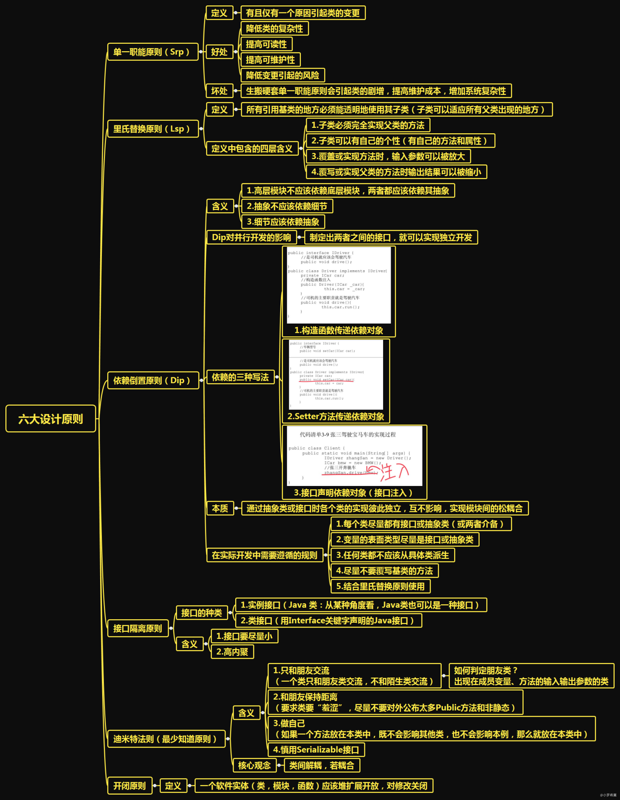

# 1 总纲

# 2 单一职责
单一职责原则英文全称：Single Responsibility Principle，缩写为 SRP：**一个类或者模块只有一个职责/功能。类可以看做模块的最细粒度的抽象**。

## 2.1 如何判断类的职责是否单一
整体原则：避免大而全的类，依赖其他类过多，避免将不相关的功能耦合在一起。

- 类中的代码行数、函数或属性过多，影响代码的可读性和可维护性。
- 类依赖的其他类过多，或者依赖类的其他类过多。
- 私有方法过多，能否将私有方法独立到新的类中，设置为 public 方法，从而提高代码的复用性。
- 类的职责定义得可能不够清晰，比较难给类起一个合适名字。
- 类中大量的方法都是集中操作类中的某几个属性。

## 2.2 过度的设计
类/模块拆分得过细，反倒会降低内聚性，影响代码的可维护性。**反例**：类的序列化和反序列化功能是成对出现的，将两个方法分别拆为一个类时，哪一方修改后另一方也要对应调整，否则可能会出现序列化，反序列不匹配的情况。这样的拆分，使得代码的可维护性降低。

## 2.3 最佳实践
我们可以先写一个粗粒度的类，满足业务需求。**随着业务的发展，如果粗粒度的类越来越庞大，代码越来越多，我们就可以将这个粗粒度的类，拆分成几个更细粒度的类**。

# 3 里氏替换

## 3.1 如何理解“里式替换”？
里式替换原则的英文全称：Liskov Substitution Principle，缩写为：LSP。具体的描述为：**子类对象可以替换掉程序中所有的父类对象，并且保证程序的原有的逻辑和正确性不变**。简而言之就是：用父类的地方，换成子类后程序也是正确运行。
> 里式替换是一种设计原则，是用来指导继承关系中子类该如何设计的，子类的设计要保证在替换父类的时候，不改变原有程序的逻辑以及不破坏原有程序的正确性。

## 3.2 哪些代码明显违背了 LSP？

- 子类违背父类声明要实现的功能
- 子类违背父类对输入、输出、异常的约定
- 子类违背父类注释中所罗列的任何特殊说明

父类限定的约定通常包含函数声明的功能，输入，输出，异常和注释说明。

## 3.3 里式替换与多态区别
里式替换和多态有点类似，但是关注的角度不一样。

- 多态是面向对象编程的一大特性；
- 里式替换是一种设计原则，用来限定子类如何设计，保证能在不破坏原有逻辑和正确性的情况下替换父类。

# 4 依赖倒置

## 4.1 控制反转（IOC）
控制反转的全称为 Inversion Of Control，"控制" 指的是对程序执行流程的控制，“反转”指的是**流程的控制权由程序员变成到框架**。

## 4.2 依赖注入（DI）
依赖注入的英文翻译是 Dependency Injection，不用 new 方式在类里创建所要依赖的对象，而是**通过构造函数或者setter函数方式传递到类**。

## 4.3 依赖倒置原则 （DIP）
依赖反转原则的英文翻译是 Dependency Inversion Principle，有时也叫做依赖倒置原则。具体描述：

- 高层模块（high-level modules）不要依赖低层模块（low-level）。高层模块和低层模块应该通过抽象（abstractions）来互相依赖。
- 抽象（abstractions）不要依赖具体实现细节（details），具体实现细节 （details）依赖抽象（abstractions）。
- 高层模块不依赖底层模块，而是共同依赖一个抽象，并且抽象不要依赖具体实现细节，要由具体实现细节依赖抽象。

# 5 接口隔离

## 5.1 如何理解“接口隔离”？
接口隔离原则英文全称：Interface Segregation Principle，缩写为 ISP：==客户端不应该依赖它们不需要的接口，应该小而完备==
这里的接口指代：一组API接口，单个API接口函数，或者OOP的接口概念。

- 把“接口”理解为一组 API 接口集合：部分接口只能被部分调用者使用时，需要将这部分接口隔离。
- 把“接口”理解为单个 API 接口或函数：函数设计要功能单一
- 把“接口”理解为 OOP 中的接口概念：保证程序更加灵活，易扩展，易复用

## 5.2 接口隔离与单一职责的区别

- 单一职责原则针对的是模块、类、接口的设计。
- 接口隔离原则相对于单一职责原则，一方面更侧重于接口的设计，另一方面它的思考角度也是不同的。

接口隔离原则提供了一种判断接口的职责是否单一的标准：通过调用者如何使用接口来间接地判定。如果调用者只使用部分接口或接口的部分功能，那接口的设计就不够职责单一。

# 6 迪米特法则

## 6.1 何为“高内聚、松耦合”？

- 高内聚：功能相近的应该放在同一个类里。用来指导类本身的设计
- 松耦合：不相近的功能不要放到同一个类里。用来指导类与类之间依赖关系的设计

## 6.2 如何理解“迪米特法则”？
迪米特法则的英文翻译是：Law of Demeter，缩写是 LOD。又叫**最少知道原则**。原则的英文定义如下：
> Each unit should have only limited knowledge about other units: only units “closely” related to the current unit. Or: Each unit should only talk to its friends; Don’t talk to strangers.

通俗地讲就是，不应该有直接依赖关系的类不要依赖；有依赖关系的类使用接口方式依赖。迪米特法目标在于减少类之间的耦合，让类独立，每个类少了解系统其它部分，并且要易于改动。

# 7 开闭原则

## 7.1 理解“对扩展开放，对修改关闭”
开闭原则的英文全称：Open Closed Principle，简称 OCP：软件实体（模块，类，方法等）应该对扩展开放，对修改关闭。通俗地讲就是，新增一个功能，应该是在已有代码上新增代码，而不是修改已有代码。**修改代码并不一定意味着违背开闭原则，**只要改动的代码没有破坏原有代码的正常运行，没有破坏原有的单元测试即可。

## 7.2 如何做到 “对扩展开放，对修改关闭”
开闭原则涉及的就是**代码的扩展性问题，根本在于如何写出扩展性好的代码**。

- 写代码时，多花时间思考，代码未来可能的需求变更，预留扩展点来应对变更。
- 将可变的部分封装起来，隔离变化，提供抽象化的不可变接口给上层系统使用。
- 多态，依赖注入，基于接口编程，大部分设计模式都可以提高代码扩展性。

## 7.3 如何在项目中灵活应用开闭原则
想要用好开闭原则，要对业务，系统足够的了解，能够识别出扩展点和变化点，但也要避免过度设计，盲目扩展。
> 对于一些比较确定的、短期内可能就会扩展，或者需求改动对代码结构影 响比较大的情况，或者实现成本不高的扩展点，在编写代码的时候之后，我们就可以事先做些扩展性设计。但对于一些不确定未来是否要支持的需求，或者实现起来比较复杂的扩展 点，我们可以等到有需求驱动的时候，再通过重构代码的方式来支持扩展的需求。

**代码扩展性好的另一面就是可读性变弱，不易理解，**因此写代码时也要权衡好扩展性与可读性之间的平衡。在某些场景下，代码的扩展性很重要，我们就可以适当地牺牲一些代 码的可读性；在另一些场景下，代码的可读性更加重要，那我们就适当地牺牲一些代码的可扩展性。

# 8 优先使用对象组合，而不是类继承

- 类继承通常为“白箱复用”，对象组合通常为“黑箱复用”
- 继承在某种程度上破坏了封装性，子类父类耦合度高
- 而对象组合则只要求被组合的对象具有良好定义的接口，耦合度低
