本篇基于李建忠老师的《C++设计模式》课程，对设计模式进行再一次的深入理解，对应资源：

- 视频教程：[https://www.bilibili.com/video/BV1c4411a7wk](https://www.bilibili.com/video/BV1c4411a7wk)
- PPT与code：[https://github.com/BarretRen/DesignPattern](https://github.com/BarretRen/DesignPattern)

# 1 设计模式总结

## 1.1 设计模式目标与手段
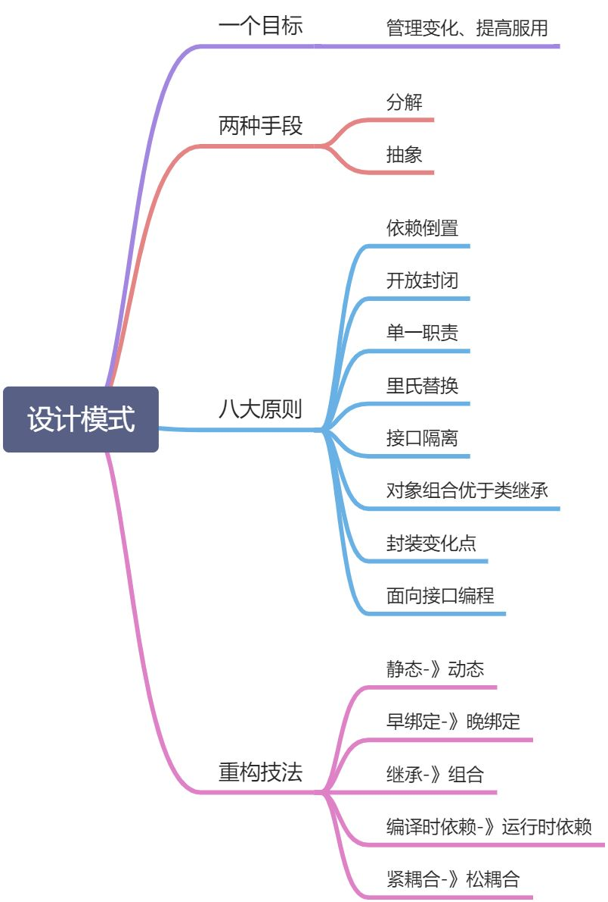
## 1.2 另一种分类方法
下图是设计模式的另一种分类，不同于经典的创建型、结构型和行为型分类：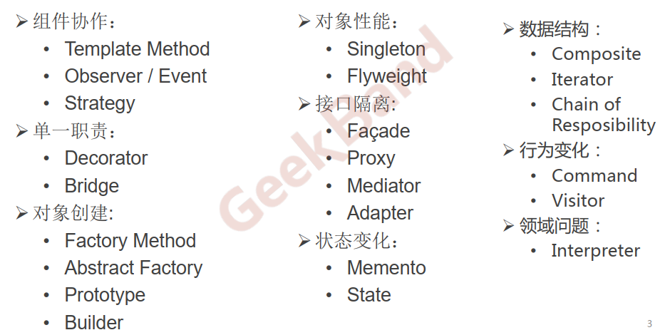

# 2 组件协作
组件协作通过**晚期绑定**，来实现**框架与应用程序**之间的松耦合，是二者之间协作时常用的模式。

## 2.1 模板方法
【**定义】**
> 定义一个操作中的算法的骨架 (稳定的模板结构)，而将一些步骤延迟(变化)到子类中（由子类实现virtual函数）。Template Method使得子类可以不改变(复用)一个算法的结构即可重定义(override 重写)该算法的某些特定步骤。

从定义看，对于模板方法来说，**识别出稳定和变化的部分十分关键**。

- 稳定的部分作为模板直接在基类中实现
- 变化的部分定义为virtual函数，由子类根据不同情况去实现


【**类图结构**】
```cpp
class Library
{
public:
    //稳定 template method
    void Run()
    {

        Step1();

        if (Step2()) //֧支持变化-->虚函数的多态调用
        {
            Step3();
        }

        for (int i = 0; i < 4; i++)
        {
            Step4(); //֧支持变化-->虚函数的多态调用
        }

        Step5();
    }
    virtual ~Library() {} //基类虚构函数要virtual

protected:
    void Step1()
    { //稳定
        //.....
    }
    void Step3()
    { //稳定
        //.....
    }
    void Step5()
    { //稳定
        //.....
    }

    virtual bool Step2() = 0; //变化，交给子类实现
    virtual void Step4() = 0; //变化，交给子类实现
};
```

## 2.2 策略模式
【**定义】**
> 定义一系列算法，把它们一个个封装起来，并且使它们可互相替换（**变化**）。该模式使得算法可独立于使用它的客户程序(**稳定**)而变化（扩展，子类化） 。

Strategy及其子类为组件提供了一系列可重用的算法，从而可以使得类型在**运行时**方便地根据需要在各个算法之间进行切换。**含有许多条件判断语句的代码通常都需要Strategy模式**。
【**类图结构】****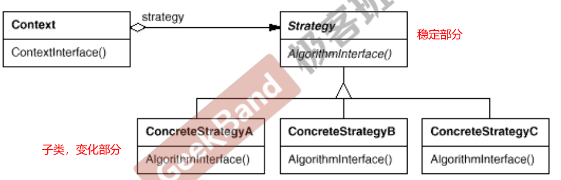
```cpp
class Context;
class TaxStrategy //基类
{
public:
    virtual double Calculate(const Context &context) = 0;
    virtual ~TaxStrategy() {}
};

class CNTax : public TaxStrategy
{
public:
    virtual double Calculate(const Context &context)
    {
        //***********
    }
};

class USTax : public TaxStrategy
{
public:
    virtual double Calculate(const Context &context)
    {
        //***********
    }
};

//扩展
//*********************************
class FRTax : public TaxStrategy
{
public:
    virtual double Calculate(const Context &context)
    {
        //.........
    }
};

class SalesOrder
{
private:
    TaxStrategy *strategy;//基类指针，用于多态调用

public:
    SalesOrder(StrategyFactory *strategyFactory)
    {//赋值具体的子类对象
        this->strategy = strategyFactory->NewStrategy();
    }
    ~SalesOrder()
    {
        delete this->strategy;
    }

public:
    double CalculateTax()
    {
        //...
        Context context();

        double val = strategy->Calculate(context); //多态调用
        //...
    }
};
```

## 2.3 观察者模式
**【定义】**
> 定义对象间的一种一对多（变化）的依赖关系，以便当一个对象(Subject)的状态发生改变时，所有依赖于它的对象都得到通知并自动更新。

目标发送通知时，无需指定观察者，通知（可以携带通知信息作为参数）会**自动传播**。观察者自己决定是否需要订阅通知，目标对象对此一无所知。

**【类图结构】**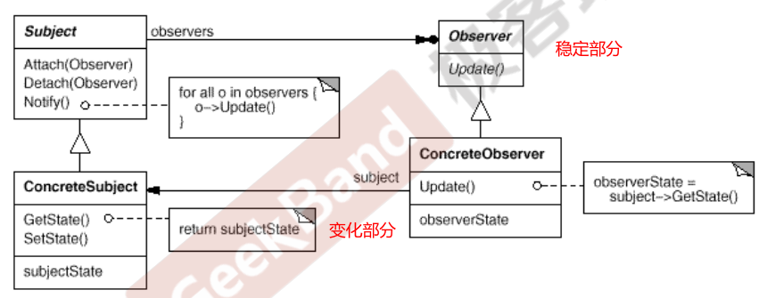
```cpp
class IProgress //观察者基类
{
public:
    virtual void DoProgress(float value) = 0;
    virtual ~IProgress() {}
};

class FileSplitter
{
    string m_filePath;
    int m_fileNumber;

    List<IProgress *> m_iprogressList; //抽象通知机制，观察者的核心

public:
    FileSplitter(const string &filePath, int fileNumber) : m_filePath(filePath),
                                                           m_fileNumber(fileNumber)
    {}
    void split()
    {

        //1.读取大文件
        //...
        //2.分批次向小文件写入
        for (int i = 0; i < m_fileNumber; i++)
        {
            //...
            float progressValue = m_fileNumber;
            progressValue = (i + 1) / progressValue;
            onProgress(progressValue); //更新进度
        }
    }

    void addIProgress(IProgress *iprogress)
    {
        m_iprogressList.push_back(iprogress);
    }
    void removeIProgress(IProgress *iprogress)
    {
        m_iprogressList.remove(iprogress);
    }
protected:
    virtual void onProgress(float value)
    {
        List<IProgress *>::iterator itor = m_iprogressList.begin();
        while (itor != m_iprogressList.end())
        {
            (*itor)->DoProgress(value);
            itor++;
        }
    }
};
```

# 3 单一职责
在软件组件的设计中，如果责任划分的不清晰，使用继承得到的结果往往是随着需求的变化，子类急剧膨胀，同时充斥着重复代码，这时候的关键是划清责任。

## 3.1 装饰器模式
**【定义】**
> 动态（**组合**）地给一个对象增加一些额外的职责。就增加功能而言，Decorator模式比生成子类（继承）更为灵活（**消除重复代码 & 减少子类个数**）。

Decorator模式实现了在运行时动态扩展对象功能的能力，而且可以根据需要扩展多个功能。避免了使用继承带来的“灵活性差”和“多子类衍生问题” 。装饰器模式的要点在于解决“**主体类在多个方向上的扩展功能**”。
**【类图结构】****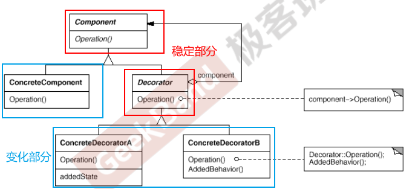
```cpp
//业务操作
class Stream
{
public:
    virtual char Read(int number) = 0;
    virtual void Seek(int position) = 0;
    virtual void Write(char data) = 0;
    virtual ~Stream() {}
};

//主体类
class FileStream : public Stream
{
public:
    virtual char Read(int number)
    {
        //读文件流
    }
    virtual void Seek(int position)
    {
        //定位文件流
    }
    virtual void Write(char data)
    {
        //写文件流
    }
};

class NetworkStream : public Stream
{
public:
    virtual char Read(int number)
    {
        //读网络流
    }
    virtual void Seek(int position)
    {
        //定位网络流
    }
    virtual void Write(char data)
    {
        //写网络流
    }
};

//用装饰器类扩展流的操作
class DecoratorStream : public Stream //装饰器基类
{
protected:
    Stream *stream; //组合代替继承，该模式的核心

    DecoratorStream(Stream *stm) : stream(stm)
    {
    }
};

class CryptoStream : public DecoratorStream
{
public:
    CryptoStream(Stream *stm) : DecoratorStream(stm)
    {
    }

    virtual char Read(int number)
    {

        //额外的加密操作...
        stream->Read(number); //读文件流
    }
    virtual void Seek(int position)
    {
        //额外的加密操作...
        stream->Seek(position); //定位文件流
        //额外的加密操作...
    }
    virtual void Write(byte data)
    {
        //额外的加密操作...
        stream->Write(data); //写文件流
        //额外的加密操作...
    }
};

class BufferedStream : public DecoratorStream
{
    Stream *stream; //...

public:
    BufferedStream(Stream *stm) : DecoratorStream(stm)
    {
    }
    //...
};

void Process()
{
    //运行时装配
    FileStream *s1 = new FileStream();

    CryptoStream *s2 = new CryptoStream(s1);//加密流
    BufferedStream *s3 = new BufferedStream(s1);//缓存流
    BufferedStream *s4 = new BufferedStream(s2);//加密缓存流，不同的装饰器进行组合装载
}
```

## 3.2 桥模式
**【定义】**
> 将抽象部分(业务功能)与实现部分(平台实现)分离，使它们都可以独立地变化。

Bridge模式的应用一般在“**两个非常强的变化维度**”，将两个方向上的变化分离开来（两个类），利用组合（抽象指针）再装载再一起完成功能。

**【类图结构】****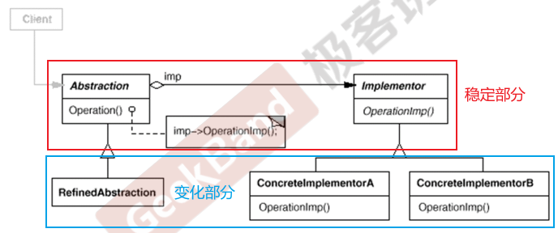
```cpp
//不同的变化方向，分成不同的类：Messager和MessagerImp
class Messager
{
protected:
    MessagerImp *messagerImp; //运行时再确定
public:
    virtual void Login(string username, string password) = 0;
    virtual void SendMessage(string message) = 0;
    virtual void SendPicture(Image image) = 0;

    virtual ~Messager() {}
};

class MessagerImp
{
public:
    virtual void PlaySound() = 0;
    virtual void DrawShape() = 0;
    virtual void WriteText() = 0;
    virtual void Connect() = 0;

    virtual ~MessagerImp() {}
};

//PC平台实现
class PCMessagerImp : public MessagerImp
{
public:
    virtual void PlaySound()
    {
        //**********
    }
    virtual void DrawShape()
    {
        //**********
    }
    virtual void WriteText()
    {
        //**********
    }
    virtual void Connect()
    {
        //**********
    }
};
//移动平台实现
class MobileMessagerImp : public MessagerImp
{
public:
    virtual void PlaySound()
    {
        //==========
    }
    virtual void DrawShape()
    {
        //==========
    }
    virtual void WriteText()
    {
        //==========
    }
    virtual void Connect()
    {
        //==========
    }
};

//业务抽象
//类的数目：1+n+m
class MessagerLite : public Messager
{
public:
    virtual void Login(string username, string password)
    {
        messagerImp->Connect();
        //........
    }
    virtual void SendMessage(string message)
    {
        messagerImp->WriteText();
        //........
    }
    virtual void SendPicture(Image image)
    {
        messagerImp->DrawShape();
        //........
    }
};
class MessagerPerfect : public Messager
{
public:
    virtual void Login(string username, string password)
    {
        messagerImp->PlaySound();
        //********
        messagerImp->Connect();
        //........
    }
    virtual void SendMessage(string message)
    {
        messagerImp->PlaySound();
        //********
        messagerImp->WriteText();
        //........
    }
    virtual void SendPicture(Image image)
    {
        messagerImp->PlaySound();
        //********
        messagerImp->DrawShape();
        //........
    }
};

void Process()
{
    //运行时装配
    MessagerImp *mImp = new PCMessagerImp();
    Messager *m = new Messager(mImp);
}
```

# 4 对象创建
绕开new，来避免对象创建（new）过程中所导致的紧耦合（依赖具体类），从而支持对象创建的稳定。

## 4.1 工厂模式
**【定义】**
> 定义一个用于创建对象的接口（**工厂基类**），让子类（**具体工厂子类**）决定实例化哪一个类。Factory Method使得一个类的实例化延迟（**目的：解耦，手段：虚函数**）到子类。

工厂模式用于隔离类对象的使用者和具体类型之间的耦合关系。 工厂模式解决的是**“单个对象”的需求变化**，缺点是要求创建方法/参数相同。
**【类图结构】****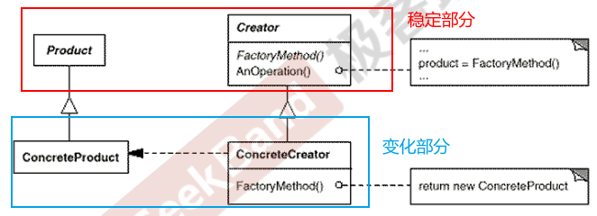
```cpp
//抽象类
class ISplitter
{
public:
    virtual void split() = 0;
    virtual ~ISplitter() {}
};

//工厂基类
class SplitterFactory
{
public:
    virtual ISplitter *CreateSplitter() = 0;
    virtual ~SplitterFactory() {}
};

//具体类
class BinarySplitter : public ISplitter
{
};

class TxtSplitter : public ISplitter
{
};

//具体工厂
class BinarySplitterFactory : public SplitterFactory
{
public:
    virtual ISplitter *CreateSplitter()
    {
        return new BinarySplitter();
    }
};

class TxtSplitterFactory : public SplitterFactory
{
public:
    virtual ISplitter *CreateSplitter()
    {
        return new TxtSplitter();
    }
};
//在使用时，可以直接指定具体的工厂子类，继而获取需要的对象
class MainForm : public Form
{
    SplitterFactory *factory; //工厂

public:
    MainForm(SplitterFactory *factory)
    {
        this->factory = factory;
    }
    void Button1_Click()
    {
        ISplitter *splitter = factory->CreateSplitter(); //多态new
        splitter->split();
    }
};
```

## 4.2 抽象工厂
**【定义】**
> 提供一个接口，让该接口负责创建“**一系列相关或者相互依赖的对象**”，无需指定它们具体的类。

“系列对象”指的是在某一特定系列下的对象之间有相互依赖、或作用的关系。抽象工厂（**或者叫家族工厂更贴切）**主要在于应对**“新系列”的需求变动。**其缺点在于难以应对“新对象”的需求变动。****【类图结构】****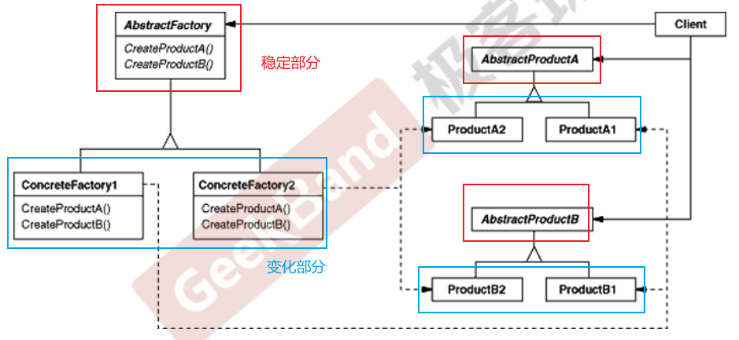
```cpp
//数据库访问有关的基类
class IDBConnection
{
};

class IDBCommand
{
};
class IDataReader
{
};
//一个统一的工厂类，可以创建多个对象
class IDBFactory
{
public:
    virtual IDBConnection *CreateDBConnection() = 0;
    virtual IDBCommand *CreateDBCommand() = 0;
    virtual IDataReader *CreateDataReader() = 0;
};

//支持SQL Server
class SqlConnection : public IDBConnection
{
};
class SqlCommand : public IDBCommand
{
};
class SqlDataReader : public IDataReader
{
};
class SqlDBFactory : public IDBFactory
{
public:
    virtual IDBConnection *CreateDBConnection() = 0;
    virtual IDBCommand *CreateDBCommand() = 0;
    virtual IDataReader *CreateDataReader() = 0;
};

//支持Oracle
class OracleConnection : public IDBConnection
{
};

class OracleCommand : public IDBCommand
{
};

class OracleDataReader : public IDataReader
{
};
class OracleBFactory : public IDBFactory
{
public:
    virtual IDBConnection *CreateDBConnection() = 0;
    virtual IDBCommand *CreateDBCommand() = 0;
    virtual IDataReader *CreateDataReader() = 0;
};

class EmployeeDAO
{
    IDBFactory *dbFactory;

public:
    vector<EmployeeDO> GetEmployees()
    {
        IDBConnection *connection = dbFactory->CreateDBConnection();
        connection->ConnectionString("...");

        IDBCommand *command = dbFactory->CreateDBCommand();
        command->CommandText("...");
        command->SetConnection(connection); //关联性

        IDBDataReader *reader = command->ExecuteReader(); //关联性
        while (reader->Read())
        {
        }
    }
};
```

## 4.3 原型模式
**【定义】**
> 使用**原型实例**指定创建对象的种类，然后通过**拷贝构造**这些原型来创建新的对象。


**【类图结构】****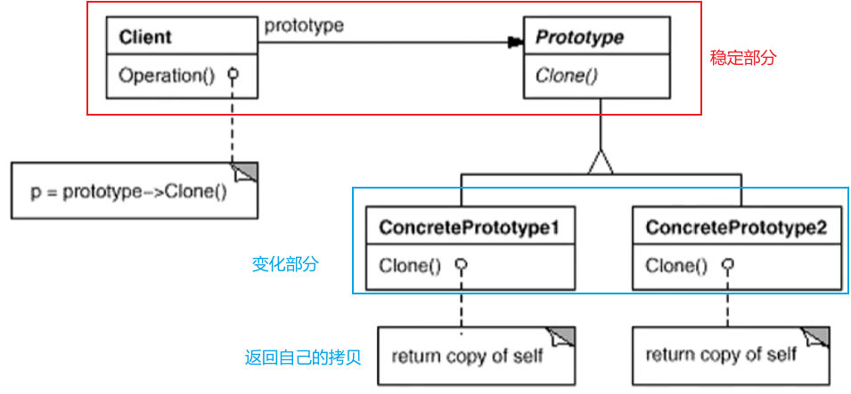
```cpp
//抽象类
class ISplitter
{
public:
    virtual void split() = 0;
    //通过克隆自己来创建对象，不需要单独的工厂类
    virtual ISplitter *clone() = 0;

    virtual ~ISplitter() {}
};
//具体类
class BinarySplitter : public ISplitter
{
public:
    virtual ISplitter *clone()
    {
        return new BinarySplitter(*this);//需要拷贝构造函数正确实现
    }
};

class TxtSplitter : public ISplitter
{
public:
    virtual ISplitter *clone()
    {
        return new TxtSplitter(*this);
    }
};
//client
class MainForm : public Form
{
    ISplitter *prototype; //原型对象

public:
    MainForm(ISplitter *prototype)
    {
        this->prototype = prototype;
    }

    void Button1_Click()
    {
        ISplitter *splitter = prototype->clone(); //克隆原型

        splitter->split();
    }
};
```

## 4.4 构建器模式
**【定义】**
> 将一个复杂对象的构建与其表示相分离，使得同样的构建过程(**稳定**)可以创建不同的表示(**变化)** 。

其基本思路（**步骤顺序不变，步骤内容在变**）是：

- 将构建的步骤过程从实际的Product中分离
- 将构建的各个步骤放在Builder中，子类继承去实现步骤的不同内容
- 将构建的步骤顺序放在Director中，这个顺序一般是不会变化的。

Builder模式主要在于应对**“复杂对象各个部分”的频繁需求变动，**其缺点在于难以应对“分步骤构建算法”的需求变动。

**【类图结构】****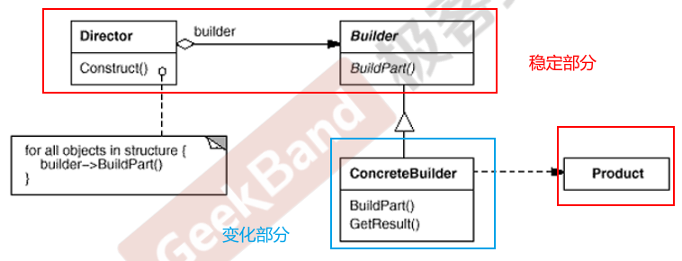
```cpp
class House
{
    //....
};
class HouseBuilder
{
public:
    House *GetResult()//返回一个House对象
    {
        return pHouse;
    }
    virtual ~HouseBuilder() {}

protected:
    House *pHouse;
    virtual void BuildPart1() = 0;
    virtual void BuildPart2() = 0;
    virtual void BuildPart3() = 0;
    virtual void BuildPart4() = 0;
    virtual void BuildPart5() = 0;
};
//稳定的部分
class HouseDirector
{
public:
    HouseBuilder *pHouseBuilder;

    HouseDirector(HouseBuilder *pHouseBuilder)//注入实际的子类对象
    {
        this->pHouseBuilder = pHouseBuilder;
    }

    House *Construct()//按照确定的顺序执行构建过程
    {
        pHouseBuilder->BuildPart1();

        for (int i = 0; i < 4; i++)
        {
            pHouseBuilder->BuildPart2();
        }

        bool flag = pHouseBuilder->BuildPart3();
        if (flag)
        {
            pHouseBuilder->BuildPart4();
        }

        pHouseBuilder->BuildPart5();
        return pHouseBuilder->GetResult();
    }
};
//子类继承，自定义构建的步骤
class StoneHouseBuilder : public HouseBuilder
{
protected:
    virtual void BuildPart1()
    {
        //pHouse->Part1 = ...;
    }
    virtual void BuildPart2()
    {
    }
    virtual void BuildPart3()
    {
    }
    virtual void BuildPart4()
    {
    }
    virtual void BuildPart5()
    {
    }
};
```

# 5 对象性能

## 5.1 单例模式
**【定义】**
> 保证一个类仅有一个实例，并提供一个接口函数返回唯一的对象


**【类图结构】****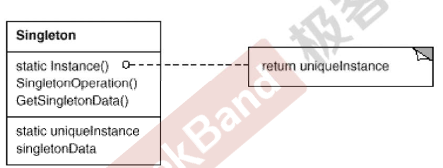
```cpp
class Singleton
{
private:
    //构造函数和拷贝构造函数私有
    Singleton();
    Singleton(const Singleton &other);
    static Singleton *m_instance;

public:
    static Singleton *getInstance();
};
Singleton *Singleton::m_instance = nullptr;

//线程非安全版本
Singleton *Singleton::getInstance()
{
    if (m_instance == nullptr)
    {
        m_instance = new Singleton();
    }
    return m_instance;
}

//线程安全版本，但读操作太多，锁的代价过高
Singleton *Singleton::getInstance()
{
    //lock加锁
    if (m_instance == nullptr)
    {
        m_instance = new Singleton();
    }
    //unlock解锁
    return m_instance;
}
//双检查锁，但由于编译乱序会导致双检查锁失效
Singleton *Singleton::getInstance()
{
    if (m_instance == nullptr)
    {
        //lock加锁
        if (m_instance == nullptr)
        {
            m_instance = new Singleton();
        }
        //unlock解锁
    }
    return m_instance;
}

//C++ 11版本之后的跨平台实现，内存栅栏
std::atomic<Singleton *> Singleton::m_instance;
std::mutex Singleton::m_mutex;
Singleton *Singleton::getInstance()
{
    Singleton *tmp = m_instance.load(std::memory_order_relaxed);
    std::atomic_thread_fence(std::memory_order_acquire); //获取内存fence
    if (tmp == nullptr)
    {
        std::lock_guard<std::mutex> lock(m_mutex); //加锁，lock_guard会自动解锁
        tmp = m_instance.load(std::memory_order_relaxed);
        if (tmp == nullptr)
        {
            tmp = new Singleton;
            std::atomic_thread_fence(std::memory_order_release); //释放内存fence
            m_instance.store(tmp, std::memory_order_relaxed);    //保存到m_instance中
        }
    }
    return tmp;
}
```
双检查锁由于编译乱序，也不是线程安全的，如下图的情况：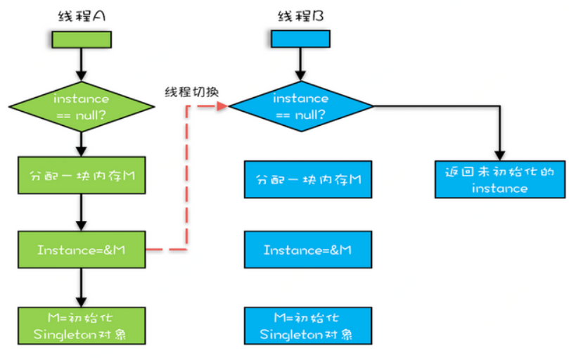

## 5.2 FlyWeight对象池
**【定义】**
> 运用共享技术（**对象池**）有效地**支持大量细粒度的对象**

**【类图结构】****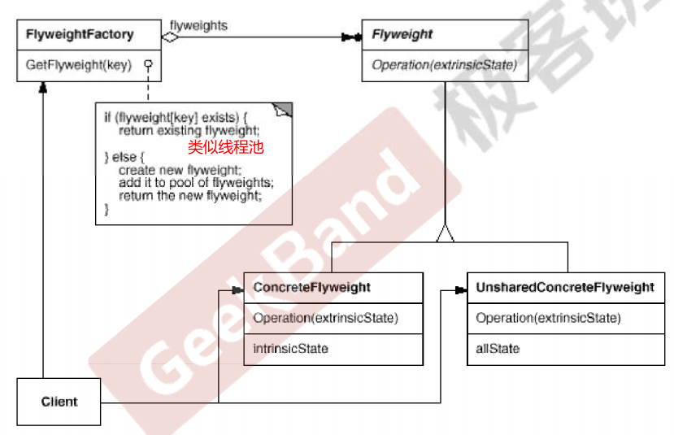
```cpp
class Font
{
private:
    //unique object key，用于查找指定对象
    string key;
    //object state
    //....

public:
    Font(const string &key)
    {
        //...
    }
};

class FontFactory
{
private:
    map<string, Font *> fontPool; //对象池
public:
    Font *GetFont(const string &key)
    {
        map<string, Font *>::iterator item = fontPool.find(key);
        if (item != footPool.end())
        {
            return fontPool[key];//对象池存在，直接返回
        }
        else
        {//找不到对象，创建新对象返回
            Font *font = new Font(key);
            fontPool[key] = font;
            return font;
        }
    }

    void clear()
    {
        //...
    }
};
```

# 6 接口隔离
添加一层**间接稳定的接口**，来隔离本来相互紧密关联的接口。

## 6.1 门面模式
**【定义】**
> 为子系统中的一组接口提供一个**一致稳定**的高层接口，这个接口使得这一子系统更加容易被复用

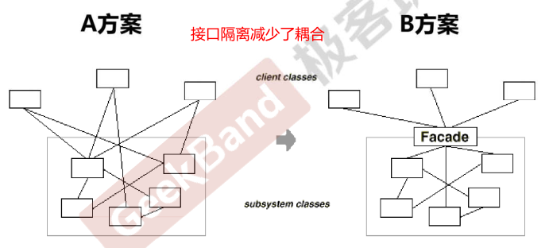

## 6.2 Proxy模式
**【定义】**
> 为其他对象提供一种代理以控制（**隔离、使用接口**）对这个对象的访问。

**【类图结构】****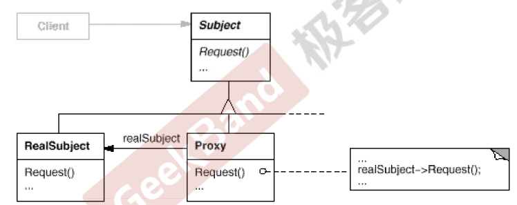
```cpp
class ISubject
{
public:
    virtual void process();
};

//Proxy的设计
class SubjectProxy : public ISubject
{
public:
    virtual void process()
    {
        //对RealSubject的一种间接访问
        //....很多操作
    }
};

class ClientApp
{
private:
    ISubject *subject;

public:
    ClientApp()
    {
        subject = new SubjectProxy();
    }

    void DoTask()
    {
        //...
        subject->process();
        //....
    }
};
```

## 6.3 适配器
**【定义】**
> 将一个类的接口转换成用户希望另一个接口，使得原本由于接口不兼容二不能一起工作的类可以协调工作。

适配器模式主要用于**服用一些现存的类，使接口兼容新的要求**。分为**对象适配器和类适配器**，推荐使用对象适配器。
**【类图结构】****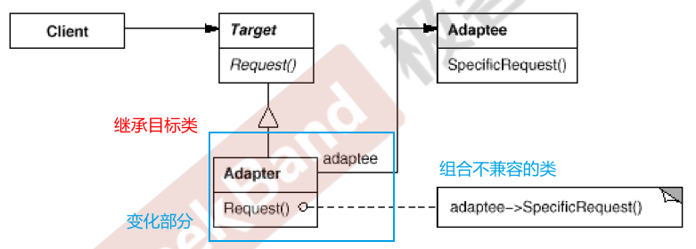
```cpp
//目标接口（新接口）
class ITarget
{
public:
    virtual void process() = 0;
};

//遗留接口（老接口）
class IAdaptee
{
public:
    virtual void foo(int data) = 0;
    virtual int bar() = 0;
};

//遗留类
class OldClass : public IAdaptee
{
    //....
};

//对象适配器
class Adapter : public ITarget //继承目标类
{
protected:
    IAdaptee *pAdaptee; //组合遗留不兼容类

public:
    Adapter(IAdaptee *pAdaptee)
    {
        this->pAdaptee = pAdaptee;
    }

    virtual void process()
    { //兼容转换代码部分
        int data = pAdaptee->bar();
        pAdaptee->foo(data);
    }
};

int main()
{
    IAdaptee *pAdaptee = new OldClass();

    ITarget *pTarget = new Adapter(pAdaptee);
    pTarget->process();
}

//另一种：类适配器
class Adapter : public ITarget,
                protected OldClass
{
    //多继承，重载类方法
};
```

## 6.4 mediator中介者
**【定义】**
> 用一个中介对象来封装（**封装变化**）一系列的对象交互。中介者使个对象不需要现实的相互引用（**编译时依赖->运行时依赖**），从而使其松耦合，并且可以独立的改变他们之间的交互。

中介者模式是将对各对象的控制逻辑进行**集中管理**，简化了系统的维护。

- 门面模式是解耦系统内和系统外（单向）的关联关系
- 中介者模式是解耦系统内各个对象之间（双向）的关联关系


**【类图结构】****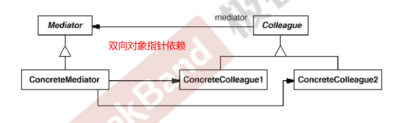

# 7 状态变化
对对象状态的变化进行管理，维持上层模块的稳定

## 7.1 状态机
**【定义】**
> 允许一个对象在其内部状态改变时改变它的行为，从而使对象看起来似乎修改了其行为。


**【类图结构】****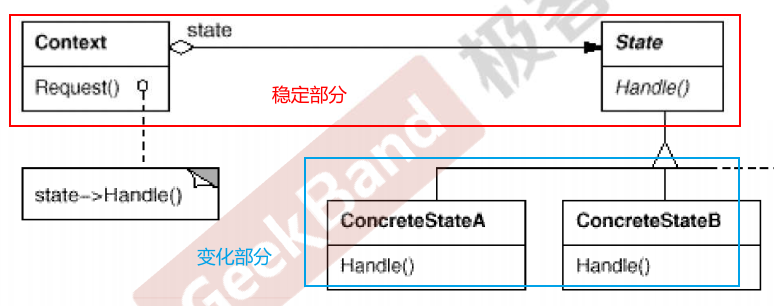
```cpp
class NetworkState
{
public:
    NetworkState *pNext;
    virtual void Operation1() = 0;
    virtual void Operation2() = 0;
    virtual void Operation3() = 0;

    virtual ~NetworkState() {}
};

class OpenState : public NetworkState
{
    static NetworkState *m_instance;

public:
    static NetworkState *getInstance()
    {
        if (m_instance == nullptr)
        {
            m_instance = new OpenState();
        }
        return m_instance;
    }

    void Operation1()
    {
        //**********
        pNext = CloseState::getInstance();
    }

    void Operation2()
    {
        //..........
        pNext = ConnectState::getInstance();
    }

    void Operation3()
    {
        //$$$$$$$$$$
        pNext = OpenState::getInstance();
    }
};

class CloseState : public NetworkState
{
};

class NetworkProcessor
{
    NetworkState *pState;

public:
    NetworkProcessor(NetworkState *pState)
    {
        this->pState = pState;
    }

    void Operation1()
    {
        //...
        pState->Operation1();
        pState = pState->pNext;
        //...
    }

    void Operation2()
    {
        //...
        pState->Operation2();
        pState = pState->pNext;
        //...
    }

    void Operation3()
    {
        //...
        pState->Operation3();
        pState = pState->pNext;
        //...
    }
};
```

## 7.2 memento备忘录
**【定义】**
> 在不破坏封装性的前提下，捕获一个对象的内部状态，并在该对象之外保存这个状态（**备份**），这样在以后就可以将该对象恢复到原先保存的状态

在今天，**对象序列化技术**更加高级有效，可以代替备忘录模式**【类图结构】**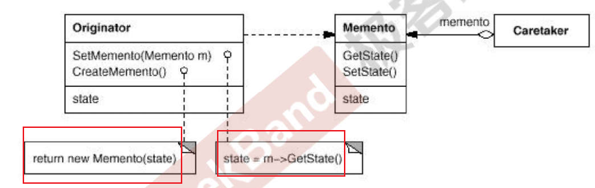
```cpp
//备忘录类
class Memento
{
private:
    string state;
public:
    Memento(const string &s) : state(s) {}
    string getState() const { return state; }
    void setState(const string &s) { state = s; }
};

class Originator
{
private:
    string state;
public:
    Originator() {}
    Memento createMomento()
    {
        Memento m(state);
        return m;
    }
    void setMomento(const Memento &m)
    {
        state = m.getState();
    }
};

int main()
{
    Originator orginator;
    //捕获对象状态，存储到备忘录
    Memento mem = orginator.createMomento();
    //... 改变orginator状态
    //从备忘录中恢复
    orginator.setMomento(mem);
}
```

# 8 数据结构
将组件内部特定的数据结构封装，在外部提供统一的接口，来实现与特定数据结构无关的访问

## 8.1 组合模式
**【定义】**
> 将对象组合成树形结构以表示“**部分-整体**”的层次结构。组合对象使得用户对单个对象和组合对象的使用具有一致性（**稳定**）

组合模式将**一对多的关系转化为一对一的关系，使得客户代码无需关系单个对象还是组合的对象容器****【类图结构】****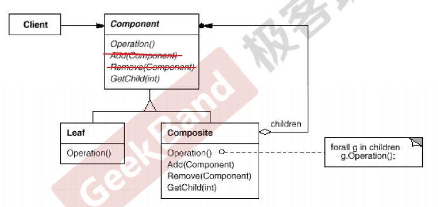
```cpp
#include <iostream>
#include <list>
#include <string>
#include <algorithm>

using namespace std;

class Component
{
public:
    virtual void process() = 0;
    virtual ~Component() {}
};

//树节点
class Composite : public Component
{
private:
    string name;
    list<Component *> elements;

public:
    Composite(const string &s) : name(s) {}

    void add(Component *element)
    {
        elements.push_back(element);
    }
    void remove(Component *element)
    {
        elements.remove(element);
    }
    void process()
    {
        //1. process current node
        //2. process leaf nodes
        for (auto &e : elements)
            e->process(); //多态调用
    }
};

//叶子节点
class Leaf : public Component
{
private:
    string name;

public:
    Leaf(string s) : name(s) {}

    void process()
    {
        //process current node
    }
};

void Invoke(Component &c)
{
    //...
    c.process();
    //...
}

int main()
{
    Composite root("root");
    Composite treeNode1("treeNode1");
    Composite treeNode2("treeNode2");
    Composite treeNode3("treeNode3");
    Composite treeNode4("treeNode4");
    Leaf leat1("left1");
    Leaf leat2("left2");

    root.add(&treeNode1);
    treeNode1.add(&treeNode2);
    treeNode2.add(&leaf1);

    root.add(&treeNode3);
    treeNode3.add(&treeNode4);
    treeNode4.add(&leaf2);

    Invoke(root);
    Invoke(leaf2);
    Invoke(treeNode3);
}
```

## 8.2 迭代器
**【定义】**
> 提供一种方法**顺序访问**一个聚合对象中的各个元素，又不暴露该对象的内部表示

**【类图结构】****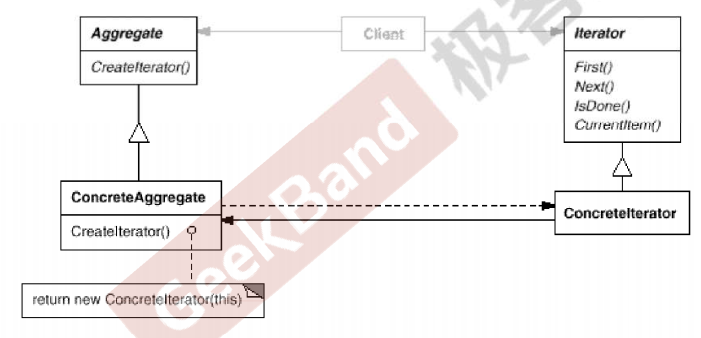
```cpp
//这种实现已经过时了
template <typename T>
class Iterator
{
public:
    virtual void first() = 0;
    virtual void next() = 0;
    virtual bool isDone() const = 0;
    virtual T &current() = 0;
};

template <typename T>
class MyCollection
{
public:
    Iterator<T>* GetIterator()
    {
        return new CollectionIterator<T>(this);
    }
};

template <typename T>
class CollectionIterator : public Iterator<T>
{
private:
    MyCollection<T> mc;

public:
    CollectionIterator(const MyCollection<T> &c) : mc(c) {}

    void first() override
    {
    }
    void next() override
    {
    }
    bool isDone() const override
    {
    }
    T &current() override
    {
    }
};

int main()
{
    MyCollection<int> mc;
    Iterator<int>* iter = mc.GetIterator();
    //虚函数运行时多态，耗时
    for (*iter.first(); !*iter.isDone(); *iter.next())
    {
        cout << *iter.current() << endl;
    }
}
```

## 8.3 责任链
**【定义】**
> 将多个对象连成一条链路（**链表**），并沿着这个链路传递请求，直到有一个对象处理它为止

两个主要函数需要不同的子类实现：

- 当前对象释放可以处理消息
- 处理请求消息

**【类图结构】****
```cpp
#include <iostream>
#include <string>

using namespace std;

enum class RequestType
{
    REQ_HANDLER1,
    REQ_HANDLER2
};
//消息请求类
class Reqest
{
private:
    string description;
    RequestType reqType;
public:
    Reqest(const string &desc, RequestType type) : description(desc), reqType(type) {}
    RequestType getReqType() const { return reqType; }
    const string &getDescription() const { return description; }
};

class ChainHandler
{
private:
    ChainHandler *nextChain;//处理请求的对象链表
    void sendReqestToNextHandler(const Reqest &req)
    {//发生请求到下一节点
        if (nextChain != nullptr)
            nextChain->handle(req);
    }
protected:
    //当前对象释放可以处理请求
    virtual bool canHandleRequest(const Reqest &req) = 0;
    virtual void processRequest(const Reqest &req) = 0;

public:
    ChainHandler() { nextChain = nullptr; }
    void setNextChain(ChainHandler *next) { nextChain = next; }
    void handle(const Reqest &req)
    {
        if (canHandleRequest(req))
            processRequest(req);
        else
            sendReqestToNextHandler(req);
    }
};
//子类实现两个虚函数
class Handler1 : public ChainHandler
{
protected:
    bool canHandleRequest(const Reqest &req) override
    {
        return req.getReqType() == RequestType::REQ_HANDLER1;
    }
    void processRequest(const Reqest &req) override
    {
        cout << "Handler1 is handle reqest: " << req.getDescription() << endl;
    }
};
class Handler2 : public ChainHandler
{
protected:
    bool canHandleRequest(const Reqest &req) override
    {
        return req.getReqType() == RequestType::REQ_HANDLER2;
    }
    void processRequest(const Reqest &req) override
    {
        cout << "Handler2 is handle reqest: " << req.getDescription() << endl;
    }
};

int main()
{
    Handler1 h1;
    Handler2 h2;
    h1.setNextChain(&h2);

    Reqest req("process task ... ", RequestType::REQ_HANDLER2);
    h1.handle(req);
    return 0;
}
```

# 9 行为变化

## 9.1 命令模式
**【定义】**
> 将一个请求封装成一个对象，使你可以用不同的请求对客户进行参数化、对请求排队或记录请求日志，以及支持可撤销操作

命令模式**将行为抽象成对象**，和C++函数对象（应用更广）有些类似。**【类图结构】****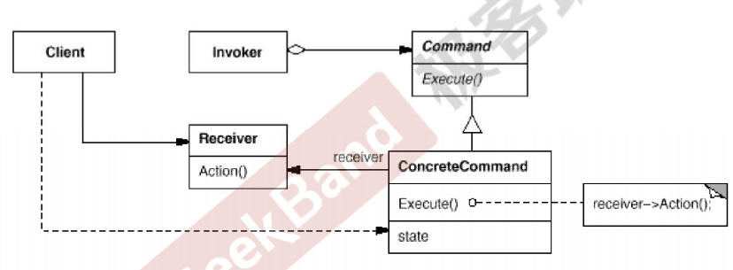
```cpp
#include <iostream>
#include <vector>
#include <string>
using namespace std;

class Command
{
public:
    virtual void execute() = 0;
};
//请求类，可以填充各种信息参数
class ConcreteCommand1 : public Command
{
private:
    string arg;

public:
    ConcreteCommand1(const string &a) : arg(a) {}
    void execute() override
    {
        cout << "#1 process..." << arg << endl;
    }
};

class ConcreteCommand2 : public Command
{
private:
    string arg;

public:
    ConcreteCommand2(const string &a) : arg(a) {}
    void execute() override
    {
        cout << "#2 process..." << arg << endl;
    }
};

class MacroCommand : public Command
{
private:
    vector<Command *> commands;//多个命令组合成宏

public:
    void addCommand(Command *c) { commands.push_back(c); }
    void execute() override
    {
        for (auto &c : commands)
        {
            c->execute();
        }
    }
};

int main()
{
    ConcreteCommand1 command1(receiver, "Arg ###");
    ConcreteCommand2 command2(receiver, "Arg $$$");

    MacroCommand macro;
    macro.addCommand(&command1);
    macro.addCommand(&command2);

    macro.execute();
}
```

## 9.2 访问者
**【定义】**
> 表示一个作用于某类结构中各元素的操作，可以在不修改类（**稳定）**的前提下**扩展**作用域这些类元素的新操作（**变化）**

解决**从基类到子类需要依次添加新函数**的问题，避免沉重的变更负担，使用**双重分发**为类的各层次子类添加新的操作。Visitor模式的缺点是：**Element类和子类结构不能改变**，需要稳定。**【类图结构】****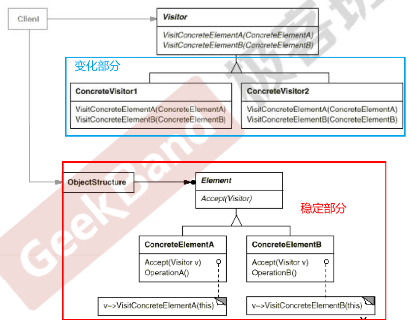
```cpp
#include <iostream>
using namespace std;

class Visitor;

class Element
{
public:
    virtual void accept(Visitor &visitor) = 0; //第一次多态辨析

    virtual ~Element() {}
};

class ElementA : public Element
{
public:
    void accept(Visitor &visitor) override
    {
        visitor.visitElementA(*this);
    }
};

class ElementB : public Element
{
public:
    void accept(Visitor &visitor) override
    {
        visitor.visitElementB(*this); //第二次多态辨析
    }
};
//=======上面的基类和子类不改变，由Visitor来添加新的处理===
class Visitor
{
public:
    virtual void visitElementA(ElementA &element) = 0;
    virtual void visitElementB(ElementB &element) = 0;

    virtual ~Visitor() {}
};
//扩展1，添加新的处理
class Visitor1 : public Visitor
{
public:
    void visitElementA(ElementA &element) override
    {
        cout << "Visitor1 is processing ElementA" << endl;
    }

    void visitElementB(ElementB &element) override
    {
        cout << "Visitor1 is processing ElementB" << endl;
    }
};
//扩展2，添加新的处理
class Visitor2 : public Visitor
{
public:
    void visitElementA(ElementA &element) override
    {
        cout << "Visitor2 is processing ElementA" << endl;
    }

    void visitElementB(ElementB &element) override
    {
        cout << "Visitor2 is processing ElementB" << endl;
    }
};

int main()
{
    Visitor2 visitor;
    ElementB elementB;
    elementB.accept(visitor); //两次多态辨析

    ElementA elementA;
    elementA.accept(visitor);//两次多态辨析

    return 0;
}
```

# 10 领域规则
结合特定领域，将问题抽象为语法规则，从而给出该领域下的一般性解决方案

## 10.1 interpreter解析器
**【定义】**
> 给定一个语言，定义它的**文法表示**，并定义一种**解释器**，这个解释器使用该表示来解释语言中的句子

**【类图结构】****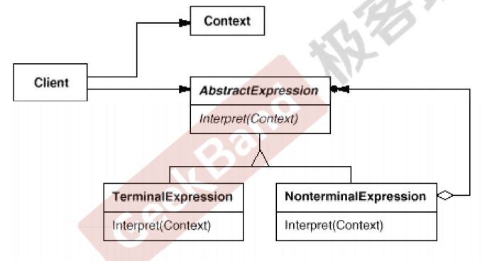
```cpp
#include <iostream>
#include <map>
#include <stack>

using namespace std;

class Expression
{
public:
    virtual int interpreter(map<char, int> var) = 0;
    virtual ~Expression() {}
};

//变量表达式
class VarExpression : public Expression
{
private:
    char key;

public:
    VarExpression(const char &key)
    {
        this->key = key;
    }

    int interpreter(map<char, int> var) override
    {
        return var[key];
    }
};
//符号表达式
class SymbolExpression : public Expression
{
    // 运算符左右两个参数
protected:
    Expression *left;
    Expression *right;

public:
    SymbolExpression(Expression *left, Expression *right) : left(left), right(right)
    {
    }
};
//加法运算
class AddExpression : public SymbolExpression
{
public:
    AddExpression(Expression *left, Expression *right) : SymbolExpression(left, right)
    {
    }
    int interpreter(map<char, int> var) override
    {
        return left->interpreter(var) + right->interpreter(var);
    }
};
//减法运算
class SubExpression : public SymbolExpression
{
public:
    SubExpression(Expression *left, Expression *right) : SymbolExpression(left, right)
    {
    }
    int interpreter(map<char, int> var) override
    {
        return left->interpreter(var) - right->interpreter(var);
    }
};
//解析字符串，转换成表达式对象
Expression *analyse(string expStr)
{
    stack<Expression *> expStack;
    Expression *left = nullptr;
    Expression *right = nullptr;
    for (int i = 0; i < expStr.size(); i++)
    {
        switch (expStr[i])
        {
        case '+': // 加法运算
            left = expStack.top();
            right = new VarExpression(expStr[++i]);
            expStack.push(new AddExpression(left, right));
            break;
        case '-': // 减法运算
            left = expStack.top();
            right = new VarExpression(expStr[++i]);
            expStack.push(new SubExpression(left, right));
            break;
        default: // 变量表达式
            expStack.push(new VarExpression(expStr[i]));
        }
    }
    Expression *expression = expStack.top();
    return expression;
}

void release(Expression *expression)
{
    //释放表达式树的节点内存...
}

int main(int argc, const char *argv[])
{
    string expStr = "a+b-c+d-e";
    map<char, int> var;
    var.insert(make_pair('a', 5));
    var.insert(make_pair('b', 2));
    var.insert(make_pair('c', 1));
    var.insert(make_pair('d', 6));
    var.insert(make_pair('e', 10));

    Expression *expression = analyse(expStr);
    int result = expression->interpreter(var);
    cout << result << endl;
    release(expression);//释放所有new的对象
    return 0;
}
```
