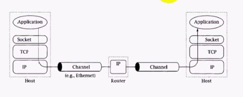
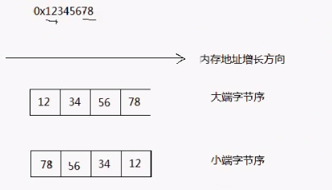
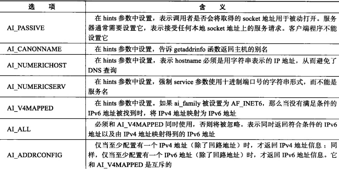

socket是用户进程和内核网络协议栈之间的编程接口；socket可以用于本机的进程间通信，也可以用于网络是不同主机的进程间通信。


# 1 socket类型

- 流式套接字 **SOCK_STREAM**：  提供面向连接的、可靠的数据传输服务，数据无差错，无重复的发送，且按发送顺序接收。 用于TCP
- 数据报式套接字 **SOCK_DGRAM**：  提供无连接服务。不提供无错保证，数据可能丢失或重读，且接受循序混乱. 用于UDP
- 原始套接字 **SOCK_RAW**：  直接将应用层数据封装成IP层数据格式


# 2 socket地址

## 2.1 通用地址结构
通用地址结构可以用于任何协议的socket。结构如下：
```c
struct sockaddr
{
    sa_faminly_t  sin_family;
    char sa_data[14]; //对应ipv4结构中后三个成员，大小兼容
};
```

- sin_family： 指定地址家族，取值如下：
   - AF_UNIX：unix本地域协议
   - AF_INET：IPv4协议
   - AF_INET6：IPv6协议
- sa_data: 由地址家族决定格式
> 注意：**所有专用的地址类型在使用是都需要强制转换成通用地址sockaddr，因为socket所有的API都是以sockaddr为参数类型的。**

**

## 2.2 IPv4地址结构
ipv4地址结构只能用于ipv4的地址协议，头文件位置：`<netinet/in.h>`
```c
struct sockaddr_in
{
    uint8_t  sin_len;
    sa_family_t sin_family;
    in_port_t  sin_port;
    struct in addr sin_addr;
    char sin_zero[8];
};

struct in_addr
{
    uint32_t   s_addr;
｝;
```

- sin_len: 整个结构体的长度
- sin_family： 指定地址家族；ipv4需要设置为**AF_INET**
- sin_port: 端口
- sin_addr: ip地址
- sin_zero:  暂无用处，都设置为0

## 2.3 Unix本地域地址结构
```c
struct sockaddr_un
{
 	sa_family_t sin_family; //地址族AF_UNIX
    char sun_path[108]; //文件路径名
}
```

# 3 网络字节序

- **大端字节序**：最高有效位存储于最低内存地址，最低有效位存储于最高内存地址（**高低低高）**。
- **小端字节序**：最高有效位存储于最高内存地址，最低有效位存储于最低内存地址（**高高低低**）。



下面代码可以查看当前系统是什么字节序：
```c
#include <stdio.h>
union Test
{
    short value;
    char bytes[sizeof(short)];
};

int main()
{
    Test test;
    test.value=0x0102;
    if (test.bytes[0] == 1 && test.bytes[1] ==2)
        printf("big endian\n");
    else if (test.bytes[0] == 2 && test.bytes[1] ==1)
        printf("little endian\n");
    else
        printf("unknown\n");
}
```

## 3.1 字节序转换函数
头文件:`**<arpa/inet.h>**`**，****长整型用于转换IP地址，短整型用于转换端口号**

- uint32_t **htonl**(uint32_t hostlong): 将4字节整数由主机字节序转换为网络字节序
- uint16_t **htons**(uint16_t hostshort)：将2字节整数由主机字节序转换为网络字节序
- uint32_t **ntohl**(uint32_t netlong)：将4字节整数由网络字节序转换为主机字节序
- uint16_t **ntohs**(uint16_t netshort)：将2字节整数由网络字节序转换为主机字节序


示例代码：
```cpp
#include <iostream>
#include <arpa/inet.h>

int main(int, char**) {
    unsigned int a=0x12345678;
    unsigned char* p=(unsigned char*)&a;
    printf("%0x,%0x,%0x,%0x\r\n", p[0],p[1],p[2],p[3]);//打印本机字节序

    unsigned int b = htonl(a); //转换为网络字节序
    unsigned char* p=(unsigned char*)&b;
    printf("%0x,%0x,%0x,%0x\r\n", p[0],p[1],p[2],p[3]);
}
```

# 4 IP地址转换函数
头文件: `**<netinet/in.h>**`和`**<arpa/inet.h>**`

- in_addr_t **inet_addr**(const char *cp):   将xxx.xxx.xxx.xxx格式转换为32位int
- char* **inet_ntoa**(in_addr in):   将32位int转换为xxx.xxx.xxx.xxx格式
- int **inet_aton**(const char_ cp, in_addr_ inp):   将xxx.xxx.xxx.xxx格式转换为32位int


示例代码:
```c
#include <stdio.h>
#include <arpa/inet.h>

int main()
{
    unsigned long addr = inet_addr("192.168.0.100");
    printf("addr=%0x\r\n", ntohl(addr));

    struct in_addr ipaddr;
    ipaddr.s_addr = addr;
    printf("%s\r\n", inet_ntoa(ipaddr));
    return 0;
}
```
下面两个函数同时适用于IPv4和IPv6，可以完成同样的功能：

- `int inet_pton(int af, const char *src, void *dst)`：将点分表示字符串转换为网络字节序整数，af指定地址族
- `const char *inet_ntop(int af, const void *src, char *dst, socklen_t size)`：将网络字节序整数转换为可读字符串

# 5 地址信息函数

- getsockname: 获取指定socket id绑定的本地地址和端口
- getpeername: 获取指定socket id已连接的remote地址和端口
- gethostname: 获取本机主机名


## 5.1 获取host信息
```c
//根据name获取host主机信息
struct hostent* gethostbyname(const char *name);
//根据IP地址获取host主机完整信息
struct hostent *gethostbyaddr(const void *addr,
                              socklen_t len, int type);
//hostent结构体定义如下：
struct hostent {
    char*  h_name;            //主机名
    char** h_aliases;         //主机别名列表，可能多个
    int    h_addrtype;        //地址类型
    int    h_length;          //地址长度
    char** h_addr_list;       //IP地址列表，网络字节序，可能多个
}
```


## 5.2 获取serv服务信息
```c
//根据服务名称获取服务信息
struct servent *getservbyname(const char *name, const char *proto);
//根据默认端口号获取服务信息
struct servent *getservbyport(int port, const char *proto);
//服务信息结构体定义：
struct servent {
    char*  s_name;       /* official service name */
    char** s_aliases;    /* alias list */
    int    s_port;       /* port number */
    char*  s_proto;      //协议类型，TCP or UDP
}
```

使用示例如下：
```c
#include <assert.h>
#include <stdio.h>
#include <netdb.h>
#include <sys/socket.h>

int main(int argc, char* argv[])
{
    assert(argc == 2);
    struct hostent* hostInfo = gethostbyname(argv[1]);
    //打印host信息
    printf("host info: name:%s, addrtype:%d, length:%d, first addr:%s\n", hostInfo->h_name, hostInfo->h_addrtype,
            hostInfo->h_length, hostInfo->h_addr_list[0]);
    //获取daytime服务的信息
    struct servent* servInfo = getservbyname("daytime", "tcp");
    printf("serv daytime info: name:%s, s_port:%d, protocol:%s", servInfo->s_name, servInfo->s_port, servInfo->s_proto);

    return 0;
}
```


## 5.3 通用的getaddrinfo
getaddrinfo函数可以同时支持上面两种功能，其内部也是调用上面的函数，定义如下：
```c
int getaddrinfo(const char *node, const char *service,
                const struct addrinfo *hints,
                struct addrinfo **res);

void freeaddrinfo(struct addrinfo *res);//因为内部申请了堆内存，需要手动释放结构体

struct addrinfo {
    int              ai_flags;
    int              ai_family;   //地址族
    int              ai_socktype; //socket类型
    int              ai_protocol; //协议类型
    socklen_t        ai_addrlen;
    struct sockaddr *ai_addr;     //socket地址
    char            *ai_canonname; //主机别名
    struct addrinfo *ai_next; //next指针
};
```

ai_flags的取值含义如下：
