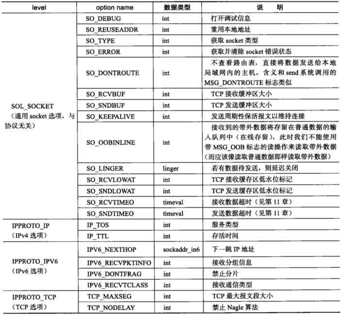
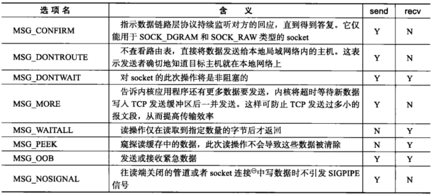
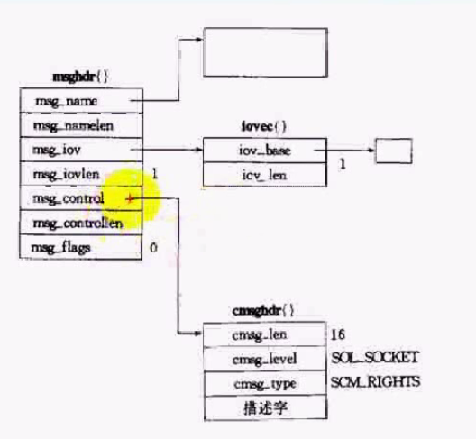

# 1 TCP通信过程
TCP客户端/服务器(C/S)结构的通信过程如下：


# 2 服务器端函数

## 2.1 socket
头文件： `<sys/socket.h>`函数定义： `int socket(int domain, int type, int protocol);`功能：  创建一个套接字用于通信； 返回值为socket 描述符，失败返回-1参数：

- domain： 指定协议族
- type： 指定socket类型，SOCK_STREAM、SOCK_DGRAM，SOCK_RAW
- protocol: 协议类型。指定0表示自动选择协议类型

## 2.2 setsockopt
头文件： `<sys/socket.h>`函数定义： `int setsockopt(int sockfd, int level, int optname, const void *optval, socklen_t optlen);`功能：  绑定本地地址到socket； 返回值为0，失败返回-1参数：

- sockfd: 要设置的socket id
- level： 设置的级别，一般设置为SOL_SOCKET
- optname： 设置参数名。例如地址重复利用为参数**SO_REUSEADDR**
- optval: 参数值
- optlen: 参数值的长度
> **NOTE: 服务器要尽可能使用****SO_REUSEADDR****;可以不必等待端口TIME_WAIT状态消失就可以重启服务器 **

下图列出来常用的socket选项：

## 2.3 bind
头文件： `<sys/socket.h>`函数定义： `int bind(int sockid, const sockaddr* addr, socklen_t addrlen);`功能：  绑定本地地址到socket； 返回值为0，失败返回-1参数：

- addr:  要绑定的地址
- addrlen： 地址长度

## 2.4 listen
头文件： `<sys/socket.h>`函数定义： `int listen(int sockid, int backlog);`功能：  监听socket的连接请求； 返回值为0，失败返回-1参数：

- backlog: 最大连接个数

## 2.5 accept
头文件： `<sys/socket.h>`函数定义： `int accept(int sockid, struct sockaddr* addr, socklen_t addrlen);`功能：  从已完成连接的队列中返回第一个连接，队列空则继续等待；成功返回connection id，失败返回-1
> 注意：accept只是从监听队列中取出连接，不关心当前连接的状态和网络的变化。


# 3 客户端端函数

## 3.1 connect
头文件： `<sys/socket.h>`函数定义： `int connect(int sockid, const sockaddr* addr, socklen_t addrlen);`功能：  建立一个连接到addr的客户端socket； 成功返回0，失败返回-1


# 4 TCP读写函数

## 4.1 recv
头文件： `<sys/socket.h>`函数定义： `ssize_t recv(int sockfd, void* buf, size_t len, int flags);`功能： 从socket获取数据； 返回读取的字节数，失败返回-1参数：

- flags: 常用选项：MSG_OOB（指定接收带外数据）； MSG_PEEK（接收数据，并保留缓冲区数据不清除）

## 4.2 send
头文件： <sys/socket.h>函数定义： `int send(int s, const void *buf, int len, unsigned int flags);`功能： 从socket发送数据到指定主机； 返回发送的字节数，失败返回-1
flags的常用选项如下：

# 5 通用读写函数 
socket API提供了一堆通用的读写函数，能用于TCP和UDP，定义如下：
```c
ssize_t recvmsg(int sockfd, struct msghdr *msg, int flags);
ssize_t sendmsg(int sockfd, const struct msghdr *msg, int flags);
//msgHdr结构体定义如下：
struct msghdr
{
    void         *msg_name;       //指向socket变量，对于TCP设置为NULL
    socklen_t     msg_namelen;    //socket地址长度
    struct iovec *msg_iov;        //内存块数组
    size_t        msg_iovlen;     //msg_iov内存块个数
    void         *msg_control;    /* Ancillary data*/
    size_t        msg_controllen; /* Ancillary data buffer len */
    int           msg_flags;      /* Flags (unused) */
};
```
msghdr与其他结构体的关系如下：


# 6 关闭连接函数

- `int close(int fd);`：将fd的引用计数减一，当引用计数为0时，关闭连接或文件。需要注意的是多进程中**父进程和子进程都要执行close操作**，不然引用计数一直不为0。
- `int shutdown(int sockfd, int how);`：立刻终止连接，不是减少引用计数。how参数用以决定具体的行为，取值如下：
   - SHUT_RD：关闭socket的读
   - SHUT_WR：关闭socket的写
   - SHUT_RDWR：同时关闭socket读写

# 7 完整代码示例

## 服务器端
```c
#include <stdio.h>
#include <sys/socket.h>
#include <arpa/inet.h>
#include <string.h>
#include <unistd.h>

int main()
{
    //create socket
    int socketId;
    if ((socketId = socket(PF_INET, SOCK_STREAM, IPPROTO_TCP)) < 0)
    {
        printf("socket create failed\r\n");
    }

    sockaddr_in addr;
    memset(&addr, 0, sizeof(addr));
    addr.sin_family = AF_INET; //指定协议
    addr.sin_port = htons(5188); //指定网络字节序格式的端口号
    /** addr.sin_addr = htonl(INADDR_ANY); //指定本地任意ip地址，使用网络字节序 */
    addr.sin_addr.s_addr = inet_addr("127.0.0.1");
    
    //start bind
    if (bind(socketId, (sockaddr*)&addr, sizeof(addr)) < 0)
    {
        printf("socket bind failed\r\n");
    }
    //start listen
    if (listen(socketId, SOMAXCONN) < 0)
    {
        printf("socket listen failed\r\n");
    }

    //get connection from socket queue
    sockaddr remoteAddr;
    socklen_t remoteLen = sizeof(remoteAddr);
    int remoteConnId;
   
    pid_t pid;
    while (1)
    {
        //get connection from socket queue
        if ((remoteConnId = accept(socketId, (sockaddr*)&remoteAddr, &remoteLen)) < 0)
        {
            printf("socket accept failed\r\n");
            break;
        }

        pid = fork(); //创建新进程处理socket连接
        if (pid == -1)
        {
            printf("create new process failed\r\n");
            break;
        }
        if (pid == 0)
        {
            //子进程不需要处理socket监听，关闭监听
            close(socketId);
            //子进程处理connection
            char rcvBuf[1024];
            while(1)
            {
                memset(rcvBuf, 0, sizeof(rcvBuf));
                int ret = read(remoteConnId, rcvBuf,sizeof(rcvBuf));// 从socket中读取数据流
                if (ret == 0)
                {
                    printf("close client: [%d]\r\n", remoteConnId);
                    break;
                }
                fputs(rcvBuf, stdout);
                write(remoteConnId, rcvBuf, strlen(rcvBuf));//将数据再写回remote端
            }
            close(remoteConnId);
            //退出子进程
            _exit(0);
        }
        else
        {
            //父进程不需要处理socket连接，关闭connection
            close(remoteConnId);
        }
    }
    close(socketId);
    return 0;
}
```

## 客户端
```c
#include <stdio.h>
#include <sys/socket.h>
#include <arpa/inet.h>
#include <string.h>
#include <unistd.h>

int main()
{
    //create socket
    int socketId;
    if ((socketId = socket(PF_INET, SOCK_STREAM, IPPROTO_TCP)) < 0)
    {   
        printf("socket create failed\r\n");
    }   

    sockaddr_in addr;
    memset(&addr, 0, sizeof(addr));
    addr.sin_family = AF_INET; //指定协议
    addr.sin_port = htons(5188); //指定网络字节序格式的端口号
    addr.sin_addr.s_addr = inet_addr("127.0.0.1");
    
    //connect to server via socket
    if (connect(socketId, (sockaddr*)&addr, sizeof(addr)) < 0)
    {
        printf("connect to server failed\r\n");
    }

    char buf[1024];
    while (fgets(buf, sizeof(buf), stdin) != NULL)
    {
        write(socketId, buf, strlen(buf));
        read(socketId, buf, sizeof(buf));//read reply from server

        printf("received from server: [%s]\r\n", buf);
        memset(buf, 0, sizeof(buf));
    }

    close(socketId);
    return 0;
}
```

