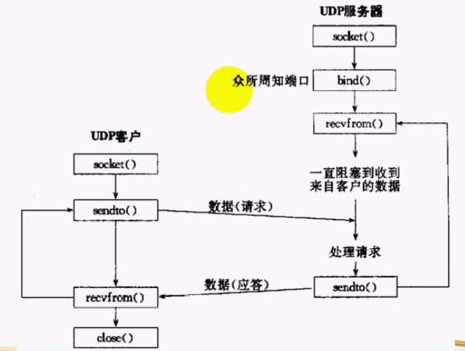

# 1 UDP通信过程
UDP客户端/服务器(C/S)结构的通信过程如下:


# 2 完整代码示例

## server
```cpp
#include <unistd.h>
#include <stdlib.h>
#include <stdio.h>
#include <errno.h>
#include <sys/types.h>
#include <sys/socket.h>
#include <netinet/in.h>
#include <string.h>

#define ERR_EXIT(m)\
    do\
    {\
        perror(m);\
        exit(EXIT_FAILURE);\
    }while(0)

int main()
{
    int sock;
    if ((sock = socket(PF_INET, SOCK_DGRAM, 0)) < 0)//类型指定为数据报式，用于TCP
    {
        ERR_EXIT("socket create failed"); 
    }

    sockaddr_in servaddr;
    servaddr.sin_family = AF_INET;
    servaddr.sin_port = htons(5188);
    servaddr.sin_addr.s_addr = htonl(INADDR_ANY);

    //bind the socket
    if (bind(sock, (sockaddr*)&servaddr, sizeof(servaddr)) < 0)
    {
        ERR_EXIT("bind socket failed");
    }

    //send and receive data
    char recvbuf[1024] = {0};
    sockaddr_in remoteAddr;
    socklen_t remoteLen = sizeof(remoteAddr);
    int ret;
    while (1)
    {
        memset(recvbuf, 0, sizeof(recvbuf));
        ret = recvfrom(sock, recvbuf, sizeof(recvbuf), 0, (sockaddr*)&remoteAddr, &remoteLen);
        if (ret == -1)
        {
            if (errno == EINTR)
                continue;//是系统中断导致，则继续
            ERR_EXIT("recvfrom failed");
        }
        else if (ret > 0)
        {
            printf("%s\r\n", recvbuf);
            sendto(sock, recvbuf, ret, 0, (sockaddr*)&remoteAddr, remoteLen);
        }
    }
    close(sock);
}
```

## client
```cpp
#include <unistd.h>
#include <stdlib.h>
#include <stdio.h>
#include <errno.h>
#include <sys/types.h>
#include <sys/socket.h>
#include <netinet/in.h>
#include <string.h>
#include <arpa/inet.h>

#define ERR_EXIT(m)\
    do\
    {\
        perror(m);\
        exit(EXIT_FAILURE);\
    }while(0)

int main()
{
    int sock;
    if ((sock = socket(PF_INET, SOCK_DGRAM, 0)) < 0)//类型指定为数据报式，用于TCP
    {
        ERR_EXIT("socket create failed"); 
    }

    sockaddr_in servaddr;
    servaddr.sin_family = AF_INET;
    servaddr.sin_port = htons(5188);
    servaddr.sin_addr.s_addr = inet_addr("127.0.0.1");//指定server地址

    //send and receive data
    char sendbuf[1024] = {0};
    int ret;
    while (fgets(sendbuf, sizeof(sendbuf), stdin) != NULL)
    {
        sendto(sock, sendbuf, strlen(sendbuf), 0, (sockaddr*)&servaddr, sizeof(servaddr));
        memset(sendbuf, 0, sizeof(sendbuf));
        ret = recvfrom(sock, sendbuf, sizeof(sendbuf), 0, NULL, NULL);//从server接收，不需要指定ip
        if (ret == -1)
        {
            if (errno == EINTR)
                continue;//是系统中断导致，则继续
            ERR_EXIT("recvfrom failed");
        }
        else if (ret > 0)
        {
            printf("%s\r\n", sendbuf);
            memset(sendbuf, 0, sizeof(sendbuf));
        }
    }
    close(sock);
}
```

# 3 UDP的注意点

- UDP报文可能会**丢失或重复**
- UDP报文可能会**乱序**
- UDP缺乏流量控制，**缓冲区数据可能被覆盖**
- UDP数据报文可能被截断
- recvfrom返回0，不代表连接关闭，因为UDP是无连接的
- ICMP**异步错误**，本端无法知道对端是否开启，发生数据不会出现错误提示（可以先调用一下**UDP connect函数**，这样发送数据会返回错误）
