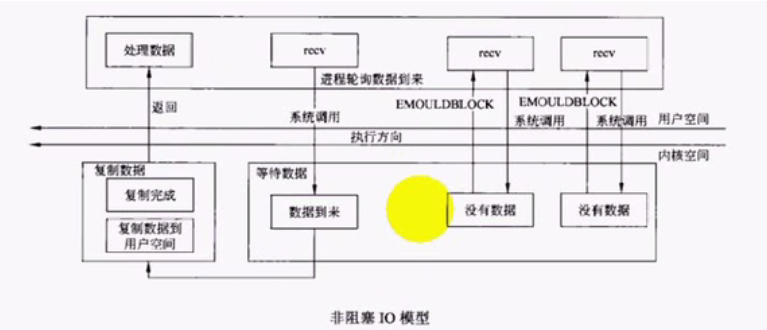
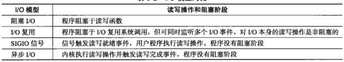
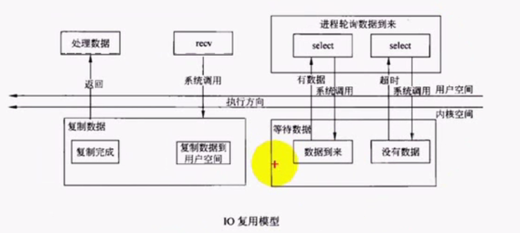
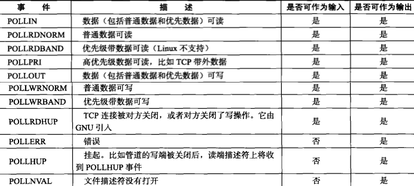
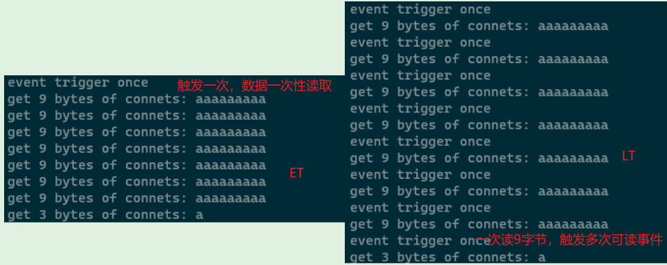
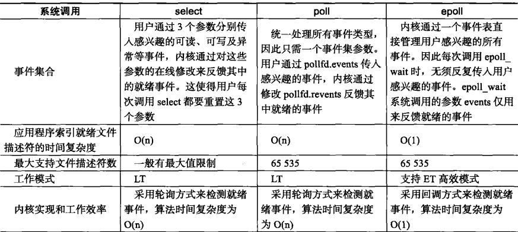
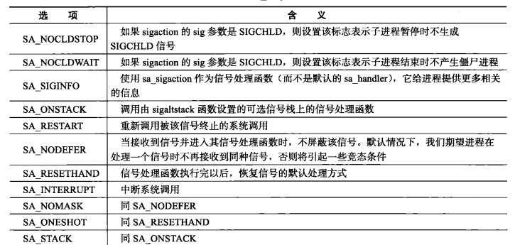
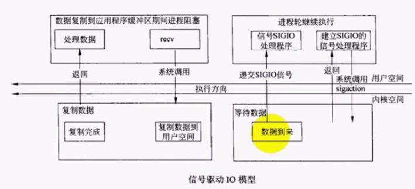
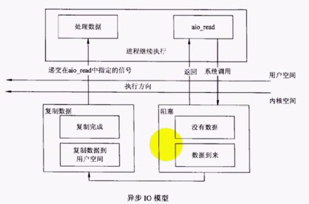

# 1 IO模型总结
阻塞模式：调用recv函数接收对端数据时，如果对端没有数据发送过来，进程会一直阻塞在那里什么都不能做，直到数据到来才能开始工作。图示如下：
Socket支持设置为非阻塞模式，需要调用下面函数设置：

```c
fcntl(socketId, F_SETFL, flag | 0_NONBLOCK);
```
非阻塞模式下，如果recv没有发现数据，会返回-1，错误代码为**EMOULDBLOCK**, 进程不会被阻塞。根据错误代码可以判断当前对端没有发送数据，可以尝试继续调用recv函数。图示如下：
 IO模型的差异总结如下：

# 2 IO复用
用select管理IO，监听多个文件描述符，若其中某个或多个描述符对应的通道有数据到来，select方法就会返回。然后再用recv去获取数据，就不会出现阻塞。图示如下：


## 2.1 select复用
头文件：`<sys/select.h>`函数定义： `int select(int nfds, fd_set* readfds, fd_set* writefds, fd_set* exceptfds, timeval* timeout);`功能： 同时管理多个IO，IO有事件发生就会返回；返回值为IO事件的个数和哪些IO， 失败返回-1。参数：

- nfds: 所有集合中最大描述符值+1
- readfds: 有数据可读时函数返回的socket集合
- writefds: 有数据可写时函数返回的socket集合
- exceptfds: 出现异常时函数返回的集合
- timeout:  超时时间，NULL代表不超时


描述符集合相关的几个函数(<sys/select.h>)：

- void FD_CLR(int fd, fd_set *set):  将fd从集合中移除
- int  FD_ISSET(int fd, fd_set *set): fd是否再集合之中
- void FD_SET(int fd, fd_set *set): 将fd添加到集合
- void FD_ZERO(fd_set *set): 清空集合


**select代码示例**:
```c
//client.c:
#include <stdio.h>
#include <sys/socket.h>
#include <arpa/inet.h>
#include <string.h>
#include <unistd.h>
#include <sys/select.h>

int main()
{
    //create socket
    int socketId;
    if ((socketId = socket(PF_INET, SOCK_STREAM, IPPROTO_TCP)) < 0)
    {
        printf("socket create failed\r\n");
    }

    sockaddr_in addr;
    memset(&addr, 0, sizeof(addr));
    addr.sin_family = AF_INET; //指定协议
    addr.sin_port = htons(5188); //指定网络字节序格式的端口号
    addr.sin_addr.s_addr = inet_addr("127.0.0.1");

    //connect to server via socket
    if (connect(socketId, (sockaddr*)&addr, sizeof(addr)) < 0)
    {
        printf("connect to server failed\r\n");
    }

    //使用select实现IO复用监听、读写数据
    fd_set rset;
    FD_ZERO(&rset);//create a set and initial it
    int stdinFd = fileno(stdin); //获取标准输入的文件描述符
    int maxfd = (stdinFd < socketId) ? socketId : stdinFd;
    int nready;
    char recvbuf[1024];
    char sendbuf[1024];

    while(1)
    {
        FD_SET(stdinFd, &rset);
        FD_SET(socketId, &rset);
        nready = select(maxfd + 1, &rset, NULL, NULL, NULL);    
        if (nready == -1)
            printf("select failed\r\n");
        else if (nready == 0)
            continue;
        else
        {
            //产生可读事件，返回的是那个fd产生的
            //检查是那个fd产生的事件
            if (FD_ISSET(socketId, &rset))
            {
                //是socket产生可读事件，表示数据到来，获取数据
                read(socketId, recvbuf, sizeof(recvbuf));
                printf("received from server: %s\r\n", recvbuf);
                memset(recvbuf, 0, sizeof(recvbuf));
            }
            else if (FD_ISSET(stdinFd, &rset))
            {
                //是控制台输入产生的可读事件，表示用户输入数据了，需要发送到server
                if (fgets(sendbuf, sizeof(sendbuf), stdin) == NULL)
                    break;
                write(socketId, sendbuf, strlen(sendbuf));
                memset(sendbuf, 0, sizeof(sendbuf));
            }
        }
    }
    close(socketId);
    return 0;
}

//=============================================
//server.c
#include <stdio.h>
#include <sys/socket.h>
#include <arpa/inet.h>
#include <string.h>
#include <unistd.h>
#include <signal.h>
#include <sys/wait.h>
#include <sys/select.h>
#include <errno.h>

void customHandler(int sig)
{
    while(waitpid(-1, NULL, WNOHANG) > 0)
        ;
}
int main()
{
    //add SIGCHLD signal handler
    signal(SIGCHLD, customHandler);
    //create socket
    int socketId;
    if ((socketId = socket(PF_INET, SOCK_STREAM, IPPROTO_TCP)) < 0)
    {
        printf("socket create failed\r\n");
    }

    sockaddr_in addr;
    memset(&addr, 0, sizeof(addr));
    addr.sin_family = AF_INET; //指定协议
    addr.sin_port = htons(5188); //指定网络字节序格式的端口号
    /** addr.sin_addr = htonl(INADDR_ANY); //指定本地任意ip地址，使用网络字节序 */
    addr.sin_addr.s_addr = inet_addr("127.0.0.1");

    //set REUSEADDR
    int on = 1;
    if(setsockopt(socketId, SOL_SOCKET, SO_REUSEADDR, &on, sizeof(on)) < 0)
    {
        printf("socket set REUSEADDR failed\r\n");
    }
    //start bind
    if (bind(socketId, (sockaddr*)&addr, sizeof(addr)) < 0)
    {
        printf("socket bind failed\r\n");
    }
    //start listen
    if (listen(socketId, SOMAXCONN) < 0)
    {
        printf("socket listen failed\r\n");
    }

    sockaddr_in remoteAddr;
    socklen_t remoteLen = sizeof(remoteAddr);
    int remoteConnId;

    //select IO复用方式实现多客户端连接处理
    int connectedClient[FD_SETSIZE];//最大值为select函数可接受的最多fd
    for (int i = 0; i < FD_SETSIZE; i++)
    {
        connectedClient[i] = -1;
    }
    int nready;
    int maxFd = socketId;
    fd_set rset;
    fd_set allset;
    FD_ZERO(&rset);
    FD_ZERO(&allset);
    FD_SET(socketId, &allset);//第一次添加监听socket，此时还没有客户端socket

    while(1)
    {
        rset = allset;
        nready = select(maxFd + 1, &rset, NULL, NULL, NULL);
        if (nready == -1)
        {
            //select失败，判断是否为系统中断导致，是中断则继续
            if (errno == EINTR)
                continue;
            printf("select failed");
            return 0;
        }
        else if (nready == 0)
            continue;

        if (FD_ISSET(socketId, &rset))
        {
            //监听端口有可读事件，表示有客户端连接过来，需要建立连接
            remoteConnId = accept(socketId, (sockaddr*)&remoteAddr, &remoteLen);
            if (remoteConnId == -1)
            {
                printf("accept failed");
                return 0;
            }
            int i;
            for (int i = 0; i < FD_SETSIZE; i++)
            {
                if (connectedClient[i] == -1)
                {
                    connectedClient[i] = remoteConnId;
                    break;
                }
            }
            if (i == FD_SETSIZE)
            {
                printf("too many clients");
                return 0;
            }

            printf("IP = %s, port = %d\r\n", inet_ntoa(remoteAddr.sin_addr), ntohs(remoteAddr.sin_port));
            FD_SET(remoteConnId, &allset);//添加已连接的socket到下一次select集合中
            if (remoteConnId > maxFd) //更新最大fd值
                maxFd = remoteConnId;
            if (--nready <= 0)
                continue; //返回集合都处理了，继续下一次循环
        }
        //处理已连接socket的读写事件
        for (int i = 0; i < FD_SETSIZE; i++)
        {
            remoteConnId = connectedClient[i];
            if (remoteConnId == -1)
                continue;
            if (FD_ISSET(remoteConnId, &rset))
            {
                char rcvBuf[1024] = {0};
                int ret = read(remoteConnId, rcvBuf, sizeof(rcvBuf));// 从socket中读取数据流
                if (ret == 0)
                {
                    printf("close client: [%d]\r\n", remoteConnId);
                    connectedClient[i] = -1;
                    FD_CLR(remoteConnId, &allset);
                    close(remoteConnId);
                }
                fputs(rcvBuf, stdout);
                write(remoteConnId, rcvBuf, strlen(rcvBuf));//将数据再写回remote端
                
                if (--nready <= 0)
                    continue;
            }
        }
    }

    close(socketId);
    return 0;
}
```

### select就绪的条件
**可读**:

- 套接口接收缓冲区有数据可读
- 连接的读通道关闭，即接收到FIN段，读操作将返回0
- 对于监听socket，已完成连接的对了不为空时（server端）
- 套接口发生错误待处理

**可写**:

- 套接口发送缓冲区有空间容纳数据
- 连接的写通道关闭
- 套接口发生错误待处理

**异常**:

- 套接口存在**带外数据**（普通数据触发可读）


### select的限制

- 一个进程能打开的**最大文件描述符限制**，可以通过调整内核参数进行修改。下面代码可以用来测试：
```c
#include <sys/time.h>
#include <sys/resource.h>
#include <stdio.h>
#include <unistd.h>

int main()
{
    struct rlimit rl;
    if (getrlimit(RLIMIT_NOFILE, &rl) < 0)
    {
        printf("getrlimit error\n");
        return 0;
    }

    printf("%d\n", (int)rl.rlim_max);

    rl.rlim_cur = 5000;
    rl.rlim_max = 5000;
    if (setrlimit(RLIMIT_NOFILE, &rl) < 0)
    {
        printf("setrlimit error\n");
        return 0;
    }

    return 0;
}
```

- select中的fd_set**集合容量限制**（FD_SETSIZE=1024），要修改需要重新编译内核


## 2.2 poll复用
poll函数没有集合容量的限制（仍然有第一个限制），定义如下头文件：`<poll.h>`函数定义： `int poll(struct pollfd* fd, nfds_t nfds, int timeout);`功能： 同时管理多个IO，IO有事件发生就会返回；返回值为IO事件的个数和哪些IO， 失败返回-1。参数：

- fds: 要监听的套接口和事件
- nfds: 要检测的IO个数
- timeout:  超时时间


结构体pollfd结构如下：
```c
struct pollfd {
    int fd;    //要监听的IO接口
    short events;  //要监听的事件
    short revnets; //由内核返回，发生在fd上的事件
}
```
结构体pollfd中event的取值如下：


## 2.3 epoll复用

### epoll函数
epoll是Linux特有的IO复用函数，epoll和select、poll的不同表现在：

- epoll使用一组函数，不是单个函数
- epoll把需要监听的文件描述符上的事件放在**内核事件表**中，不需要每次传入结构体和集合
   - epoll的事件和poll一样，宏定义多了**E前缀**
- epoll需要一个文件描述符表示内核事件表


用到的函数如下：头文件：`<sys/epoll.h>`函数定义：
```cpp
int epoll_create(int size); //创建内核事件表（哈希实现），size为个数。返回事件表的描述符
int epoll_create1(int flags);//创建红黑树实现的内核事件表

//操作事件表，参数分别为描述符，操作方式（增删改等），要监听的文件描述符，要监听的事件
//op = EPOLL_CTL_ADD，添加fd上新的监听事件
//op = EPOLL_CTL_MOD，修改fd上的监听事件
//op = EPOLL_CTL_DEL，删除fd上的监听事件
int epoll_ctl(int epfd, int op, int fd, struct epoll_event* event);

//等待监听事件发生，参数分别为epoll描述符，监听到的事件，事件个数，超时时间
//返回值为就绪的描述符个数
int epoll_wait(int epfd, struct epoll_event* event, int maxevents, int timeout);
```
epoll效率高的原因：

- 不会随监听个数增加而降低效率，基于回调，如果有期望的事件发生会通过**回调函数**将其加入epoll队列，因此与个数无关。
- select/poll采用内存拷贝方法通知用户进程，epoll采用的是**共享内存**。
- epoll会告诉app相关信息（通过event里的socket id和事件类型）用于app直接定位到事件，而不必遍历整个集合（见下面的示例）
```c
//处理poll返回的就绪文件描述符
int ret = poll(fds, MAX_EVENT_NUMBER, -1);
//需要遍历fds中每个描述符
for (int i = 0; i < MAX_EVENT_NUMBER; i++)
{
    if (fds[i].revents & POLLIN)//判断返回的事件是不是要监听的事件
        //do something
}

//处理epoll返回的就绪文件描述符
int ret = epoll_wait(epollfd, events, MAX_EVENT_NUMBER, -1);
//只需要遍历ret个描述符
for (int i = 0; i < ret; i++)
{
    int socketfd = event[i].data.fd;
    //do something
}
```

### epoll工作模式
epoll对文件描述符的操作有两种模式：LT (Level Trigger，电平触发）模式和ET (Edge Trigger，边沿触发）模式：

- LT模式是默认的工作模式，这种模式下epoll相当于一个效率较高的poll。对于采用LT工作模式的文件描述符，当epoll_wait检测到其上有事件发生并将此事件通知应用程序后，**应用程序可以不立即处理该事件。当应用程序下一次调用epoll_wait时，epoll_wait还会再次向应用程序通告此事件，直到该事件被处理**。
- ET模式是epoll的高效工作模式。对于采用ET工作模式的文件描述符，当epoll_wait检测到其上有事件发生并将此事件通知应用程序后，**应用程序必须立即处理该事件，因为后续的epoll_wait调用将不再向应用程序通知这一事件**。


ET模式在很大程度上降低了同一个epoll事件被重复触发的次数， 因此效率要比LT模式高。当往epoll内核事件表中注册一个文件描述符上的**EPOLLET事件**(poll没有该事件）时，epoll将以ET模式来操作该文件描述符。
下面代码是两种模式处理的示例：
```c
//测试epoll函数的LT和ET模式
#include <sys/types.h>
#include <sys/socket.h>
#include <netinet/in.h>
#include <arpa/inet.h>
#include <assert.h>
#include <stdio.h>
#include <unistd.h>
#include <errno.h>
#include <string.h>
#include <fcntl.h>
#include <stdlib.h>
#include <sys/epoll.h>
#include <stdbool.h>
#include <libgen.h>

#define MAX_EVENT_NUMBER 1024
#define BUFFER_SIZE 10

//设置描述符为非阻塞模式
int setNonblocking(int fd)
{
    int old_option = fcntl(fd, F_GETFL);
    int new_option = old_option | O_NONBLOCK;
    fcntl(fd, F_SETFL, new_option);
    return old_option;
}
//添加描述符到epoll事件表，可以指定LT or ET模式
void addfd(int epollfd, int fd, bool enableET)
{
    struct epoll_event event;
    event.data.fd = fd;
    event.events = EPOLLIN; //监听数据可读事件
    if (enableET)
        event.events |= EPOLLET;
    epoll_ctl(epollfd, EPOLL_CTL_ADD, fd, &event);
    setNonblocking(fd);
}
//LT模式下工作流程
void lt_flow(struct epoll_event *event, int number, int epollfd, int listenfd)
{
    char buf[BUFFER_SIZE];
    for (int i = 0; i < number; i++)
    {
        int sockfd = event[i].data.fd;
        if (sockfd == listenfd) //epoll返回的是监听中的socket，说明有新客户端连接
        {
            struct sockaddr_in client_addr;
            socklen_t client_len = sizeof(client_addr);
            //接受客户端连接
            int connfd = accept(listenfd, (struct sockaddr *)&client_addr, &client_len);
            addfd(epollfd, connfd, false); //LT模式，加入到epoll事件表
        }
        else if (event[i].events & EPOLLIN) //有数据可读
        {
            //因为是LT模式，socket缓存中有未读出的数据，就会触发EPOLLIN事件
            printf("event trigger once\n");
            memset(buf, 0, BUFFER_SIZE);
            int ret = recv(sockfd, buf, BUFFER_SIZE - 1, 0);
            if (ret <= 0)
            {
                close(sockfd); //出异常了，关闭socket
                continue;
            }
            printf("get %d bytes of connets: %s\n", ret, buf);
        }
        else
        {
            printf("something else happened\n");
        }
    }
}
//ET模式下工作流程
void et_flow(struct epoll_event *event, int number, int epollfd, int listenfd)
{
    char buf[BUFFER_SIZE];
    for (int i = 0; i < number; i++)
    {
        int sockfd = event[i].data.fd;
        if (sockfd == listenfd) //epoll返回的是监听中的socket，说明有新客户端连接
        {
            struct sockaddr_in client_addr;
            socklen_t client_len = sizeof(client_addr);
            //接受客户端连接
            int connfd = accept(listenfd, (struct sockaddr *)&client_addr, &client_len);
            addfd(epollfd, connfd, true); //ET模式，加入到epoll事件表
        }
        else if (event[i].events & EPOLLIN) //有数据可读
        {
            //因为是ET模式，只会触发一次EPOLLIN事件，所以需要在这里一次性读完数据
            printf("event trigger once\n");
            while (1)
            {
                memset(buf, 0, BUFFER_SIZE);
                int ret = recv(sockfd, buf, BUFFER_SIZE - 1, 0);
                if (ret < 0)
                {
                    if (errno == EAGAIN || errno == EWOULDBLOCK)
                    { //判断用于非阻塞IO，表示数据全部读完，等待下一次数据可读，不关闭sockfd
                        printf("read later\n");
                        break;
                    }
                    close(sockfd); //出异常了，关闭socket
                    break;
                }
                else if (ret == 0)
                {
                    close(sockfd); //数据读完，关闭socket
                }
                else
                {
                    printf("get %d bytes of connets: %s\n", ret, buf);
                }
            }
        }
        else
        {
            printf("something else happened\n");
        }
    }
}

int main(int argc, char *argv[])
{
    if (argc <= 2)
    {
        printf("Usage: %s ip_address port_number\n", basename(argv[0]));
        return 1;
    }
    const char *ip = argv[1];
    const int port = atoi(argv[2]);
    int ret = 0;

    struct sockaddr_in address;
    bzero(&address, sizeof(address));
    address.sin_family = AF_INET; //IPv4
    address.sin_addr.s_addr = inet_addr(ip);
    address.sin_port = htons(port);

    int listenfd = socket(PF_INET, SOCK_STREAM, 0);
    assert(listenfd >= 0);

    ret = bind(listenfd, (struct sockaddr *)&address, sizeof(address));
    assert(ret >= 0);

    ret = listen(listenfd, 5); //最大连接数5
    assert(ret >= 0);

    //创建epoll并添加socket到事件表中
    struct epoll_event events[MAX_EVENT_NUMBER];
    int epollfd = epoll_create(5);
    assert(epollfd >= 0);
    addfd(epollfd, listenfd, true);

    while(1)
    {
        //使用epoll等待事件触发，可能是新客户端连接，可能是数据可写
        ret = epoll_wait(epollfd, events, MAX_EVENT_NUMBER, -1);
        if(ret < 0)
        {
            printf("epoll failed\n");
            break;
        }
        //选择LT或ET模式处理
        lt_flow(events, ret, epollfd, listenfd);
        // et_flow(events, ret, epollfd, listenfd);
    }
    close(listenfd);
    return 0;
}
```
当用telnet充当客户端发送大于10字节的数据时，由于buffer只有10字节，所以LT和ET会出现不同的现象，ET上报的可读事件只有一次：

### EPOLLONESHOT事件
即使使用ET模式，一个socket上的某个事件还是可能被触发多次。这在并发程序中就会引起一个问题。比如一个线程（或进程）在读取完某个socket上的数据后开始处理这些数据，而在数据的处理过程中该socket上又有新数据可读（EPOLLIN再次被触发），此时另外一个线程被唤醒来读取这些新的数据。于是就出现了**两个线程同时操作一个 socket的局面**。我们期望的是一个socket连接在任一时刻都只被一 个线程处理。这一点可以使用epoll的**EPOLLONESHOT**事件实现。

- **对于注册了EPOLLONESHOT事件的文件描述符，OS最多触发其上注册的一个可读、可写、异常事件，且只触发一次。**
- 在某个线程处理完后，需要重置描述符上的EPOLLONESHOT事件，确保下次事件可以被正常触发。


使用结构如下：
```c
void addfd(int epollfd, int fd, bool oneshot)
{
    struct epoll_event event;
    event.data.fd = fd;
    event.events = EPOLLIN | EPOLLET; //监听数据可读事件
    if (oneshot)
        event.events |= EPOLLONESHOT;
    epoll_ctl(epollfd, EPOLL_CTL_ADD, fd, &event);
    setNonblocking(fd);
}
//正常处理可读写、异常事件后，调用reset函数重置描述符
void reset_oneshot(int epollfd, int fd)
{
 	struct epoll_event event;
    event.data.fd = fd;
    event.events = EPOLLIN | EPOLLET | EPOLLONESHOT;
    epoll_ctl(epollfd, EPOLL_CTL_MOD, fd, &event); //modify操作重置
}
```

## 2.4 三种复用方式的比较


# 3 信号驱动IO

## 3.1 信号处理概述和函数
Linux信号产生的条件：

- 对于前台进程，用户可以通过输入特殊的终端字符来给它发送信号。比如输人Ctrl+C通常会给进程发送一个中断信号
- 系统异常。比如浮点异常和非法内存段访问
- 系统状态变化。比如alarm定时器到期将引起SIGALRM信号
- 运行kill命令或调用kill函数。


Linux系统信号的含义如下（也可以通过man signal查看），**服务器程序必须处理（或至少忽略）一些常见的信号，以免异常终止**。


### 信号发送函数
```c
#include <sys/types.h>
#include <signal.h>
int kill(pid_t pid, int sig); //将信号sig发送给进程pid
```
pid是进程号，不同值具有不同的含义：

| **pid参数** | **含义** |
| --- | --- |
| pid > 0 | 发送给进程号为pid的进程 |
| pid = 0 | 发送给本进程组内其他进程 |
| pid = -1 | 发送给出init进程外的所有进程，要求发送者有相应的权限 |
| pid < -1 | 发送给组ID为-pid的进程组中所有进程 |


### 自定义信号处理
```c
//默认信号处理函数，宏定义：
SIG_DFL //系统默认处理
SIG_IGN //忽略信号
//自定义的信号处理函数的格式，输入参数int为指定的信号
typedef void (*sighandler_t)(int);

//下面两个函数用于为指定信号设置处理函数
sighandler_t signal(int signum, sighandler_t handler);
int sigaction(int signum, const struct sigaction *act, struct sigaction *oldact);
```
signal只能生效一次，下次需要重新指定处理函数，而sigaction接口更加健壮，act是指定的新的信号处理方式，oldact是返回的之前的处理方式。自定义的信号处理函数需要填充到sigaction结构体中：
```c
struct sigaction {
    void     (*sa_handler)(int); //自定义信号处理函数
    void     (*sa_sigaction)(int, siginfo_t *, void *); //更强大的信号处理函数，选一个指定
    sigset_t   sa_mask; //进程的信号掩码，可以用sigprocmask获取和设置
    int        sa_flags; //程序收到信号时的行为
    void     (*sa_restorer)(void);   //过时，不要使用
};
```
sa_flags 字段指定对信号进行处理的各个选项：

### 信号集函数
结构体sigset_t可以用来指定一组信号，和文件描述符集合fd_set很相似，其处理函数如下：
```c
#include <signal.h>

int sigemptyset(sigset_t *set); //清空集合
int sigfillset(sigset_t *set);  //设置所有信号
int sigaddset(sigset_t *set, int signum); //添加指定信号
int sigdelset(sigset_t *set, int signum); //删除指定信号
int sigismember(const sigset_t *set, int signum); 测试信号是否集合中

int sigpending(sigset_t *set); //获取当前被系统挂起的信号
```

## 3.2 信号处理IO事件
对SIGIO信号注册专门的信号处理函数。在有数据到来的时候，SIGIO信号被触发，处理函数就可以通知程序用recv去接收数据。等待信号不会阻塞进程。图示如下：
示例代码如下：信号通过pipe管道传递给while循环，进行数据读取或其他处理：
```c
//信号传输IO事件
#include <sys/types.h>
#include <sys/socket.h>
#include <netinet/in.h>
#include <arpa/inet.h>
#include <assert.h>
#include <stdio.h>
#include <unistd.h>
#include <errno.h>
#include <string.h>
#include <fcntl.h>
#include <stdlib.h>
#include <sys/epoll.h>
#include <stdbool.h>
#include <libgen.h>
#include <signal.h>

#define MAX_EVENT_NUMBER 1024
#define BUFFER_SIZE 1024
static int pipefd[2];//双向通道

//设置描述符为非阻塞模式
int setNonblocking(int fd)
{
    int old_option = fcntl(fd, F_GETFL);
    int new_option = old_option | O_NONBLOCK;
    fcntl(fd, F_SETFL, new_option);
    return old_option;
}
//添加描述符到epoll事件表，指定ET模式
void addfd(int epollfd, int fd)
{
    struct epoll_event event;
    event.data.fd = fd;
    event.events = EPOLLIN | EPOLLET; //监听数据可读事件
    epoll_ctl(epollfd, EPOLL_CTL_ADD, fd, &event);
    setNonblocking(fd);
}
//自定义信号处理函数
void sig_handler(int sig)
{
    int save_errno = errno;//保留原来的errno，保证函数的可重入性
    int msg = sig;
    send(pipefd[1], (char*)&msg, 1, 0);//发送信号到管道，让while循环处理
    errno = save_errno;
}
//添加信号处理映射的函数
void addsighandler(int sig)
{
    struct sigaction sa;
    memset(&sa, 0, sizeof(sa));
    sa.sa_handler = sig_handler;
    sa.sa_flags |= SA_RESTART;
    sigfillset(&sa.sa_mask);
    assert(sigaction(sig, &sa, NULL) != -1);
}
//ET模式下工作流程, 返回值为是否结束循环
bool et_flow(struct epoll_event* event, int number, int epollfd, int listenfd)
{
    char buf[BUFFER_SIZE];
    for (int i = 0; i < number; i++)
    {
        int sockfd = event[i].data.fd;
        if (sockfd == listenfd) //epoll返回的是监听中的socket，说明有新客户端连接
        {
            struct sockaddr_in client_addr;
            socklen_t client_len = sizeof(client_addr);
            //接受客户端连接
            int connfd = accept(listenfd, (struct sockaddr*)&client_addr, &client_len);
            addfd(epollfd, connfd); //加入到epoll事件表
        }
        else if (sockfd == pipefd[0] && event[i].events & EPOLLIN)
        {
            //是管道发来的信号，触发了可读事件
            int sig;
            int ret = recv(pipefd[0], buf, BUFFER_SIZE - 1, 0);
            if (ret <= 0)
            {
                return false;
            }
            else
            {
                for (int i = 0; i < ret; i++)
                {
                    printf("receive signal from pipe: %d\n", buf[i]);
                    switch (buf[i]) //遍历每个收到的信号
                    {
                        case SIGCHLD:
                        case SIGHUP:
                        {
                            return false;
                        }
                        case SIGTERM:
                        case SIGINT:
                        {
                            return true;
                        }
                    }
                }
            }
        }
        else if (event[i].events & EPOLLIN) //有数据可读
        {
            //因为是ET模式，只会触发一次EPOLLIN事件，所以需要在这里一次性读完数据
            printf("event trigger once\n");
            while (1)
            {
                memset(buf, 0, BUFFER_SIZE);
                int ret = recv(sockfd, buf, BUFFER_SIZE - 1, 0);
                if (ret < 0)
                {
                    if (errno == EAGAIN || errno == EWOULDBLOCK)
                    {
                        //判断用于非阻塞IO，表示数据全部读完，等待下一次数据可读，不关闭sockfd
                        printf("read later\n");
                        break;
                    }
                    close(sockfd); //出异常了，关闭socket
                    break;
                }
                else if (ret == 0)
                {
                    close(sockfd); //数据读完，关闭socket
                }
                else
                {
                    printf("get %d bytes of connets: %s\n", ret, buf);
                }
            }
        }
        else
        {
            printf("something else happened\n");
        }
    }
    return false;
}

int main(int argc, char* argv[])
{
    if (argc <= 2)
    {
        printf("Usage: %s ip_address port_number\n", basename(argv[0]));
        return 1;
    }
    const char* ip = argv[1];
    const int port = atoi(argv[2]);
    int ret = 0;

    struct sockaddr_in address;
    bzero(&address, sizeof(address));
    address.sin_family = AF_INET; //IPv4
    address.sin_addr.s_addr = inet_addr(ip);
    address.sin_port = htons(port);

    int listenfd = socket(PF_INET, SOCK_STREAM, 0);
    assert(listenfd >= 0);

    ret = bind(listenfd, (struct sockaddr*)&address, sizeof(address));
    assert(ret >= 0);

    ret = listen(listenfd, 5); //最大连接数5
    assert(ret >= 0);

    //创建epoll并添加socket到事件表中
    struct epoll_event events[MAX_EVENT_NUMBER];
    int epollfd = epoll_create(5);
    assert(epollfd >= 0);
    addfd(epollfd, listenfd);

    //创建本地域管道，用于父子进程通信，并监听可读事件
    ret = socketpair(PF_UNIX, SOCK_STREAM, 0, pipefd);
    assert(ret >= 0);
    setNonblocking(pipefd[1]);
    addfd(epollfd, pipefd[0]);

    //设置一些信号的自定义处理
    addsighandler(SIGHUP);
    addsighandler(SIGCHLD);
    addsighandler(SIGTERM);
    addsighandler(SIGINT);
    bool stop_while = false;

    while (!stop_while)
    {
        //使用epoll等待事件触发，可能是新客户端连接，可能是数据可写
        ret = epoll_wait(epollfd, events, MAX_EVENT_NUMBER, -1);
        if (ret < 0 && errno != EINTR)
        {
            printf("epoll failed\n");
            break;
        }
        stop_while = et_flow(events, ret, epollfd, listenfd);
    }
    close(listenfd);
    close(pipefd[0]);
    close(pipefd[1]);
    return 0;
}
```


# 4 异步IO
异步IO方式是效率最高的模式，使用**aio_read**取代recv。aio_read会向内核空间提交一个buffer，即使没有数据到来，aio_read会立刻返回，buffer会保留在内核空间。当有数据到来的时候，数据会被复制到buffer，同时会触发一个信号（信号定义在aio_read参数中）通知应用程序。应用程序只需要为该信号添加处理函数即可。图示如下：


## 4.1 POSIX异步IO结构体
POSIX异步IO接口使用aiocb来描述IO操作：
```c
#include <aiocb.h>

struct aiocb {
               int             aio_fildes;     /* 被打开用于读写的文件描述符 */
               off_t           aio_offset;     /* 偏移量，必须显式的定义*/
               volatile void  *aio_buf;        /* 要读写的内容*/
               size_t          aio_nbytes;     /* 要读写的字节数 */
               int             aio_reqprio;    /* 异步IO请求优先级 */
               struct sigevent aio_sigevent;   /* 控制如何通知应用程序*/
               int             aio_lio_opcode; /* Operation to be performed lio_listio() only */
           };
```

sigevent结构体用于定义如何通知进程：
```c
#include <signal.h>

struct sigevent {
           int          sigev_notify; /* 通知的类型：不通知SIGEV_NONE，信号通知SIGEV_SIGNAL，函数调用 SIGEV_THREAD*/
           int          sigev_signo;  /* 信号通知指定的信号 */
           union sigval sigev_value;  /* 信号通知附件的info */
           void       (*sigev_notify_function) (union sigval); /* 指定的函数调用*/
           void        *sigev_notify_attributes; /* Attributes for notification thread (SIGEV_THREAD) */
           pid_t        sigev_notify_thread_id;  /* ID of thread to signal (SIGEV_THREAD_ID) */
       };
```

## 4.2 POSIX异步IO函数
```c
#include <aio.h>

int aio_read(struct aiocb *aiocbp);
int aio_write(struct aiocb *aiocbp);
int aio_fsync(int op, struct aiocb *aiocbp); //同步数据到存储，op为操作
int aio_error(const struct aiocb *aiocbp); //获取异步读写和同步操作的完成状态，返回值为状态
ssize_t aio_return(struct aiocb *aiocbp); //获取异步操作的返回值
int aio_suspend(const struct aiocb * const aiocb_list[], int nitems, const struct timespec *timeout); //阻塞进程，等待异步操作完成
int aio_cancel(int fd, struct aiocb *aiocbp);  //取消异步操作
```

aio_error返回值：

| 返回值 | 含义 |
| --- | --- |
| 0 | 异步操作成功 |
| -1 | aio_error调用失败 |
| EINPROGRESS | 操作仍在等待 |


aio_cancel返回值：

| 返回值 | 含义 |
| --- | --- |
| AIO_ALLDONE | 所有操作在取消前已经完成 |
| AIO_CANCELED | 所有操作已经取消 |
| AIO_NOTCANCELED | 至少有一个要求的操作没有被取消 |
| -1 | aio_cancel调用失败 |


## 4.3 异步IO代码示例
```c
//ROT-13翻译算法异步操作版
#include "../include/apue.h"
#include <ctype.h>
#include <fcntl.h>
#include <aio.h>
#include <errno.h>

#define BSZ 4096
#define NBUF 8

enum rwop {
	UNUSED = 0,
	READ_PENDING = 1,
	WRITE_PENDING = 2
};

struct buf {
	enum rwop     op;
	int           last;
	struct aiocb  aiocb;
	unsigned char data[BSZ];
};

struct buf bufs[NBUF];

unsigned char
translate(unsigned char c)
{
	if (isalpha(c)) {
		if (c >= 'n')
			c -= 13;
		else if (c >= 'a')
			c += 13;
		else if (c >= 'N')
			c -= 13;
		else
			c += 13;
	}
	return(c);
}

int
main(int argc, char* argv[])
{
	int					ifd, ofd, i, j, n, err, numop;
	struct stat			sbuf;
	const struct aiocb	*aiolist[NBUF];
	off_t				off = 0;

	if (argc != 3)
		err_quit("usage: rot13 infile outfile");
	if ((ifd = open(argv[1], O_RDONLY)) < 0)//打开输入文件
		err_sys("can't open %s", argv[1]);
	if ((ofd = open(argv[2], O_RDWR|O_CREAT|O_TRUNC, FILE_MODE)) < 0)//打开输出文件
		err_sys("can't create %s", argv[2]);
	if (fstat(ifd, &sbuf) < 0)
		err_sys("fstat failed");

	/* 初始化8个缓冲区 */
	for (i = 0; i < NBUF; i++) {
		bufs[i].op = UNUSED;
		bufs[i].aiocb.aio_buf = bufs[i].data;
		bufs[i].aiocb.aio_sigevent.sigev_notify = SIGEV_NONE;
		aiolist[i] = NULL;
	}

	numop = 0;
	for (;;) {
		for (i = 0; i < NBUF; i++) {
			switch (bufs[i].op) {
			case UNUSED:
				/*
				 * 从输入文件读取未读内容
				 */
				if (off < sbuf.st_size) {
					bufs[i].op = READ_PENDING;
					bufs[i].aiocb.aio_fildes = ifd;
					bufs[i].aiocb.aio_offset = off;
					off += BSZ;
					if (off >= sbuf.st_size)
						bufs[i].last = 1;
					bufs[i].aiocb.aio_nbytes = BSZ;
					if (aio_read(&bufs[i].aiocb) < 0)  //异步读取
						err_sys("aio_read failed");
					aiolist[i] = &bufs[i].aiocb;
					numop++;
				}
				break;

			case READ_PENDING:
				if ((err = aio_error(&bufs[i].aiocb)) == EINPROGRESS)//检查异步操作是否完成，未完成则继续循环
					continue;
				if (err != 0) {
					if (err == -1)
						err_sys("aio_error failed");
					else
						err_exit(err, "read failed");
				}

				/*
				 * 异步读完成，翻译然后进行异步写
				 */
				if ((n = aio_return(&bufs[i].aiocb)) < 0) //获取异步读的返回值
					err_sys("aio_return failed");
				if (n != BSZ && !bufs[i].last)
					err_quit("short read (%d/%d)", n, BSZ);
				for (j = 0; j < n; j++)
					bufs[i].data[j] = translate(bufs[i].data[j]);  //开始翻译
				bufs[i].op = WRITE_PENDING;
				bufs[i].aiocb.aio_fildes = ofd;
				bufs[i].aiocb.aio_nbytes = n;
				if (aio_write(&bufs[i].aiocb) < 0) //异步写入
					err_sys("aio_write failed");
				/* retain our spot in aiolist */
				break;

			case WRITE_PENDING:
				if ((err = aio_error(&bufs[i].aiocb)) == EINPROGRESS)
					continue;
				if (err != 0) {
					if (err == -1)
						err_sys("aio_error failed");
					else
						err_exit(err, "write failed");
				}

				/*
				 * 异步写完成
				 */
				if ((n = aio_return(&bufs[i].aiocb)) < 0)
					err_sys("aio_return failed");
				if (n != bufs[i].aiocb.aio_nbytes)
					err_quit("short write (%d/%d)", n, BSZ);
				aiolist[i] = NULL;
				bufs[i].op = UNUSED;//将此缓冲区置为空闲
				numop--;
				break;
			}
		}
		if (numop == 0) {
			if (off >= sbuf.st_size)
				break;
		} else {
			if (aio_suspend(aiolist, NBUF, NULL) < 0)  //等待所有异步操作完成
				err_sys("aio_suspend failed");
		}
	}

	bufs[0].aiocb.aio_fildes = ofd;
	if (aio_fsync(O_SYNC, &bufs[0].aiocb) < 0) //异步同步操作，写入存储文件
		err_sys("aio_fsync failed");
	exit(0);
}
```

