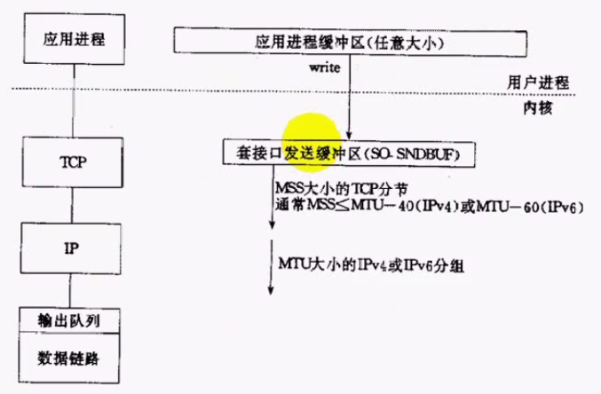
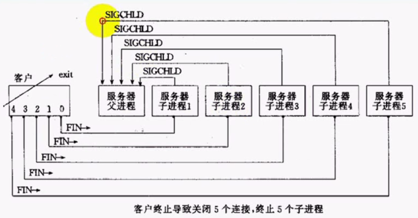
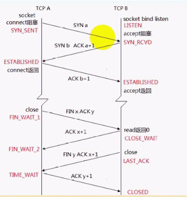

# 1 TCP粘包问题
TCP**粘包**： 指在一次接收数据不能完全地体现一个**完整的消息数据**。发送方发送的若干包数据到接收方接收时粘成一包，从接收缓冲区看，后一包数据的头紧接着前一包数据的尾。主要原因有以下几种：

## 1.1 发送方原因

1. 应用缓冲区大于TCP socket发送缓冲区的大小，导致消息被分成多部分发送
2. 发送的数据大于TCP **MSS**的达到，导致TCP消息进行分节
3. 发送的消息大于IPceng**MTU**大小，IP分组





## 1.2 接收方原因
TCP将收到的分组保存至接收缓存里，然后应用程序主动从缓存里读收到的分组。这样一来，如果TCP接收分组的速度大于应用程序读分组的速度，多个包就会被存至缓存，应用程序读时，就会读到多个首尾相接粘到一起的包。


## 1.3 粘包如何解决
方案：要在应用层维护消息与消息的**边界**。具体方法如下：

- 每次发定长的包（设置一个固定大小的**消息struct**)


```cpp
struct packet
{
    int len; //消息实际长度
    char buf[1024]; //消息buffer长度
};
```

- 包尾加\r\n（FTP的方法）或其他特定符号
- 在消息头加上数据长度(Q921的做法）
- 设计复杂应用层协议


# 2 client关闭后的server端僵尸进程问题

## 2.1 问题原因
client连接server完成传输之后，在client端关闭时, 服务器子进程会向服务器父进程发送**SIGCHLD**信号，导致server端进程出现僵尸进程。如图：




## 2.2 解决方法
解决方法如下：

- 忽略所有SIGCHLD信号: 在代码开始加入如下代码
```c
signal(SIGCHLD, SIG_IGN);
```


- 对SIGCHLD指定处理函数： 处理函数中使用**waitpid**
```c
signal(SIGCHLD, customHandler);

void customHandler(int signal)
{
    //循环处理多个子进程的信号
    while(waitpid(-1, NULL, WNOHANG) > 0) 
        ;
}
```


# 3 关闭一端通路SIGPIPE信号导致进程终止问题

## 3.1 问题原因
如下图所示为TCP两端建立和断开的流程和状态：


在断开时，由于TCP是一个全双工的通道，所以需要两端都需要向对端发送**FIN断开请求**。如果A方发送FIN到B方，表示A方不再发送数据；但此时B方并没有发送FIN，所以还是可以发送数据到A方的。B方第一次发送数据之后，A方会再回复**RST**消息，表示socket通道变成了单通道，需要reset连接。如果在B方收到RST之后，仍然调用write函数发送数据到A方，B方就会收到**SIGPIPE**信号（通道有问题），导致B方进程终止。


## 3.2 解决方法
对于SIGPIPE信号，通常的做法是忽略，禁止该信号终止进程：
```c
signal(SIGPIPE, SIP_IGN);
```

