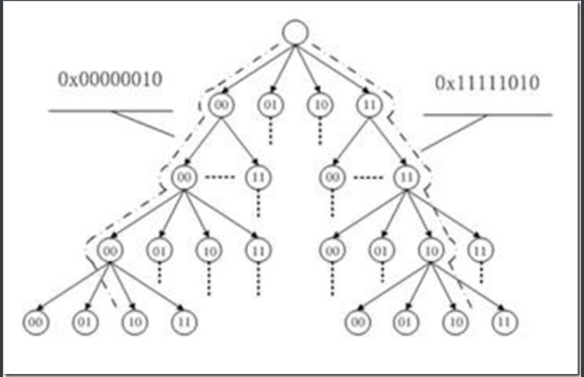

## **1. 缓存简介**

在编程中，缓存是很常见也很有效的一种提高程序性能的机制。linux内核也不例外，为了提高I/O性能，也引入了缓存机制，即将一部分磁盘上的数据缓存到内存中。


### 1.1 原理

之所以通过缓存能提高I/O性能是基于以下2个重要的原理：

1. CPU访问内存的速度远远大于访问磁盘的速度（访问速度差距不是一般的大，差好几个数量级）
2. 数据一旦被访问，就有可能在短期内再次被访问（临时局部原理）


缓存的创建和读取没什么好说的，无非就是检查缓存是否存在要创建或者要读取的内容。但是写缓存和缓存回收就需要好好考虑了，这里面涉及到**缓存内容**和**磁盘内容**同步的问题。


### **1.2 写缓存常见策略**


- 不缓存(nowrite) : 也就是不缓存写操作，当对缓存中的数据进行写操作时，直接写入磁盘，同时使此数据的缓存失效
- 写透缓存(write-through) : 写数据时同时更新磁盘和缓存
- 回写(copy-write or write-behind) : 写数据时直接写到缓存，由另外的进程(回写进程)在合适的时候将数据同步到磁盘


3种策略的优缺点如下：

| **策略** | **复杂度** | **性能** |
| --- | --- | --- |
| 不缓存 | 简单 | 缓存只用于读，对于写操作较多的I/O，性能反而会下降 |
| 写透缓存 | 简单 | 提升了读性能，写性能反而有些下降(除了写磁盘，还要写缓存) |
| 回写 | 复杂 | 读写的性能都有提高(**目前内核中采用的方法**) |


### **1.3 缓存回收的策略**


- 最近最少使用(LRU) :: 每个缓存数据都有个时间戳，保存最近被访问的时间。回收缓存时首先回收时间戳较旧的数据。
- 双链策略(LRU/2) :: 基于LRU的改善策略。


**补充说明(双链策略):**
双链策略其实就是 LRU(Least Recently Used) 算法的改进版。它通过2个链表(活跃链表和非活跃链表)来模拟LRU的过程，目的是为了提高页面回收的性能。页面回收动作发生时，从非活跃链表的尾部开始回收页面。**双链策略的关键就是页面如何在2个链表之间移动的**。双链策略中，每个页面都有2个标志位，分别为

- PG_active - 标志页面是否活跃，也就是表示此页面是否要移动到活跃链表
- PG_referenced - 表示页面是否被进程访问到


页面移动的流程如下：

1. 当页面第一次被被访问时，PG_active 置为1，加入到活动链表
2. 当页面再次被访问时，PG_referenced 置为1，此时如果页面在非活动链表，则将其移动到活动链表，并将PG_active置为1，PG_referenced 置为0
3. 系统中 daemon 会定时扫描活动链表，定时将页面的 PG_referenced 位置为0
4. 系统中 daemon 定时检查页面的 PG_referenced，如果 PG_referenced=0，那么将此页面的 PG_active 置为0，同时将页面移动到非活动链表


参考：[Linux 2.6 中的页面回收与反向映射](http://www.ibm.com/developerworks/cn/linux/l-cn-pagerecycle/index.html)


## **2. 页高速缓存**

故名思义，**页高速缓存中缓存的最小单元就是内存页**。但是此内存页对应的数据不仅仅是文件系统的数据，可以是任何基于页的对象，包括各种类型的文件和内存映射。


### 2.1 简介

页高速缓存缓存的是具体的物理页面，与前面章节中提到的虚拟内存空间(vm_area_struct)不同，假设有进程创建了多个 vm_area_struct 都指向同一个文件，那么这个 vm_area_struct 对应的 页高速缓存只有一份。也就是**磁盘上的文件缓存到内存后，它的虚拟内存地址可以有多个，但是物理内存地址却只能有一个**。为了有效提高I/O性能，页高速缓存要需要满足以下条件：

1. 能够快速检索需要的内存页是否存在
2. 能够快速定位 脏页面(也就是被写过，但还没有同步到磁盘上的数据)
3. 页高速缓存被并发访问时，尽量减少并发锁带来的性能损失


### 2.2 实现

实现页高速缓存的最重要的结构体要算是 **address_space** ，在 `<linux/fs.h>` 中

```c
struct address_space {
    struct inode        *host;        /* 拥有此 address_space 的inode对象 */
    struct radix_tree_root    page_tree;    /* 包含全部页面的 radix 树 */
    spinlock_t        tree_lock;    /* 保护 radix 树的自旋锁 */
    unsigned int        i_mmap_writable;/* VM_SHARED 计数 */
    struct prio_tree_root    i_mmap;        /* 私有映射链表的树 */
    struct list_head    i_mmap_nonlinear;/* VM_NONLINEAR 链表 */
    spinlock_t        i_mmap_lock;    /* 保护 i_map 的自旋锁 */
    unsigned int        truncate_count;    /* 截断计数 */
    unsigned long        nrpages;    /* 总页数 */
    pgoff_t            writeback_index;/* 回写的起始偏移 */
    const struct address_space_operations *a_ops;    /* address_space 的操作表 */
    unsigned long        flags;        /* gfp_mask 掩码与错误标识 */
    struct backing_dev_info *backing_dev_info; /* 预读信息 */
    spinlock_t        private_lock;    /* 私有 address_space 自旋锁 */
    struct list_head    private_list;    /* 私有 address_space 链表 */
    struct address_space    *assoc_mapping;    /* 缓冲 */
    struct mutex        unmap_mutex;    /* 保护未映射页的 mutux 锁 */
} __attribute__((aligned(sizeof(long))));
```

**补充说明：**

1. inode - 如果 address_space 是由不带inode的文件系统中的文件映射的话，此字段为 null
2. page_tree - 这个树结构很重要，它保证了页高速缓存中数据能被快速检索到，脏页面能够快速定位。
3. i_mmap - 根据 vm_area_struct，能够快速的找到关联的缓存文件(即 address_space)，前面提到过， address_space 和 vm_area_struct 是 一对多的关系。
4. 其他字段主要是提供各种锁和辅助功能


### 2.3 radix树

这里出现的一种新的数据结构 radix 树，进行简要的说明。radix树通过long型的位操作来查询各个节点， 存储效率高，并且可以快速查询。linux中 radix树相关的内容参见： `include/linux/radix-tree.h` 和 `lib/radix-tree.c`。首先是 radix树节点的定义

```c
/* 源码参照 lib/radix-tree.c */
struct radix_tree_node {
    unsigned int    height;        /* radix树的高度 */
    unsigned int    count;      /* 当前节点的子节点数目 */
    struct rcu_head    rcu_head;   /* RCU 回调函数链表 */
    void        *slots[RADIX_TREE_MAP_SIZE]; /* 节点中的slot数组 */
    unsigned long    tags[RADIX_TREE_MAX_TAGS][RADIX_TREE_TAG_LONGS]; /* slot标签 */
};
```

弄清楚 radix_tree_node 中各个字段的含义，也就差不多知道 radix树是怎么一回事了。

- height   表示的整个 radix树的高度（即叶子节点到树根的高度）， 不是当前节点到树根的高度
- count    这个比较好理解，表示当前节点的子节点个数，叶子节点的 count=0
- rcu_head RCU发生时触发的回调函数链表
- slots    每个slot对应一个子节点（叶子节点）
- tags     标记子节点是否 dirty 或者 wirteback


每个叶子节点指向文件内相应偏移所对应的缓存页。比如下图表示 0x000000 至 0x11111111 的偏移范围，树的高度为4：


**radix tree 的叶子节点都对应一个二进制的整数，不是字符串，所以进行比较的时候非常快**。其实叶子节点的值就是地址空间的值(一般是long型)


## **3. 页回写**

由于目前linux内核中对于写缓存采用的是第3种策略，所以回写的时机就显得非常重要，回写太频繁影响性能，回写太少容易造成数据丢失。


### 3.1 简介

linux 页高速缓存中的回写是由内核中的一个线程(**flusher 线程**)来完成的，flusher 线程在以下3种情况发生时，触发回写操作。

- 当空闲内存低于一个阀值时： 空闲内存不足时，需要释放一部分缓存，由于只有不脏的页面才能被释放，所以要把脏页面都回写到磁盘，使其变成干净的页面。
- 当脏页在内存中驻留时间超过一个阀值时： 确保脏页面不会无限期的驻留在内存中，从而减少了数据丢失的风险。
- 当用户进程调用 sync() 和 fsync() 系统调用时：给用户提供一种强制回写的方法，应对回写要求严格的场景。


页回写中涉及的一些阀值可以在`/proc/sys/vm`中找到。
flusher 线程的数目不是唯一的，这就避免了 bdflush 线程的问题。其次，flusher 线程不是面向所有磁盘的，而是每个 flusher 线程对应一个磁盘，这就避免了 pdflush 线程的问题。
