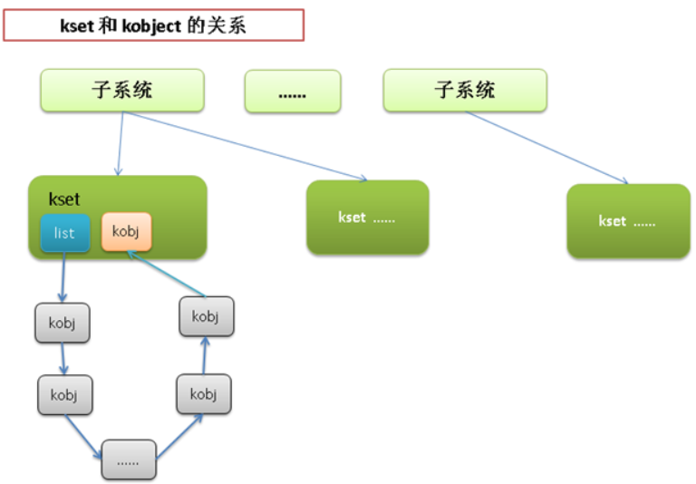

## **1. 设备类型**

linux中主要由3种类型的设备，分别是：

| **设备类型** | **代表设备** | **特点** | **访问方式** |
| --- | --- | --- | --- |
| 块设备 | 硬盘，光盘 | 随机访问设备中的内容 | 一般都是把设备挂载为文件系统后再访问 |
| 字符设备 | 键盘，打印机 | 只能顺序访问(一个一个字符或者一个一个字节) | 一般不挂载，直接和设备交互 |
| 网络设备 | 网卡 | 打破了Unix "所有东西都是文件" 的设计原则 | 通过套接字API来访问 |


除了以上3种典型的设备之外，其实Linux中还有一些其他的设备类型，其中见的较多的应该算是"**伪设备**"。所谓"伪设备"，其实就是一些虚拟的设备，仅提供访问内核功能而已，没有物理设备与之关联。典型的"伪设备"就是 /dev/random(内核随机数发生器)， /dev/null(空设备)， /dev/zero(零设备)， /dev/full(满设备)


## **2. 内核模块**

Linux内核是模块化组成的，内核中的模块可以按需加载，从而保证内核启动时不用加载所有的模块，即减少了内核的大小，也提高了效率。通过编写内核模块来给内核增加功能或者接口是个很好的方式（**既不用重新编译内核，也方便调试和删除**）。


### 2.1  带参数的内核模块

构造带参数的内核模块其实也不难，内核中已经提供了简单的框架来给我们声明参数。


#### 2.1.1 module_param(name, type, perm)

- 参数 name :: 既是用户可见的参数名，也是模块中存放模块参数的变量名
- 参数 type :: 参数的类型(byte, short, int, uint, long, ulong, charp, bool...) byte型存放在char变量中，bool型存放在int变量中
- 参数 perm :: 指定模块在 sysfs 文件系统中对应的文件权限(关于 sysfs 的内容后面介绍)

```c
static int stu_id = 0;  // 默认id
module_param(stu_id, int, 0644);
```


#### 2.1.2 module_param_named(name, variable, type, perm)

- 参数 name :: 用户可见的参数名
- 参数 variable :: 模块中存放模块参数的变量名
- 参数 type和perm :: 同 module_param 中的 type 和 perm

```c
static char* stu_name_in = "default name"; // 默认名字
module_param_named(stu_name_out, stu_name_in ,charp, 0644);
/* stu_name_out 是对用户开放的名称
 * stu_name_in 是内核模块内部使用的名称
 */
```


#### 2.1.3 module_param_string(name, string, len, perm)

拷贝字符串到指定的字符数组

- 参数 name :: 用户可见的参数名
- 参数 string :: 模块中存放模块参数的变量名
- 参数 len :: string 参数的缓冲区长度
- 参数 perm :: 同 module_param 中的 perm

```c
static char str_in[BUF_LEN];
module_param_string(str_out, str_in, BUF_LEN, 0);
/* perm=0 表示完全禁止 sysfs 项 */
```


#### 2.1.4 module_param_array(name, type, nump, perm)

定义数组类型的模块参数

- 参数 name :: 同 module_param 中的 name
- 参数 type :: 同 module_param 中的 type
- 参数 nump :: 整型指针，存放数组的长度
- 参数 perm :: 同 module_param 中的 perm

```c
#define MAX_ARR_LEN 5
static int arr_len;
static int arr_in[MAX_ARR_LEN];
module_param_array(arr_in, int, &arr_len, 0644);
```


#### 2.1.5 module_param_array_named(name, array, type, nump, perm)

- 参数 name :: 数组参数对外的名称
- 参数 array :: 数组参数对内的名称
- 参数 type，nump，perm :: 同 module_param_array 中的 type，nump，perm

```c
#define MAX_ARR_LEN 5
static int arr_len;
static int arr_in[MAX_ARR_LEN];
module_param_array_named(arr_out, arr_in, int, &arr_len, 0644);
```


#### 2.1.6 参数描述宏

可以通过 **MODULE_PARM_DESC**() 来给内核模块的参数添加一些描述信息。这些描述信息在编译完内核模块后，可以通过 modinfo  命令查看。

```c
static int stu_id = 0;  // 默认id
module_param(stu_id, int, 0644);
MODULE_PARM_DESC(stu_id, "学生ID，默认为 0");  // 这句就是描述内核模块参数 stu_id 的语句
```


### 2.2 带参数的内核模块的示例

示例代码：test_paramed_km.c。定义了3个内核模块参数，分别是 int型，char*型，数组型的。

```c
#include <linux/init.h>
#include <linux/module.h>
#include <linux/kernel.h>

MODULE_LICENSE("Dual BSD/GPL");

struct student
{
    int id;
    char* name;
};
static void print_student(struct student*);

static int stu_id = 0;  // 默认id
module_param(stu_id, int, 0644);  //int型参数
MODULE_PARM_DESC(stu_id, "学生ID，默认为 0");

static char* stu_name_in = "default name"; // 默认名字
module_param_named(stu_name_out, stu_name_in ,charp, 0644);//char*参数
MODULE_PARM_DESC(stu_name, "学生姓名，默认为 default name");

#define MAX_ARR_LEN 5
static int arr_len;
static int arr_in[MAX_ARR_LEN];
module_param_array_named(arr_out, arr_in, int, &arr_len, 0644);//数组参数
MODULE_PARM_DESC(arr_in, "数组参数，默认为空");

static int test_paramed_km_init(void)
{
    struct student* stu1;
    int i;
    
    /* 进入内核模块 */
    printk(KERN_ALERT "*************************\n");
    printk(KERN_ALERT "test_paramed_km is inited!\n");
    printk(KERN_ALERT "*************************\n");
    // 根据参数生成 struct student 信息
    // 如果没有参数就用默认参数
    printk(KERN_ALERT "alloc one student....\n");
    stu1 = kmalloc(sizeof(*stu1), GFP_KERNEL);
    stu1->id = stu_id;
    stu1->name = stu_name_in;
    print_student(stu1);

    // 模块数组
    for (i = 0; i < arr_len; ++i) {
        printk(KERN_ALERT "arr_value[%d]: %d\n", i, arr_in[i]);
    }

    return 0;
}

static void test_paramed_km_exit(void)
{
    /* 退出内核模块 */
    printk(KERN_ALERT "*************************\n");
    printk(KERN_ALERT "test_paramed_km is exited!\n");
    printk(KERN_ALERT "*************************\n");
    printk(KERN_ALERT "\n\n\n\n\n");
}

static void print_student(struct student *stu)
{
    if (stu != NULL)
    {
        printk(KERN_ALERT "**********student info***********\n");
        printk(KERN_ALERT "student id   is: %d\n", stu->id);
        printk(KERN_ALERT "student name is: %s\n", stu->name);
        printk(KERN_ALERT "*********************************\n");
    }
    else
        printk(KERN_ALERT "the student info is null!!\n");    
}

module_init(test_paramed_km_init);
module_exit(test_paramed_km_exit);
```

上面的示例对应的 Makefile 如下：

```makefile
obj-m := test_paramed_km.o

#generate the path
CURRENT_PATH:=$(shell pwd)
#the current kernel version number
LINUX_KERNEL:=$(shell uname -r)
#the absolute path
LINUX_KERNEL_PATH:=/usr/src/linux-headers-$(LINUX_KERNEL)  #直接用发行版中的linux源码，不用再下载linux内核源码。注意，每个linux发行版的目录不一定一样
#complie object
all:
        make -C $(LINUX_KERNEL_PATH) M=$(CURRENT_PATH) modules
clean:
        make -C $(LINUX_KERNEL_PATH) M=$(CURRENT_PATH) clean
```

内核模块运行方法：

```shell
[root@vbox chap17] modinfo  test_paramed_km.ko
filename:       paramed_km.ko
license:        Dual BSD/GPL
srcversion:     C52F97687B033738742800D
depends:
vermagic:       2.6.32-279.el6.x86_64 SMP mod_unload modversions
parm:           stu_id:学生ID，默认为 0 (int)
parm:           stu_name_out:charp
parm:           stu_name_in:学生姓名，默认为 default name
parm:           arr_out:array of int
parm:           arr_in:数组参数，默认为空

<-- 3 个参数都是默认的
[root@vbox chap17] insmod paramed_km.ko
[root@vbox chap17] rmmod paramed_km.ko
[root@vbox chap17] dmesg | tail -16  <-- 结果中显示2个默认参数，第3个数组参数默认为空，所以不显示
*************************
test_paramed_km is inited!
*************************
alloc one student....
**********student info***********
student id   is: 0
student name is: default name
*********************************
*************************
test_paramed_km is exited!
*************************

<-- 3 个参数都被设置
[root@vbox chap17] insmod paramed_km.ko stu_id=100 stu_name_out=myname arr_out=1,2,3,4,5
[root@vbox chap17] rmmod paramed_km.ko
[root@vbox chap17] dmesg | tail -21
*************************
test_paramed_km is inited!
*************************
alloc one student....
**********student info***********
student id   is: 100
student name is: myname
*********************************
arr_value[0]: 1
arr_value[1]: 2
arr_value[2]: 3
arr_value[3]: 4
arr_value[4]: 5
*************************
test_paramed_km is exited!
************************
```


### 2.3 内核模块的位置

- 内核代码外：上面的例子，以及之前内核模块的例子都是把模块代码放在内核之外来运行的。
- 内核代码中

内核模块的代码也可以直接放到内核代码树中。如果你开发了一种驱动，并且希望被加入到内核中，那么，可以在编写驱动的时候就将完成此驱动功能的内核模块加到内核代码树中 driver 的相应位置。将内核模块加入内核代码树中之后，不需要另外写 Makefile，修改内核代码树中的已有的 Makefile 就行。在编译内核的时候会将新的驱动以内核模块的方式编译出来。


### 2.4 内核模块相关操作

- 模块安装

```
make modules_install  <-- 把随内核编译出来的模块安装到合适的目录中( /lib/modules/version/kernel )
```

- 模块依赖性: linux中自动生产模块依赖性的命令：

```
depmod     <-- 产生内核依赖关系信息
depmod -A  <-- 只为新模块生成依赖信息(速度更快)
```

- 模块的载入:

```
insmod module.ko

<-- 推荐使用以下的命令， 自动加载依赖的模块
modprobe module [module parameters]
```

- 模块的卸载:

```
rmmod module.ko

<-- 推荐使用以下的命令， 自动卸载依赖的模块
modprobe -r module
```

- 模块导出符号表: 内核模块被载入后，就动态的加载到内核中，为了能让其他内核模块使用其功能，需要将其中函数导出。内核模块中导出函数的方法：

```
EXPORT_SYMBOL(函数名)       <-- 接在要导出的函数后面即可
EXPORT_SYMBOL_GPL(函数名)   <-- 和EXPORT_SYMBOL一样，区别在于只对标记为GPL协议的模块可见
```


#### 导出符号表示例：

```c
#include <linux/init.h>
#include <linux/module.h>
#include <linux/kernel.h>

MODULE_LICENSE("Dual BSD/GPL");

static int test_export_A_init(void)
{
    /* 进入内核模块 */
    printk(KERN_ALERT "*************************\n");
    printk(KERN_ALERT "ENTRY test_export_A!\n");
    printk(KERN_ALERT "*************************\n");
    printk(KERN_ALERT "\n\n\n\n\n");
    return 0;
}

static void test_export_A_exit(void)
{
    /* 退出内核模块 */
    printk(KERN_ALERT "*************************\n");
    printk(KERN_ALERT "EXIT test_export_A!\n");
    printk(KERN_ALERT "*************************\n");
    printk(KERN_ALERT "\n\n\n\n\n");
}

/* 要导出的函数 */
int export_add10(int param)
{
    printk(KERN_ALERT "param from other module is : %d\n", param);
    return param + 10;
}
EXPORT_SYMBOL(export_add10);

module_init(test_export_A_init);
module_exit(test_export_A_exit);
```

Makefile

```makefile
must complile on customize kernel
obj-m += export_A.o
export_A-objs := test_export_A.o

#generate the path
CURRENT_PATH:=$(shell pwd)
#the current kernel version number
LINUX_KERNEL:=$(shell uname -r)
#the absolute path
LINUX_KERNEL_PATH:=/usr/src/kernels/$(LINUX_KERNEL)
#complie object
all:
    make -C $(LINUX_KERNEL_PATH) M=$(CURRENT_PATH) modules
    rm -rf modules.order .*.cmd *.o *.mod.c .tmp_versions *.unsigned
#clean
clean:
    rm -rf modules.order Module.symvers .*.cmd *.o *.mod.c *.ko .tmp_versions *.unsigned
```

再编写一个内核模块 module_B，使用 module_A 导出的函数 : test_module_B.c

```c
#include<linux/init.h>
#include<linux/module.h>
#include<linux/kernel.h>

MODULE_LICENSE("Dual BSD/GPL");

extern int export_add10(int);   // 这个函数是 module_A 中实现的

static int test_export_B_init(void)
{
    /* 进入内核模块 */
    printk(KERN_ALERT "*************************\n");
    printk(KERN_ALERT "ENTRY test_export_B!\n");
    printk(KERN_ALERT "*************************\n");
    printk(KERN_ALERT "\n\n\n\n\n");

    /* 调用 module_A 导出的函数 */
    printk(KERN_ALERT "result from test_export_A: %d\n", export_add10(100));
    
    return 0;
}

static void test_export_B_exit(void)
{
    /* 退出内核模块 */
    printk(KERN_ALERT "*************************\n");
    printk(KERN_ALERT "EXIT test_export_B!\n");
    printk(KERN_ALERT "*************************\n");
    printk(KERN_ALERT "\n\n\n\n\n");
}

module_init(test_export_B_init);
module_exit(test_export_B_exit);
```

测试方法

- 编译 module_A 中的 test_export_A.c
- 将编译 module_A 后生成的 Module.symvers 拷贝到 module_B 文件夹中，否则在模块B找不到模块A导出的函数
- 编译 module_B 中的 test_export_B.c
- 先安装 模块A，再安装模块B
- dmesg 查看log
- 用 rmmod 卸载模块B 和 模块A (注意卸载顺序，先卸载B再卸载A)

```shell
[root@vbox module_B] insmod ../module_A/export_A.ko 
[root@vbox module_B] insmod export_B.ko 
[root@vbox module_B] dmesg | tail -18
*************************
ENTRY test_export_A!
*************************
*************************
ENTRY test_export_B!
*************************
param from other module is : 100
result from test_export_A: 110

[root@vbox module_B] rmmod export_B
[root@vbox module_B] rmmod export_A
```


## **3. 内核对象**


### 3.1 kobject 简介

统一设备模型的核心部分就是 **kobject**，通过下面对kobject结构体的介绍，可以大致了解它是如何使得各个物理设备能够以树结构的形式组织起来的。


#### 3.1.1. kobject

kobject的定义在 `<linux/kobject.h>`中

```c
struct kobject {
    const char        *name;                   /* kobject 名称 */
    struct list_head    entry;               /* kobject 链表 */
    struct kobject        *parent;             /* kobject 的父对象，说明kobject是有层次结构的 */
    struct kset        *kset;                   /* kobject 的集合，接下来有详细介绍 */
    struct kobj_type    *ktype;              /* kobject 的类型，接下来有详细介绍 */
    struct sysfs_dirent    *sd;                 /* 在sysfs中，这个结构体表示kobject的一个inode结构体，sysfs之后也会介绍 */
    struct kref        kref;                    /* 提供 kobject 的引用计数 */
    /* 一些标志位  */
    unsigned int state_initialized:1;       
    unsigned int state_in_sysfs:1;
    unsigned int state_add_uevent_sent:1;
    unsigned int state_remove_uevent_sent:1;
    unsigned int uevent_suppress:1;
};
```

kobject 本身不代表什么实际的内容，一般都是嵌在其他数据结构中来发挥作用。嵌入kobject后，数据结构之间就有了树结构关系和层次关系。


#### 3.1.2. ktype

ktype是为了描述一族的kobject所具有的普遍属性，也就是将这一族的kobject的属性统一定义一下，避免每个kobject分别定义。ktype的定义很简单，参见<linux/kobject.h>

```c
struct kobj_type {
    void (*release)(struct kobject *kobj);  /* kobject的引用计数降到0时触发的析构函数，负责释放和清理内存的工作 */
    struct sysfs_ops *sysfs_ops;            /* sysfs操作相关的函数 */
    struct attribute **default_attrs;       /* kobject 相关的默认属性 */
};
```


#### 3.1.3. kset

kset是kobject对象的集合体，可以所有相关的kobject置于一个kset之中，比如所有“块设备”可以放在一个表示块设备的kset中。kset的定义也不复杂，参见 <linux/kobject.h>

```c
struct kset {
    struct list_head list;    /* 表示kset中所有kobject的链表 */
    spinlock_t list_lock;     /* 用于保护 list 的自旋锁*/
    struct kobject kobj;      /* kset中嵌入的一个kobject，使得kset也可以表现的像一样kobject一样*/
    struct kset_uevent_ops *uevent_ops;  /* 处理kset中kobject的热插拔事件 提供了与用户空间热插拔进行通信的机制 */
};
```




#### 3.1.4. kref

kref记录kobject被引用的次数，当引用计数降到0的时候，则执行release函数释放相关资源。kref的定义参见：<linux/kref.h>

```c
struct kref {
    atomic_t refcount;  /* 只有一个表示引用计数的属性，atomic_t 类型表示对它的访问是原子操作 */
};

void kref_set(struct kref *kref, int num);  /* 设置引用计数的值 */
void kref_init(struct kref *kref);          /* 初始化引用计数 */
void kref_get(struct kref *kref);           /* 增加引用计数 +1 */
int kref_put(struct kref *kref, void (*release) (struct kref *kref)); /* 减少引用计数 -1 当减少到0时，释放相应资源 */
```

上面这些函数的具体实现可以参考内核代码 `lib/kref.c`


### 3.2 kobject 操作

kobject的相关操作都在 <linux/kobject.h> 中定义了，主要由以下一些：

```c
extern void kobject_init(struct kobject *kobj, struct kobj_type *ktype);  /* 初始化一个kobject，设置它是哪种ktype */
extern int __must_check kobject_add(struct kobject *kobj,
                    struct kobject *parent,
                    const char *fmt, ...);   /* 设置此kobject的parent，将此kobject加入到现有对象层次结构中 */
extern int __must_check kobject_init_and_add(struct kobject *kobj,
                         struct kobj_type *ktype,
                         struct kobject *parent,
                         const char *fmt, ...); /* 初始化kobject，完成kobject_add 函数的功能*/

extern void kobject_del(struct kobject *kobj); /* 将此kobject从现有对象层次结构中取消 */

extern struct kobject * __must_check kobject_create(void); /* 创建一个kobject，比kobject_init更常用 */
extern struct kobject * __must_check kobject_create_and_add(const char *name,
                        struct kobject *parent); /* 创建一个kobject，并将其加入到现有对象层次结构中 */

extern int __must_check kobject_rename(struct kobject *, const char *new_name);  /* 改变kobject的名称 */
extern int __must_check kobject_move(struct kobject *, struct kobject *); /* 给kobject设置新的parent */

extern struct kobject *kobject_get(struct kobject *kobj); /* 增加kobject的引用计数 +1 */
extern void kobject_put(struct kobject *kobj);            /* 减少kobject的引用计数 -1 */

extern char *kobject_get_path(struct kobject *kobj, gfp_t flag);  /* 生成并返回与给定的一个kobj和kset相关联的路径 */
```


## **4. sysfs**

**sysfs是一个处于内存中的虚拟文件系统，它提供了kobject对象层次结构的视图**。可以用下面这个命令来查看 /sys 的结构

```
tree /sys        显示所有目录和文件
或者
tree -L 1 /sys   只显示一层目录
```


### 4.1 sysfs中的kobject


#### 4.1.1. sysfs中添加和删除kobject

非常简单，就是上面介绍的 kobject操作中提到。添加了kobject之后，只会增加文件夹，不会增加文件。因为kobject在sysfs中就是映射成一个文件夹。添加删除kobject的示例代码如下：

```c
#include <linux/init.h>
#include <linux/module.h>
#include <linux/kernel.h>
#include <linux/kobject.h>

MODULE_LICENSE("Dual BSD/GPL");

struct kobject* kobj = NULL;

static int test_kobject_init(void)
{
    /* 初始化kobject，并加入到sysfs中 */    
    kobj = kobject_create_and_add("test_kobject", NULL);
    
    /* 进入内核模块 */
    printk(KERN_ALERT "*************************\n");
    printk(KERN_ALERT "test_kobject is inited!\n");
    printk(KERN_ALERT "*************************\n");
    
    return 0;
}

static void test_kobject_exit(void)
{
    /* 如果 kobj 不为空，则将其从sysfs中删除 */
    if (kobj != NULL)
        kobject_del(kobj);
    /* 退出内核模块 */
    printk(KERN_ALERT "*************************\n");
    printk(KERN_ALERT "test_kobject is exited!\n");
    printk(KERN_ALERT "*************************\n");
    printk(KERN_ALERT "\n\n\n\n\n");
}

module_init(test_kobject_init);
module_exit(test_kobject_exit);
```

测试方法：

```shell
[root@localhost test_kobject] insmod mykobject.ko              <-- 安装内核模块 
[root@localhost test_kobject] ll /sys/                         <-- 安装后，sysfs中多了一个文件夹 test_kobject
total 0
drwxr-xr-x  2 root root 0 Dec 24 09:28 block
drwxr-xr-x 17 root root 0 Dec 24 09:28 bus
drwxr-xr-x 40 root root 0 Dec 24 09:28 class
drwxr-xr-x  4 root root 0 Dec 24 09:28 dev
drwxr-xr-x 12 root root 0 Dec 24 09:28 devices
drwxr-xr-x  4 root root 0 Dec 24 09:28 firmware
drwxr-xr-x  3 root root 0 Dec 24 09:28 fs
drwxr-xr-x  2 root root 0 Dec 24 09:44 hypervisor
drwxr-xr-x  5 root root 0 Dec 24 09:28 kernel
drwxr-xr-x 85 root root 0 Dec 24 09:54 module
drwxr-xr-x  2 root root 0 Dec 24 09:44 power
drwxr-xr-x  2 root root 0 Dec 24 09:55 test_kobject
[root@localhost test_kobject] ll /sys/test_kobject/             <-- 追加kobject只能增加文件夹，文件夹中是没有文件的
total 0
[root@localhost test_kobject] rmmod mykobject.ko                <-- 卸载内核模块
[root@localhost test_kobject] ll /sys/                          <-- 卸载后，sysfs 中的文件夹 test_kobject 也消失了
total 0
drwxr-xr-x  2 root root 0 Dec 24 09:28 block
drwxr-xr-x 17 root root 0 Dec 24 09:28 bus
drwxr-xr-x 40 root root 0 Dec 24 09:28 class
drwxr-xr-x  4 root root 0 Dec 24 09:28 dev
drwxr-xr-x 12 root root 0 Dec 24 09:28 devices
drwxr-xr-x  4 root root 0 Dec 24 09:28 firmware
drwxr-xr-x  3 root root 0 Dec 24 09:28 fs
drwxr-xr-x  2 root root 0 Dec 24 09:44 hypervisor
drwxr-xr-x  5 root root 0 Dec 24 09:28 kernel
drwxr-xr-x 84 root root 0 Dec 24 09:55 module
drwxr-xr-x  2 root root 0 Dec 24 09:44 power
```


#### 4.1.2. sysfs中添加文件

kobject是映射成sysfs中的目录，sysfs中的文件就是kobject的属性，属性的来源有2个：

- 默认属性 :: kobject所关联的ktype中的 default_attrs 字段，类型是结构体 struct attribute， 定义在 `<linux/sysfs.h>`

```c
struct attribute {
    const char        *name;   /* sysfs文件树中的文件名 */
    struct module        *owner; /* x86体系结构中已经不再继续使用了，可能在其他体系结构中还会使用 */
    mode_t            mode;   /* sysfs中该文件的权限 */
};
```

- sysfs_ops 则描述了如何使用默认属性。struct sysfs_ops 的定义也在 <linux/sysfs.h>

```c
struct sysfs_ops {
    /* 在读sysfs文件时该方法被调用 */
    ssize_t    (*show)(struct kobject *kobj, struct attribute *attr,char *buffer);
    /* 在写sysfs文件时该方法被调用 */
    ssize_t    (*store)(struct kobject *kobj,struct attribute *attr,const char *buffer, size_t size);
};
```

show 方法在读取sysfs中文件时调用，它会拷贝attr提供的属性到buffer指定的缓冲区。store 方法在写sysfs中文件时调用，它会从buffer中读取size字节的数据到attr提供的属性中

```c
#include <linux/init.h>
#include <linux/module.h>
#include <linux/kernel.h>
#include <linux/kobject.h>
#include <linux/sysfs.h>

MODULE_LICENSE("Dual BSD/GPL");

static void myobj_release(struct kobject*);
static ssize_t my_show(struct kobject *, struct attribute *, char *);
static ssize_t my_store(struct kobject *, struct attribute *, const char *, size_t);

/* 自定义的结构体，2个属性，并且嵌入了kobject */
struct my_kobj 
{
    int ival;
    char* cname;
    struct kobject kobj;
};

static struct my_kobj *myobj = NULL;

/* my_kobj 的属性 ival 所对应的sysfs中的文件，文件名 val */
static struct attribute val_attr = {
    .name = "val",
    .owner = NULL,
    .mode = 0666,
};

/* my_kobj 的属性 cname 所对应的sysfs中的文件，文件名 name */
static struct attribute name_attr = {
    .name = "name",
    .owner = NULL,
    .mode = 0666,
};

static int test_kobject_default_attr_init(void)
{
    struct attribute *myattrs[] = {NULL, NULL, NULL};
    struct sysfs_ops *myops = NULL;
    struct kobj_type *mytype = NULL;

    /* 初始化 myobj */
    myobj = kmalloc(sizeof(struct my_kobj), GFP_KERNEL);
    if (myobj == NULL)
        return -ENOMEM;

    /* 配置文件 val 的默认值 */
    myobj->ival = 100;
    myobj->cname = "test";

    /* 初始化 ktype */
    mytype = kmalloc(sizeof(struct kobj_type), GFP_KERNEL);
    if (mytype == NULL)
        return -ENOMEM;

    /* 增加2个默认属性文件 */
    myattrs[0] = &val_attr;
    myattrs[1] = &name_attr;

    /* 初始化ktype的默认属性和析构函数 */
    mytype->release = myobj_release;
    mytype->default_attrs = myattrs;

    /* 初始化ktype中的 sysfs */
    myops = kmalloc(sizeof(struct sysfs_ops), GFP_KERNEL);
    if (myops == NULL)
        return -ENOMEM;

    myops->show = my_show;
    myops->store = my_store;
    mytype->sysfs_ops = myops;

    /* 初始化kobject，并加入到sysfs中 */
    memset(&myobj->kobj, 0, sizeof(struct kobject)); /* 这一步非常重要，没有这一步init kobject会失败 */
    if (kobject_init_and_add(&myobj->kobj, mytype, NULL, "test_kobj_default_attr"))
        kobject_put(&myobj->kobj);

    printk(KERN_ALERT "*************************\n");
    printk(KERN_ALERT "test_kobject_default_attr is inited!\n");
    printk(KERN_ALERT "*************************\n");
    
    return 0;
}

static void test_kobject_default_attr_exit(void)
{
    kobject_del(&myobj->kobj);
    kfree(myobj);
    
    /* 退出内核模块 */
    printk(KERN_ALERT "*************************\n");
    printk(KERN_ALERT "test_kobject_default_attr is exited!\n");
    printk(KERN_ALERT "*************************\n");
    printk(KERN_ALERT "\n\n\n\n\n");
}

static void myobj_release(struct kobject *kobj) 
{
    printk(KERN_ALERT, "release kobject");
    kobject_del(kobj);
}

/* 读取属性文件 val 或者name时会执行此函数 */
static ssize_t my_show(struct kobject *kboj, struct attribute *attr, char *buf) 
{
    printk(KERN_ALERT "SHOW -- attr-name: [%s]\n", attr->name);    
    if (strcmp(attr->name, "val") == 0)
        return sprintf(buf, "%d\n", myobj->ival);
    else
        return sprintf(buf, "%s\n", myobj->cname);
}

/* 写入属性文件 val 或者name时会执行此函数 */
static ssize_t my_store(struct kobject *kobj, struct attribute *attr, const char *buf, size_t len) 
{
    printk(KERN_ALERT "STORE -- attr-name: [%s]\n", attr->name);
    if (strcmp(attr->name, "val") == 0)
        sscanf(buf, "%d\n", &myobj->ival);
    else
        sscanf(buf, "%s\n", myobj->cname);        
    return len;
}

module_init(test_kobject_default_attr_init);
module_exit(test_kobject_default_attr_exit);
```

测试方法

```shell
[root@localhost test_kobject_defalt_attr] insmod mykobject_with_default_attr.ko 
[root@localhost test_kobject_defalt_attr] ll /sys/                           <-- kobject对应的文件夹
total 0
drwxr-xr-x  2 root root 0 Dec 24 15:50 block
drwxr-xr-x 17 root root 0 Dec 24 15:50 bus
drwxr-xr-x 40 root root 0 Dec 24 15:50 class
drwxr-xr-x  4 root root 0 Dec 24 15:50 dev
drwxr-xr-x 12 root root 0 Dec 24 15:50 devices
drwxr-xr-x  4 root root 0 Dec 24 15:50 firmware
drwxr-xr-x  3 root root 0 Dec 24 15:50 fs
drwxr-xr-x  2 root root 0 Dec 24 16:06 hypervisor
drwxr-xr-x  5 root root 0 Dec 24 15:50 kernel
drwxr-xr-x 85 root root 0 Dec 24 16:59 module
drwxr-xr-x  2 root root 0 Dec 24 16:06 power
drwxr-xr-x  2 root root 0 Dec 24 16:59 test_kobj_default_attr
[root@localhost test_kobject_defalt_attr] ll /sys/test_kobj_default_attr/    <-- kobject的2个属性文件
total 0
-rw-rw-rw- 1 root root 4096 Dec 24 16:59 name
-rw-rw-rw- 1 root root 4096 Dec 24 16:59 val
[root@localhost test_kobject_defalt_attr] dmesg                              <-- dmesg 中只有初始化的信息
*************************
test_kobject_default_attr is inited!
*************************

###########################  读取属性文件 ###############################################
[root@localhost test_kobject_defalt_attr] cat /sys/test_kobj_default_attr/val  <-- 属性值就是我们在测试代码中输入的值
100
[root@localhost test_kobject_defalt_attr] cat /sys/test_kobj_default_attr/name <-- 属性值就是我们在测试代码中输入的值
test
[root@localhost test_kobject_defalt_attr] dmesg                              <-- dmesg 中多了2条读取属性文件的log
SHOW -- attr-name: [val]
SHOW -- attr-name: [name]

########################### 写入属性文件 ################################################
[root@localhost test_kobject_defalt_attr] echo "200" > /sys/test_kobj_default_attr/val         <-- val文件中写入 200
[root@localhost test_kobject_defalt_attr] echo "abcdefg" > /sys/test_kobj_default_attr/name    <-- name文件中写入 adcdefg
[root@localhost test_kobject_defalt_attr] dmesg                              <-- dmesg 中又多了2条写入属性文件的log
STORE -- attr-name: [val]
STORE -- attr-name: [name]
[root@localhost test_kobject_defalt_attr] cat /sys/test_kobj_default_attr/val     <-- 再次查看 val文件中的值，已变为200
200
[root@localhost test_kobject_defalt_attr] cat /sys/test_kobj_default_attr/name    <-- 再次查看 name文件中的值，已变为abcdefg
abcdefg

########################### 卸载 ########################################################
[root@localhost test_kobject_defalt_attr] rmmod mykobject_with_default_attr.ko
```

- 新属性 :: kobject 自己定义的属性。在一些特殊的情况下，kobject可能会需要自己特有的属性。内核也充分考虑到了这些情况，提供了创建或者删除新属性的方法。在sysfs中文件的操作方法参见： fs/sysfs/file.c

```c
/* 文件的相关操作非常多，这里只列出创建文件和删除文件的方法 */

/**
 * 给 kobj 增加一个新的属性 attr
 * kobj 对应sysfs中的一个文件夹， attr 对应sysfs中的一个文件
 */
int sysfs_create_file(struct kobject * kobj, const struct attribute * attr)
{
    BUG_ON(!kobj || !kobj->sd || !attr);

    return sysfs_add_file(kobj->sd, attr, SYSFS_KOBJ_ATTR);

}

/**
 * 给 kobj 删除一个新的属性 attr
 * kobj 对应sysfs中的一个文件夹， attr 对应sysfs中的一个文件
 */
void sysfs_remove_file(struct kobject * kobj, const struct attribute * attr)
{
    sysfs_hash_and_remove(kobj->sd, attr->name);
}
```

除了可以在sysfs中增加/删除的文件，还可以在sysfs中**增加或者删除一个符号链接**。具体实现参见：fs/sysfs/symlink.c

```c
/* 下面只列出了创建和删除符号链接的方法，其他方法请参考 symlink.c 文件 */

/**
 * 在kobj对应的文件夹中创建一个符号链接指向 target
 * 符号链接的名称就是 name
 */
int sysfs_create_link(struct kobject *kobj, struct kobject *target,
              const char *name)
{
    return sysfs_do_create_link(kobj, target, name, 1);
}


void sysfs_remove_link(struct kobject * kobj, const char * name)
{
    struct sysfs_dirent *parent_sd = NULL;

    if (!kobj)
        parent_sd = &sysfs_root;
    else
        parent_sd = kobj->sd;

    sysfs_hash_and_remove(parent_sd, name);
}
```

增加新的属性的示例代码 (这里只演示了增加文件的方法，增加符号链接的方法与之类似)

```c
#include <linux/init.h>
#include <linux/module.h>
#include <linux/kernel.h>
#include <linux/kobject.h>
#include <linux/sysfs.h>

MODULE_LICENSE("Dual BSD/GPL");

static void myobj_release(struct kobject*);
static ssize_t my_show(struct kobject *, struct attribute *, char *);
static ssize_t my_store(struct kobject *, struct attribute *, const char *, size_t);

/* 自定义的结构体，其中嵌入了kobject，通过属性 c_attr 来控制增加或者删除新属性 */
struct my_kobj 
{
    int c_attr;                 /* 值为0：删除新属性， 值为1：增加新属性*/
    int new_attr;
    struct kobject kobj;
};

static struct my_kobj *myobj = NULL;

/* my_kobj 的属性 c_attr 所对应的sysfs中的文件，文件名 c_attr */
static struct attribute c_attr = {
    .name = "c_attr",
    .owner = NULL,
    .mode = 0666,
};

/* 用于动态增加或者删除的新属性 */
static struct attribute new_attr = {
    .name = "new_attr",
    .owner = NULL,
    .mode = 0666,
};

static int test_kobject_new_attr_init(void)
{
    struct attribute *myattrs[] = {NULL, NULL};
    struct sysfs_ops *myops = NULL;
    struct kobj_type *mytype = NULL;

    /* 初始化 myobj */
    myobj = kmalloc(sizeof(struct my_kobj), GFP_KERNEL);
    if (myobj == NULL)
        return -ENOMEM;

    /* 配置文件 val 的默认值 */
    myobj->c_attr = 0;

    /* 初始化 ktype */
    mytype = kmalloc(sizeof(struct kobj_type), GFP_KERNEL);
    if (mytype == NULL)
        return -ENOMEM;

    /* 增加1个默认属性文件 */
    myattrs[0] = &c_attr;

    /* 初始化ktype的默认属性和析构函数 */
    mytype->release = myobj_release;
    mytype->default_attrs = myattrs;

    /* 初始化ktype中的 sysfs */
    myops = kmalloc(sizeof(struct sysfs_ops), GFP_KERNEL);
    if (myops == NULL)
        return -ENOMEM;

    myops->show = my_show;
    myops->store = my_store;
    mytype->sysfs_ops = myops;

    /* 初始化kobject，并加入到sysfs中 */
    memset(&myobj->kobj, 0, sizeof(struct kobject)); /* 这一步非常重要，没有这一步init kobject会失败 */
    if (kobject_init_and_add(&myobj->kobj, mytype, NULL, "test_kobj_new_attr"))
        kobject_put(&myobj->kobj);

    printk(KERN_ALERT "*************************\n");
    printk(KERN_ALERT "test_kobject_new_attr is inited!\n");
    printk(KERN_ALERT "*************************\n");
    
    return 0;
}

static void test_kobject_new_attr_exit(void)
{
    kobject_del(&myobj->kobj);
    kfree(myobj);
    
    /* 退出内核模块 */
    printk(KERN_ALERT "*************************\n");
    printk(KERN_ALERT "test_kobject_new_attr is exited!\n");
    printk(KERN_ALERT "*************************\n");
    printk(KERN_ALERT "\n\n\n\n\n");
}

static void myobj_release(struct kobject *kobj) 
{
    printk(KERN_ALERT "release kobject");
    kobject_del(kobj);
}

/* 读取属性文件 c_attr 或者 new_attr 时会执行此函数 */
static ssize_t my_show(struct kobject *kboj, struct attribute *attr, char *buf) 
{
    printk(KERN_ALERT "SHOW -- attr-name: [%s]\n", attr->name);
    if (strcmp(attr->name, "c_attr") == 0)
        return sprintf(buf, "%d\n", myobj->c_attr);
    else if (strcmp(attr->name, "new_attr") == 0)
        return sprintf(buf, "%d\n", myobj->new_attr);

    return 0;
}

/* 写入属性文件c_attr 或者 new_attr 时会执行此函数 */
static ssize_t my_store(struct kobject *kobj, struct attribute *attr, const char *buf, size_t len) 
{
    printk(KERN_ALERT "STORE -- attr-name: [%s]\n", attr->name);
    if (strcmp(attr->name, "c_attr") == 0)
        sscanf(buf, "%d\n", &myobj->c_attr);
    else if (strcmp(attr->name, "new_attr") == 0)
        sscanf(buf, "%d\n", &myobj->new_attr);

    if (myobj->c_attr == 1)     /* 创建新的属性文件 */
    {
        if (sysfs_create_file(kobj, &new_attr))
            return -1;
        else
            myobj->new_attr = 100; /* 新属性文件的值默认设置为 100  */
    }
    
    if (myobj->c_attr == 0)     /* 删除新的属性文件 */
        sysfs_remove_file(kobj, &new_attr);
    
    return len;
}

module_init(test_kobject_new_attr_init);
module_exit(test_kobject_new_attr_exit);
```

测试方法：

```shell
########################### 动态增加新属性文件 #########################################
[root@localhost test_kobject_new_attr] ll /sys/test_kobj_new_attr/            <-- 默认没有新属性 new_attr
total 0
-rw-rw-rw- 1 root root 4096 Dec 24 18:47 c_attr
[root@localhost test_kobject_new_attr] cat /sys/test_kobj_new_attr/c_attr     <-- c_attr 的值为0
0
[root@localhost test_kobject_new_attr] echo "1" > /sys/test_kobj_new_attr/c_attr <-- c_attr 的值设为1
[root@localhost test_kobject_new_attr] ll /sys/test_kobj_new_attr/            <-- 增加了新属性 new_attr
total 0
-rw-rw-rw- 1 root root 4096 Dec 24 19:02 c_attr
-rw-rw-rw- 1 root root 4096 Dec 24 19:02 new_attr

########################### 动态删除属性文件 ###########################################
[root@localhost test_kobject_new_attr] echo "0" > /sys/test_kobj_new_attr/c_attr   <-- c_attr 的值为0
[root@localhost test_kobject_new_attr] ll /sys/test_kobj_new_attr/                 <-- 删除了新属性 new_attr
total 0
-rw-rw-rw- 1 root root 4096 Dec 24 19:03 c_attr
```


#### 4.1.3. sysfs相关约定

为了保持sysfs的干净和直观，在内核开发中涉及到sysfs相关内容时，需要注意以下几点：

- sysfs属性保证每个文件只导出一个值，该值为文本形式并且可以映射为简单的C类型
- sysfs中要以一个清晰的层次组织数据
- sysfs提供内核到用户空间的服务


### 4.2 基于sysfs的内核事件

内核事件层也是利用kobject和sysfs来实现的，用户空间通过监控sysfs中kobject的属性的变化来异步的捕获内核中kobject发出的信号。用户空间可以通过一种netlink的机制来获取内核事件。内核空间向用户空间发送信号使用 kobject_uevent() 函数，具体参见： <linux/kobject.h>

```
int kobject_uevent(struct kobject *kobj, enum kobject_action action);
```

**内核模块安装或者删除时，会发送 KOBJ_ADD 或者 KOBJ_REMOVE 的消息**。用户态程序通过**netlink socket机制**来接收 kobject 的事件通知

```c
#include <stdio.h>  
#include <stdlib.h>  
#include <string.h>  
#include <errno.h>  
#include <sys/types.h>  
#include <asm/types.h>  
#include <sys/socket.h>    
#include <linux/netlink.h>  

void MonitorNetlinkUevent()  
{  
    int sockfd;  
    struct sockaddr_nl sa;  
    int len;  
    char buf[4096];  
    struct iovec iov;  
    struct msghdr msg;  
    int i;  
  
    memset(&sa,0,sizeof(sa));  
    sa.nl_family = AF_NETLINK;  
    sa.nl_groups = NETLINK_KOBJECT_UEVENT;  
    sa.nl_pid = 0;//getpid(); both is ok  
    memset(&msg,0,sizeof(msg));  
    iov.iov_base = (void *)buf;  
    iov.iov_len = sizeof(buf);  
    msg.msg_name = (void *)&sa;  
    msg.msg_namelen = sizeof(sa);  
    msg.msg_iov = &iov;  
    msg.msg_iovlen = 1;  
  
    sockfd = socket(AF_NETLINK, SOCK_RAW, NETLINK_KOBJECT_UEVENT);  
    if(sockfd == -1)  
        printf("socket creating failed:%s\n",strerror(errno));  
    if(bind(sockfd,(struct sockaddr *)&sa,sizeof(sa)) == -1)  
        printf("bind error:%s\n", strerror(errno));  
    while(1) {  
      memset(buf, 0, sizeof(buf));  
      len=recvmsg(sockfd, &msg, 0);  
      if(len < 0){}  
        //printf("receive error\n");  
      else if(len < 32||len > sizeof(buf))  
        printf("invalid message");  
      for(i=0; i<len; i++)  
        if(*(buf+i) == '\0')  
            buf[i] = '\n';  
      printf("received %d bytes\n%s\n", len, buf);  
    }  
}  

int main(int argc, char *argv[])
{
    MonitorNetlinkUevent();
    return 0;
}
```

测试方法:

```shell
[root@localhost test_kobject_event] gcc -o test_netlink_client test_netlink_client.c     <-- 编译用户态程序
[root@localhost test_kobject_event] ./test_netlink_client                                <-- 启动后等待内核kobject的事件到来

########################### 安装内核模块并查看用户态程序输出 （窗口2）#######################
[root@localhost test_kobject] insmod mykobject.ko                         <-- 在窗口2中安装内核模块，窗口1中会接收到 KOBJ_ADD 信号
########################### 卸载内核模块并查看用户态程序输出 （窗口2）#######################
[root@localhost test_kobject] rmmod mykobject.ko                          <-- 在窗口2中安装内核模块，窗口1中会接收到 KOBJ_REMOVE 信号
```
