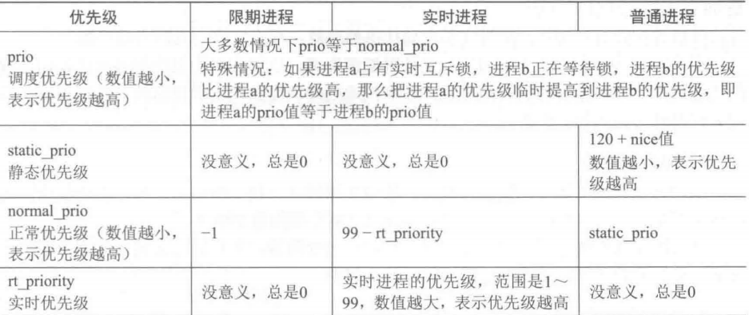
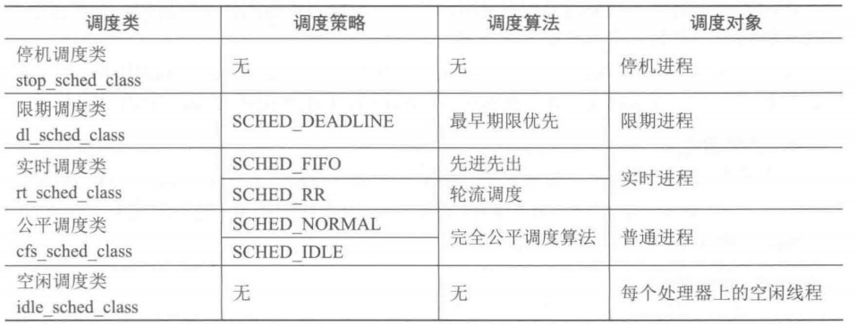

调度功能就是决定哪个进程运行以及进程运行多长时间，决定哪个进程运行以及运行多长时间都和进程的优先级有关。为了确定一个进程到底能持续运行多长时间，调度中还引入了**时间片**的概念。

# 进程的优先级
进程的优先级有3种度量方法：

- 限期进程的优先级是-1
- **静态优先级（**nice值**）：**nice值的范围是-20～+19，值越大优先级越低，也就是说nice值为-20的进程优先级最大
- **实时优先级**：范围是0～99，与nice值的定义相反，实时优先级是值越大优先级越高

实时优先级高于nice值。一个进程有了实时优先级就没有Nice值，有了Nice值就没有实时优先级_。_在`task_struct`中如下成员与优先级有关：
```c
int             prio;
int             static_prio;
int             normal_prio;
unsigned int    rt_priority;
```

```c
#define MAX_USER_RT_PRIO        100
#define MAX_RT_PRIO             MAX_USER_RT_PRIO
#define MAX_PRIO                (MAX_RT_PRIO + 40)
```

可以通过以下命令查看进程的实时优先级和Nice值(其中RTPRIO是实时优先级，NI是Nice值)：
```shell
$ ps -eo state，uid，pid，ppid，rtprio，ni，time，comm
S   UID   PID  PPID RTPRIO  NI     TIME COMMAND
S     0     1     0      -   0 00:00:00 systemd
S     0     2     0      -   0 00:00:00 kthreadd
S     0     3     2      -   0 00:00:00 ksoftirqd/0
S     0     6     2     99   - 00:00:00 migration/0
S     0     7     2     99   - 00:00:00 watchdog/0
S     0     8     2     99   - 00:00:00 migration/1
S     0    10     2      -   0 00:00:00 ksoftirqd/1
S     0    12     2     99   - 00:00:00 watchdog/1
S     0    13     2     99   - 00:00:00 migration/2
S     0    15     2      -   0 00:00:00 ksoftirqd/2
S     0    16     2     99   - 00:00:00 watchdog/2
S     0    17     2     99   - 00:00:00 migration/3
S     0    19     2      -   0 00:00:00 ksoftirqd/3
S     0    20     2     99   - 00:00:00 watchdog/3
S     0    21     2      - -20 00:00:00 cpuset
S     0    22     2      - -20 00:00:00 khelper
```


# 时间片
有了优先级，可以决定谁先运行了。但是对于调度程序来说，并不是运行一次就结束了，还必须知道间隔多久进行下次调度。于是就有了时间片的概念。
> **时间片是一个数值，表示一个进程被抢占前能持续运行的时间**。也可以认为是进程在下次调度发生前运行的时间(除非进程主动放弃CPU，或者有实时进程来抢占CPU)。

时间片的大小设置并不简单，设大了，系统响应变慢(调度周期长)；设小了，进程频繁切换带来的处理器消耗。默认的时间片一般是10ms。

## 基于优先级和时间片的调度原理
假设系统中只有3个进程ProcessA(NI=+10)，ProcessB(NI=0)，ProcessC(NI=-10)，NI表示进程的nice值，时间片=10ms

1. 调度前，把进程优先级按一定的权重映射成时间片(这里假设优先级高一级相当于多5msCPU时间)。假设ProcessA分配了一个时间片10ms，那么ProcessB的优先级比ProcessA高10(nice值越小优先级越高)，ProcessB应该分配10_5+10=60ms，以此类推，ProcessC分配20_5+10=110ms
2. 开始调度时，优先调度分配CPU时间多的进程。由于ProcessA(10ms)，ProcessB(60ms)，ProcessC(110ms)。显然先调度ProcessC
3. 10ms(一个时间片)后，再次调度时，ProcessA(10ms)，ProcessB(60ms)，ProcessC(100ms)。ProcessC刚运行了10ms，所以变成100ms。此时仍然先调度ProcessC
4. 再调度4次后(4个时间片)，ProcessA(10ms)，ProcessB(60ms)，ProcessC(60ms)。此时ProcessB和ProcessC的CPU时间一样，这时得看ProcessB和ProcessC谁在CPU运行队列的前面，假设ProcessB在前面，则调度ProcessB
5. 10ms(一个时间片)后，ProcessA(10ms)，ProcessB(50ms)，ProcessC(60ms)。再次调度ProcessC
6. ProcessB和ProcessC交替运行，直至ProcessA(10ms)，ProcessB(10ms)，ProcessC(10ms)。这时得看ProcessA，ProcessB，ProcessC谁在CPU运行队列的前面就先调度谁。这里假设调度ProcessA
7. 10ms(一个时间片)后，ProcessA(时间片用完后退出)，ProcessB(10ms)，ProcessC(10ms)。
8. 再过2个时间片，ProcessB和ProcessC也运行完退出。


这个例子很简单，主要是为了说明调度的原理，实际的调度算法虽然不会这么简单，但是基本的实现原理也是类似的：

- 确定每个进程能占用多少CPU时间(这里确定CPU时间的算法有很多，根据不同的需求会不一样)
- 占用CPU时间多的先运行
- 运行完后，扣除运行进程的CPU时间，再回到第一步

# 调度类
内核抽象了一个调度类 sched_class，实现了如下5中调度方法：

## 实时调度类
实时调度类为每个调度优先级维护一个队列，每次调度，先找到优先级最高 的第一个非空队列，然后从队列中选择第一个进程：

- **先进先出调度**策略的进程没有时间片，如果没有优先级更高的进程 ， 并且它不主动让出处理器，那么它将一直霸占处理器
- **轮流调度**策略的进程有时间片，用完时间片以后 ，进程加入队列的尾部 

## CFS调度算法
在2.6.23内核以后，采用了“**完全公平调度算法**”，简称CFS。 CFS算法在分配每个进程的CPU时间时，不是分配给它们一个绝对的CPU时间，而是**根据进程的优先级分配给它们一个占用CPU时间的百分比。**
> **虚拟运行时间＝实际运行时间 x nice0对应的权重／进程的权重**

比如ProcessA(NI=1)，ProcessB(NI=3)，ProcessC(NI=6)，在CFS算法中，分别占用CPU的百分比为：ProcessA(10%)，ProcessB(30%)，ProcessC(60%)。因为总共是100%，ProcessB的优先级是ProcessA的3倍，ProcessC的优先级是ProcessA的6倍。
Linux上的CFS算法主要有以下步骤：(还是以ProcessA(10%)，ProcessB(30%)，ProcessC(60%)为例)

- 计算每个进程的vruntime(进程虚拟运行的时间的总和)。vruntime定义在：kernel/sched_fair.c 文件的 struct sched_entity 中)，通过update_curr()函数更新进程的vruntime。
- 选择具有最小vruntime的进程投入运行。
- 进程运行完后，更新进程的vruntime，转入步骤2。Linux为了能快速的找到具有最小vruntime，将所有的进程的存储在一个红黑树中。这样树的最左边的叶子节点就是具有最小vruntime的进程，新的进程加入或有旧的进程退出时都会更新这棵树。


_vruntime并不是实际的运行时间，它是**实际运行时间进行加权运算**后的结果。_比如上面3个进程中ProcessA(10%)只分配了CPU总的处理时间的10%，那么ProcessA运行10ms的话，它的vruntime会增加100ms。以此类推，ProcessB运行10ms的话，它的vruntime会增加(100/3)ms,ProcessC运行10ms的话，它的vruntime会增加(100/6)ms。实际的运行时，由于ProcessC的vruntime增加的最慢，所以它会获得最多的CPU处理时间。

# task group


# 相关的system call
前8个是调度相关，后3个为处理器相关：

| 系统调用 | 描述 | 系统调用 | 描述 |
| --- | --- | --- | --- |
| nice() | 设置进程的nice值 | sched_setscheduler() | 设置进程的调度策略，即设置进程采取何种调度算法 |
| sched_getscheduler() | 获取进程的调度算法 | sched_setparam() | 设置进程的实时优先级 |
| sched_getparam() | 获取进程的实时优先级 | sched_get_priority_max() | 获取实时优先级的最大值，由于用户权限的问题，非root用户并不能设置实时优先级为99 |
| sched_get_priority_min() | 获取实时优先级的最小值，理由与上面类似 | sched_rr_get_interval() | 获取进程的时间片 |
| sched_setaffinity() | 设置进程的处理亲和力，其实就是保存在task_struct中的cpu_allowed这个掩码标志。该掩码的每一位对应一个系统中可用的处理器，默认所有位都被设置，即该进程可以再系统中所有处理器上执行。用户可以通过此函数设置不同的掩码，使得进程只能在系统中某一个或某几个处理器上运行。 | sched_getaffinity() | 获取进程的处理亲和力 |
| sched_yield() | 暂时让出处理器 |  |  |

