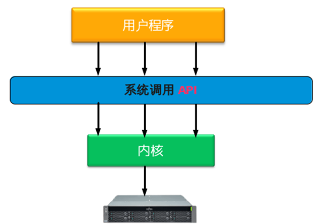

## 1 什么是系统调用

简单来说，系统调用就是用户程序和硬件设备之间的桥梁。用户程序在需要的时候，通过系统调用来使用硬件设备。
系统调用的存在，有以下重要的意义:

1. 用户程序通过系统调用来使用硬件，而不用关心具体的硬件设备，这样大大简化了用户程序的开发。比如：用户程序通过write()系统调用就可以将数据写入文件，而不必关心文件是在磁盘上还是软盘上，或者其他存储上。
2. 系统调用使得用户程序有更好的可移植性。只要操作系统提供的系统调用接口相同，用户程序就可在不用修改的情况下，从一个系统迁移到另一个操作系统。
3. 系统调用使得内核能更好的管理用户程序，增强了系统的稳定性。因为系统调用是内核实现的，内核通过系统调用来控制开放什么功能及什么权限给用户程序。这样可以避免用户程序不正确的使用硬件设备，从而破坏了其他程序。
4. 系统调用有效的分离了用户程序和内核的开发。用户程序只需关心系统调用API，通过这些API来开发自己的应用，不用关心API的具体实现。内核则只要关心系统调用API的实现，而不必管它们是被如何调用的。

用户程序，系统调用，内核，硬件设备的调用关系如下图：




## 2 Linux上的系统调用实现原理

要想实现系统调用，主要实现以下几个方面：

- 通知内核调用一个哪个系统调用
- 用户程序把系统调用的参数传递给内核
- 用户程序获取内核返回的系统调用返回值

下面看看Linux是如何实现上面3个功能的。


### 2.1 通知内核调用一个哪个系统调用

每个系统调用都有一个_系统调用号_，系统调用发生时，内核就是根据传入的系统调用号来知道是哪个系统调用的。在x86架构中，用户空间**将系统调用号是放在eax**中的，系统调用处理程序通过eax取得系统调用号。
系统调用号定义在内核代码：`arch/alpha/include/asm/unistd.h` 中，可以看出linux的系统调用不是很多。


### 2.2 用户程序把系统调用的参数传递给内核

系统调用的参数也是_通过寄存器传给内核_的，在x86系统上，系统调用的前5个参数放在ebx,ecx,edx,esi和edi中，如果参数多的话，还需要用个单独的寄存器存放指向所有参数在用户空间地址的指针。
一般的系统调用都是通过C库(最常用的是glibc库)来访问的，Linux内核提供一个从用户程序直接访问系统调用的方法。
参见内核代码：`arch/cris/include/arch-v10/arch/unistd.h`

里面定义了6个宏，分别可以调用参数个数为0～6的系统调用

```c
_syscall0(type,name)
_syscall1(type,name,type1,arg1)
_syscall2(type,name,type1,arg1,type2,arg2)
_syscall3(type,name,type1,arg1,type2,arg2,type3,arg3)
_syscall4(type,name,type1,arg1,type2,arg2,type3,arg3,type4,arg4)
_syscall5(type,name,type1,arg1,type2,arg2,type3,arg3,type4,arg4,type5,arg5)
_syscall6(type,name,type1,arg1,type2,arg2,type3,arg3,type4,arg4,type5,arg5,type6,arg6)
```

超过6个参数的系统调用很罕见，所以这里只定义了6个。


### 2.3 用户程序获取内核返回的系统调用返回值

获取系统调用的返回值也是通过寄存器，在x86系统上，返回值放在eax中。


## 3 一个简单的系统调用的实现

了解了Linux上系统调用的原理，下面就可以自己来实现一个简单的系统调用。


### 3.1 修改内核源码中的相应文件

主要修改以下文件：

```c
arch/x86/ia32/ia32entry.S
arch/x86/include/asm/unistd_32.h
arch/x86/include/asm/unistd_64.h
arch/x86/kernel/syscall_table_32.S
include/asm-generic/unistd.h
include/linux/syscalls.h
kernel/sys.c
```

在sys.c中追加了2个函数:sys_foo和sys_bar。如果是在x86_64的内核中增加一个系统调用，只需修改`arch/x86/include/asm/unistd_64.h`，比如sys_bar。

修改内容参见下面的diff文件：

```diff
diff -r new/arch/x86/ia32/ia32entry.S old/arch/x86/ia32/ia32entry.S
+     .quad sys_foo
diff -r new/arch/x86/include/asm/unistd_32.h old/arch/x86/include/asm/unistd_32.h
+ #define __NR_foo    349
+ #define NR_syscalls 350
---
- #define NR_syscalls 349
diff -r new/arch/x86/include/asm/unistd_64.h old/arch/x86/include/asm/unistd_64.h
+ #define __NR_foo            312
+ __SYSCALL(__NR_foo, sys_foo)
+ #define __NR_bar            313
+ __SYSCALL(__NR_bar, sys_bar)
diff -r new/arch/x86/kernel/syscall_table_32.S old/arch/x86/kernel/syscall_table_32.S
+     .long sys_foo
diff -r new/include/asm-generic/unistd.h old/include/asm-generic/unistd.h
+ #define __NR_foo 272
+ __SYSCALL(__NR_foo, sys_foo)
+ #define __NR_syscalls 273
---
- #define __NR_syscalls 272
diff -r new/kernel/sys.c old/kernel/sys.c
+ 
+ asmlinkage long sys_foo(void)
+ {
+     return 1112223334444555;
+ }
+ asmlinkage long sys_bar(void)
+ {
+     return 1234567890;
+ }
```


### 3.2 编译内核

```shell
#cd linux-3.2.28
#make menuconfig  (选择要编译参数，如果不熟悉内核编译，用默认选项即可)
#make all  (这一步真的时间很长......)
#make modules_install
#make install  (这一步会把新的内核加到启动项中)
#reboot  (重启系统进入新的内核)
```


### 3.3 编写调用的系统调用的代码

```c
#include +unistd.h
#include +sys/syscall.h
#include +string.h
#include +stdio.h
#include +errno.h


#define __NR_foo 312  //系统调用号，唯一的
#define __NR_bar 313

int main()
{
        printf ("result foo is %ld\n", syscall(__NR_foo));
        printf("%s\n", strerror(errno));
        printf ("result bar is %ld\n", syscall(__NR_bar));
        printf("%s\n", strerror(errno));
        return 0;
}
```

编译运行上面的代码,结果如下：

```
result foo is 1112223334444555
Success
result bar is 1234567890
Success
```
