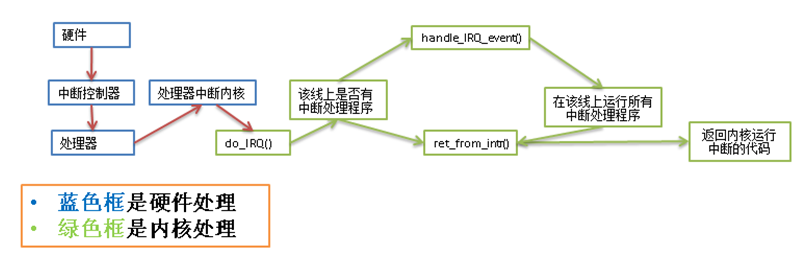
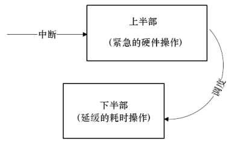
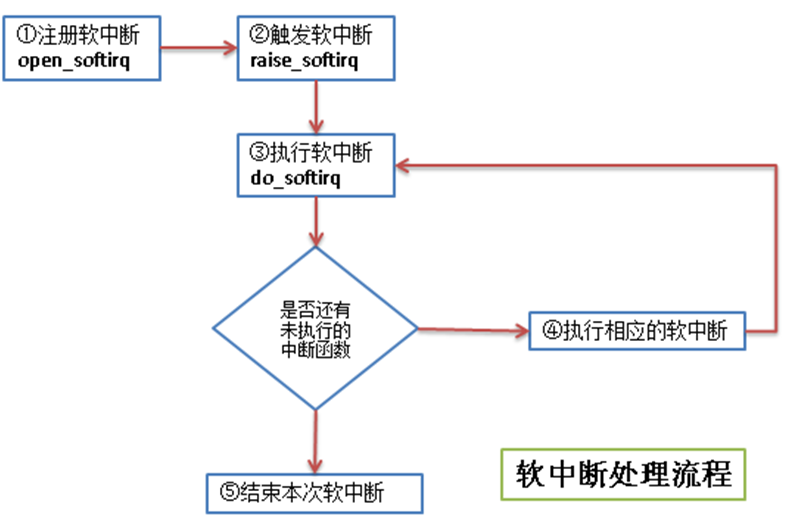

# 第七章 中断处理
中断处理一般不是纯软件来实现的，需要硬件的支持。通过对中断的学习有助于更深入的了解系统的一些底层原理，特别是驱动程序的开发。


## 1 什么是中断
为了提高 CPU 和外围硬件 (硬盘，键盘，鼠标等等) 之间协同工作的性能，引入了中断的机制。**没有中断的话，CPU 和外围设备之间协同工作可能只有轮询这个方法：CPU 定期检查硬件状态，需要处理时就处理，否则就跳过。**当硬件忙碌的时候，CPU 很可能会做许多无用功（每次轮询都是跳过不处理）。_中断机制是硬件在需要的时候向 CPU 发出信号，CPU 暂时停止正在进行的工作，来处理硬件请求的一种机制。_


## 2 中断类型
中断一般分为**异步中断 (一般由硬件引起) 和同步中断(一般由处理器本身引起)。****异步中断**：CPU 处理中断的时间过长，所以先将硬件复位，使硬件可以继续自己的工作，然后在适当时候处理中断请求中耗时的部分。这样做避免了处理数据包时间过长导致网卡接收数据包速度变慢。举个例子：网卡的工作原理

1. 网卡收到数据包后，向 CPU 发出中断信号，请求处理接收到的数据包
2. CPU 将收到的数据包拷贝到内存后，即通知网卡继续工作
3. 至于数据包拷贝至内存后的处理会在适当的时候进行


**同步中断**：CPU 处理完中断请求的所有工作后才反馈硬件举个例子：系统异常处理 (比如运算中的除 0 操作)

1. 应用程序出现异常后，需要内核来处理
2. 内核调用相应的异常处理函数来处理异常
3. 处理完后终了应用程序或者给出 message


## 3 中断相关函数
实现一个中断，主要需要知道 3 个函数：

- 注册中断的函数
- 释放中断的函数
- 中断处理程序的声明


### 3.1 注册中断的函数
位置：`linux/interrupt.h`定义如下：
```c
/*
 * irg     - 表示要分配的中断号
 * handler - 实际的中断处理程序
 * flags   - 标志位，表示此中断的具有特性
 * name    - 中断设备名称的ASCII 表示，这些会被/proc/irq和/proc/interrupts文件使用
 * dev     - 用于共享中断线，多个中断程序共享一个中断线时(共用一个中断号)，依靠dev来区别各个中断程序
 * 返回值：
 * 执行成功：0
 * 执行失败：非0
 */
int request_irq(unsigned int irq,
                irq_handler_t handler,
                unsigned long flags,
                const char* name,
                void *dev);
//此函数与request_irq()的区别是devm_开头的API申请的是内核 "managed"的资源
//一般不需要在出错处理和remove()接口里再显式的释放，类似于自动回收机制
int devm_request_irq(struct device *dev, unsigned int irq, irq_handler_t handler,
					unsigned long irqflags, const char *devname, void *dev_id);
```
除了可以通过request_irq() 、devm_request_irq()申请中断以外，还可以通过request_threaded_irq()和devm_request_threaded_irq()申请。 这两个函数的原型为
```c
//使用这两个函数注册中断时，内核会为相应的中断号分配一个对应的内核线程，thread_fn对应的函数会在新线程
//中执行，可以在这个线程中执行中断后半部的操作
int request_threaded_irq(unsigned int irq, irq_handler_t handler, irq_handler_t thread_fn,
                         unsigned long flags, const char *name, void *dev);
int devm_request_threaded_irq(struct device *dev, unsigned int irq,
                              irq_handler_t handler, irq_handler_t thread_fn,
                              unsigned long irqflags, const char *devname,
                              void *dev_id);
```


### 3.2 释放中断的函数
定义比较简单：`void free_irq(unsigned int irq, void *dev)`如果不是共享中断线，则直接删除 irq 对应的中断线。如果是共享中断线，则判断此中断处理程序是否中断线上的最后一个中断处理程序，

- 是最后一个中断处理程序 -> 删除中断线和中断处理程序
- 不是最后一个中断处理程序 -> 删除中断处理程序


### 3.3 中断处理函数声明
声明格式如下：
```c
/* 
 * 中断处理程序的声明
 * @irp  - 中断处理程序(即request_irq()中handler)关联的中断号
 * @dev  - 与 request_irq()中的dev一样，表示一个设备的结构体
 * 返回值：
 * irqreturn_t -  执行成功：IRQ_HANDLED  执行失败：IRQ_NONE
 */
static irqreturn_t intr_handler(int, irq, void *dev)
```


### 3.4 中断控制函数
常用的中断控制方法见下表，local开头的表示**作用范围为本CPU(注意多核)**：

| **函数** | **说明** |
| --- | --- |
| local_irq_disable() | 禁止本地中断传递 |
| local_irq_enable() | 激活本地中断传递 |
| local_irq_save() | 保存本地中断传递的当前状态，然后禁止本地中断传递 |
| local_irq_restore() | 恢复本地中断传递到给定的状态 |
| **disable_irq()** | 禁止给定中断线，并确保该函数返回之前在该中断线上没有处理程序在运行 |
| **disable_irq_nosync()** | 禁止给定中断线 |
| **enable_irq()** | 激活给定中断线 |
| irqs_disabled() | 如果本地中断传递被禁止，则返回非 0；否则返回 0 |
| in_interrupt() | 如果在中断上下文中，则返回非 0；如果在进程上下文中，则返回 0 |
| in_irq() | 如果当前正在执行中断处理程序，则返回非 0；否则返回 0 |


## 4. 中断处理机制
中断处理的过程主要涉及 3 函数：

- do_IRQ 与体系结构有关，对所接收的中断进行应答
- handle_IRQ_event 调用中断线上所有中断处理
- ret_from_intr 恢复寄存器，将内核恢复到中断前的状态


处理流程可以参见书中的图，如下：




## 总结
中断处理对处理时间的要求很高，如果一个中断要花费较长时间，那么中断处理一般分为 2 部分。

- 上半部只做一些必要的工作后，立即通知硬件继续自己的工作。
- 中断处理中耗时的部分，也就是下半部的工作，CPU 会在适当的时候去完成：




# 第8章 中断下半部处理


## 1 中断下半部处理
那么对于一个中断，如何划分上下两部分呢？哪些处理放在上半部，哪些处理放在下半部？这里有一些经验可供借鉴：

- 如果一个任务对时间十分敏感，将其放在上半部
- 如果一个任务和硬件有关，将其放在上半部
- 如果一个任务要保证不被其他中断打断，将其放在上半部
- 其他所有任务，考虑放在下半部


## 2 实现中断下半部的机制
实现下半部的方法很多，随着内核的发展，产生了一些新的方法，也淘汰了一些旧方法。目前使用最多的是以下 3 中方法

- 2.1 软中断
- 2.2 tasklet
- 2.3 工作队列
- 线程化irq


### 2.1 软中断
软中断的代码在：`kernel/softirq.c`软中断的流程如下：


流程图中几个步骤的说明：

- ① 注册软中断的函数 open_softirq 参见 kernel/softirq.c 文件)
```c
/* 
 * 将软中断类型和软中断处理函数加入到软中断序列中
 * @nr                                 - 软中断类型
 * @(*action)(struct softirq_action *) - 软中断处理的函数指针
 */
void open_softirq(int nr, void (*action)(struct softirq_action *))
{
    /* softirq_vec是个struct softirq_action类型的数组 */
    softirq_vec[nr].action = action;
}
```

软中断类型目前有 10 个，其定义在 include/linux/interrupt.h 文件中：
```c
enum
{
    HI_SOFTIRQ=0,
    TIMER_SOFTIRQ,
    NET_TX_SOFTIRQ,
    NET_RX_SOFTIRQ,
    BLOCK_SOFTIRQ,
    BLOCK_IOPOLL_SOFTIRQ,
    TASKLET_SOFTIRQ,
    SCHED_SOFTIRQ,
    HRTIMER_SOFTIRQ,
    RCU_SOFTIRQ,    /* Preferable RCU should always be the last softirq */

    NR_SOFTIRQS
};
```

struct softirq_action 的定义也在 include/linux/interrupt.h 文件中
```c
/*
 * 这个结构体的字段是个函数指针，字段名称是action
 * 函数指针的返回指是void型
 * 函数指针的参数是 struct softirq_action 的地址，其实就是指向 softirq_vec 中的某一项
 *     如果 open_softirq 是这样调用的： open_softirq(NET_TX_SOFTIRQ, my_tx_action);
 *     那么 my_tx_action 的参数就是 softirq_vec[NET_TX_SOFTIRQ]的地址
 */
struct softirq_action
{
    void    (*action)(struct softirq_action *);
};
```


- ② 触发软中断的函数 raise_softirq 参见 kernel/softirq.c 文件
```c
/*
 * 触发某个中断类型的软中断
 * @nr - 被触发的中断类型
 * 从函数中可以看出，在处理软中断前后有保存和恢复寄存器的操作
 */
void raise_softirq(unsigned int nr)
{
    unsigned long flags;

    local_irq_save(flags);
    raise_softirq_irqoff(nr);
    local_irq_restore(flags);
}
```


- ③ 执行软中断 do_softirq 参见 kernel/softirq.c 文件
```c
asmlinkage void do_softirq(void)
{
    __u32 pending;
    unsigned long flags;

    /* 判断是否在中断处理中，如果正在中断处理，就直接返回 */
    if (in_interrupt())
        return;

    /* 保存当前寄存器的值 */
    local_irq_save(flags);

    /* 取得当前已注册软中断的位图 */
    pending = local_softirq_pending();

    /* 循环处理所有已注册的软中断 */
    if (pending)
        __do_softirq();

    /* 恢复寄存器的值到中断处理前 */
    local_irq_restore(flags);
}
```


- ④ 执行相应的软中断 - 执行自己写的中断处理

linux 中，执行软中断有专门的内核线程，每个处理器对应一个线程，名称 **ksoftirqd/n (n 对应处理器号)**通过 top 命令查看我的单核虚拟机，CentOS 系统中的 ksoftirqd 线程如下：

```bash
[root@vbox ~] top | grep ksoftirq
    4 root      20   0     0    0    0 S  0.0  0.0   0:00.02 ksoftirqd/0
```


### 2.2 tasklet
tasklet 也是利用软中断来实现的，但是它**提供了比软中断更好用的接口** (其实就是基于软中断又封装了一下)，所以_除了对性能要求特别高的情况，一般建议使用 tasklet 来实现自己的中断。_tasklet 对应的结构体在 `<linux/interrupt.h>` 中
```c
struct tasklet_struct
{
    struct tasklet_struct *next; /* 链表中的下一个tasklet */
    unsigned long state;         /* tasklet状态 */
    atomic_t count;              /* 引用计数器 */
    void (*func)(unsigned long); /* tasklet处理函数 */
    unsigned long data;          /* tasklet处理函数的参数 */
};
```
tasklet 状态只有 3 种值：

- 值 0:  表示该 tasklet 没有被调度
- 值 TASKLET_STATE_SCHED: 表示该 tasklet 已经被调度
- 值 TASKLET_STATE_RUN: 表示该 tasklet 已经运行


引用计数器 count 的值不为 0，表示该 tasklet 被禁止。
tasklet 使用流程如下：

- 声明 tasklet (参见 < linux/interrupt.h>)
```c
/* 静态声明一个tasklet */
#define DECLARE_TASKLET(name, func, data)  
struct tasklet_struct name = { NULL, 0, ATOMIC_INIT(0), func, data }

#define DECLARE_TASKLET_DISABLED(name, func, data)  
struct tasklet_struct name = { NULL, 0, ATOMIC_INIT(1), func, data }

/* 动态声明一个tasklet 传递一个tasklet_struct指针给初始化函数 */
extern void tasklet_init(struct tasklet_struct *t,
             void (*func)(unsigned long), unsigned long data);
```

- 编写处理程序参照 tasklet 处理函数的原型来写自己的处理逻辑: `void tasklet_handler(unsigned long date)`
- 调度 tasklet中断的上半部处理完后调度 tasklet，在适当时候进行下半部的处理: `tasklet_schedule(&my_tasklet) /* my_tasklet就是之前声明的tasklet_struct */`


### 2.3 工作队列
工作队列子系统是一个用于创建内核线程的接口，通过它可以创建一个工作者线程来专门处理中断的下半部工作。**工作队列和 tasklet 不一样，不是基于软中断来实现的。**缺省的工作者线程名称是 events/n (n 对应处理器号)。
通过 top 命令查看我的单核虚拟机，CentOS 系统中的 events 线程如下：
```bash
[root@vbox ~] top | grep event
    7 root      20   0     0    0    0 S  0.0  0.0   0:03.71 events/0
```

工作队列主要用到下面 3 个结构体，弄懂了这 3 个结构体的关系，也就知道工作队列的处理流程了。
```c
/* 在 include/linux/workqueue.h 文件中定义 */
struct work_struct {
    atomic_long_t data;             /* 这个并不是处理函数的参数，而是表示此work是否pending等状态的flag */
#define WORK_STRUCT_PENDING 0        /* T if work item pending execution */
#define WORK_STRUCT_FLAG_MASK (3UL)
#define WORK_STRUCT_WQ_DATA_MASK (~WORK_STRUCT_FLAG_MASK)
    struct list_head entry;         /* 中断下半部处理函数的链表 */
    work_func_t func;               /* 处理中断下半部工作的函数 */
#ifdef CONFIG_LOCKDEP
    struct lockdep_map lockdep_map;
#endif
};

/* 在 kernel/workqueue.c文件中定义
 * 每个工作者线程对应一个 cpu_workqueue_struct ，其中包含要处理的工作的链表
 * (即 work_struct 的链表，当此链表不空时，唤醒工作者线程来进行处理)
 */
/*
 * The per-CPU workqueue (if single thread, we always use the first
 * possible cpu).
 */
struct cpu_workqueue_struct {

    spinlock_t lock;                   /* 锁保护这种结构 */

    struct list_head worklist;         /* 工作队列头节点 */
    wait_queue_head_t more_work;
    struct work_struct *current_work;

    struct workqueue_struct *wq;       /* 关联工作队列结构 */
    struct task_struct *thread;        /* 关联线程 */
} ____cacheline_aligned;

/* 也是在 kernel/workqueue.c 文件中定义的
 * 每个 workqueue_struct 表示一种工作者类型，系统默认的就是 events 工作者类型
 * 每个工作者类型一般对应n个工作者线程，n就是处理器的个数
 */
/*
 * The externally visible workqueue abstraction is an array of
 * per-CPU workqueues:
 */
struct workqueue_struct {
    struct cpu_workqueue_struct *cpu_wq;  /* 工作者线程 */
    struct list_head list;
    const char *name;
    int singlethread;
    int freezeable;        /* Freeze threads during suspend */
    int rt;
#ifdef CONFIG_LOCKDEP
    struct lockdep_map lockdep_map;
#endif
};
```

使用工作者队列的方法见下图：


- ① 创建推后执行的工作 - 有静态创建和动态创建 2 种方法
```c
* @n - work_struct结构体，不用事先定义
 * @f - 下半部处理函数
 */
#define DECLARE_WORK(n, f)                     
    struct work_struct n = __WORK_INITIALIZER(n, f)

/* 动态创建一个 work_struct
 * @_work - 已经定义好的一个 work_struct
 * @_func - 下半部处理函数
 */
#ifdef CONFIG_LOCKDEP
#define INIT_WORK(_work, _func)                         
    do {                                 
        static struct lock_class_key __key;             
                                     
        (_work)->data = (atomic_long_t) WORK_DATA_INIT();     
        lockdep_init_map(&(_work)->lockdep_map, #_work, &__key, 0); 
        INIT_LIST_HEAD(&(_work)->entry);             
        PREPARE_WORK((_work), (_func));                 
    } while (0)
#else
#define INIT_WORK(_work, _func)                         
    do {                                 
        (_work)->data = (atomic_long_t) WORK_DATA_INIT();     
        INIT_LIST_HEAD(&(_work)->entry);             
        PREPARE_WORK((_work), (_func));                 
    } while (0)
#endif
```
工作队列处理函数的原型：

- ② 刷新现有的工作，这个步骤不是必须的，可以直接从第①步直接进入第③步。刷新现有工作的意思就是在追加新的工作之前，保证队列中的已有工作已经执行完了。
```c
/* 刷新系统默认的队列，即 events 队列 */
void flush_scheduled_work(void);

/* 刷新用户自定义的队列
 * @wq - 用户自定义的队列
 */
void flush_workqueue(struct workqueue_struct *wq);
```


- ③ 调度工作 - 调度新定义的工作，使之处于等待处理器执行的状态
```c
/* 调度第一步中新定义的工作，在系统默认的工作者线程中执行此工作
 * @work - 第一步中定义的工作
 */
schedule_work(struct work_struct *work);

/* 调度第一步中新定义的工作，在系统默认的工作者线程中执行此工作
 * @work  - 第一步中定义的工作
 * @delay - 延迟的时钟节拍
 */
int schedule_delayed_work(struct delayed_work *work, unsigned long delay);

/* 调度第一步中新定义的工作，在用户自定义的工作者线程中执行此工作
 * @wq   - 用户自定义的工作队列类型
 * @work - 第一步中定义的工作
 */
int queue_work(struct workqueue_struct *wq, struct work_struct *work);

/* 调度第一步中新定义的工作，在用户自定义的工作者线程中执行此工作
 * @wq    - 用户自定义的工作队列类型
 * @work  - 第一步中定义的工作
 * @delay - 延迟的时钟节拍
 */
int queue_delayed_work(struct workqueue_struct *wq,
            struct delayed_work *work, unsigned long delay);
```


## 3 . 总结中断下半部的实现
下面对实现中断下半部工作的 3 种机制进行总结，便于在实际使用中决定使用哪种机制

| **下半部处理机制** | **上下文** | **复杂度** | **执行性能** | **顺序执行保障** |
| --- | --- | --- | --- | --- |
| **软中断** | 中断 | 高(需要自己确保软中断的执行顺序及锁机制) | 好(全部自己实现，便于调优) | 没有 |
| **tasklet** | 中断 | 中(提供了简单的接口来使用软中断) | 中 | 同类型不能同时执行 |
| **工作队列** | 进程 | 低(在进程上下文中运行，与写用户程序差不多) | 差 | 没有(和进程上下文一样被调度) |


## 4 中断实现示例

### 4.1 软中断的实现
本来想用内核模块的方法来测试一下软中断的流程，但是编译时发现**软中断注册函数 (open_softirq) 和触发函数(raise_softirq)并没有用 EXPORT_SYMBOL 导出**，所以自定义的内核模块中无法使用。测试的代码如下：

```c
#include <linux/interrupt.h>
#include "kn_common.h"

MODULE_LICENSE("Dual BSD/GPL");

static void my_softirq_func(struct softirq_action*);

static int testsoftirq_init(void)
{
    // 注册softirq，这里注册的是定时器的下半部
    open_softirq(TIMER_SOFTIRQ, my_softirq_func);

    // 触发softirq
    raise_softirq(TIMER_SOFTIRQ);

    return 0;

}

static void testsoftirq_exit(void)
{
    printk(KERN_ALERT "************************* n");
    print_current_time(0);
    printk(KERN_ALERT "testrbtree is exited! n");
    printk(KERN_ALERT "************************* n");

}

static void my_softirq_func(struct softirq_action* act)
{
    printk(KERN_ALERT "========================= n");
    print_current_time(0);
    printk(KERN_ALERT "my softirq function is been called!.... n");
    printk(KERN_ALERT "========================= n");
}

module_init(testsoftirq_init);
module_exit(testsoftirq_exit);
```

由于内核没有用 **EXPORT_SYMBOL** 导出 **open_softirq** 和 **raise_softirq** 函数，所以编译时有如下警告：
```c
WARNING: "open_softirq" [/root/chap08/mysoftirq.ko] undefined!
WARNING: "raise_softirq" [/root/chap08/mysoftirq.ko] undefined!
```

**注：**编译用的系统Ubuntu 18.04 (4.15.0-45-generic)
没办法，只能尝试修改内核代码 (将 open_softirq 和 raise_softirq 用 EXPORT_SYMBOL 导出)，再重新编译内核，然后再尝试能否测试软中断。主要修改 2 个文件，(既然要修改代码，干脆加了一种软中断类型)：
```c
/* 修改 kernel/softirq.c */
// ... 略 ...
char *softirq_to_name[NR_SOFTIRQS] = {
    "HI", "TIMER", "NET_TX", "NET_RX", "BLOCK", "BLOCK_IOPOLL",
    "TASKLET", "SCHED", "HRTIMER",  "RCU", "RXH"
};  /* 追加了一种新的softirq，即 "RXH"，名字的缩写*/

// ... 略 ...

void raise_softirq(unsigned int nr)
{
    unsigned long flags;

    local_irq_save(flags);
    raise_softirq_irqoff(nr);
    local_irq_restore(flags);
}
EXPORT_SYMBOL(raise_softirq);   /* 追加的代码 */

void open_softirq(int nr, void (*action)(struct softirq_action *))
{
    softirq_vec[nr].action = action;
}
EXPORT_SYMBOL(open_softirq);    /* 追加的代码 */

// ... 略 ...

/* 还修改了 include/linux/interrupt.h */
enum
{
    HI_SOFTIRQ=0,
    TIMER_SOFTIRQ,
    NET_TX_SOFTIRQ,
    NET_RX_SOFTIRQ,
    BLOCK_SOFTIRQ,
    BLOCK_IOPOLL_SOFTIRQ,
    TASKLET_SOFTIRQ,
    SCHED_SOFTIRQ,
    HRTIMER_SOFTIRQ,
    RCU_SOFTIRQ,    /* Preferable RCU should always be the last softirq */

    RXH_SOFTIRQS,   /* 追加的一种中断类型 */
    NR_SOFTIRQS
};
```

重新编译内核后，在新的内核上再次实验软中断代码：测试软中断的代码:
```c
#include <linux/interrupt.h>
#include "kn_common.h"

MODULE_LICENSE("Dual BSD/GPL");

static void my_softirq_func(struct softirq_action*);

static int testsoftirq_init(void)
{
    printk(KERN_ALERT "interrupt's top half! n");

    // 注册softirq，这里注册的是自定义的软中断类型
    open_softirq(RXH_SOFTIRQS, my_softirq_func);

    // 触发softirq
    raise_softirq(RXH_SOFTIRQS);

    return 0;

}

static void testsoftirq_exit(void)
{
    printk(KERN_ALERT "************************* n");
    print_current_time(0);
    printk(KERN_ALERT "testsoftirq is exited! n");
    printk(KERN_ALERT "************************* n");

}

static void my_softirq_func(struct softirq_action* act)
{
    printk(KERN_ALERT "========================= n");
    print_current_time(0);
    printk(KERN_ALERT "my softirq function is been called!.... n");
    printk(KERN_ALERT "========================= n");
}

module_init(testsoftirq_init);
module_exit(testsoftirq_exit);
```

Makefile：
```makefile
obj-m := intru.o
intru-objs := testsoftirq.o kn_common.o

#generate the path
CURRENT_PATH:=$(shell pwd)
#the current kernel version number
LINUX_KERNEL:=$(shell uname -r)
#the absolute path
LINUX_KERNEL_PATH:=/usr/src/linux-headers-$(LINUX_KERNEL)  #直接用发行版中的linux源码，不用再下载linux内核源码。注意，每个linux发行版的目录不一定一样
#complie object
all:
        make -C $(LINUX_KERNEL_PATH) M=$(CURRENT_PATH) modules
clean:
        make -C $(LINUX_KERNEL_PATH) M=$(CURRENT_PATH) clean
```

测试软中断的方法如下：
```bash
make
insmod mysoftirq.ko
rmmod mysoftirq
dmesg | tail -9

 运行结果
interrupt's top half!
=========================
2013-4-22 14:4:57
my softirq function is been called!....
=========================
*************************
2013-4-22 14:5:2
testsoftirq is exited!
************************
```


### 4.2 tasklet 的实现
我们可以看出，_内核之所以没有导出 open_softirq 和 raise_softirq 函数，可能还是因为提倡我们尽量用 tasklet 来实现中断的下半部工作。_tasklet 测试代码, 在Ubuntu 18.04编译通过：
```c
#include <linux/interrupt.h>
#include "kn_common.h"

MODULE_LICENSE("Dual BSD/GPL");

static void my_tasklet_func(unsigned long);

/* mytasklet 必须定义在testtasklet_init函数的外面，否则会出错 */
DECLARE_TASKLET(mytasklet, my_tasklet_func, 1000);

static int testtasklet_init(void)
{
    printk(KERN_ALERT "interrupt's top half!\n");

    // 如果在这里定义的话，那么 mytasklet是函数的局部变量，
    // 后面调度的时候会找不到 mytasklet
    // DECLARE_TASKLET(mytasklet, my_tasklet_func, 1000);

    // 调度tasklet， 处理器会在适当时候执行这个tasklet
    tasklet_schedule(&mytasklet);

    return 0;

}

static void testtasklet_exit(void)
{
    printk(KERN_ALERT "*************************\n");
    print_current_time(0);
    printk(KERN_ALERT "testtasklet is exited!\n");
    printk(KERN_ALERT "*************************\n");

}

static void my_tasklet_func(unsigned long data)
{
    printk(KERN_ALERT "=========================\n");
    print_current_time(0);
    printk(KERN_ALERT "my tasklet function is been called!....\n");
    printk(KERN_ALERT "parameter data is %ld\n", data);
    printk(KERN_ALERT "=========================\n");
}

module_init(testtasklet_init);
module_exit(testtasklet_exit);
```

Makefile：
```makefile
obj-m := intru.o
intru-objs := testtasklet.o kn_common.o

#generate the path
CURRENT_PATH:=$(shell pwd)
#the current kernel version number
LINUX_KERNEL:=$(shell uname -r)
#the absolute path
LINUX_KERNEL_PATH:=/usr/src/linux-headers-$(LINUX_KERNEL)  #直接用发行版中的linux源码，不用再下载linux内核源码。注意，每个linux发行版的目录不一定一样
#complie object
all:
        make -C $(LINUX_KERNEL_PATH) M=$(CURRENT_PATH) modules
clean:
        make -C $(LINUX_KERNEL_PATH) M=$(CURRENT_PATH) clean
```

测试 tasklet 的方法如下：
```bash
make
insmod intru.ko
rmmod intru
dmesg | tail -10

运行结果
interrupt's top half!
=========================
2013-4-22 14:53:14
my tasklet function is been called!....
parameter data is 1000
=========================
*************************
2013-4-22 14:53:20
testtasklet is exited!
*************************
```


### 4.3 工作队列的实现
workqueue 的例子的中静态定义了一个工作，动态定义了一个工作。

- 静态定义的工作由**系统工作队列（events/n）**调度，
- 动态定义的工作由**自定义的工作队列（myworkqueue）**调度。


测试工作队列的代码：testworkqueue.c
```c
#include <linux/workqueue.h>
#include "kn_common.h"

MODULE_LICENSE("Dual BSD/GPL");

static void my_work_func(struct work_struct *);
static void my_custom_workqueue_func(struct work_struct *);

/* 静态创建一个工作，使用系统默认的工作者线程，即 events/n */
DECLARE_WORK(mywork, my_work_func);

static int testworkqueue_init(void)
{
    /*自定义的workqueue */
    struct workqueue_struct *myworkqueue = create_workqueue("myworkqueue");

    /* 动态创建一个工作 */
    struct work_struct *mywork2;
    mywork2 = kmalloc(sizeof(struct work_struct), GFP_KERNEL);
    INIT_WORK(mywork2, my_custom_workqueue_func);

    printk(KERN_ALERT "interrupt's top half!\n");

    /* 刷新系统默认的队列 */
    flush_scheduled_work();
    /* 调度工作 */
    schedule_work(&mywork);

    /* 刷新自定义的工作队列 */
    flush_workqueue(myworkqueue);
    /* 调度自定义工作队列上的工作 */
    queue_work(myworkqueue, mywork2);

    return 0;
}

static void testworkqueue_exit(void)
{
    printk(KERN_ALERT "*************************\n");
    print_current_time(0);
    printk(KERN_ALERT "my workqueue test is exited!\n");
    printk(KERN_ALERT "*************************\n");

}

static void my_work_func(struct work_struct *work)
{
    printk(KERN_ALERT "=========================\n");
    print_current_time(0);
    printk(KERN_ALERT "my workqueue function is been called!....\n");
    printk(KERN_ALERT "=========================\n");
}

static void my_custom_workqueue_func(struct work_struct *work)
{
    printk(KERN_ALERT "=========================\n");
    print_current_time(0);
    printk(KERN_ALERT "my cutomize workqueue function is been called!....\n");
    printk(KERN_ALERT "=========================\n");
    kfree(work);
}

module_init(testworkqueue_init);
module_exit(testworkqueue_exit);
```

Makefile:
```makefile
obj-m := intru.o
intru-objs := testworkqueue.o kn_common.o

#generate the path
CURRENT_PATH:=$(shell pwd)
#the current kernel version number
LINUX_KERNEL:=$(shell uname -r)
#the absolute path
LINUX_KERNEL_PATH:=/usr/src/linux-headers-$(LINUX_KERNEL)  #直接用发行版中的linux源码，不用再下载linux内核源码。注意，每个linux发行版的目录不一定一样
#complie object
all:
        make -C $(LINUX_KERNEL_PATH) M=$(CURRENT_PATH) modules
clean:
        make -C $(LINUX_KERNEL_PATH) M=$(CURRENT_PATH) clean
```

测试 workqueue 的方法如下：
```c
make
insmod intru.ko
rmmod intru
dmesg | tail -13

 运行结果
interrupt's top half!
=========================
2013-4-23 9:55:29
my workqueue function is been called!....
=========================
=========================
2013-4-23 9:55:29
my cutomize workqueue function is been called!....
=========================
*************************
2013-4-23 9:55:29
my workqueue is exited!
*************************
```
