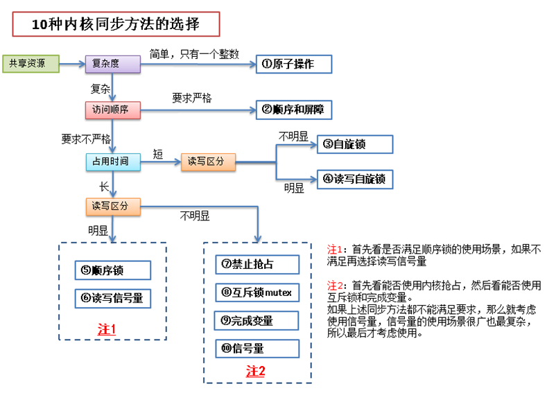

# 第九章 内核同步介绍
存在共享资源 (共享一个文件，一块内存等等) 的时候，为了防止并发访问时共享资源的数据不一致，引入了同步机制。


## 1 同步的概念
了解同步之前，先了解另外 2 个概念：

- 临界区   - 也称为临界段，就是访问和操作共享数据的代码段。
- 竞争条件 - 2 个或 2 个以上线程在临界区里同时执行的时候，就构成了竞争条件。


**所谓同步，其实防止在临界区中形成竞争条件。**如果临界区里是原子操作 (即整个操作完成前不会被打断)，那么自然就不会出竞争条件。但在实际应用中，临界区中的代码往往不会那么简单，所以为了保持同步，引入了锁机制。


## 2 同步的方法 - 加锁
为了给临界区加锁，保证临界区数据的同步，首先了解一下内核中哪些情况下会产生并发。内核中造成竞争条件的原因：

| **竞争原因** | **说明** |
| --- | --- |
| 中断 | 中断随时会发生，也就会随时打断当前执行的代码。如果中断和被打断的代码在相同的临界区，就产生了竞争条件 |
| 软中断和 tasklet | 软中断和 tasklet 也会随时被内核唤醒执行，也会像中断一样打断正在执行的代码 |
| 内核抢占 | 内核具有抢占性，发生抢占时，如果抢占的线程和被抢占的线程在相同的临界区，就产生了竞争条件 |
| 睡眠及用户空间的同步 | 用户进程睡眠后，调度程序会唤醒一个新的用户进程，新的用户进程和睡眠的进程可能在同一个临界区中 |
| 对称多处理 | 2 个或多个处理器可以同时执行相同的代码 |


为了在编写内核代码时避免出现竞争条件，在**编写代码之前就要考虑好临界区在哪，以及怎么加锁**。在编写完代码后再加锁是非常困难的，很可能还会导致部分代码重写。编写内核代码时，时时记着下面这些问题：

- 这个数据是不是全局的？除了当前线程以外，其他线程能不能访问它？
- 这个数据会不会在进程上下文或者中断上下文中共享？它是不是要在两个不同的中断处理程序中共享？
- 进程在访问数据时可不可能被抢占？被调度的新程序会不会访问同一数据？
- 当前进程会不会睡眠 (或者阻塞) 在某些资源上，如果是，它会让共享数据处于何种状态？
- 怎样防止数据失控？
- 如果这个函数又在另一个处理器上被调度将会发生什么？


## 3 死锁
死锁就是所有线程都在相互等待释放资源，导致谁也无法继续执行下去。下面一些简单的规则可以帮助我们避免死锁：

- 如果有多个锁的话，尽量确保每个线程都是按相同的顺序加锁，按加锁相反的顺序解锁。(即加锁 a->b->c，解锁 c->b->a)
- 防止发生饥饿。即设置一个超时时间，防止一直等待下去。
- 不要重复请求同一个锁。
- 设计应力求简单。加锁的方案越复杂就越容易出现死锁。


## 4 锁的粒度

在加锁的时候，**不仅要避免死锁，还需要考虑加锁的粒度。**锁的粒度对系统的可扩展性有很大影响，在加锁的时候，要考虑一下这个锁是否会被多个线程频繁的争用。如果锁有可能会被频繁争用，就需要将锁的粒度细化。细化后的锁在多处理器的情况下，性能会有所提升。
举个例子说明一下：比如给一个链表加锁，同时有 A，B，C 3 个线程频繁访问这个链表。那么当 A，B，C 3 个线程同时访问这个链表时，如果 A 获得了锁，那么 B，C 线程只能等待 A 释放了锁后才能访问这个链表。如果 A，B，C 3 个线程访问的是这个链表的不同节点（比如 A 是修改节点 listA，B 是删除节点 listB，C 是追加节点 listC），并且这 3 个节点不是连续的，那么 3 个线程同时运行是不会有问题的。这种情况下就可以细化这个锁，把加在链表上的锁去掉，改成把锁加在链表的每个节点上。（也就是锁粒度的细化）那么，上述的情况下，A，B，C 3 个线程就可以同时访问各自的节点，特别是在多处理器的情况下，性能会有显著提高。
最后还有一点需要提醒的是，锁的粒度越细，系统开销越大，程序也越复杂，所以对于争用不是很频繁的锁，就没有必要细化了。


# 第十章 内核同步方法
内核中提供了多种方法来防止竞争条件，理解了这些方法的使用场景有助于我们在编写内核代码时选用合适的同步方法，从而即可保证代码中临界区的安全，同时也让性能的损失降到最低。主要的内核同步方法有：

- 原子操作
- 自旋锁
- 读写自旋锁
- 信号量
- 读写信号量
- 互斥体
- 完成变量
- 顺序锁
- 禁止抢占
- 顺序和屏障


## 1 原子操作
**原子操作是由编译器来保证的，保证一个线程对数据的操作不会被其他线程打断。**原子操作有 2 类：

- [原子整数操作](https://www.yuque.com/barret/giv6pv/mt7u7n#Hb3qr)，有 32 位和 64 位。头文件分别为 `<asm/atomic.h>` 和 `< asm/atomic64.h>`
- [原子位操作](https://www.yuque.com/barret/giv6pv/mt7u7n#MY2TM)。头文件 `<asm/bitops.h>`


原子操作头文件与具体的体系结构有关，比如 x86 架构的相关头文件在 arch/x86/include/asm/*.h


## 2 自旋锁
原子操作只能用于临界区只有一个变量的情况，实际应用中，临界区的情况要复杂的多。对于复杂的临界区，linux 内核中也提供了多种同步方法，自旋锁就是其中一种。自旋锁的特点就是**当一个线程获取了锁之后，其他试图获取这个锁的线程一直在循环等待获取这个锁，直至锁重新可用。**由于线程实在一直循环的获取这个锁，所以会造成 CPU 处理时间的浪费，因此最好**将自旋锁用于能很快处理完的临界区。**
自旋锁的实现与体系结构有关，所以相应的头文件 `<asm/spinlock.h>` 位于相关体系结构的代码中。自旋锁使用时有 2 点需要注意：

1. 自旋锁是不可递归的，递归的请求同一个自旋锁会自己锁死自己。
2. 线程获取自旋锁之前，要禁止当前处理器上的中断。（防止获取锁的线程和中断形成竞争条件）比如：当前线程获取自旋锁后，在临界区中被中断处理程序打断，中断处理程序正好也要获取这个锁，于是中断处理程序会等待当前线程释放锁，而当前线程也在等待中断执行完后再执行临界区和释放锁的代码。


**中断处理下半部的操作中使用自旋锁尤其需要小心**：

- 下半部处理和进程上下文共享数据时，由于下半部的处理可以抢占进程上下文的代码，所以进程上下文在对共享数据加锁前要禁止下半部的执行，解锁时再允许下半部的执行。
- 中断处理程序（上半部）和下半部处理共享数据时，由于中断处理（上半部）可以抢占下半部的执行，所以下半部在对共享数据加锁前要禁止中断处理（上半部），解锁时再允许中断的执行。
- 同一种 tasklet 不能同时运行，所以同类 tasklet 中的共享数据不需要保护。
- 不同类 tasklet 中共享数据时，其中一个 tasklet 获得锁后，不用禁止其他 tasklet 的执行，因为同一个处理器上不会有 tasklet 相互抢占的情况
- 同类型或者非同类型的软中断在共享数据时，也不用禁止下半部，因为同一个处理器上不会有软中断互相抢占的情况


自旋锁方法列表如下：

| **方法** | **描述** |
| --- | --- |
| spin_lock() | 获取指定的自旋锁 |
| spin_lock_irq() | 禁止本地中断并获取指定的锁 |
| spin_lock_irqsave() | 保存本地中断的当前状态，禁止本地中断，并获取指定的锁 |
| spin_unlock() | 释放指定的锁 |
| spin_unlock_irq() | 释放指定的锁，并激活本地中断 |
| spin_unlock_irqstore() | 释放指定的锁，并让本地中断恢复到以前状态 |
| spin_lock_init() | 动态初始化指定的 spinlock_t |
| spin_trylock() | 试图获取指定的锁，如果未获取，则返回 0 |
| spin_is_locked() | 如果指定的锁当前正在被获取，则返回非 0，否则返回 0 |


## 3 读写自旋锁
读写自旋锁除了和普通自旋锁一样有自旋特性以外，还有以下特点：

- 读锁之间是共享的： 即一个线程持有了读锁之后，其他线程也可以以读的方式持有这个锁
- 写锁之间是互斥的： 即一个线程持有了写锁之后，其他线程不能以读或者写的方式持有这个锁
- 读写锁之间是互斥的： 即一个线程持有了读锁之后，其他线程不能以写的方式持有这个锁


**注：读写锁要分别使用，不能混合使用，否则会造成死锁**。
正常的使用方法：
```c
DEFINE_RWLOCK(mr_rwlock);

read_lock(&mr_rwlock);
/* 临界区(只读).... */
read_unlock(&mr_rwlock);

write_lock(&mr_lock);
/* 临界区(读写)... */
write_unlock(&mr_lock);
```

混合使用时：

```c
/* 获取一个读锁 */
read_lock(&mr_lock);
/* 在获取写锁的时候，由于读写锁之间是互斥的，
 * 所以写锁会一直自旋等待读锁的释放，
 * 而此时读锁也在等待写锁获取完成后继续下面的代码。
 * 因此造成了读写锁的互相等待，形成了死锁。
 */
write_lock(&mr_lock);
```

读写锁相关文件参照各个体系结构中的 `<asm/rwlock.h>`，读写锁的相关函数如下：

| **方法** | **描述** |
| --- | --- |
| read_lock() | 获取指定的读锁 |
| read_lock_irq() | 禁止本地中断并获得指定读锁 |
| read_lock_irqsave() | 存储本地中断的当前状态，禁止本地中断并获得指定读锁 |
| read_unlock() | 释放指定的读锁 |
| read_unlock_irq() | 释放指定的读锁并激活本地中断 |
| read_unlock_irqrestore() | 释放指定的读锁并将本地中断恢复到指定前的状态 |
| write_lock() | 获得指定的写锁 |
| write_lock_irq() | 禁止本地中断并获得指定写锁 |
| write_lock_irqsave() | 存储本地中断的当前状态，禁止本地中断并获得指定写锁 |
| write_unlock() | 释放指定的写锁 |
| write_unlock_irq() | 释放指定的写锁并激活本地中断 |
| write_unlock_irqrestore() | 释放指定的写锁并将本地中断恢复到指定前的状态 |
| write_trylock() | 试图获得指定的写锁；如果写锁不可用，返回非 0 值 |
| rwlock_init() | 初始化指定的 rwlock_t |


## 4 顺序锁
顺序锁为读写共享数据提供了一种简单的实现机制。之前提到的读写自旋锁和读写信号量，在读锁被获取之后，写锁是不能再被获取的，也就是说，必须等所有的读锁释放后，才能对临界区进行写入操作。**顺序锁则与之不同:**

- **读锁被获取的情况下，写锁仍然可以被获取**。
- **写锁正在写操作时，读锁可以继续读取。**

使用顺序锁的读操作在读之前和读之后都会检查顺序锁的序列值，如果前后值不符，则说明在读的过程中有写的操作发生，那么读操作会重新执行一次，直至读前后的序列值是一样的。

```c
do
{
    /* 读之前获取 顺序锁foo的序列值 */
    seq = read_seqbegin(&foo);
...
} while(read_seqretry(&foo, seq)); /* 顺序锁foo此时的序列值!=seq 时返回true，反之返回false */
```

**顺序锁优先保证写锁的可用，所以适用于那些读者很多，写者很少，且写优于读的场景**。顺序锁的使用例子可以参考：kernel/timer.c 和 kernel/time/tick-common.c 文件。
顺序锁的方法列表如下，头文件为`linux/seqlock.h`：
```c
//获取写顺序锁
void write_seqlock(seqlock_t *sl);
void write_seqlock_irqsave(lock, flags);
void write_seqlock_irq(lock);
void write_seqlock_bh(lock);
int write_tryseqlock(seqlock_t *sl);
//释放写顺序锁
void write_sequnlock(seqlock_t *sl);
void write_sequnlock_irqrestore(lock, flags);
void write_sequnlock_irq(lock);
void write_sequnlock_bh(lock);
    
 //读顺序锁，开始读
unsigned read_seqbegin(const seqlock_t *sl);
unsigned long read_seqbegin_irqsave(lock, flags);
//重新读
int read_seqretry(const seqlock_t *sl, unsigned iv);
read_seqretry_irqrestore(lock, iv, flags);
```


## 5 信号量
信号量也是一种锁，和自旋锁不同的是，线程获取不到信号量的时候，不会像自旋锁一样循环的去试图获取锁，而是进入睡眠，直至有信号量释放出来时，才会唤醒睡眠的线程，进入临界区执行。由于使用信号量时，线程会睡眠，所以等待的过程不会占用 CPU 时间。所以**信号量适用于等待时间较长的临界区**。信号量消耗的 CPU 时间的地方在于使线程睡眠和唤醒线程，如果 （使线程睡眠 + 唤醒线程）的 CPU 时间 > 线程自旋等待的 CPU 时间，那么可以考虑使用自旋锁。****信号量有二值信号量和计数信号量 2 种**，其中二值信号量比较常用。

- **二值信号量**表示信号量只有 2 个值，即 0 和 1。信号量为 1 时，表示临界区可用，信号量为 0 时，表示临界区不可访问。二值信号量表面看和自旋锁很相似，区别在于争用自旋锁的线程会一直循环尝试获取自旋锁，而争用信号量的线程在信号量为 0 时，会进入睡眠，信号量可用时再被唤醒。
- **计数信号量**有个计数值，比如计数值为 5，表示同时可以有 5 个线程访问临界区。


信号量相关函数参照: `<linux/semaphore.h>` 实现方法参照：`kernel/semaphore.c`

| **方法** | **描述** |
| --- | --- |
| sema_init(struct semaphore *, int) | 以指定的计数值初始化动态创建的信号量 |
| init_MUTEX(struct semaphore *) | 以计数值 1 初始化动态创建的信号量 |
| init_MUTEX_LOCKED(struct semaphore *) | 以计数值 0 初始化动态创建的信号量（初始为加锁状态） |
| down_interruptible(struct semaphore *) | 以试图获得指定的信号量，如果信号量已被争用，则进入可中断睡眠状态 |
| down(struct semaphore *) | 以试图获得指定的信号量，如果信号量已被争用，则进入不可中断睡眠状态 |
| down_trylock(struct semaphore *) | 以试图获得指定的信号量，如果信号量已被争用，则立即返回非 0 值 |
| up(struct semaphore *) | 以释放指定的信号量，如果睡眠队列不空，则唤醒其中一个任务 |


使用信号量的方法如下：
```c
/* 定义并声明一个信号量，名字为mr_sem，用于信号量计数 */
static DECLARE_MUTEX(mr_sem);

/* 试图获取信号量....， 信号未获取成功时，进入睡眠
 * 此时，线程状态为 TASK_INTERRUPTIBLE
 */
down_interruptible(&mr_sem);
/* 这里也可以用：
 * down(&mr_sem);
 * 这个方法把线程状态置为 TASK_UNINTERRUPTIBLE 后睡眠
 */

/* 临界区 ... */

/* 释放给定的信号量 */
up(&mr_sem);
```

一般用的比较多的是 down_interruptible() 方法，因为以 TASK_UNINTERRUPTIBLE 方式睡眠无法被信号唤醒。对于 TASK_INTERRUPTIBLE 和 TASK_UNINTERRUPTIBLE 补充说明一下：

- TASK_INTERRUPTIBLE - 可打断睡眠，可以接受信号并被唤醒，也可以在等待条件全部达成后被显式唤醒 (比如 wake_up() 函数)。
- TASK_UNINTERRUPTIBLE - 不可打断睡眠，只能在等待条件全部达成后被显式唤醒 (比如 wake_up() 函数)。


信号量结构体具体如下：
```
/* Please don't access any members of this structure directly */
struct semaphore {
    spinlock_t        lock;
    unsigned int        count;
    struct list_head    wait_list;
};
```

可以发现信号量结构体中有个自旋锁，这个自旋锁的作用是保证信号量的 down 和 up 等操作不会被中断处理程序打断。


## 6 读写信号量
读写信号量和信号量之间的关系与读写自旋锁和普通自旋锁之间的关系差不多。**读写信号量都是二值信号量，即计数值最大为 1，增加读者时，计数器不变，增加写者，计数器才减一。**也就是说读写信号量保护的临界区，最多只有一个写者，但可以有多个读者。读写信号量的相关内容参见：`<asm/rwsem.h>` 具体实现与硬件体系结构有关。


## 7 互斥量
互斥量也是一种可以睡眠的锁，相当于二值信号量，只是提供的API更加简单，使用的场景也更严格一些，如下所示:

- mutex 的计数值只能为 1，也就是最多只允许一个线程访问临界区
- 在同一个上下文中上锁和解锁
- 不能递归的上锁和解锁
- 持有 mutex 时，进程不能退出
- mutex 不能在中断或者下半部中使用，也就是 mutex 只能在进程上下文中使用
- mutex 只能通过官方 API 来管理，不能自己写代码操作它


在面对**互斥体和信号量的选择**时，只要满足互斥体的使用场景就尽量优先使用互斥体。在面对**互斥体和自旋锁的选择**时，参见下表：

| **需求** | **建议的加锁方法** |
| --- | --- |
| 低开销加锁 | 优先使用自旋锁 |
| 短期锁定 | 优先使用自旋锁 |
| 长期加锁 | 优先使用互斥体 |
| 中断上下文中加锁 | 使用自旋锁 |
| 持有锁需要睡眠 | 使用互斥体 |


互斥体头文件：`<linux/mutex.h>`常用的互斥体方法如下：

| **方法** | **描述** |
| --- | --- |
| mutex_lock(struct mutex *) | 为指定的 mutex 上锁，如果锁不可用则睡眠 |
| mutex_unlock(struct mutex *) | 为指定的 mutex 解锁 |
| mutex_trylock(struct mutex *) | 试图获取指定的 mutex，如果成功则返回 1；否则锁被获取，返回 0 |
| mutex_is_locked(struct mutex *) | 如果锁已被争用，则返回 1；否则返回 0 |


## 8 完成量
完成变量的机制类似于信号量，比如一个线程A进入临界区之后，另一个线程B会在完成变量上等待，线程A完成了任务出了临界区之后，使用完成变量来唤醒线程 B。一般在 2 个任务需要简单同步的情况下，可以考虑使用完成变量。完成变量的头文件：`<linux/completion.h>`
完成变量的 API 也很简单：

| **方法** | **描述** |
| --- | --- |
| init_completion(struct completion *) | 初始化指定的动态创建的完成变量 |
| wait_for_completion(struct completion *) | 等待指定的完成变量接受信号 |
| complete(struct completion *)complete_all(struct complete*) | 发信号唤醒任何等待任务 |


使用完成变量的例子可以参考：kernel/sched.c 和 kernel/fork.c


## 9 禁止抢占

其实使用自旋锁已经可以防止内核抢占了，但是有时候仅仅需要禁止内核抢占，不需要像自旋锁那样连中断都屏蔽掉。这时候就需要使用禁止内核抢占的方法了：

| **方法** | **描述** |
| --- | --- |
| preempt_disable() | 增加抢占计数值，从而禁止内核抢占 |
| preempt_enable() | 减少抢占计算，并当该值降为 0 时检查和执行被挂起的需调度的任务 |
| preempt_enable_no_resched() | 激活内核抢占但不再检查任何被挂起的需调度的任务 |
| preempt_count() | 返回抢占计数 |


这里的 preempt_disable() 和 preempt_enable() 是可以嵌套调用的，disable 和 enable 的次数最终应该是一样的。禁止抢占的头文件参见：`<linux/preempt.h>`


## 10 顺序和屏障
对于一段代码，编译器或者处理器在编译和执行时可能会对执行顺序进行一些优化，从而使得代码的执行顺序和我们写的代码有些区别。一般情况下，这没有什么问题，但是在并发条件下，可能会出现取得的值与预期不一致的情况
比如下面的代码：
```c
/* 
 * 线程A和线程B共享的变量 a和b
 * 初始值 a=1, b=2
 */
int a = 1, b = 2;

/*
 * 假设线程A 中对 a和b的操作
 */
void Thread_A()
{
    a = 5;
    b = 4;
}

/*
 * 假设线程B 中对 a和b的操作
 */
void Thread_B()
{
    if (b == 4)
        printf("a = %d\n", a);
}
```

由于编译器或者处理器的优化，线程 A 中的赋值顺序可能是 b 先赋值后，a 才被赋值。所以如果线程 A 中 b=4; 执行完，a=5; 还没有执行的时候，线程 B 开始执行，那么线程 B 打印的是 a 的初始值 1。这就与我们预期的不一致了，我们预期的是 a 在 b 之前赋值，所以线程 B 要么不打印内容，如果打印的话，a 的值应该是 5。
在某些并发情况下，为了保证代码的执行顺序，引入了一系列屏障方法来**阻止编译器和处理器的优化**。

| **方法** | **描述** |
| --- | --- |
| rmb() | 阻止跨越屏障的载入动作发生重排序 |
| read_barrier_depends() | 阻止跨越屏障的具有数据依赖关系的载入动作重排序 |
| wmb() | 阻止跨越屏障的存储动作发生重排序 |
| mb() | 阻止跨越屏障的载入和存储动作重新排序 |
| smp_rmb() | 在 SMP 上提供 rmb() 功能，在 UP 上提供 barrier() 功能 |
| smp_read_barrier_depends() | 在 SMP 上提供 read_barrier_depends() 功能，在 UP 上提供 barrier() 功能 |
| smp_wmb() | 在 SMP 上提供 wmb() 功能，在 UP 上提供 barrier() 功能 |
| smp_mb() | 在 SMP 上提供 mb() 功能，在 UP 上提供 barrier() 功能 |
| barrier() | 阻止编译器跨越屏障对载入或存储操作进行优化 |


为了使得上面的小例子能正确执行，用上表中的函数修改线程 A 的函数即可：
```c
/*
 * 假设线程A 中对 a和b的操作
 */
void Thread_A()
{
    a = 5;
    mb(); 
    /* 
     * mb()代码之前的所有载入和存储值的操作全部完成(即 a = 5;已经完成)
     * 只要保证a的赋值在b的赋值之前进行，那么线程B的执行结果就和预期一样了
     */
    b = 4;
}
```


## 11  总结
10 种同步方法在图中分别用蓝色框标出。


