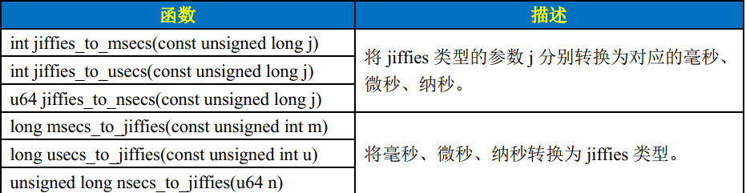
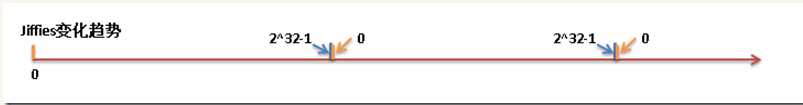
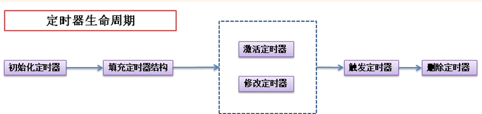

系统中有很多与时间相关的程序（比如定期执行的任务，某一时间执行的任务，推迟一段时间执行的任务），因此，时间的管理对于 linux 来说非常重要。系统中管理的时间有 2 种：**实际时间和定时器**。


# 1 实际时间
实际时间就是现实中钟表上显示的时间，其实内核中并不常用这个时间，主要是用户空间的程序有时需要获取当前时间，所以内核中也管理着这个时间。实际时间的获取是在开机后，内核初始化时从 **RTC** 读取的。内核读取这个时间后就将其放入内核中的 **xtime** 变量中，并且在系统的运行中不断更新这个值。
**注：**RTC 就是实时时钟的缩写，它是用来存放系统时间的设备。一般和 BIOS 一样，由主板上的电池供电的，所以即使关机也可将时间保存。
实际时间存放的变量 **xtime** 在文件 `kernel/time/timekeeping.c`中。
```c
/* 按照16位对齐，其实就是2个long型的数据 */
struct timespec xtime __attribute__ ((aligned (16)));

/* timespec结构体的定义如下， 参考 <linux/time.h>  */
struct timespec {
    __kernel_time_t    tv_sec;            /* seconds */
    long        tv_nsec;        /* nanoseconds */
};

/* _kernel_time_t 定义如下 */
typedef long        __kernel_time_t;
```

系统读写 **xtime** 时用的就是顺序锁。
```c
/* 写入 xtime 参考 do_sometimeofday 方法 */
int do_settimeofday(struct timespec *tv)
{
/* 省略 。。。。 */
    write_seqlock_irqsave(&xtime_lock, flags); /* 获取写锁 */
/* 更新 xtime */
    write_sequnlock_irqrestore(&xtime_lock, flags); /* 释放写锁 */
/* 省略 。。。。 */
    return 0;
}

/* 读取 xtime 参考 do_gettimeofday 方法 */
void do_gettimeofday(struct timeval *tv)
{
    struct timespec now;

    getnstimeofday(&now); /* 就是在这个方法中获取读锁，并读取 xtime */
    tv->tv_sec = now.tv_sec;
    tv->tv_usec = now.tv_nsec/1000;
}

void getnstimeofday(struct timespec *ts)
{
/* 省略 。。。。 */

/* 顺序锁中读锁来循环获取 xtime，直至读取过程中 xtime 没有被改变过 */
    do {
        seq = read_seqbegin(&xtime_lock);

        *ts = xtime;
        nsecs = timekeeping_get_ns();
    
        /* If arch requires, add in gettimeoffset() */
        nsecs += arch_gettimeoffset();
    
    } while (read_seqretry(&xtime_lock, seq));
/* 省略 。。。。 */
}
```
上述场景中，写锁必须要优先于读锁 (因为 **xtime** 必须及时更新)，而且写锁的使用者很少 (一般只有系统定期更新 **xtime** 的线程需要持有这个锁)。这正是顺序锁的应用场景。


# 2 定时器
定时器是内核中主要使用的时间管理方法，通过定时器，可以有效的调度程序的执行。动态定时器是内核中使用比较多的定时器，下面重点讨论的也是动态定时器。内核中的定时器有 2 种，**静态定时器和动态定时器**。静态定时器一般执行了一些周期性的固定工作：

- 更新系统运行时间
- 更新实际时间
- 在 SMP 系统上，平衡各个处理器上的运行队列
- 检查当前进程是否用尽了自己的时间片，如果用尽，需要重新调度。
- 更新资源消耗和处理器时间统计值


动态定时器顾名思义，是在需要时（一般是推迟程序执行）动态创建的定时器，使用后销毁（一般都是只用一次）。一般我们在内核代码中使用的定时器基本都是动态定时器，下面重点讨论动态定时器相关的概念和使用方法。


## 2.1 定时器相关概念
定时器的使用中，下面 3 个概念非常重要：

1. HZ
2. jiffies
2. 时间中断处理程序

### HZ
节拍率 (HZ) 是时钟中断的频率，表示的一秒内时钟中断的次数。比如 HZ=100 表示一秒内触发 100 次时钟中断程序。HZ 的值一般与体系结构有关，x86 体系结构一般定义为 100，参考文件 `include/asm-generic/param.h`。HZ 值的大小的设置过程其实就是平衡精度和性能的过程，并不是 HZ 值越高越好。

| **HZ 值** | **优势** | **劣势** |
| --- | --- | --- |
| 高 HZ | 时钟中断程序运行的更加频繁，依赖时间执行的程序更加精确，对资源消耗和系统运行时间的统计更加精确。 | 时钟中断执行的频繁，增加系统负担时钟中断占用的 CPU 时间过多 |


此外，有一点需要注意，内核中使用的 HZ 可能和用户空间中定义的 HZ 值不一致，为了避免用户空间取得错误的时间，内核中也定义了 USER_HZ，即用户空间使用的 HZ 值。一般来说，USER_HZ 和 HZ 都是相差整数倍，内核中通过函数 **jiffies_to_clock_t来将内核来将内核中的 jiffies 转为 用户空间 jiffies**

```c
/* 参见文件： kernel/time.c  *
//*
 * Convert jiffies/jiffies_64 to clock_t and back.
 */
clock_t jiffies_to_clock_t(unsigned long x)
{
#if (TICK_NSEC % (NSEC_PER_SEC / USER_HZ)) == 0
 if HZ < USER_HZ
    return x * (USER_HZ / HZ);
 else
    return x / (HZ / USER_HZ);
 endif
#else
    return div_u64((u64)x * TICK_NSEC, NSEC_PER_SEC / USER_HZ);
#endif
}
EXPORT_SYMBOL(jiffies_to_clock_t);
```

### jiffies
jiffies 用来记录自系统启动以来产生的总节拍数。比如系统启动了 N 秒，那么 jiffies 就为 N×HZ。jiffies 的相关定义参考头文件 **<linux/jiffies.h>**_
```c
/* 64bit和32bit的jiffies定义如下 */
extern u64 __jiffy_data jiffies_64;
extern unsigned long volatile __jiffy_data jiffies;
```
Linux 内核提供了几个 jiffies 和 ms、 us、 ns 之间的转换函数：
```c
unsigned long timeout = jiffies + HZ/2; /* 设置超时时间为 0.5秒 */

while (timeout < jiffies)
{
    /* 还没有超时，继续执行任务 */
}

/* 执行超时后的任务 */
```
正常情况下，上面的代码没有问题。当 jiffies 接近最大值的时候，就会出现回绕问题。由于是 **unsinged long** 类型，所以 jiffies 达到最大值后会变成 0 然后再逐渐变大，如下图所示：

1. 循环中第一次比较时，jiffies = J1，没有超时
2. 循环中第二次比较时，jiffies = J2，实际已经超时了，但是由于 jiffies 超过的最大值后又从 0 开始，所以 J2 远远小于 timeout
3. while 循环会执行很长时间 (> 2^32-1 个节拍) 不会结束，几乎相当于死循环了


为了回避回扰的问题，可以使用 **<linux/jiffies.h>** 头文件中提供的 **time_after**，**time_before** 等宏
```c
#define time_after(a,b)        \
    (typecheck(unsigned long, a) && \
     typecheck(unsigned long, b) && \
     ((long)(b) - (long)(a) < 0))
#define time_before(a,b)    time_after(b,a)

#define time_after_eq(a,b)    \
    (typecheck(unsigned long, a) && \
     typecheck(unsigned long, b) && \
     ((long)(a) - (long)(b) >= 0))
#define time_before_eq(a,b)    time_after_eq(b,a)
```
上述代码的原理其实就是将 **unsigned long** 类型转换为 **long** 类型来避免回扰带来的错误，利用 time_after 宏就可以巧妙的避免回绕带来的超时判断问题，将之前的代码改成如下代码即可：
```c
unsigned long timeout = jiffies + HZ/2; /* 设置超时时间为 0.5秒 */

while (time_after(jiffies, timeout))
{
    /* 还没有超时，继续执行任务 */
}

/* 执行超时后的任务 */
```

## 2.2 时钟中断处理程序
时钟中断处理程序作为系统定时器而注册到内核中，体系结构的不同，可能时钟中断处理程序中处理的内容不同。但是以下这些基本的工作都会执行：

- 获得 xtime_lock 锁，以便对访问 jiffies_64 和墙上时间 xtime 进行保护
- 需要时应答或重新设置系统时钟
- 周期性的使用墙上时间更新实时时钟
- 调用 tick_periodic()


tick_periodic 函数位于： `kernel/time/tick-common.c` 中
```c
static void tick_periodic(int cpu)
{
    if (tick_do_timer_cpu == cpu) {
        write_seqlock(&xtime_lock);
         /* Keep track of the next tick event */
    	tick_next_period = ktime_add(tick_next_period, tick_period);

   	 	do_timer(1);
    	write_sequnlock(&xtime_lock);
	}
	update_process_times(user_mode(get_irq_regs()));
	profile_tick(CPU_PROFILING);
}

void do_timer(unsigned long ticks)
{
    /* jiffies_64 增加指定ticks */
    jiffies_64 += ticks;
    /* 更新实际时间 */
    update_wall_time();
    /* 更新系统的平均负载值 */
    calc_global_load();
}

void update_process_times(int user_tick)
{
    struct task_struct *p = current;
    int cpu = smp_processor_id();
    /* 更新当前进程占用CPU的时间 */
    account_process_tick(p, user_tick);
    /* 同时触发软中断，处理所有到期的定时器 */
    run_local_timers();
    rcu_check_callbacks(cpu, user_tick);
    printk_tick();
    /* 减少当前进程的时间片数 */
    scheduler_tick();
    run_posix_cpu_timers(p);
}
```


## 2.3 定时器的定义
定时器在内核中用一个链表来保存的，链表的每个节点都是一个定时器。参见头文件 **<linux/timer.h>**
```c
struct timer_list {
    struct list_head entry;
    unsigned long expires; //超时时间

    void (*function)(unsigned long); //超时后的回调函数
    unsigned long data;
    
    struct tvec_base *base;
#ifdef CONFIG_TIMER_STATS
    void *start_site;
    char start_comm[16];
    int start_pid;
#endif
#ifdef CONFIG_LOCKDEP
    struct lockdep_map lockdep_map;
#endif
};
```
通过加入条件编译的参数，可以追加一些调试信息。


## 2.4 定时器的生命周期
一个动态定时器的生命周期中，一般会经过下面的几个步骤：
1 初始化定时器：
```c
struct timer_list my_timer; /* 定义定时器 */
init_timer(&my_timer);      /* 初始化定时器 */
```

2 填充定时器：
```c
my_timer.expires = jiffies + delay; /* 定义超时的节拍数 */
my_timer.data = 0;                  /* 给定时器函数传入的参数 */
my_timer.function = my_function;    /* 定时器超时时，执行的自定义函数 */

/* 从定时器结构体中，我们可以看出这个函数的原型应该如下所示： */
void my_function(unsigned long data);
```

3 激活定时器和修改定时器：激活定时器之后才会被触发，否则定时器不会执行。修改定时器主要是修改定时器的延迟时间，修改定时器后，不管原先定时器有没有被激活，都会处于激活状态。填充定时器结构之后，可以只激活定时器，也可以只修改定时器，也可以激活定时器后再修改定时器。所以填充定时器结构和触发定时器之间的步骤，也就是虚线框中的步骤是不确定的。
```c
add_timer(&my_timer);  /* 注册到内核，激活定时器 */
mod_timer(&my_timer, jiffies + new_delay);  /* 修改定时器，设置新的延迟时间 */
```

4 触发定时器：每次时钟中断处理程序会检查已经激活的定时器是否超时，如果超时就执行定时器结构中的自定义函数。
5 删除定时器：激活和未被激活的定时器都可以被删除，已经超时的定时器会自动删除，不用特意去删除。
```c
/*
 * 删除激活的定时器时，此函数返回1
 * 删除未激活的定时器时，此函数返回0
 */
del_timer(&my_timer);
```

在多核处理器上用 del_timer 函数删除定时器时，可能在删除时正好另一个 CPU 核上的时钟中断处理程序正在执行这个定时器，于是就形成了竞争条件。**为了避免竞争条件，建议使用 del_timer_sync 函数来删除定时器**。
del_timer_sync 函数会等待其他处理器上的定时器处理程序全部结束后，才删除指定的定时器。
```c
/*
 * 和del_timer 不同，del_timer_sync 不能在中断上下文中执行
 */
del_timer_sync(&my_timer);
```

# 3 delayed_work
对于周期性的任务，除了定时器以外，在Linux内核中还可以利用一套封装得很好的快捷机制，其本质是利用工作队列和定时器实现，这套快捷机制就是delayed_work：
```c
#include <linux/workqueue.h>

struct delayed_work {
	struct work_struct work;//work_func_t类型成员函数func()会在延时后被执行
	struct timer_list timer;

	/* target workqueue and CPU ->timer uses to queue ->work */
	struct workqueue_struct *wq;
	int cpu;
};
//函数，用于指定内核延时任务
static inline bool schedule_delayed_work(struct delayed_work *dwork,unsigned long delay);
//取消函数
int cancel_delayed_work(struct delayed_work *work);
int cancel_delayed_work_sync(struct delayed_work *work);
```

# 4 内核延时与唤醒
内核对于那些短暂，精确的延迟要求也提供了相应的宏。

## 4.1 短延迟
Linux内核中提供了下列3个函数以分别进行纳秒、微秒和毫秒延迟：
```c
#include <include/asm/delay.h>
#include <include/delay.h>

void ndelay(unsigned long nsecs);
void udelay(unsigned long usecs);
void mdelay(unsigned long msecs);//忙等待，时间太长不建议使用
```

毫秒时延(以及更大的秒时延)已经比较大了，在内核中，**最好不要直接使用mdelay()函数，这将耗费CPU资源**，对于毫秒级以上的时延，内核提供了下述函数：
```c
void msleep(unsigned int millisecs);
unsigned long msleep_interruptible(unsigned int millisecs);
void ssleep(unsigned int seconds);
```

通过这些宏，可以简单的实现延迟，比如延迟 5ns，只需 ndelay(5); 即可。这些短延迟的实现原理并不复杂：

- 首先，内核在启动时就计算出了当前处理器 1 秒能执行多少次循环，即 loops_per_jiffy (loops_per_jiffy 的计算方法参见 `init/main.c`文件中的 calibrate_delay 方法)。
- 然后算出延迟 5ns 需要循环多少次，**执行那么多次空循环即可达到延迟的效果**。


loops_per_jiffy的值可以在启动信息中看到：
```c
[root@vbox ~] dmesg | grep delay
Calibrating delay loop (skipped), value calculated using timer frequency.. 6387.58 BogoMIPS (lpj=3193792)
```

## 4.2 长延迟
在内核中进行延迟的一个很直观的方法是比较当前的jiffies和目标jiffies(设置为当前jiffies加上时间间隔的jiffies)，直到未来的jiffies达到目标jiffies。内核提供的方法如下：
```c
#define time_after(a,b) \
    (typecheck(unsigned long, a) && \
    typecheck(unsigned long, b) && \
    ((long)(b) - (long)(a) < 0))
#define time_before(a,b) time_after(b,a)
```
使用示例如下：
```c
/* 延迟 100 个 jiffies */
unsigned long delay = jiffies + 100;
while(time_before(jiffies, delay)); //等待期间一直在循环，忙等待

/* 再延迟 2s */
unsigned long delay = jiffies + 2*Hz;
while(time_before(jiffies, delay));
```

## 4.3 睡着延迟
睡着延迟无疑是比忙等待更好的方式，睡着延迟是在等待的时间到来之前进程处于睡眠状态，CPU资源被其他进程使用。内核中有个利用定时器实现延迟的函数**schedule_timeout**。这个函数会将当前的任务**睡眠到指定时间后唤醒**，所以等待时不会占用 CPU 时间。
```c
/* 将任务设置为可中断睡眠状态 */
set_current_state(TASK_INTERRUPTIBLE);

/* 小睡一会儿，“s“秒后唤醒 */
schedule_timeout(s*HZ);
```

查看 schedule_timeout 函数的实现方法，可以看出是如何使用定时器的。
```c
signed long __sched schedule_timeout(signed long timeout)
{
    /* 定义一个定时器 */
    struct timer_list timer;
    unsigned long expire;

    switch (timeout)
    {
    case MAX_SCHEDULE_TIMEOUT:
        /*
         * These two special cases are useful to be comfortable
         * in the caller. Nothing more. We could take
         * MAX_SCHEDULE_TIMEOUT from one of the negative value
         * but I' d like to return a valid offset (>=0) to allow
         * the caller to do everything it want with the retval.
         */
        schedule();
        goto out;
    default:
        /*
         * Another bit of PARANOID. Note that the retval will be
         * 0 since no piece of kernel is supposed to do a check
         * for a negative retval of schedule_timeout() (since it
         * should never happens anyway). You just have the printk()
         * that will tell you if something is gone wrong and where.
         */
        if (timeout < 0) {
            printk(KERN_ERR "schedule_timeout: wrong timeout "
                "value %lx\n", timeout);
            dump_stack();
            current->state = TASK_RUNNING;
            goto out;
        }
    }
    
    /* 设置超时时间 */
    expire = timeout + jiffies;
    
    /* 初始化定时器，超时处理函数是 process_timeout，后面再补充说明一下这个函数 */
    setup_timer_on_stack(&timer, process_timeout, (unsigned long)current);
    /* 修改定时器，同时会激活定时器 */
    __mod_timer(&timer, expire, false, TIMER_NOT_PINNED);
    /* 将本任务睡眠，调度其他任务 */
    schedule();
    /* 删除定时器，其实就是 del_timer_sync 的宏
    del_singleshot_timer_sync(&timer);
    
    /* Remove the timer from the object tracker */
    destroy_timer_on_stack(&timer);
    
    timeout = expire - jiffies;

 out:
    return timeout < 0 ? 0 : timeout;
}
EXPORT_SYMBOL(schedule_timeout);

/* 
 * 超时处理函数 process_timeout 里面只有一步操作，唤醒当前任务。
 * process_timeout 的参数其实就是 当前任务的地址
 */
static void process_timeout(unsigned long __data)
{
    wake_up_process((struct task_struct *)__data);
}
```
schedule_timeout**一般用于延迟时间较长的程序**。这里的延迟时间较长是对于计算机而言的，其实也就是延迟大于 1 个节拍 (jiffies)。对于某些极其短暂的延迟，比如只有 1ms，甚至 1us，1ns 的延迟，必须使用上面的短延迟方法。


## 4.3 定时器和延迟的例子
下面的例子测试了短延迟，自定义定时器以及 schedule_timeout 的使用：
```c
#include <linux/sched.h>
#include <linux/timer.h>
#include <linux/jiffies.h>
#include <asm/param.h>
#include <linux/delay.h>
#include "kn_common.h"

MODULE_LICENSE("Dual BSD/GPL");

static void test_short_delay(void);
static void test_delay(void);
static void test_schedule_timeout(void);
static void my_delay_function(unsigned long);

static int testdelay_init(void)
{
    printk(KERN_ALERT "HZ in current system: %dHz\n", HZ);

    /* test short delay */
    test_short_delay();
    
    /* test delay */
    test_delay();
    
    /* test schedule timeout */
    test_schedule_timeout();
    
    return 0;
}

static void testdelay_exit(void)
{
    printk(KERN_ALERT "*************************\n");
    print_current_time(0);
    printk(KERN_ALERT "testdelay is exited!\n");
    printk(KERN_ALERT "*************************\n");
}

static void test_short_delay()
{
    printk(KERN_ALERT "jiffies [b e f o r e] short delay: %lu", jiffies);
    ndelay(5);
    printk(KERN_ALERT "jiffies [a f t e r] short delay: %lu", jiffies);
}

static void test_delay()
{
    /* 初始化定时器 */
    struct timer_list my_timer;
    init_timer(&my_timer);

    /* 填充定时器 */
    my_timer.expires = jiffies + 1*HZ; /* 2秒后超时函数执行 */
    my_timer.data = jiffies;
    my_timer.function = my_delay_function;
    
    /* 激活定时器 */
    add_timer(&my_timer);
}

static void my_delay_function(unsigned long data)
{
    printk(KERN_ALERT "This is my delay function start......\n");
    printk(KERN_ALERT "The jiffies when init timer: %lu\n", data);
    printk(KERN_ALERT "The jiffies when timer is running: %lu\n", jiffies);
    printk(KERN_ALERT "This is my delay function end........\n");
}

static void test_schedule_timeout()
{
    printk(KERN_ALERT "This sample start at : %lu", jiffies);

    /* 睡眠2秒 */
    set_current_state(TASK_INTERRUPTIBLE);
    printk(KERN_ALERT "sleep 2s ....\n");
    schedule_timeout(2*HZ);
    
    printk(KERN_ALERT "This sample end at : %lu", jiffies);
}

module_init(testdelay_init);
module_exit(testdelay_exit);
```

Makefile 如下：
```makefile
obj-m := mydelay.o
mydelay-objs := testdelay.o kn_common.o

#generate the path
CURRENT_PATH:=$(shell pwd)
#the absolute path
LINUX_KERNEL_PATH:=/usr/src/linux-source-4.15.0  #直接用发行版中的linux源码，不用再下载linux内核源码。注意，每个linux发行版的目录不一定一样
#complie object
all:
        make -C $(LINUX_KERNEL_PATH) M=$(CURRENT_PATH) modules
clean:
        make -C $(LINUX_KERNEL_PATH) M=$(CURRENT_PATH) clean
```

执行测试命令及查看结果的方法如下：(Ubuntu 18.04编译不过，kernel已经改变)
```bash
[root@vbox chap11] make
[root@vbox chap11] insmod mydelay.ko 
[root@vbox chap11] rmmod mydelay.ko 
[root@vbox chap11] dmesg | tail -14
HZ in current system: 1000Hz
jiffies [b e f o r e] short delay: 4296079617
jiffies [a f t e r] short delay: 4296079617
This sample start at : 4296079619
sleep 2s ....
This is my delay function start......
The jiffies when init timer: 4296079619
The jiffies when timer is running: 4296080621
This is my delay function end........
This sample end at : 4296081622
*************************
2013-5-9 23:7:20
testdelay is exited!
*************************
```

结果说明：1 短延迟只延迟了 5ns，所以执行前后的 jiffies 是一样的。
```bash
jiffies [b e f o r e] short delay: 4296079617
jiffies [a f t e r] short delay: 4296079617
```

2 自定义定时器延迟了 1 秒后执行自定义函数，由于我的系统 HZ=1000，所以 jiffies 应该相差 1000
```bash
The jiffies when init timer: 4296079619
The jiffies when timer is running: 4296080621
```

实际上 jiffies 相差了 1002，多了 2 个节拍
3 schedule_timeout 延迟了 2 秒，jiffies 应该相差 2000
```bash
This sample start at : 4296079619
This sample end at : 4296081622
```

实际上 jiffies 相差了 2003，多了 3 个节拍
以上结果也说明了定时器的延迟并不是那么精确，差了 2,3 个节拍其实就是误差 2,3 毫秒 (因为 HZ=1000)如果 HZ=100 的话，一个节拍是 10 毫秒，那么定时器的误差可能就发现不了了 (误差只有 2,3 毫秒，没有超多 1 个节拍)。
