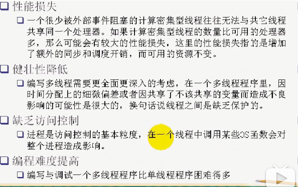
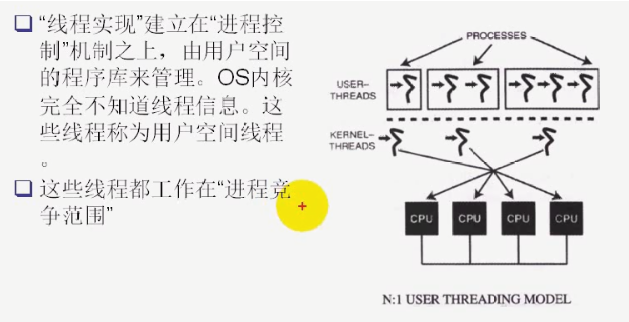
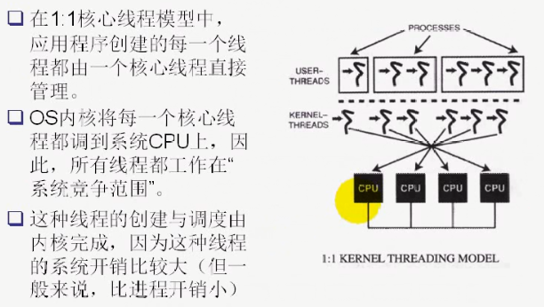
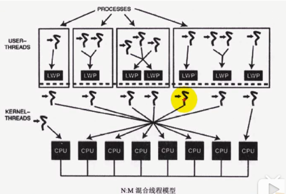
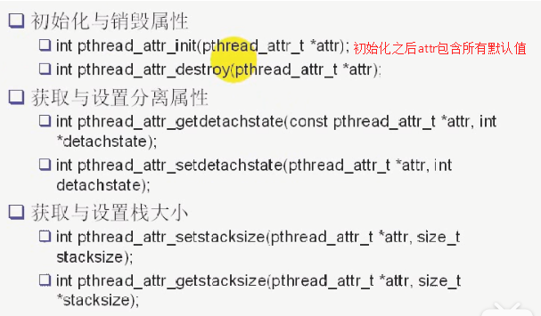
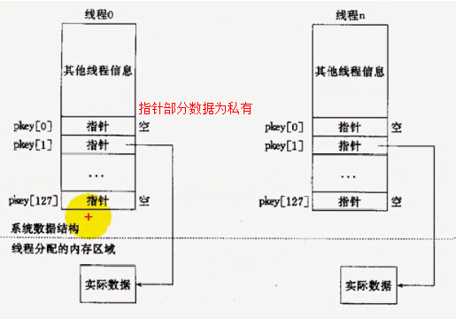
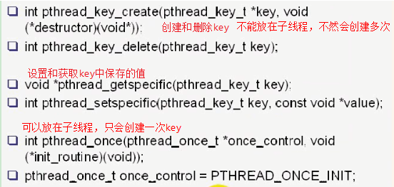

# 1 线程与进程

## 1.1 线程和进程对比
| 进程 | 线程 |
| --- | --- |
| 程序的一次**动态执行过程** | 一个进程内部的**控制序列** |
| 一个进程只能对应一个程序, 一个程序可以有多个进程实例 | 一切进程至少都有一个线程 |
| 资源竞争的基本单位 | 程序执行的最小单位 |
| 进程间不共享数据 | 线程共享进程数据，也拥有自己的结构数据 |
| fork新进程后，有自己的变量和PID，完全独立于父进程 | 创建新线程后，有自己的堆栈，但与父进程共享全局变量，文件描述符，信号处理和当前工作目录状态 |


## 1.2 线程优点


- 创建新线程代价比创建新进程小
- 线程间切换代价小
- 线程占用的资源少
- 线程能充分利用多处理器的并行数量。计算密集型应用，将计算分解为多个线程实现，可在多处理器系统运行。
- 在等待慢速IO操作时，程序可执行其他任务。IO密集型应用，为了提高性能，将IO操作重叠。线程可以同时等待不同的IO操作。


## 1.3 线程的缺点



# 2 线程模型


## 2.1 N:1用户线程模型



## 2.2 1:1核心线程模型



## 2.3 N:M混合线程模型

该模型提供了两级控制，将用户线程映射为系统的可调度体（称为**LWP轻量级进程**）以实现并行，LWP再一一映射到核心线程。POSIX线程就是使用这种模型。



# 3 POSIX线程


## 3.1 POSIX线程API

头文件：

```
#include <pthread.h>
```

同时编译时需要加上链接线程库的命令：**-lpthread**。


### 3.1.1 pthread_create

原型：`int pthread_create(pthread_t *thread, const pthread_attr_t *attr, void *(*start_routine) (void *), void *arg);`功能：创建一个新线程返回值：成功返回0， 失败返回错误码参数：

- thread：返回的线程ID
- attr：设置线程属性，NULL代表使用默认属性
- start_routine：函数指针，即线程启动后要执行的函数
- arg：函数指针需要的参数


**注意**：pthread相关的函数出错时不会设置全局变量errno，而是通过返回值。


### 3.1.2 pthread_join

原型：`int pthread_join(pthread_t thread, void **retval);`功能：等待创建的新线程结束，类似进程的**waitpid**函数返回值：成功返回0， 失败返回错误码参数：

- retval：线程的exit状态，return的返回值或pthread_exit的retVal，可以置为NULL


### 3.1.3 pthread_exit

原型：`void pthread_exit(void *retval);`功能：终止线程，类似进程的**exit**函数。也可以调用return返回值：无返回值，跟进程一样，线程结束无法返回到它的调用者参数：

- retval：返回状态，不能指向一个局部变量


### 3.1.4 pthread_self

原型：`pthread_t pthread_self(void);`功能： 返回本线程的id返回值： 成功返回线程id


### 3.1.5 pthread_cancel

原型：`int pthread_cancel(pthread_t thread);`功能：取消一个执行中的新线程返回值：成功返回0， 失败返回错误码参数：

- thread：线程id


### 3.1.6 pthread_detach

原型：`int pthread_detachl(pthread_t thread);`功能：将一个线程与调用者分离返回值：成功返回0， 失败返回错误码参数：

- thread：线程id


## 3.2 线程属性设置



## 3.3 线程私有数据

线程除了共享其他线程和主线程的信息之外，还有128个**key-value**的结构(PTHREAD_KEY_MAX决定每个系统支持的个数）可以保存本线程私有的数据，这些数据不被其他线程访问，但是可以被本线程的所有函数访问，类似于本线程中的**全局变量**。结构如下：


如下函数用于设置**key-value**数据段的数据：




## 3.4 代码示例


### 3.4.1 线程创建


```cpp
#include "common.h"
#include <pthread.h>

void* thread_function(void* arg)
{
    for (int i=0; i<20; i++)
    {
        printf("slave thread said B\n");
        fflush(stdout);
        usleep(20);
    }
    sleep(3);
    return 0;
}

int main()
{
    pthread_t tid;
    int ret = pthread_create(&tid, NULL, thread_function, NULL);
    if (ret != 0)
    {
        //错误处理
        printf("pthread_create failed, error message: %s\r\n", strerror(ret));
        exit(EXIT_FAILURE);
    }
    for (int i=0; i<20; i++)
    {
        printf("master thread said A\n");
        fflush(stdout);
        usleep(20);
    }

    //主线程等待新创建的线程结束，不然会直接终止
    ret = pthread_join(tid, NULL);
    if (ret != 0)
    {
        //错误处理
        printf("pthread_join failed, error message: %s\r\n", strerror(ret));
        exit(EXIT_FAILURE);
    }

    return 0;
}
```


### 3.4.2 私有数据区操作


```cpp
#include "common.h"
#include <pthread.h>

struct tsd
{
    pthread_t tid;
    char* str;
};

pthread_key_t key;
void destroy_func(void* value)
{
    //删除key时调用该函数
    printf("destroy the key here\n");
    free(value); //释放malloc的内存,这里value就是保存到key中的数据的指针
}

void* thread_func(void* arg)
{
    tsd* value = (tsd*)malloc(sizeof(tsd));
    value->tid = pthread_self();
    value->str = (char*)arg;
    //设置key的值
    printf("%s set the value[%p] of the key\n", (char*)arg, value);
    pthread_setspecific(key, value);
    //获取key中的值
    sleep(2);
    value = (tsd*)pthread_getspecific(key);
    printf("tid=0x%x, str=%s\n", value->tid, value->str);

    return NULL;
}
int main()
{
    key = pthread_key_create(&key, destroy_func);

    pthread_t t1;
    pthread_t t2;
    pthread_create(&t1, NULL, thread_func, (void*)"thread1");
    pthread_create(&t2, NULL, thread_func, (void*)"thread2");

    pthread_join(t1, NULL);
    pthread_join(t2, NULL);
    return 0;
}
```


# 4 线程池实现

线程池中有多个线程，用于以下用途：


线程池本质上也是**生产者和消费者模型**，生产者线程向任务队列添加任务，一旦有任务到了，如果有等待线程就唤醒执行任务；如果没有等待线程并且线程池未达到阈值，就创建新线程执行任务。
