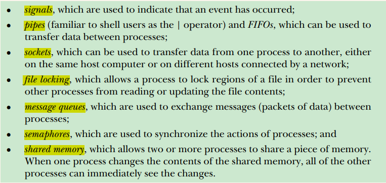
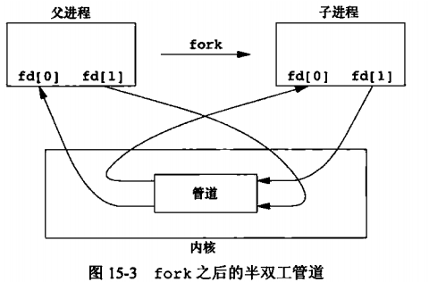
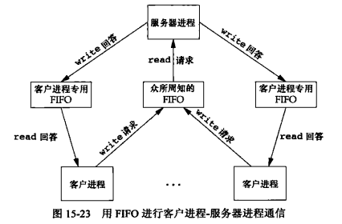

# 1. 进程间通信(IPC)介绍


## 1.1 进程通信的几种方式



## 1.2 进程通信目的


- **数据传输**：一个进程需要将它的数据发送给另一进程
- **资源共享**．多个进程之间共享同样的资源。
- **通知事件**：一个进程需要向另一个或一组进程发送消息，通知它（它们）发生了某种事件（如进程终上时要通知父进程）。
- **进程控制**：有些进程希望完全控制另一个进程的执行（如Debug进程），北时控制进程希望能够拦截另一个进程的所有陷入和异常，并能够及时知道它的状态改变。


# 2 信号处理


# 3 管道
管道只能在具有公共祖先的两个进程间使用，通常，一个管道由一个进程创建，在进程fork之后，父子进程可以共用这个管道。

## 3.1 管道函数

### pipe
函数定义：`int pipe(int pipefd[2]);`功能： 创建一个普通管道返回值： 成功返回0，失败返回-1参数：

- pipefd[0]为读打开，用于输出
- pipefd[1]为写打开，用于输入



### popen
函数定义：`FILE *popen(const char *command, const char *type);`功能： 先fork一个子进程，然后调用exec执行command返回值： 成功返回文件指针，失败返回-1。参数：

- command： 要执行的命令
- type： 根据type不同，文件指针指向标准输出或标准输入

### pclose
函数定义：`int pclose(FILE *stream);`功能： 关闭popen创建的管道，等待命令结束返回值： 成功返回shell中止状态，失败返回-1。参数：

- stream： 指向管道的文件指针


## 3.2 代码示例

### pipe
代码示例：
```c
#include "apue.h"

int main(void)
{
	int		n;
	int		fd[2];
	pid_t	pid;
	char	line[MAXLINE];

	if (pipe(fd) < 0)
		err_sys("pipe error");
	if ((pid = fork()) < 0) {
		err_sys("fork error");
	} else if (pid > 0) {		/* parent */
		close(fd[0]);
		write(fd[1], "hello world\n", 12);
	} else {					/* child */
		close(fd[1]);
		n = read(fd[0], line, MAXLINE);
		write(STDOUT_FILENO, line, n);
	}
	exit(0);
}
```

### popen
```c
#include "apue.h"
#include <sys/wait.h>

int
main(void)
{
	char	line[MAXLINE];
	FILE	*fpin;

	if ((fpin = popen("myuclc", "r")) == NULL)
		err_sys("popen error");
	for ( ; ; ) {
		fputs("prompt> ", stdout);
		fflush(stdout);
		if (fgets(line, MAXLINE, fpin) == NULL)	/* read from pipe */
			break;
		if (fputs(line, stdout) == EOF)
			err_sys("fputs error to pipe");
	}
	if (pclose(fpin) == -1)
		err_sys("pclose error");
	putchar('\n');
	exit(0);
}
```

# 4 FIFO命名管道
未命名的管道只能在有共同祖先进程的两个进程之间使用。**通过FIFO，不相关的进程也能交换数据**。创建FIFO类似于创建文件，路径存在于文件系统中。

## 4.1 FIFO函数

### mkfifo
函数定义：`int mkfifo(const char *pathname, mode_t mode);`功能： 创建一个命名管道返回值： 成功返回0，失败返回-1参数：

- pathname：管道文件路径
- mode：文件权限，和不同文件一样参数

### mkfifoat
函数定义：`int mkfifoat(int dirfd, const char *pathname, mode_t mode);`功能： 在某个文件描述符指向的目录下创建一个命名管道返回值： 成功返回0，失败返回-1参数：

- dirfd：
- pathname：管道文件名
- mode：文件权限

### 打开管道读写
FIFO管道是使用open打开（和打开普通文件一样），使用write和read读写。当打开FIFO是，O_NONBLOCK标志会产生如下影响：

- 未指定O_NONBLOCK，只读open会阻塞到某个进程为写打开该管道为止。只写open会阻塞到某个进程为读而打开管道为止
- 指定O_NONBLOCK， 只读open立刻返回，不会阻塞。如果没有读FIFO存在，只写open会返回-1， errno为ENXIO

## 4.2 FIFO用途
FIFO有以下两种用途：

- shell命令使用FIFO将数据从一条管道传送到另一条管道，无需创建中间临时文件
- CS架构中，FIFO用作汇聚点，在客户端和服务器进程间传递数据



